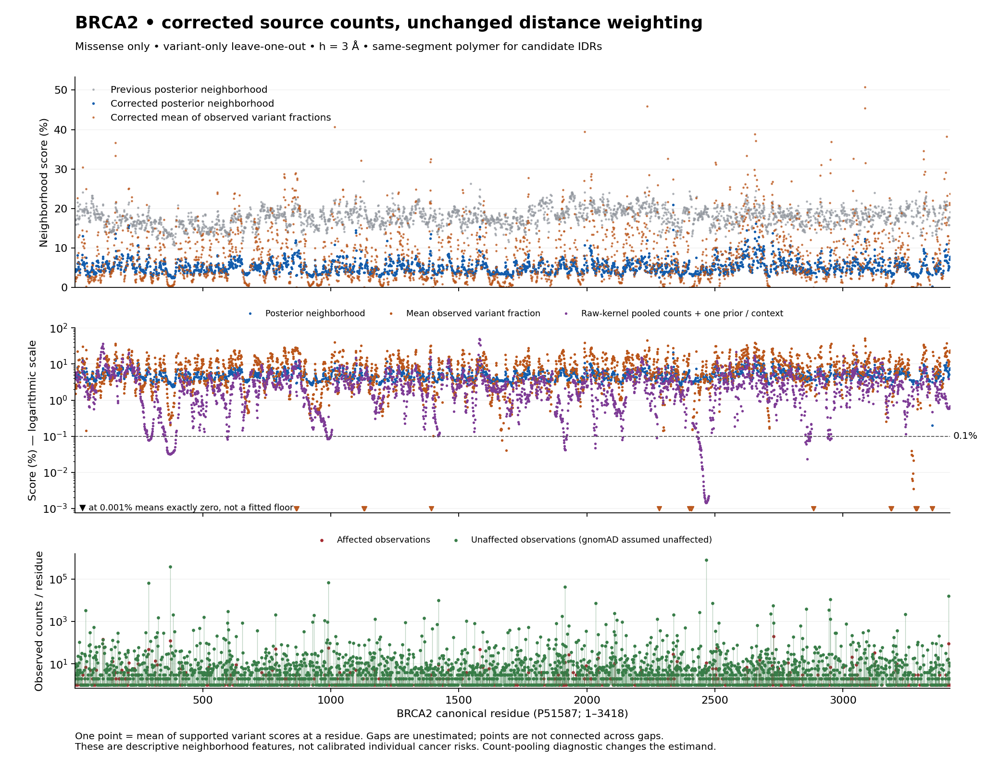

# BRCA2 distance, counts and prior audit — 2026-09-13

The earlier BRCA2 analysis contained false affected observations. A ClinVar
catalogue embedded in PMID 40664060 was interpreted as a patient table, assigning
one affected carrier to each entry. Correcting this source changes the missense
prior mean from **14.86% to 4.58%** and the median supported variant neighborhood
from **17.98% to 4.57%**, with the same geometry and h=3 Å distance kernel.
All **1,516,774 missense gnomAD carriers** remain in the corrected input and are
assumed unaffected, as requested. This audit supersedes the BRCA2 counts, priors
and residue density in the earlier class-matched and structural evidence; those
frozen artifacts remain available to reproduce the error.

[Corrected figure (PNG)](corrected/BRCA2_CORRECTED_RESIDUE_DENSITY.png) ·
[PDF](corrected/BRCA2_CORRECTED_RESIDUE_DENSITY.pdf) ·
[Residue table](corrected/BRCA2_residue_density.csv) ·
[Prior comparison](corrected/prior_comparison.csv) ·
[Density comparison](corrected/density_comparison.csv)

## What was wrong

The source article separates a ClinVar inventory in Supplementary Table 4 from
the actual patient observations in its clinical Table 2. The inventory's
classification/impact headers contain the word “clinical”; the regex parser
mistook that metadata for a patient's phenotype. For example, its A1043V entry
VCV001002452 became total=1, affected=1 and “pathogenic,” despite a source
classification of conflicting interpretations and no observed carrier count.
See the [primary paper](https://pmc.ncbi.nlm.nih.gov/articles/PMC12281534/),
[source adjudication](source/README.md) and
[exact pre-fix parser reproduction](parser/README.md).

The correction quarantines 4,070 source-proven catalogue observations across
variant classes. Of these, 2,976 entered the canonical missense inputs and 196
entered nonsense inputs. It restores the five documented missense observations
from the actual patient table: R118H, P2276T, V2076I, S28N and W2619C, one breast
cancer carrier each. These are affected carrier observations, not assertions
that each variant caused cancer. One additional, incompletely retained catalogue
header remains pending outside the missense/nonsense analysis; it was not removed
by a blanket paper exclusion.

The clinical/population union was rebuilt from the frozen allele inventory.
Zero-clinical-evidence keys were dropped before joining, releasing their
population alleles to genomic units. New real patient keys then consume their
matching population alleles instead of duplicating them. Every one of the
24,851 eligible population alleles across all consequences is still assigned
exactly once; 784 assignments changed. There are no A=0/U=0 donors. The
[crosswalk and union checks](corrected/union_checks.json) distinguish this rebuilt
universe from the source auditor's provisional old-unit accounting table.

| Missense input or prior | Previous | Corrected |
|---|---:|---:|
| Observed variant units | 6,656 | 4,584 |
| Affected observations | 5,056 | 2,085 |
| Literature unaffected observations | 1,482 | 1,482 |
| gnomAD carriers, assumed unaffected | 1,516,774 | 1,516,774 |
| Population-only units | 2,971 | 3,736 |
| Unaffected singleton units | 1,495 | 1,989 |
| α empirical, affected pseudocount | 0.907455 | 0.202612 |
| β empirical, unaffected pseudocount | 5.199319 | 4.219486 |
| Prior mean | 14.8598% | 4.5818% |
| Prior strength α+β | 6.106774 | 4.422098 |

Nonsense is still fitted separately: corrected α=3.014200, β=1.772593,
453 units and 1,174 affected observations. Four released alleles formerly
labeled as nonsense by truncated clinical protein keys are canonical frameshift
indels. Their 511 gnomAD carriers remain in the complete union but correctly
leave the nonsense class; they do not enter the missense model. The
[independent audit](corrected_audit/README.md) preserves their exact identities.

## Why this was not mainly the distance tail

The sigmoid remains K(d)=2/[1+exp(log(3)·d/3)], with K(0)=1, K(3)=0.5,
K(10)=0.0501, K(20)=0.001318 and strictly positive tails. The measured median
normalized weight beyond 20 Å in the previous run was **0.389% for polymer**
and **0.707% for structured** targets. Narrowing h to 1 Å still left the old
median scores near 18%. It could not remove a common contribution already
present in nearly every donor posterior.

There are sparse contexts where normalization makes distant donors influential;
these deserve support diagnostics. They do not explain the general plateau.
The [distance audit](distance/README.md) reports the full target/context
distribution, nearest distances, total kernel mass,
normalized weight radii and h=1/2/3/5 sensitivity (effective donor numbers are
available in the frozen structural primary table). Its measurements deliberately
use the original donor inventory to diagnose the displayed original result.

## Why a zero-case neighborhood still does not reach zero

The accepted primary computes each variant's empirical posterior first:

`p_j = (α + A_j) / (α + β + A_j + U_j)`

It then averages those values with normalized spatial weights after removing
the target variant. Other variants at that residue remain eligible. Thus each
donor contributes its own shrinkage toward the shared prior; adding many
unaffected singletons does not pool their counts against one prior.

With the corrected missense prior, A=0/U=1 gives **3.7368%**. A neighborhood
made entirely of such donors also gives 3.7368%, whatever their relative
distances. The old value was 12.7689%. At residues 865–866, six variants have
A=0 and U=20 in total: their mean posterior-neighborhood score falls from
10.7858% to **3.0617%**, while the mean observed-fraction neighborhood is
**exactly zero**. In the corrected run, 33 supported targets across 22 residues
have no affected donor in any permitted context. Their raw fraction score is
zero; their primary scores range from 0.1998% to 3.7368%.

The 1.5 million population carrier observations are concentrated in a few common
variants. The historical fit weights each variant by `1−1/(n+0.01)`, which
saturates near one, and the primary neighborhood gives no additional vote for
carrier count. Many carriers are therefore not the same as many independent
variant votes. Common variants already have near-zero own posteriors; their
counts were not reversed or omitted.

The same historical moment formula is retained: the mean uses those weights;
the variance is `sum(w·(A/n−mean)^2)/M`, with M the variant count. α and β are
backed out from those moments. This audit corrects the source input, not the
formula or the desired histogram shape. Prior shrinkage can raise sparse
zero-case donor values and lower sparse all-case values; it is not uniformly
an upward adjustment.

## What the additional curves mean

The corrected primary supports **4,371/4,584 variant targets** and **2,525
residues**: 3,041 targets use candidate-IDR polymer geometry and 1,330 use
structured geometry. Missing targets remain unestimated. Local AlphaFold
frames remain independent, experimental canonical mapping is unchanged, and
polymer distances remain 3.8√|Δresidue| within the same contiguous candidate
IDR segment. This is still incomplete biological-unit coverage.

| Corrected feature | Median across supported variants | Targets ≤0.1% | Exact zeros |
|---|---:|---:|---:|
| Mean of empirical posteriors, primary | 4.5714% | 0 | 0 |
| Mean of observed variant fractions A/n | 5.6363% | 61 | 33 |
| Raw-kernel pooled affected / total counts | 1.5641% | 388 | 33 |
| Raw-kernel pooled counts + one empirical prior per context | 1.9941% | 242 | 0 |

For the last two diagnostics, each context computes A_K=ΣK·A and U_K=ΣK·U
using the **unnormalized** kernel and excluding the target identity. The raw
fraction is A_K/(A_K+U_K); its one-prior counterpart is
(α+A_K)/(α+β+A_K+U_K). Supported contexts are averaged equally, rather than
summed as independent evidence. Absolute kernel scaling therefore matters for
the one-prior diagnostic. It answers a different question from an equal-variant
posterior average; the figure does not silently replace the requested primary.

Zero observed affected individuals supports an observed fraction of zero, but
does not by itself establish disease probability below 0.1%. Under this fixed
prior, an individual A=0 posterior needs at least **199 unaffected observations**
to have a mean ≤0.1%. That arithmetic is conditional on this model and is not a
clinical threshold or an independence claim about the source records.

## Repairs, verification and next step

The live regex parser now refuses annotation-only tables as one-person
evidence, blocks numeric annotation tails as carrier counts, preserves explicit
conflicting classifications and keeps variant metadata out of patient phenotype
inference. Genuine subject and explicit-count tables remain covered. Fifteen
new regression cases, 237 focused tests and the full **3,064-test offline
suite** passed. This changes future extraction; archived source DBs were not
silently rewritten. A registered scored refresh and its required figures are
still needed before making an extraction recall/MAE claim.

The independent numerical audit checks the rebuilt population ownership,
class-specific moments, α+A/β+U orientation, source corrections, exact
variant-only exclusion, selected context calculations and residue aggregation.
The main script independently reproduced the original frozen classes before
applying corrections and checked its deltas against the separate source ledger.
Figures were rendered and inspected. No new fitted prediction model or outer-LOO
performance comparison was run; the earlier BRCA2 performance metrics depend
on the contaminated labels and should not be reused as corrected validation.

The next model comparison should treat local count evidence and prior shrinkage
as separate features, retain the posterior-average baseline, and compare the
count-based alternatives with the same variant-only LOO. Preserve zero-case
observations as zero in descriptive evidence displays, show available support,
and do not tune distances to force 0.1%. Before outcome validation, finish
source/endpoint and person/family overlap curation, including the other genes;
this BRCA2 correction does not certify their counts or clinical calibration.

Two specific BRCA2 source queues remain **in the current counts**: 22 missense
affected observations from the variant compilation
[PMID 36385461](https://pubmed.ncbi.nlm.nih.gov/36385461/), and 205 from the
[pan-tumor study PMID 33054725](https://pubmed.ncbi.nlm.nih.gov/33054725/).
The former needs row-level inventory-versus-patient adjudication; the latter
has real sample identifiers but needs germline/somatic and cancer-endpoint
review. These 227 observations were not automatically subtracted on suspicion.
Resolve them before training on the current labels again. The present results
isolate the proven PMID 40664060 correction and are not a declaration that all
remaining BRCA2 cases are validated. A bounded cross-gene screen found no rows
from PMID 40664060 or the exact same catalogue/implicit-carrier signature in
the other four genes; incomplete source quotations limit that negative result.

Both requested CLIs completed fresh reviews of synthetic mathematical examples.
Their [exact prompts, responses and dispositions](reviews/REVIEW_DISPOSITION.md)
are saved. Automatic approval review blocked transmitting the detailed internal
BRCA2 brief, citing sensitive-data transmission; the approved conceptual reviews
did not receive the actual BRCA2 records or results. The real source and
numerical findings above come from local audits.

## Reproduction

Run `recompute_brca2.py` with the sibling BPE virtualenv and PPA source checkout;
single-threaded BLAS is recommended. The script reads the source-adjudicated
clinical ledger and frozen gnomAD inventory, refits the historical type-specific
priors, runs primary variant-only LOO density, exports diagnostics and renders
the figures. `corrected/input_hashes.json` pins its inputs. Raw scratch logs
stay in ignored `results/`; compact audit evidence is frozen here. Individual
files stay below 1.2 MB and CSV payloads, including GZip, use LF endings.
