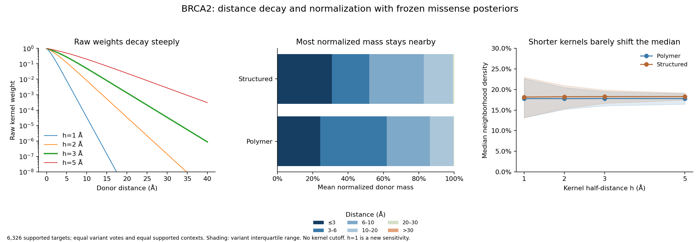

# BRCA2 distance and normalization audit

Long-range weights do not explain the broad nonzero score distribution in this
frozen run. With h=3 Å, the median normalized mass beyond 20 Å is 0.389% in
polymer neighborhoods and 0.707% in structured neighborhoods. Tightening h to
1 Å leaves their median densities at 17.80% and 18.18%; none of the 6,326
supported targets reaches 0.1% or lower at h=1, 2, 3, or 5.

These measurements preserve the frozen gene/missense empirical prior, count
snapshot, geometry, equal-variant votes, same-residue alternative alleles,
variant-only exclusion, nearest eligible donor copy per context, and equal
supported-context averaging. Recorded `affected > 0` is a count-field label,
not a claim that the original source established a disease case. The parallel
source audit identified annotation-table contamination in those frozen counts.

| Median per target | Polymer (4,389 targets) | Structured (1,937 targets) |
|---|---:|---:|
| Normalized mass beyond 10 Å | 13.48% | 16.91% |
| Normalized mass beyond 20 Å | 0.389% | 0.707% |
| Normalized mass beyond 30 Å | 0.0065% | 0.0193% |
| Distance containing 50% of weight | 5.37 Å | 5.91 Å |
| Distance containing 90% of weight | 10.75 Å | 11.61 Å |
| Weight from recorded affected donors | 53.43% | 55.41% |
| Weight from zero-affected donors | 46.57% | 44.59% |

Normalization still matters locally. S1855A in the AF-F10 context has total
raw K=0.1680 and its closest eligible donor is 10.26 Å away. That context gives
100% of its normalized weight to donors beyond 10 Å, and 11.71% beyond 20 Å.
It is the largest beyond-20 context share; none of the 12,874 supported
contexts puts a majority of its mass beyond 20 Å. This is an example of small
raw weights being renormalized, rather than a slow-decaying raw kernel.

Eleven supported targets have no recorded affected donor anywhere allowed by
their geometry. Their median density is 10.99%, entirely contributed by
posteriors of zero-affected donors. Eight lie in two entirely zero-case IDR
segments: residues 865–866 (six variants, 20 unaffected observations) and
1393–1394 (two variants, 14 unaffected observations). A third zero-case segment
at residue 1870 has one variant and remains unsupported after self-exclusion.
These are empirical posterior averages, so zero affected observations do not
make the donor values zero. This distance audit does not replace the prior or
repair the underlying counts.

`run_distance_audit.py` rebuilds compact context kernels and computes distances
by an exact, stable inversion of the frozen sigmoid. Distance quantiles use
the normalized donor mass, pooled with equal context weight. The separately
labeled `eligible_pair_distance_*` columns are unweighted geometric summaries;
they do not describe where most model weight lies. `raw_kernel_sum` on target
rows is the mean across supported contexts. `nearest_donor_distance` is the
minimum; `mean_context_nearest_donor_distance` is separately retained.

The run reproduces every cached h=2/3/5 density and beyond-20 weight share,
and adds an h=1 sensitivity without changing eligibility. Twenty-eight selected
contexts are also independently enumerated by PPA's reference backend and
checked using the direct raw-kernel formula. `checks.json` records input hashes.
All CSV/GZIP files are below 1.15 MB. The figure was visually checked for labels,
legends, scales, and agreement with the saved tables.

