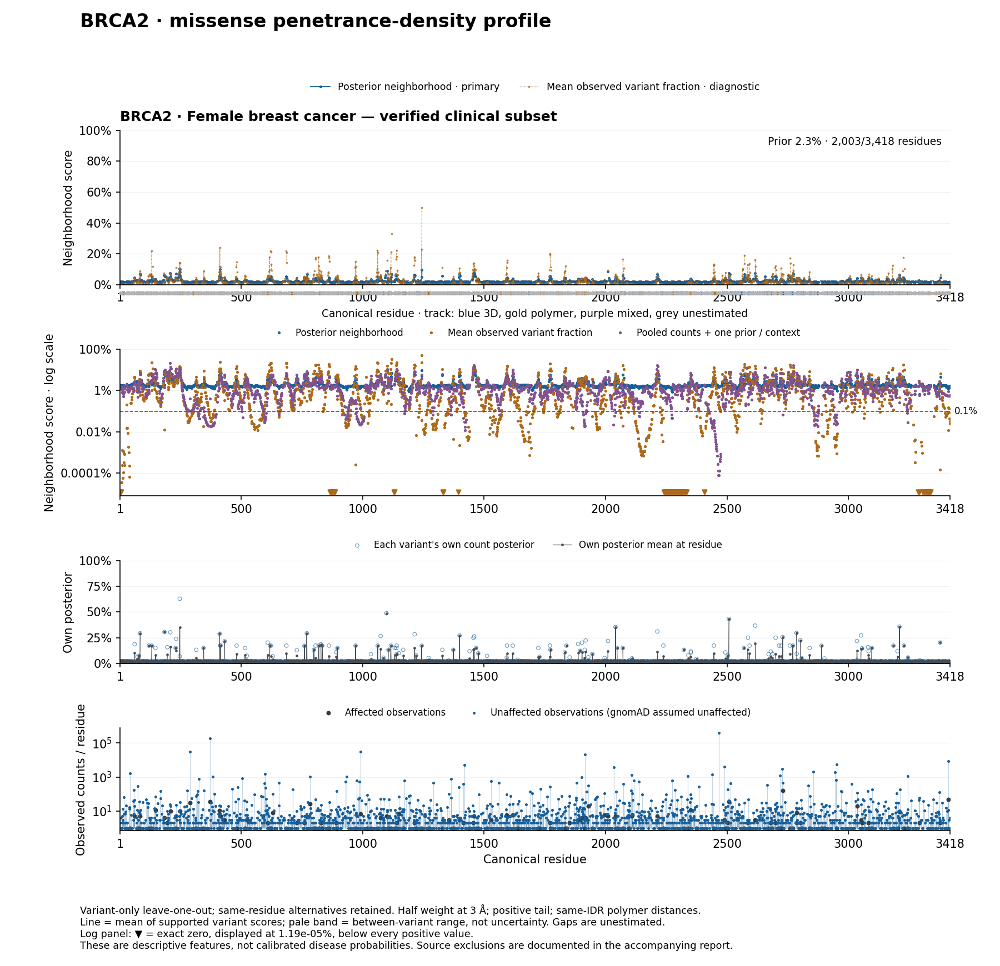

# BRCA2 female breast-cancer source correction

2026-09-14. **Restricted descriptive run, not a lifetime-risk model.** This is
the current BRCA2 female breast-cancer analysis. It supersedes the BRCA2 panel
of the [frozen five-gene refresh](../residue_density_refresh_20260914/README.md)
for this endpoint. The other four panels and archived source databases are
unchanged. [TASKS.md](../../../TASKS.md) owns remaining work.



[PDF](plots/BRCA2_RESIDUE_DENSITY.pdf) ·
[Full residue table](BRCA2_residue_density.csv.gz) ·
[Validation](validation.json) · [CLI reviews](reviews.md)

## Result and limits

The rebuilt missense universe has **3,033 observed variant units**, with 722
affected clinical observations, 708 clinical unaffected observations and
760,268 exact XX gnomAD carrier observations. gnomAD is assumed entirely
unaffected, as requested. Counts summed over alleles are carrier-observations,
not necessarily distinct people across the gene or across studies.

The gold residue median is **0.487%**: 536 of 2,003 supported residues are at or
below 0.1%, including 107 exact zeros. The blue median is **1.823%**. Its median
prior component is 1.564 percentage points; the historical prior still keeps
many sparse neighborhoods above zero. It has not been replaced by a calibrated
beta-binomial estimator in this correction.

The largest gold score is 50.05% at residue 1244. Almost all of it comes from
neighbor D1243E: one female case, no observed unaffected carriers, and normalized
weight 0.499885. That is a low-N fluctuation, not evidence that residue 1244
confers 50% breast-cancer risk. The gold curve can reach zero but remains noisy;
the blue curve suppresses these peaks and raises the lower end. Neither curve
has been established as a calibrated prediction target.

Clinical eligibility is verified for a subset of **nine studies**, not every
paper in the warehouse. Removing uncertain studies changes ascertainment and
ancestry composition. This run supports matched source/count arithmetic, not a
claim that restricting sex has by itself made the biological risk estimates
accurate. Ages, censoring and complete participant overlap are unresolved.

## Corrections applied

1. **Wrong-gene counts:** remove E1581D's 48 cases from the BRCA1 table in
   [Han et al., PMID 17100994](https://pubmed.ncbi.nlm.nih.gov/17100994/).
   Remove V109G's 142 cases and 137 controls from the P27/CDKN1B genotype block
   in [PMID 16672066](https://pubmed.ncbi.nlm.nih.gov/16672066/). These were
   misassigned to BRCA2.
2. **Omitted controls:** restore five I3412V normal controls from Han et al.'s
   BRCA2 table. Its BIC-entry column is not a patient count. Only the five
   explicitly female controls enter the female analysis; the 26 cases remain
   in the all-sex source overlay because patient sex was not enumerated in the
   cached Methods. Exact observation IDs, deltas and source lines are in
   [source_repairs.csv](source_repairs.csv).
3. **Sex and endpoint:** retain verified female germline breast cases and
   breast-unaffected female controls. Unknown clinical sex/endpoint, male
   cancer, other cancer endpoints and tumor-only evidence never become U.
   Rebuild [Momozawa et al., PMID 30287823](https://pmc.ncbi.nlm.nih.gov/articles/PMC6172276/)
   from the female SD1 workbook; the earlier observations combined separate
   female and male supplements. Keep only uniquely identified existing clinical
   alleles with recoverable carrier counts. Omit MyBrCa K2729N's 15 cases and
   19 controls while overlap with the BCAC contribution is unresolved; this
   is a precaution, not a finding of confirmed duplicate participants.
4. **Exact population counts:** fetch all 4,419 eligible canonical missense or
   stop-gained DNA alleles from gnomAD v4.1.1 joint data. All-sex counts match the
   frozen inventory; XX+XY reproduces AC, AN, homozygotes and carriers for every
   allele. Deduplicate identical repeated overall sex rows and reject conflicts.
   Female carriers are **XX AC minus XX homozygotes**, never AN or half the
   total. The 1,351 DNA alleles with zero XX carriers remain in the membership
   ledger. A unit with no female clinical or population observations is removed
   before fitting; it is not an unaffected singleton.
5. **Type identity:** build population joins within missense or nonsense,
   rather than attaching a frameshift to a nonsense key with the same protein
   stop label. Explicit DNA/type conflicts and unresolved clinical indels are
   excluded even when absent from gnomAD; clear equal-length delins within one
   codon can remain missense MNVs. For example, N1098* in
   [PMID 33278427](https://pubmed.ncbi.nlm.nih.gov/33278427/) is
   `c.3291dupT`, explicitly called a frameshift in Table 1, and its three cases
   do not enter the nonsense prior. These exclusions are not corrections to
   patient phenotype or proof of a particular alternative consequence.

The clinical supplements sometimes report frequencies, not integer counts.
Japanese SD1 gives five-decimal carrier frequencies for 7,051 female cases and
11,241 female controls but lacks exact per-allele called denominators. Its ≥98%
call-rate filter implies fewer than 620 missing calls across the 30,926 initial
samples. Conservatively allow up to 620 missing calls in either stratum and
frequency rounding ±0.000005; retain a count only when exactly one integer is
possible within those bounds. These are **derived counts under that bound**,
not directly enumerated counts. Twenty-two SD1 rows remain in the
[identity/count queue](female_SD1_identity_queue.csv), including common alleles
whose carrier counts cannot be uniquely recovered. Workbook GRCh37 positions
are never joined directly to gnomAD GRCh38 coordinates.

## Priors and attrition

| Universe | Type | Units | Clinical A | Clinical U | Population U | Prior mean | α empirical | β empirical |
| --- | --- | ---: | ---: | ---: | ---: | ---: | ---: | ---: |
| Source/type-corrected all-sex | Missense | 4,410 | 1,617 | 1,357 | 1,516,774 | 3.330% | 0.154259 | 4.477753 |
| Verified female breast | Missense | 3,033 | 722 | 708 | 760,268 | 2.266% | 0.124784 | 5.382211 |
| Source/type-corrected all-sex | Nonsense | 329 | 846 | 108 | 13,297 | 53.323% | 2.742021 | 2.400290 |
| Verified female breast | Nonsense | 138 | 55 | 9 | 6,597 | 15.949% | 0.843879 | 4.447137 |

Source: [prior_comparison.csv](prior_comparison.csv). The accepted pre-audit
all-sex missense prior was 3.816%; the first row additionally repairs sources
and type joins. The two current scopes use the same corrected type rules.
Clinical missense A retention is 44.7%, U retention 52.2%, and population U
retention 50.1% between these scopes. These are net changes after supplement
recovery and identity checks, not independent filter-retention experiments.
Nonsense case attrition is much greater, so its drop should not be interpreted
as a sex-specific biological effect.

[observation_eligibility.csv.gz](observation_eligibility.csv.gz) records every
retained/excluded original observation and rebuilt SD1 row;
[clinical_attrition.csv](clinical_attrition.csv) groups by study and reason;
[cohort_decisions.csv](cohort_decisions.csv) gives primary-source anchors.
Do not sum superseded Japanese observations together with the newly recovered
SD1 rows as one input cohort. At source-row level, before type/identity filtering,
the corrected old observations total A=7,195/U=3,599 across 575 PMIDs; retained
old rows contribute A=1,033/U=564 and rebuilt female SD1 adds A=293/U=424.
These totals include other variant types. The missense join then excludes four
canonical-WT mismatches (192 A/139 U), leaving the 722 A/708 U above; the
nonsense join excludes the three frameshift cases. The retained clinical
missense/nonsense unit counts are 252/26 respectively.

Source-corrected clinical counts before the current type exclusions are retained in
[clinical_source_corrected_all_sex.csv.gz](clinical_source_corrected_all_sex.csv.gz).
The female source overlay and join/exclusion ledgers keep rejected identities
inspectable without injecting their counts into a prior. Full-population DNA
membership is in [population_membership.csv.gz](population_membership.csv.gz).

The prior recipe remains `w=1-1/(n+0.01)`, weighted mean μ and
`v=sum(w*(A/n-μ)^2)/M`; κ=`μ*(1-μ)/v-1`, α=`μκ`, β=`(1-μ)κ`.
The posterior is **Beta(α+A, β+clinical U+XX carriers)**. n must be positive.
The singleton weighting and variance normalization remain limitations; the
accepted next comparison is beta-binomial marginal likelihood, then a mixture
only if supported. Nothing in this run learns the prior from AlphaMissense.

## Structure, plots and verification

The existing union, prior, density and plotting implementations are imported,
not copied. BRCA2's frozen canonical geometry, separate local structural
contexts and same-chain/same-IDR polymer distance `3.8*sqrt(sequence gap)` remain
unchanged. There is no claim of a solved full-length biological assembly.
Missing coordinates alone do not authorize a polymer edge.

The positive kernel is `2/(1+exp(log(3)*d/h))`, with h=3 Å and h=2 Å/5 Å
sensitivities. There is no hard distance cutoff. Median normalized weight beyond
20 Å is 0.539%. Variant-only LOO removes the target unit and its aliases/copies,
while retaining other variants at the same residue. Full-data prior parameters
are held fixed inside this descriptive LOO; predictive validation must refit
within folds.

Blue is `W @ posterior_mean`, gold is `W @ (A/n)`, with the same normalized
weights. Purple uses raw kernel-weighted counts and one prior per context.
The lines summarize supported observed variants at each residue; they do not
estimate all hypothetical substitutions. There are 2,899 supported variant
units at 2,003 residues; 1,415 residues remain unestimated. Pale bands show
between-variant ranges, not confidence intervals. The bottom color track
describes geometry, independently of the plotted line colors.

`validate.py` passed: 260 source/run hashes, all six earlier exact-sex probes,
all-allele membership and count conservation, female study exclusions, type
checks, α/A and β/U updates, moments, zero self-weight, normalized rows,
independent blue/gold reconstruction, prior decomposition and residue totals.
There are 2,188 nonself same-residue weight pairs. The final PNG was visually
checked. All 16 artifacts from the previous sex audit retain their frozen
hashes. CLI reviews found useful methodological risks but did not validate the
data; [reviews.md](reviews.md) records the decisions.

Reproduce locally with the existing scientific environment and source cache:

```bash
/Users/kronckbm/GitRepos/BayesianPenetranceEstimator/.venv/bin/python docs/evidence/brca2_female_breast_20260914/fetch_population.py
/Users/kronckbm/GitRepos/BayesianPenetranceEstimator/.venv/bin/python docs/evidence/brca2_female_breast_20260914/curate_clinical.py
/Users/kronckbm/GitRepos/BayesianPenetranceEstimator/.venv/bin/python docs/evidence/brca2_female_breast_20260914/run.py
/Users/kronckbm/GitRepos/BayesianPenetranceEstimator/.venv/bin/python docs/evidence/brca2_female_breast_20260914/validate.py
```

The public population fetch resumes cached batches; raw API/CLI responses and
weight matrices remain ignored run outputs. Tracked artifacts are compact
tables, receipts, scripts and figures. No extraction recall or clinical
calibration improvement is claimed without the registered scored evaluation.
