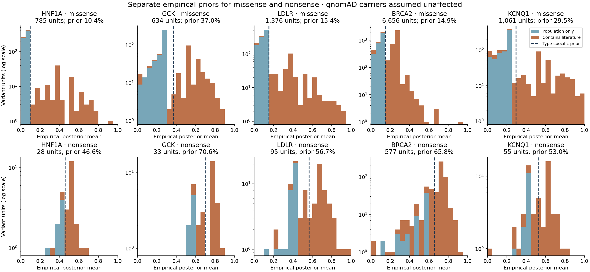
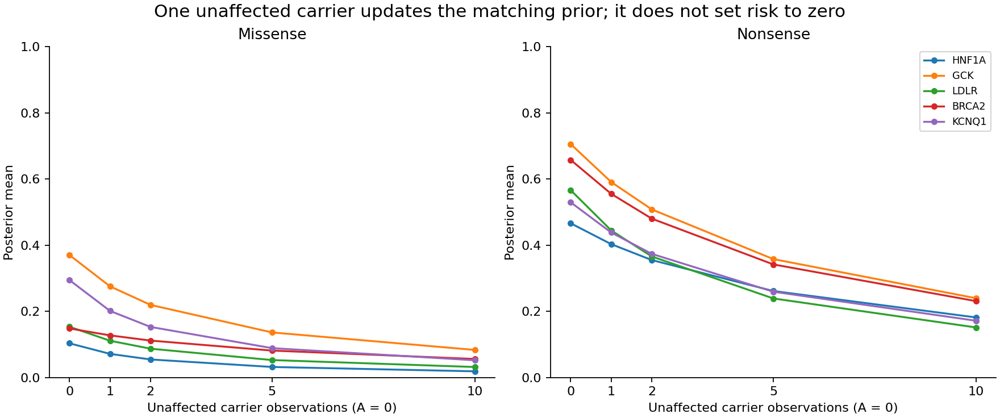

# Empirical priors by gene and variant type — 2026-09-12

This supersedes use of the full-gene empirical prior for missense and nonsense variants. Each gene now has **one missense prior and one separate nonsense prior**, fitted to eligible literature and observed population variants of that same type. Synonymous, frameshift, splice, noncoding, start-loss and stop-loss records do not influence either fit. Nonsense combines the equivalent `nonsense` and `stop_gained` source labels only.

There are **10,512 missense units and 788 nonsense units** across the five genes. All have a validated canonical reference amino acid. The frozen allele identities, QC rules, affected counts and unaffected counts are unchanged. All gnomAD carriers are assumed unaffected. The prior fitting method is unchanged so this run isolates the correction to variant type.

| Gene | Type | Units | α empirical | β empirical | Prior mean | After A=0, U=1 |
|---|---|---:|---:|---:|---:|---:|
| HNF1A | missense | 785 | 0.23327 | 2.01670 | 10.37% | 7.18% |
| HNF1A | nonsense | 28 | 2.98369 | 3.41285 | 46.65% | 40.34% |
| GCK | missense | 634 | 1.08116 | 1.83760 | 37.04% | 27.59% |
| GCK | nonsense | 33 | 3.63675 | 1.51516 | 70.59% | 59.12% |
| LDLR | missense | 1,376 | 0.40506 | 2.22906 | 15.38% | 11.15% |
| LDLR | nonsense | 95 | 2.07086 | 1.58433 | 56.66% | 44.49% |
| BRCA2 | missense | 6,656 | 0.90746 | 5.19932 | 14.86% | 12.77% |
| BRCA2 | nonsense | 577 | 3.56489 | 1.85309 | 65.80% | 55.55% |
| KCNQ1 | missense | 1,061 | 0.63824 | 1.52703 | 29.48% | 20.16% |
| KCNQ1 | nonsense | 55 | 2.54530 | 2.25838 | 52.99% | 43.86% |



## How a population singleton updates its matching prior

For every variant, alpha adds affected observations and beta adds literature-unaffected plus gnomAD-unaffected observations. An unaffected singleton is `A=0, U=1`; its posterior is `Beta(α, β+1)`, not a point estimate of zero. If `κ=α+β`, its mean is `μ × κ/(κ+1)`. The strength therefore determines how far below the prior it moves.

GCK missense uses `Beta(1.08116, 1.83760)`, strength 2.91876. One unaffected carrier gives mean **27.59%**, retaining 74.48% of the 37.04% prior mean. GCK nonsense uses `Beta(3.63675, 1.51516)`, strength 5.15191; one unaffected carrier gives **59.12%**, retaining 83.74% of the 70.59% prior mean. High nonsense alpha relative to beta concerns this selected nonsense class; it is not a prior for an arbitrary variant of any consequence.

The no-count example in the update table illustrates the prior only. No hypothetical unobserved `A=0,U=0` allele was inserted into the fitted data.



## Singleton prevalence and fitting weights

| Gene | Missense population-only units | Population-only units with n=1 | All missense units with n=1 | n=1 share of prior-fit weight |
|---|---:|---:|---:|---:|
| HNF1A | 640 | 48.8% | 44.3% | 1.02% |
| GCK | 385 | 63.9% | 52.4% | 1.53% |
| LDLR | 1,005 | 50.1% | 43.2% | 1.00% |
| BRCA2 | 2,971 | 48.9% | 57.0% | 1.81% |
| KCNQ1 | 666 | 55.7% | 42.9% | 0.95% |

For GCK, 246 of 385 population-only missense units are singletons (63.9%). Across genes, singleton dominance is not universal; roughly half of population-observed missense units have one gnomAD carrier. The source-stratified audit distinguishes one gnomAD carrier from one total carrier after adding clinical counts.

The historical fit is `w=1−1/(n+0.01)`, `μ=Σ(w·A/n)/Σw`, `v=Σ[w·(A/n−μ)²]/M`, and `κ=μ(1−μ)/v−1`, with M restricted to the current gene and type. Thus n=1 gets weight 0.009901 while large n approaches weight 1. Singletons are retained in the data and receive their full count update, but collectively contribute only about 1–2% of the missense prior-fitting weight despite representing 43–57% of units. This is a separate methodological influence on the averages; it is not corrected by changing the variant class.

The diagnostic equal-weight raw-fraction mean/MSE is reported separately, without replacing the primary. For GCK missense it gives mean 31.83% but strength only 0.138, so an unaffected singleton falls to 3.86%. Simply removing the historical weights does not ensure a small singleton update: raw fractions mix binomial sampling noise with between-variant variation. MAE remains a diagnostic and is never substituted directly for variance. No prior strength has been chosen to force a desired histogram.

## Structural rerun and scope

The GCK structural analysis uses **missense donors and the GCK missense prior only**. Nonsense posteriors remain a separate table and do not enter the missense density. The 634 missense identities, observed counts, AlphaMissense values, biological monomer geometry, distance kernel and variant-only LOO rules are unchanged from the population-inclusive run. This provides a direct comparison of the effect of the prior class.

The primary kernel retains half weight at 3 Å and positive tails beyond 20 Å. Other distinct variants at the target residue remain available; the target itself is removed globally from training density features in each outer fold. Full gene-by-type hyperparameters remain fixed by instruction. The complete 20 geometry/metric/kernel scenarios and the 610-target and original-242-target model comparisons are rerun. Median structural density is now 37.41%, versus 18.24% under the full-gene prior; the normalized spatial weights are exactly unchanged. Structure gives a modest gain across the 610 common targets, with essentially unchanged or mixed results on the original 242. See the [structural report](structural/README.md).

These remain empirical estimates from the observed, ascertained count collection under the adopted gnomAD-unaffected assumption. GCK clinical outcomes still mix MODY and activating/hypoglycemia evidence. Class separation corrects the prior population; it does not by itself establish outcome calibration. No AlphaMissense, GPN-Star or AlphaGenome score enters either empirical prior.

## Evidence and reproduction

The source is the committed population-inclusive union in `../population_inclusive_penetrance_20260912/analysis/union_counts/`. Existing raw population snapshots and the complete clinical identity ledger are reused without changes. `analysis/fit_checks.json` pins source hashes; posterior shards retain the `variant_type` and `class_scope` fields on every row. `analysis/source_type_inventory.csv` shows the other source classes rather than discarding their provenance.

```bash
../BayesianPenetranceEstimator/.venv/bin/python docs/evidence/class_matched_penetrance_20260912/fit_class_priors.py
../BayesianPenetranceEstimator/.venv/bin/python docs/evidence/class_matched_penetrance_20260912/run_structure.py
../BayesianPenetranceEstimator/.venv/bin/python docs/evidence/class_matched_penetrance_20260912/validate_structure.py
../BayesianPenetranceEstimator/.venv/bin/python -m pytest docs/evidence/class_matched_penetrance_20260912 -q
```

Tests demonstrate that adding or changing synonymous/frameshift/other classes cannot change either prior, modifying nonsense counts cannot change a missense prior, equivalent stop labels agree, noncanonical rows are excluded, and unaffected singletons update beta only. The independent [count/weight audit](audit/README.md) reconstructs the type-specific results.

Validation: 11 targeted class-isolation and LOO tests passed; 17 class-fit tables reproduced byte-identically. The independent audit matches all 30 primary and sensitivity fits. Run `../BayesianPenetranceEstimator/.venv/bin/python docs/evidence/class_matched_penetrance_20260912/verify_artifacts.py` to check the source hashes and frozen manifest.
