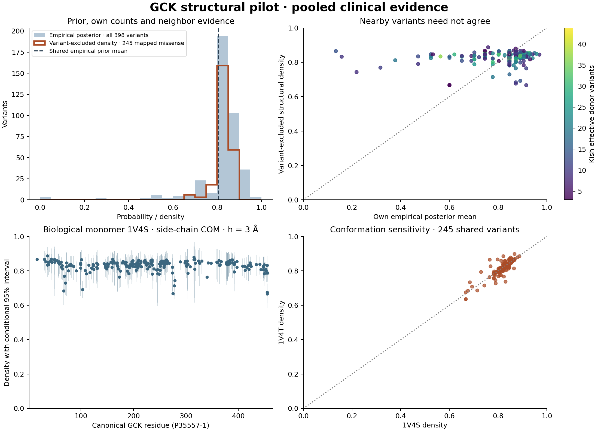
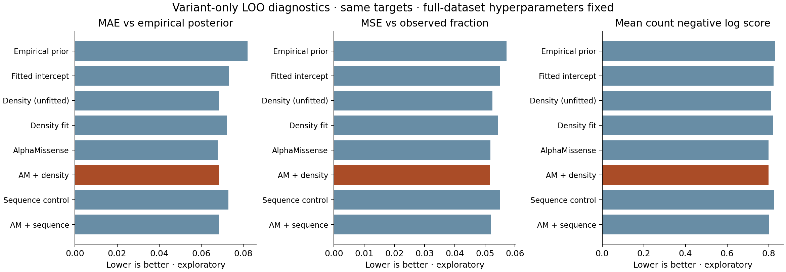

# GCK empirical-posterior structural pilot

Completed 2026-09-12. **The structural calculation works, but this first internal
comparison shows essentially no incremental benefit over AlphaMissense.** The
input audit also found canonical-reference errors and mixed clinical endpoints.
The output is exploratory pooled GCK clinical evidence, not a validated
GCK-MODY penetrance model.



## What ran

The common empirical Beta prior was reproduced from all **398 frozen
count-bearing keys**, before missense or geometry filtering:
alpha = **3.127017**, beta = **0.746194**, mean = **0.807345**, strength =
**3.873211**. The historical saturating-weight mean and weighted MSE formula is
unchanged from the [agreed specification](../structural_density_plan_20260912/PLAN.md).
Affected observations total 932, literature unaffected 82, and gnomAD 3,620;
gnomAD is treated as unaffected as requested. Each key then receives
Beta(alpha + affected, beta + unaffected), with intervals saved for all 398.
AlphaMissense does not enter this empirical prior or any density donor value.

The new explicit `alphafold_rin.empirical_density` API uses equal-variant
empirical posterior means with variant-only exclusion. It excludes the target
identity across all copies and retains other substitutions at its residue.
Its kernel is `2 / (1 + exp(log(3) * distance / h))`, with primary **h = 3 Å**,
K(3) = 0.5, K(20) = 0.001318, and no distance, weight, or sequence cutoff.
The primary coordinate metric is the complete side-chain heavy-atom
mass-weighted center, with glycine Cα fallback. This is an explicit metric,
not a claim of exact reproduction of the historical centroid file.

Both experimental biological assemblies are actual GCK monomers. Their
isoform-2 constructs were mapped to canonical **P35557-1** with SIFTS and exact
sequence checks; isoform-specific N-terminal coordinates were excluded. The
separate full AlphaFold v6 monomer was also mapped exactly. No predicted and
experimental coordinates were combined into a synthetic frame. See the
[geometry audit](geometry/README.md) for source URLs, author/label/canonical
numbering, complete 465-row manifests, raw-file hashes and reconstruction.

The open 1V4T structure's experimentally disordered **157–179** loop uses
`3.8 * sqrt(canonical sequence separation)` within that segment and chain.
Both endpoints must be in the same segment; mixed ordered/disordered geometry
is unavailable. The loop is resolved in 1V4S and uses measured coordinates
there. This state-dependent disorder assignment is supported by the
[experimental structural analysis](https://pmc.ncbi.nlm.nih.gov/articles/PMC3531626/),
even though AlphaFold gives that region high confidence. Predicted geometry
otherwise requires pLDDT ≥70; <50 is flagged candidate disorder and 50–70
remains ambiguous. Experimental B-factors are not used as pLDDT.

| Geometry | Structured canonical residues | Supported variants | Density median | Polymer-supported variants |
|---|---:|---:|---:|---:|
| 1V4S closed, primary COM/h3 | 446 | 245/249 | 0.83810 | 0 |
| 1V4T super-open, COM/h3 | 423 | 245/249 | 0.83959 | 16 |
| Full AlphaFold monomer, COM/h3 | 455 | 249/249 | 0.83713 | 0 |

The four unsupported experimental targets are **A11T, D4N, M462I and M462V**.
They remain explicit rows with missing density, interval, and variance. Their
empirical posteriors are preserved. AlphaFold supplies a separately labeled
modeled context for all four. Omitting the open-state polymer loop reduces
1V4T support from 245 to 229 variants, demonstrating the fallback's contribution.

Twenty prespecified scenarios cover three structures, COM/Cα, half-distances
2/3/5 Å, the open-loop missing-geometry control, and the older polymer
parameters 5.5*N^0.55. At COM/h3, switching closed to open changes density by
0.00948 on average (maximum 0.10153); replacing COM with Cα in the closed
structure changes it by 0.00968 on average. Sensitivities were not selected
using prediction performance.

## Support and uncertainty

For the 245 supported primary variants, density ranges **0.66675–0.88709**.
The median Kish effective donor count is **15.55**, median summed kernel
weight **3.275**, and median largest-donor share **16.36%**. Sixteen targets
have Kish donor counts below five. These describe the concentration of spatial
weights, not independent patients or calibrated clinical confidence.

Every supported primary target includes all 244 other geometrically eligible
donor keys, with no distance pruning. Donors beyond 20 Å supply a median
**0.817%** of the normalized weight and as much as **6.861%** for one target.
They are small contributions, but not zero. A total of 121 mapped target keys
retain another substitution at the same residue. No target includes itself.
The general API collapses equivalent donor copies by nearest eligible distance
within each target context, then averages supported target contexts; the GCK
pilot has one biological chain.

The conditional intervals use **8,192 Beta draws per donor**, seed 20260912,
reusing each donor draw across every target. Median primary interval width is
0.13167. These intervals hold empirical hyperparameters and geometry fixed and
assume independent donor posteriors. Shared patients/families/cohorts, source
count errors, endpoint ambiguity, geometry uncertainty and hyperparameter
uncertainty are not included. Unsupported rows are missing, not zero-variance.

## Internal comparison on the same 242 variants

All models use the intersection with archived AlphaMissense and available
primary density. The full eligible donor pool remains available even when a
donor lacks an AM score. The sequence control uses the same sigmoid over
3.8*sqrt(sequence separation) across the protein; it is a control distinct from
the IDR-specific structural routing.

Regression uses equal-variant fractional logistic labels equal to empirical
posterior means, fixed ridge penalty 1 on slopes, an unpenalized intercept,
and training-only feature scaling. There is no hyperparameter selection.
For outer held-out variant i, i is removed from **every training row's donor
pool** as well as its own density; each training row also excludes itself.
Other substitutions at either residue remain. Full-dataset empirical alpha/beta
remain fixed as requested, so the comparison retains indirect target influence
through those shared parameters and is not wholly independent validation.

| Model | MAE vs empirical posterior | MSE vs observed A/(A+U) | Mean Beta-binomial negative log score |
|---|---:|---:|---:|
| Fixed empirical prior | 0.08206 | 0.05721 | 0.82934 |
| Fitted intercept | 0.07311 | 0.05490 | 0.82353 |
| Unfitted structural density | 0.06849 | 0.05246 | 0.81042 |
| Fitted structural density | 0.07226 | 0.05442 | 0.82050 |
| AlphaMissense | 0.06784 | 0.05178 | 0.79863 |
| AlphaMissense + density | 0.06829 | 0.05165 | 0.79849 |
| Fitted sequence control | 0.07288 | 0.05501 | 0.82464 |
| AlphaMissense + sequence | 0.06828 | 0.05199 | 0.80066 |

Lower is better for these scores. Adding density to AM slightly worsens error
against the empirical posterior, while observed-fraction MSE improves by just
0.00013 and the count score by 0.00014. This is insufficient to claim useful
incremental predictive information. The count score uses a Beta-binomial with
predicted mean and the fixed empirical strength; it describes these ascertained
counts under the adopted unaffected assumption, not population disease risk.
Support-stratified errors, calibration bins and every held-out prediction are
saved. Rank correlations of an outer-LOO intercept vary mechanically because
each fold omits a different outcome; they should not be interpreted as a
predictive association.



## Why the map still does not approach zero

The input remains a literature-selected variant universe. **320/398 keys have
no unaffected observations, and 188 are exactly one affected/zero unaffected**.
With the requested empirical prior, each such singleton has posterior mean
0.846878. Averaging neighboring empirical posteriors therefore produces a
narrow high-valued density; it does not manufacture low-risk evidence. Only
three full-universe posteriors are below 0.1: A11T and two synonymous keys
(C220= and Y215=). The synonymous keys are correctly outside the missense
spatial kernel; A11T lacks canonical experimental coordinates. This result
does not show that all unsampled GCK variants have high penetrance.

Two concrete input problems now have inspectable review queues:

1. **19/268 missense keys fail canonical reference validation.** They are
   excluded from spatial calculation, with counts and original identities
   preserved. They remain in the requested frozen full-dataset prior, so that
   prior also retains their influence pending source correction.
2. **Clinical endpoints are mixed.** Retained extracted evidence includes
   hyperinsulinemic hypoglycemia/activating GCK observations, including W99R
   and V389L. A keyword screen flags 22 keys for review but is not an exclusion
   rule. Disease-specific counts require source review.

Eight missense protein keys map multiple genomic alleles. The frozen data have
already aggregated by protein key; the calculation therefore excludes one
**protein-key aggregate**, not an independently reconstructed DNA allele.
Aliases are not multiplied into extra donors. Full details and exact source
lineage are in the [eligibility audit](eligibility/README.md).

The next run should correct the 19 reference/identity conflicts and curate
gene–disease/direction-of-effect counts, then refit the same empirical method
and repeat this fixed-setting comparison. Population-only variant coverage
and independent genotype-first outcomes remain necessary for the original
population-risk question. After these checks, extend to LDLR with its geometry
review and to oligomeric genes only with suitable biological assemblies.

## Reproduction and artifacts

From the GVF repository root, using the existing sibling environments:

```bash
MPLCONFIGDIR=tmp/matplotlib ../BayesianPenetranceEstimator/.venv/bin/python \
  docs/evidence/gck_structural_pilot_20260912/run_pilot.py

../BayesianPenetranceEstimator/.venv/bin/python -m pytest \
  docs/evidence/gck_structural_pilot_20260912/test_pilot_statistics.py -q

.venv/bin/python docs/evidence/gck_structural_pilot_20260912/verify_artifacts.py

cd ../ProteinProximityAnalysis
.venv/bin/python -m pytest -q
```

The analysis runner is offline and reads frozen count, identity, predictor and
coordinate snapshots. `--ppa-src` accepts another installation's source path;
`--output-dir` writes an isolated reproduction. Geometry source reacquisition
is documented separately and rejects changed raw hashes. Raw downloaded
structures stay in ignored GVF `results/`; compact canonical coordinates and
provenance are committed here. Historical PPA functions retain their behavior;
this pilot explicitly calls the new empirical API.

- `analysis/GCK_empirical_posteriors_and_eligibility.csv`: all 398 keys, count
  partitions, common prior, individual Beta posteriors/intervals, and audit flags.
- `analysis/GCK_primary_variant_density.csv`: all 249 eligible targets,
  densities, missingness, conditional intervals, and support diagnostics.
- `analysis/GCK_primary_donor_contexts_*.csv.gz`: every primary target–donor
  contribution in bounded file chunks, including distances beyond 20 Å.
- `analysis/GCK_primary_normalized_donor_weights.csv.gz`: matrix used for
  conditional draws and outer-fold exclusion.
- `analysis/GCK_density_scenarios.csv.gz` and `GCK_sensitivity_summary.csv`:
  all 20 settings and comparisons with the fixed primary.
- `analysis/GCK_variant_loo_predictions.csv`, `GCK_variant_loo_metrics.csv`
  and `GCK_internal_calibration.csv`: same-target internal comparisons.
- `analysis/run_checks.json`, `geometry/geometry_checks.json` and
  `artifact_manifest.json`: input/source hashes, numerical checks and artifact
  integrity. The PPA source hash and commit pin the density contract.
- `validation.json`: target/donor reconstruction checks and the byte-identical
  second run of all 16 analysis outputs, including the three figures.

Validation: 174 offline PPA tests pass, including 38 tests for this API, plus
four pilot statistical tests. Three complete engine recalculations verify the
outer-exclusion matrix shortcut. Geometry and full analysis reconstruction are byte-identical;
canonical WT checks and source hashes pass. An independent review caught and
fixed missing rows incorrectly receiving zero conditional variance. Figures
were rendered and visually inspected.
