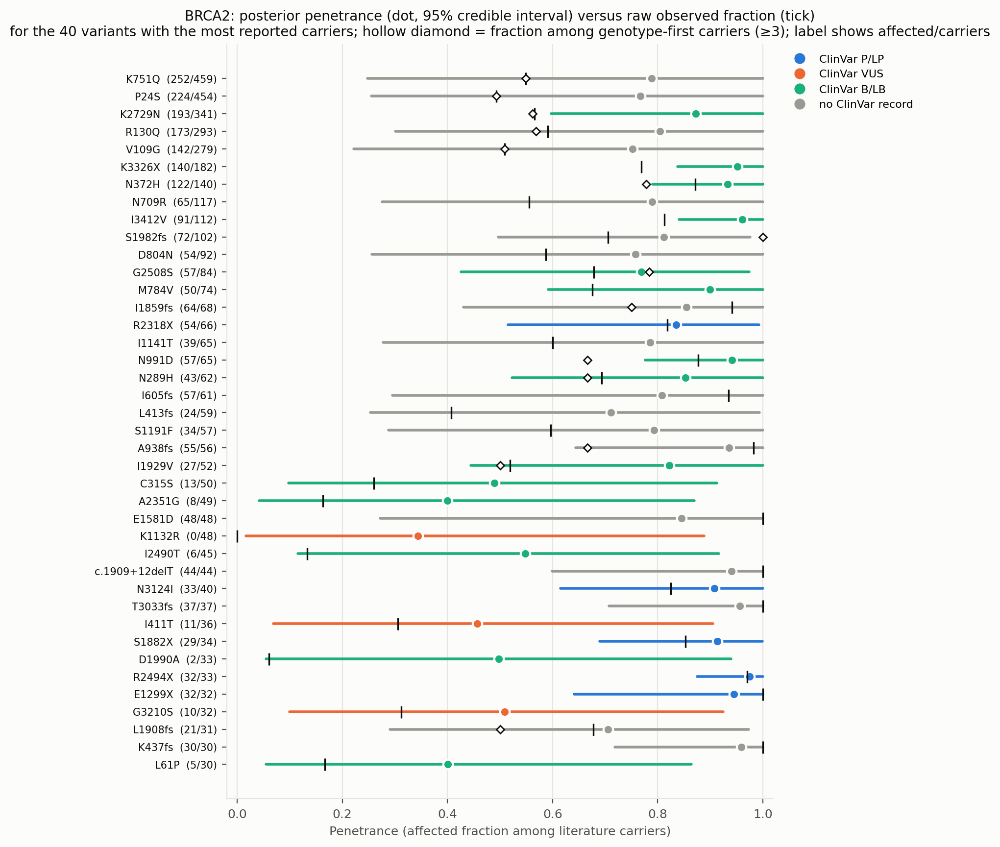
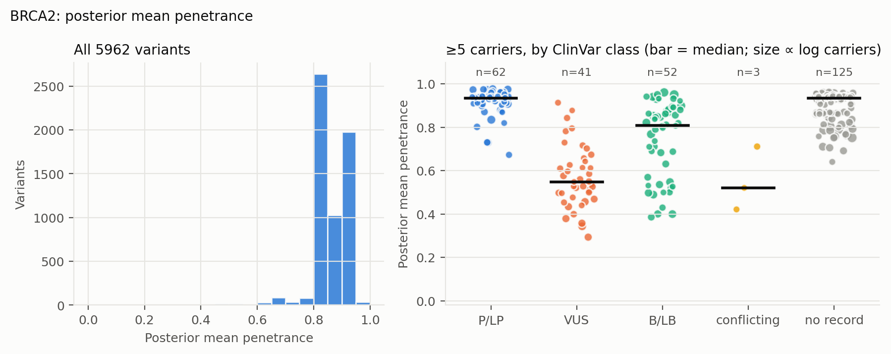
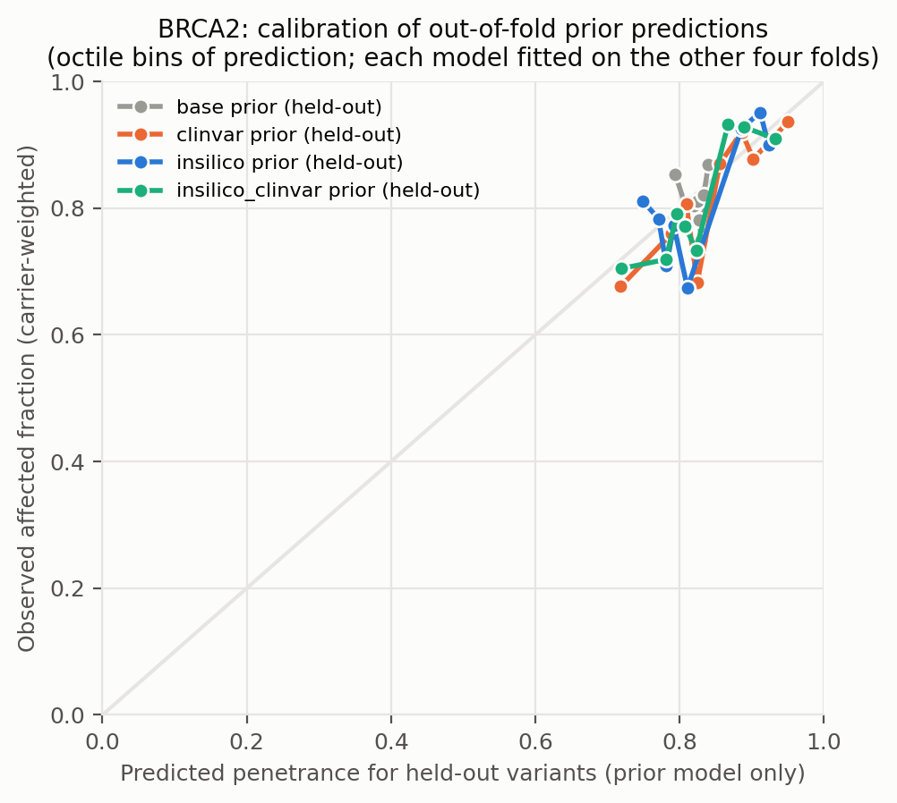
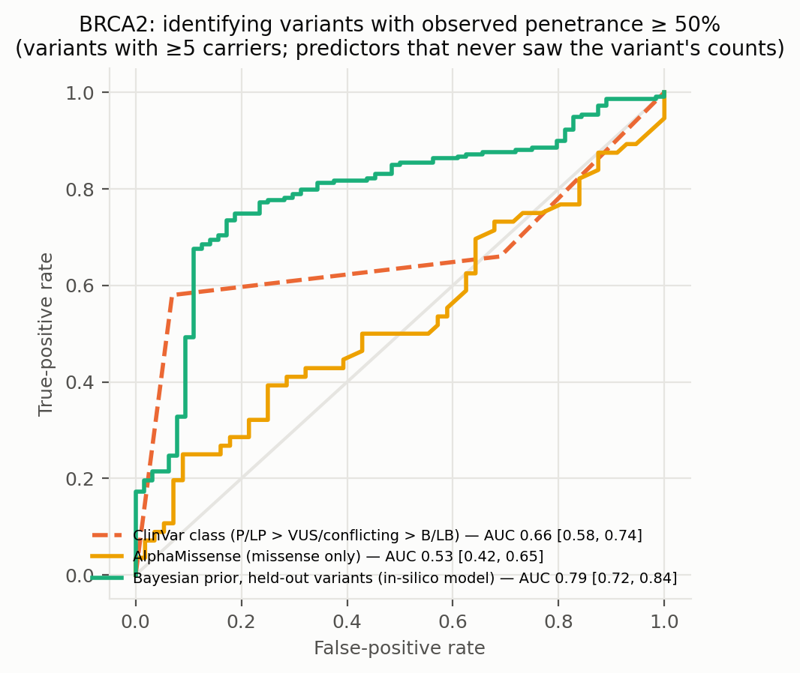
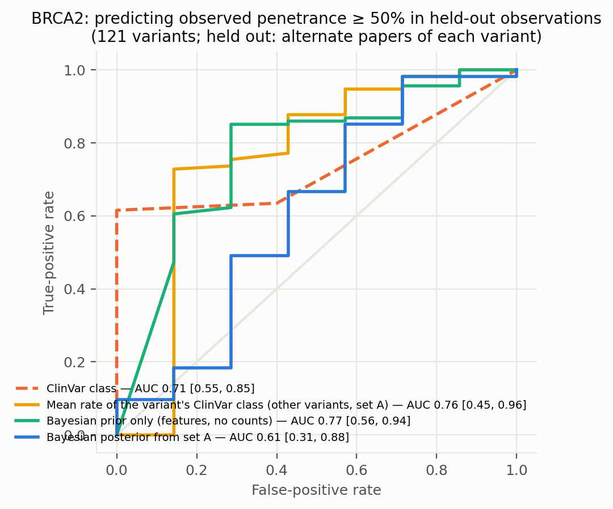
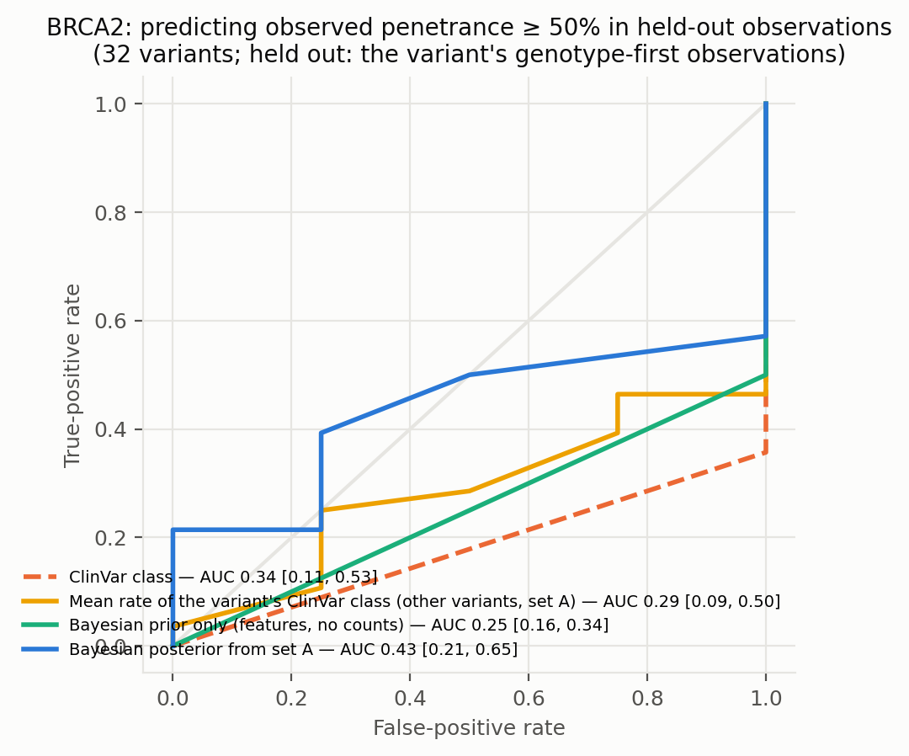
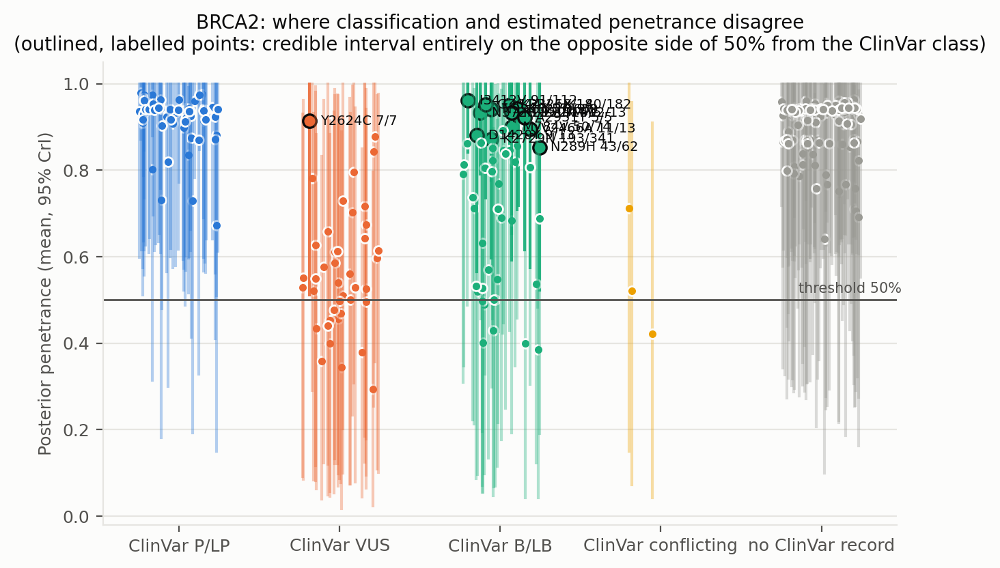
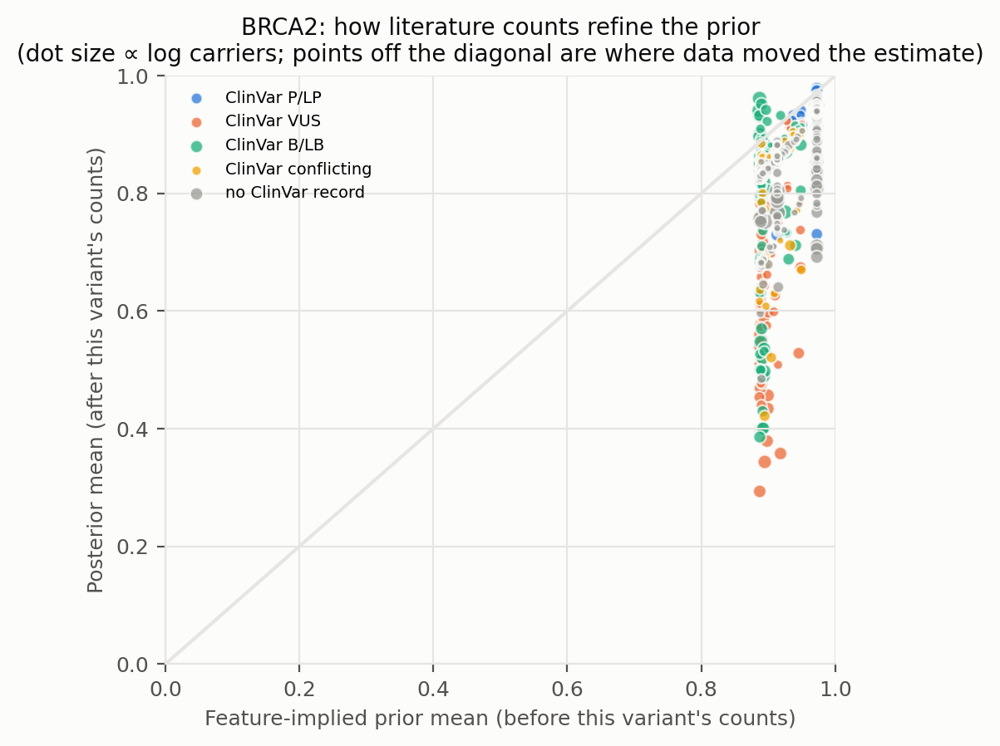
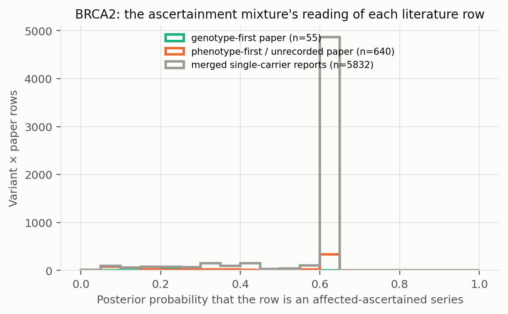

# BRCA2: literature-derived penetrance with a Bayesian prior — automated report

Generated by `iterations/grant_e2e_20260909/scripts/make_report.py` from the frozen workflow (GeneVariantFetcher tag `grant-freeze-20260909`). All numbers below are produced by code from the run artifacts; none were edited by hand.

## Data

| Quantity | Value |
| --- | ---: |
| Papers in the extraction database | 3759 |
| Variant rows in the database | 104862 |
| Usable carrier observations (variant × paper) | 8182 |
| Papers contributing usable observations | 575 |
| Count rows without a usable denominator (excluded) | 14518 |
| Quarantined count rows excluded by the trust gate | 1403 |
| Distinct variants with carrier counts | 6106 |
| Total literature carriers / affected | 15689 / 11958 |
| Variants with ≥5 carriers (evaluation set; carriers = literature) | 283 |
| Share of observations that are single affected probands | 0.87 |
| Missense variants with an AlphaMissense score | 3631 / 3733 |
| Variants with a ClinVar record | 4082 / 6106 |
| Feature transcript | ENST00000380152.8 |
| gnomAD carriers added as unaffected | 0 (off) |

Denominator sources: explicit = 877, individual_records = 168, total_derived = 7137. Study designs (paper level): unknown = 5993, case_series = 1203, cohort_population = 645, case_control = 146, case_report = 111, family_segregation = 32, functional_invitro = 25, other = 19, case_report|review_meta = 4, cohort = 4.

Excluded count rows by shape: affected_only_no_denominator = 77, other_or_inconsistent = 24, total_only_no_phenotype_split = 14326, unaffected_only = 91. Largest sources of total-only rows (carrier totals with no affected/unaffected split): PMID 39779857 (6957 rows, 15028981 carriers, design unrecorded); PMID 32566972 (1126 rows, 1126 carriers, design unrecorded); PMID 31131967 (677 rows, 3685808 carriers, design unrecorded).

ClinVar classes among variants with counts: B/LB = 893, Conflicting = 610, P/LP = 496, VUS = 2083, none = 2024.

## Model

Hierarchical logistic-binomial on variant × paper rows (6527 rows after merging single-carrier reports per variant, 5962 variants). Each row is either an **affected-ascertained series** (probability π, success probability p_asc ≈ 1) or an **informative observation** of the variant's penetrance: `y_r ~ π·Binomial(n_r, p_asc) + (1−π)·Binomial(n_r, p_r)`, `logit(p_r) = α + x_v·β + σ·z_v + τ·e_r`, with a between-variant effect `z_v` and a between-study effect `e_r`; `logit(π_r) = g0 + g1·[genotype-first ascertainment recorded for the paper] + g2·[standardized log10 gnomAD allele frequency of the variant]` (case series of common alleles are ascertainment). gnomAD anchor rows are informative by construction and carry no study effect. Fitted by NUTS (PyMC, 4 chains). The posterior of `p_v = sigmoid(α + x_v·β + σ·z_v)` is the penetrance estimate among carriers not selected for being affected: variants with many informative carriers are driven by their own counts; variants known only from case reports are shrunk toward the feature-implied prior and carry wide intervals. Fixed-effect sets: `base` (intercept only), `class` (truncating), `insilico` (class + AlphaMissense), `clinvar` (class + ClinVar P/LP, B/LB, no-record), `insilico_clinvar`. The primary model is `insilico`.

| Model | Features | σ (between-variant SD, logit) | τ (between-study SD, logit) | π ascertained: phenotype-first / genotype-first rows (typical frequency) | g2 (per SD of log10 AF) | max R̂ | min ESS | divergences |
| --- | --- | ---: | ---: | ---: | ---: | ---: | ---: | ---: |
| base ⚠ chains disagree | — | 1.39 | 1.44 | 0.61 / 0.22 | -0.98 | 1.540 | 7 | 0 |
| class ⚠ chains disagree | trunc | 1.46 | 1.39 | 0.60 / 0.20 | -0.79 | 1.550 | 7 | 287 |
| clinvar ⚠ chains disagree | trunc, clinvar_plp, clinvar_blb, clinvar_none | 1.93 | 1.86 | 0.58 / 0.22 | -1.04 | 1.540 | 7 | 0 |
| insilico ⚠ chains disagree | trunc, am, am_missing | 1.93 | 1.83 | 0.59 / 0.21 | -0.81 | 1.540 | 7 | 0 |
| insilico_clinvar ⚠ chains disagree | trunc, am, am_missing, clinvar_plp, clinvar_blb, clinvar_none | 1.91 | 1.85 | 0.57 / 0.21 | -1.03 | 1.540 | 7 | 0 |

⚠ Convergence: chains disagree (R̂ > 1.05) for base, class, clinvar, insilico, insilico_clinvar. The ascertainment mixture is multimodal when a variant's literature consists of all-affected series with no genotype-first or population anchor (the same rows are explained either as ascertained series or as high penetrance); estimates from those models are not reliable.

**The primary model itself did not converge in this arm (R̂ 1.54). Treat every per-variant estimate below as provisional and use the gnomAD-anchored arm, where population carriers break the ambiguity, as the reportable estimate.**

Primary-model coefficients (posterior mean [94% HDI]): `alpha` 2.98 [1.34, 6.54]; `sigma` 1.93 [1.25, 3.16]; `beta[trunc]` 1.65 [0.90, 2.66]; `beta[am]` 0.24 [-0.01, 0.49]; `beta[am_missing]` 0.48 [-0.58, 1.85]; `tau` 1.83 [1.50, 2.23]; `g0` 0.08 [-3.54, 1.58]; `g1` -1.60 [-3.99, 3.62]; `g2` -0.81 [-1.49, 0.40]; `p_asc` 0.89 [0.55, 1.00].

## Held-out predictive performance (5-fold by variant)

| Prior model | NLL / carrier ↓ | Brier / carrier ↓ | log pred. density / row ↑ | calibration slope (1 = ideal) |
| --- | ---: | ---: | ---: | ---: |
| base | 0.4713 | 0.0789 | -0.315 | 1.11 |
| class | 0.4597 | 0.0754 | -0.313 | 1.08 |
| insilico | 0.4617 | 0.0761 | -0.313 | 1.07 |
| clinvar | 0.4505 | 0.0732 | -0.311 | 1.10 |
| insilico_clinvar | 0.4540 | 0.0740 | -0.311 | 1.09 |

Scored on held-out variant × paper rows (each fold's model never saw the held-out variants; predictions integrate both the variant and the study effect).

Paired bootstrap change in NLL per carrier versus the `base` prior (negative = better): `class` -0.0117 [-0.0178, -0.0048]; `insilico` -0.0097 [-0.0146, -0.0039]; `clinvar` -0.0208 [-0.0329, -0.0089]; `insilico_clinvar` -0.0173 [-0.0284, -0.0069].

Paired bootstrap change in NLL per carrier versus the `clinvar` prior (negative = better): `base` +0.0208 [+0.0089, +0.0328]; `class` +0.0092 [+0.0025, +0.0163]; `insilico` +0.0112 [+0.0027, +0.0214]; `insilico_clinvar` +0.0035 [-0.0019, +0.0094].

## Classification performance: identifying variants with observed penetrance ≥ 50%

Evaluation set: variants with ≥5 carriers (literature carriers). Label: observed fraction ≥ 50%. AUC with 95% bootstrap interval.

| Scorer | variants | high-penetrance variants | AUC | 95% CI |
| --- | ---: | ---: | ---: | --- |
| clinvar_ordinal | 158 | 100 | 0.662 | [0.580, 0.743] |
| clinvar_plp_binary | 158 | 100 | 0.756 | [0.688, 0.809] |
| alphamissense_missense_only | 112 | 56 | 0.529 | [0.422, 0.647] |
| insilico_posterior_mean_in_sample_LEAKY | 283 | 219 | 0.990 | [0.980, 0.996] |
| base_oof_prior | 283 | 219 | 0.446 | [0.371, 0.525] |
| class_oof_prior | 283 | 219 | 0.751 | [0.685, 0.813] |
| insilico_oof_prior | 283 | 219 | 0.788 | [0.724, 0.843] |
| clinvar_oof_prior | 283 | 219 | 0.733 | [0.664, 0.797] |
| insilico_clinvar_oof_prior | 283 | 219 | 0.710 | [0.645, 0.775] |

The `_LEAKY` row uses the posterior that already contains the variant's own counts, which also define the label; it is shown only to make the leakage explicit and is not a validation.

Binary rule 'ClinVar P/LP ⇒ high penetrance': sensitivity 0.58, specificity 0.93, PPV 0.94, NPV 0.56 (TP 58, FP 4, FN 42, TN 54).

Other thresholds: ≥25%: clinvar_ordinal 0.65, insilico_oof_prior 0.79; ≥75%: clinvar_ordinal 0.83, insilico_oof_prior 0.82.

## Held-out observations of known variants: penetrance estimate versus classification

**Alternate-paper hold-out.** For each variant reported in ≥2 papers, papers are split alternately by PMID; set A updates the prior, set B is scored (121 variants, 1190 held-out carriers). Because B still contains phenotype-first reports, the prediction for B is the mixture prediction (ascertained series with probability π, informative otherwise).

The ClinVar comparator predicts each variant with the observed A-rate of its ClinVar class among the *other* variants; the pooled rate is the A-rate over all variants.

| Predictor for held-out observations | NLL / carrier ↓ | Brier / carrier ↓ |
| --- | ---: | ---: |
| posterior_from_half_A | 0.4405 | 0.0558 |
| prior_only | 0.4272 | 0.0531 |
| pooled_rate_half_A | 0.4912 | 0.0751 |
| clinvar_class_rate_half_A | 0.4622 | 0.0652 |

Paired bootstrap change in NLL per held-out carrier, posterior-from-A minus ClinVar-class rate: -0.0217 [-0.0794, +0.0410] (negative favours the count-informed estimate).

Paired bootstrap change in NLL per held-out carrier, posterior-from-A minus pooled rate: -0.0507 [-0.1091, +0.0074] (negative favours the count-informed estimate).

Paired bootstrap change in NLL per held-out carrier, posterior-from-A minus features-only prior: +0.0133 [-0.0296, +0.0605] (negative favours the count-informed estimate).

| Scorer (label: observed ≥ 50% in set B) | variants | AUC | 95% CI |
| --- | ---: | ---: | --- |
| posterior_from_half_A | 121 | 0.608 | [0.315, 0.883] |
| prior_only | 121 | 0.769 | [0.559, 0.941] |
| pooled_rate_half_A | 121 | 0.500 | [0.500, 0.500] |
| clinvar_class_rate_half_A | 121 | 0.758 | [0.449, 0.957] |
| clinvar_ordinal | 121 | 0.711 | [0.551, 0.852] |

**Genotype-first hold-out.** Set B = the variant's observations from papers whose ascertainment the extractor recorded as population screening or cascade testing; set A = its phenotype-first observations (case reports, referral series) plus any gnomAD anchor. A updates the feature prior into a variant posterior (exact grid update; the mixture likelihood per row, study effects integrated, τ/π/p_asc at posterior means); B is scored (32 variants, 816 held-out genotype-first carriers). This is the clinical question: does case-based literature plus features predict the penetrance seen when carriers are found by genotype?

The ClinVar comparator predicts each variant with the observed A-rate of its ClinVar class among the *other* variants; the pooled rate is the A-rate over all variants.

| Predictor for held-out observations | NLL / carrier ↓ | Brier / carrier ↓ |
| --- | ---: | ---: |
| posterior_from_half_A | 0.8252 | 0.0744 |
| prior_only | 0.7891 | 0.0653 |
| pooled_rate_half_A | 0.7673 | 0.0592 |
| clinvar_class_rate_half_A | 0.7961 | 0.0642 |

Paired bootstrap change in NLL per held-out carrier, posterior-from-A minus ClinVar-class rate: +0.0291 [-0.0112, +0.0593] (negative favours the count-informed estimate).

Paired bootstrap change in NLL per held-out carrier, posterior-from-A minus pooled rate: +0.0579 [+0.0073, +0.1124] (negative favours the count-informed estimate).

Paired bootstrap change in NLL per held-out carrier, posterior-from-A minus features-only prior: +0.0361 [-0.0153, +0.0873] (negative favours the count-informed estimate).

| Scorer (label: observed ≥ 50% in set B) | variants | AUC | 95% CI |
| --- | ---: | ---: | --- |
| posterior_from_half_A | 32 | 0.433 | [0.213, 0.645] |
| prior_only | 32 | 0.250 | [0.158, 0.342] |
| pooled_rate_half_A | 32 | 0.500 | [0.500, 0.500] |
| clinvar_class_rate_half_A | 32 | 0.286 | [0.089, 0.500] |
| clinvar_ordinal | 32 | 0.344 | [0.114, 0.535] |

Largest genotype-first hold-outs (affected / carriers in B; predictions from A):

| Variant | ClinVar | A: affected / carriers | B (genotype-first): affected / carriers | observed B | posterior from A | features-only prior | ClinVar-class rate |
| --- | --- | ---: | ---: | ---: | ---: | ---: | ---: |
| K2729N | B/LB | 29 / 49 | 164 / 292 | 0.56 | 0.81 | 0.83 | 0.77 |
| R130Q | none | 15 / 15 | 158 / 278 | 0.57 | 0.87 | 0.82 | 0.87 |
| G2508S | B/LB | 10 / 24 | 47 / 60 | 0.78 | 0.68 | 0.82 | 0.77 |
| Y3035S | B/LB | 1 / 1 | 18 / 25 | 0.72 | 0.87 | 0.85 | 0.74 |
| R18H | B/LB | 3 / 3 | 10 / 17 | 0.59 | 0.85 | 0.79 | 0.74 |
| G2919fs | none | 16 / 16 | 10 / 11 | 0.91 | 0.92 | 0.88 | 0.87 |
| V3040fs | none | 2 / 2 | 10 / 11 | 0.91 | 0.89 | 0.88 | 0.87 |
| S1982fs | none | 62 / 92 | 10 / 10 | 1.00 | 0.73 | 0.88 | 0.96 |
| N372H | B/LB | 115 / 131 | 7 / 9 | 0.78 | 0.86 | 0.80 | 0.68 |
| c.426-2A>G | none | 2 / 2 | 2 / 9 | 0.22 | 0.89 | 0.88 | 0.87 |

## Common variants: the known-outcome check

Variants with gnomAD allele frequency above 0.001 are common alleles whose outcome is known independently of the literature: at most a GWAS-scale risk, no Mendelian penetrance. They stay in the model as a check. In case-series literature they look penetrant (median literature fraction 1.00; 90% of them are ≥ 50% affected among reported carriers); the model's estimate for them should be near the population risk: median posterior 0.875, 0% with the 97.5% bound below 10%.

| Variant | ClinVar | gnomAD AF | gnomAD carriers added | affected / literature carriers | literature fraction | posterior mean [97.5%] |
| --- | --- | ---: | ---: | ---: | ---: | --- |
| V2466A | B/LB | 9.98e-01 | 0 | 11 / 13 | 0.85 | 0.896 [1.000] |
| N372H | B/LB | 2.81e-01 | 0 | 122 / 140 | 0.87 | 0.933 [1.000] |
| N991D | B/LB | 5.41e-02 | 0 | 57 / 65 | 0.88 | 0.941 [1.000] |
| N289H | B/LB | 5.21e-02 | 0 | 43 / 62 | 0.69 | 0.853 [1.000] |
| I3412V | B/LB | 3.64e-02 | 0 | 91 / 112 | 0.81 | 0.961 [1.000] |
| T1915M | B/LB | 2.74e-02 | 0 | 12 / 13 | 0.92 | 0.932 [1.000] |
| I2490T | B/LB | 1.93e-02 | 0 | 6 / 45 | 0.13 | 0.548 [0.916] |
| I2944F | B/LB | 1.17e-02 | 0 | 2 / 2 | 1.00 | 0.887 [1.000] |
| A2951T | B/LB | 9.55e-03 | 0 | 5 / 5 | 1.00 | 0.922 [1.000] |
| H2440R | B/LB | 9.02e-03 | 0 | 2 / 2 | 1.00 | 0.881 [1.000] |
| K3326X | B/LB | 8.12e-03 | 0 | 140 / 182 | 0.77 | 0.951 [1.000] |
| V3244I | B/LB | 7.21e-03 | 0 | 1 / 1 | 1.00 | 0.867 [1.000] |
| K2339N | B/LB | 7.20e-03 | 0 | 1 / 1 | 1.00 | 0.874 [1.000] |
| D1420Y | B/LB | 6.50e-03 | 0 | 9 / 13 | 0.69 | 0.881 [1.000] |
| D1902N | B/LB | 5.90e-03 | 0 | 1 / 1 | 1.00 | 0.863 [1.000] |

## Examples where the classification is wrong about penetrance

Variants with ≥5 literature carriers whose 95% credible interval lies entirely on the other side of 50% from what the ClinVar class implies. `literature affected / carriers` are the extracted counts; `genotype-first` are the affected / carriers in screening or cascade rows, the evidence least affected by ascertainment. PMIDs are the source papers.

| Variant | Class | ClinVar | literature affected / carriers | literature fraction | genotype-first affected / carriers | posterior mean [95% CrI] | prior mean | papers | PMIDs |
| --- | --- | --- | ---: | ---: | ---: | --- | ---: | ---: | --- |
| K2729N | missense | B/LB | 193 / 341 | 0.57 | 164 / 292 | 0.87 [0.60, 1.00] | 0.93 | 7 | 19393826, 25802882, 27488874, 28222693, 28283652, 38863777 (+1) |
| K3326X | nonsense | B/LB | 140 / 182 | 0.77 | — | 0.95 [0.84, 1.00] | 0.97 | 20 | 12552570, 17257844, 21356067, 24811890, 24961674, 26455428 (+14) |
| N372H | missense | B/LB | 122 / 140 | 0.87 | 7 / 9 | 0.93 [0.79, 1.00] | 0.89 | 13 | 19476645, 25802882, 25923920, 27148582, 28202063, 29797793 (+7) |
| I3412V | missense | B/LB | 91 / 112 | 0.81 | 1 / 1 | 0.96 [0.84, 1.00] | 0.89 | 12 | 14746861, 17100994, 21356067, 23469205, 25802882, 29755871 (+6) |
| M784V | missense | B/LB | 50 / 74 | 0.68 | — | 0.90 [0.59, 1.00] | 0.89 | 5 | 25802882, 29755871, 29802286, 35641994, 39831988 |
| N991D | missense | B/LB | 57 / 65 | 0.88 | 2 / 3 | 0.94 [0.78, 1.00] | 0.89 | 8 | 17257844, 18694767, 19476645, 25802882, 35116780, 35116935 (+2) |
| N289H | missense | B/LB | 43 / 62 | 0.69 | 2 / 3 | 0.85 [0.52, 1.00] | 0.89 | 8 | 19476645, 25923920, 29755871, 35116780, 35858847, 35908255 (+2) |
| G2044V | missense | B/LB | 18 / 18 | 1.00 | — | 0.95 [0.74, 1.00] | 0.89 | 3 | 25802882, 29215753, 29802286 |
| D1420Y | missense | B/LB | 9 / 13 | 0.69 | 2 / 2 | 0.88 [0.56, 1.00] | 0.89 | 7 | 11139248, 11879560, 17257844, 29453630, 31090900, 32846166 (+1) |
| T1915M | missense | B/LB | 12 / 13 | 0.92 | 3 / 3 | 0.93 [0.72, 1.00] | 0.89 | 7 | 11879560, 21156238, 22666503, 25923920, 31090900, 32322271 (+1) |
| V2466A | missense | B/LB | 11 / 13 | 0.85 | — | 0.90 [0.57, 1.00] | 0.89 | 4 | 25923920, 33240400, 34296289, 40664060 |
| K322Q | missense | B/LB | 9 / 9 | 1.00 | — | 0.94 [0.71, 1.00] | 0.90 | 3 | 29215753, 29802286, 31666926 |
| Y2624C | missense | VUS | 7 / 7 | 1.00 | — | 0.91 [0.51, 1.00] | 0.93 | 1 | 39062721 |
| A2951T | missense | B/LB | 5 / 5 | 1.00 | 1 / 1 | 0.92 [0.62, 1.00] | 0.90 | 5 | 17018160, 22666503, 31090900, 32846166, 38863777 |
| K2950N | missense | B/LB | 5 / 5 | 1.00 | — | 0.93 [0.65, 1.00] | 0.92 | 2 | 39062721, 40664060 |

Counts: 0 P/LP variants estimated below 50%; 15 non-P/LP variants estimated above 50% (≥5 literature carriers).

Evidence rows behind the first discordant variants (per paper; `ascertained` = posterior probability that the row is an affected-only series):

| Variant | PMID | affected / carriers | ascertainment recorded | ascertained |
| --- | --- | ---: | --- | ---: |
| K2729N | 28283652 | 164 / 292 | population_screening | 0.21 |
| K2729N | 28222693 | 15 / 34 | — | 0.05 |
| K2729N | 25802882 | 6 / 6 | proband_referral | 0.05 |
| K2729N | 27488874 | 4 / 4 | proband_referral | 0.05 |
| K2729N | 19393826 | 1 / 2 | proband_referral | 0.05 |
| K2729N | 39844043 | 2 / 2 | proband_referral | 0.05 |
| K3326X | 26455428 | 66 / 99 | proband_referral | 0.08 |
| K3326X | 33672545 | 37 / 37 | proband_referral | 0.08 |
| K3326X | 38785549 | 4 / 11 | proband_referral | 0.08 |
| K3326X | single_carrier_reports | 10 / 10 | — | 0.08 |
| K3326X | 37129948 | 5 / 5 | unknown | 0.08 |
| K3326X | 38219492 | 5 / 5 | proband_referral | 0.08 |
| N372H | 25802882 | 46 / 46 | proband_referral | 0.15 |
| N372H | 38863777 | 35 / 35 | proband_referral | 0.15 |
| N372H | 35116780 | 13 / 24 | proband_referral | 0.15 |
| N372H | 32356124 | 3 / 7 | proband_referral | 0.15 |
| N372H | 19476645 | 5 / 6 | family_cascade | 0.24 |
| N372H | 34296289 | 4 / 5 | proband_referral | 0.15 |
| I3412V | 29755871 | 48 / 69 | unknown | 0.11 |
| I3412V | 17100994 | 26 / 26 | — | 0.11 |
| I3412V | single_carrier_reports | 5 / 5 | — | 0.11 |
| I3412V | 25802882 | 3 / 3 | proband_referral | 0.11 |
| I3412V | 35116780 | 3 / 3 | proband_referral | 0.11 |
| I3412V | 35858847 | 3 / 3 | proband_referral | 0.11 |
| M784V | 29755871 | 26 / 50 | unknown | 0.06 |
| M784V | 25802882 | 21 / 21 | proband_referral | 0.06 |
| M784V | single_carrier_reports | 3 / 3 | — | 0.06 |
| N991D | 25802882 | 30 / 30 | proband_referral | 0.12 |
| N991D | 35116780 | 6 / 13 | proband_referral | 0.12 |
| N991D | 35116935 | 8 / 8 | proband_referral | 0.12 |
| N991D | 38863777 | 7 / 7 | proband_referral | 0.12 |
| N991D | 19476645 | 2 / 3 | family_cascade | 0.24 |
| N991D | 35908255 | 2 / 2 | proband_referral | 0.12 |
| N289H | 29755871 | 24 / 35 | unknown | 0.12 |
| N289H | 35116780 | 6 / 13 | proband_referral | 0.12 |
| N289H | 38863777 | 7 / 7 | proband_referral | 0.12 |
| N289H | single_carrier_reports | 4 / 4 | — | 0.12 |
| N289H | 19476645 | 2 / 3 | family_cascade | 0.24 |
| G2044V | 29215753 | 12 / 12 | — | 0.05 |
| G2044V | 25802882 | 5 / 5 | proband_referral | 0.05 |
| G2044V | single_carrier_reports | 1 / 1 | — | 0.05 |

## Figures

**Figure — Posterior penetrance (dot, 95% credible interval) versus the raw observed fraction (tick) for the best-observed variants, coloured by ClinVar class.**

**Figure — Distribution of posterior mean penetrance across all variants, and by ClinVar class for variants with enough carriers.**

**Figure — Calibration of held-out prior predictions (each model predicts variants it never saw).**

**Figure — ROC curves for identifying observed high-penetrance variants: ClinVar class alone, AlphaMissense alone, the held-out Bayesian prior, and the posterior that includes the variant's own counts.**

**Figure — Alternate-paper hold-out: the posterior built from half of each variant's papers predicts the observed penetrance in the other half; compared with ClinVar class and a features-only prior.**

**Figure — Genotype-first hold-out: the posterior built from a variant's phenotype-first reports predicts the penetrance observed in its genotype-first (screening / cascade) observations.**

**Figure — Where classification and estimated penetrance disagree; outlined, labelled points are the discordant variants listed above.**

**Figure — Prior mean versus posterior mean: how the literature counts refine the feature-implied prior.**

**Figure — How the mixture reads the literature: posterior probability that each variant × paper row is a pure affected series, by the paper's recorded ascertainment.**

## Limitations that travel with these numbers

- Counts are pooled across papers; cohort overlap between publications cannot be resolved from the extraction, so denominators may double count.
- Probands are included; ascertainment inflates penetrance, most strongly for variants known only from single case reports (see the single-proband share above).
- 'Affected' follows each paper's own phenotype definition for the gene–disease pair; ages are not modelled.
- ClinVar classes are as of the variantFeatures snapshot; frameshift/splice alleles often lack a warehouse record and appear as 'no ClinVar record'.
- Held-out metrics score the prior model; posterior values include the variant's own counts and are the estimate a user would see, not a validation.

## Artifacts

`observations.csv`, `variants.csv`, `variants_features.csv`, `fit/posterior_variants.csv`, `fit/oof_predictions.csv`, `fit/metrics.csv`, `fit/classification_metrics.csv`, `fit/discordant_variants.csv`, `fit/coefficients.csv`, `fit/model_diagnostics.csv`, `fit/fit_summary.json` in the analysis directory.
