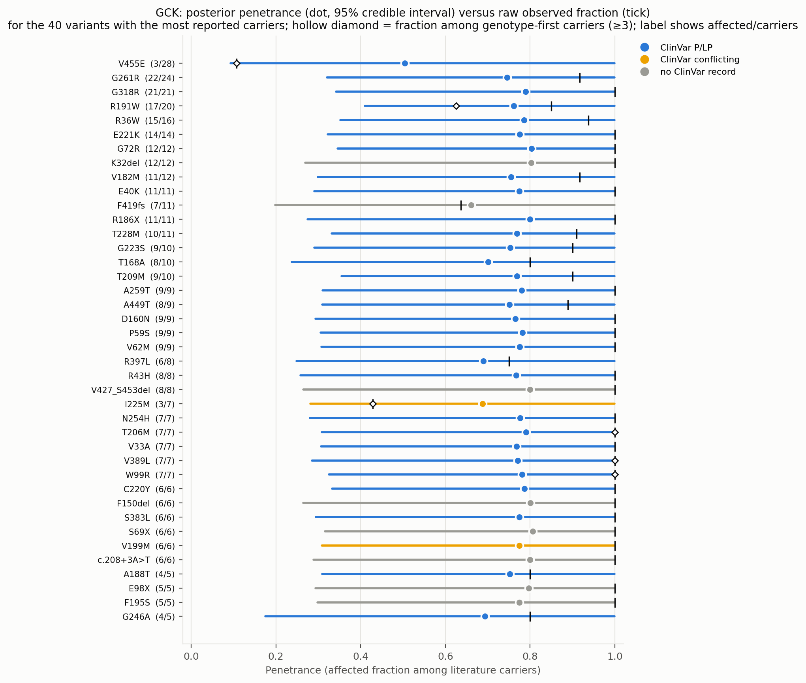
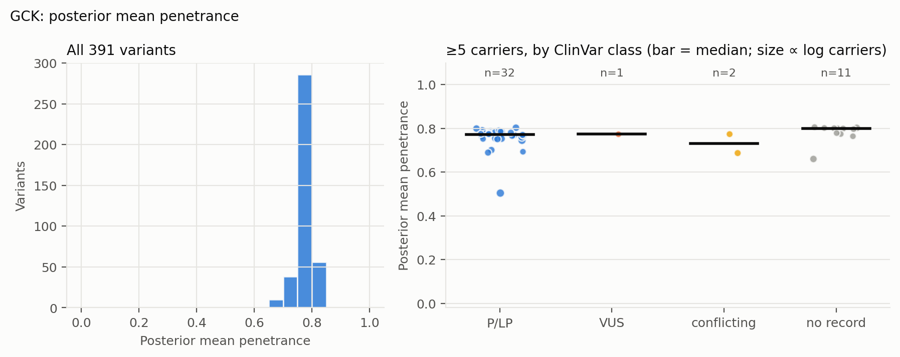
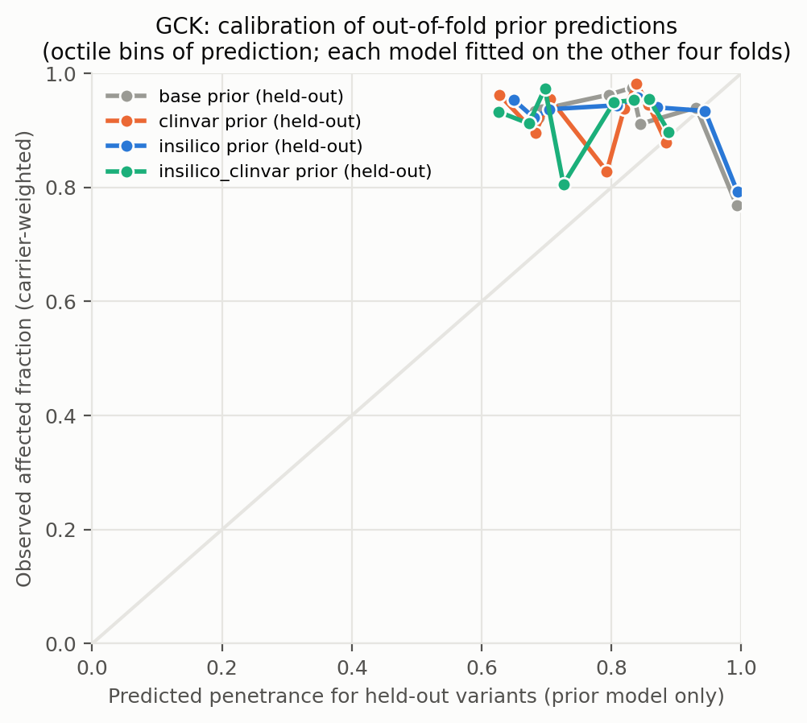
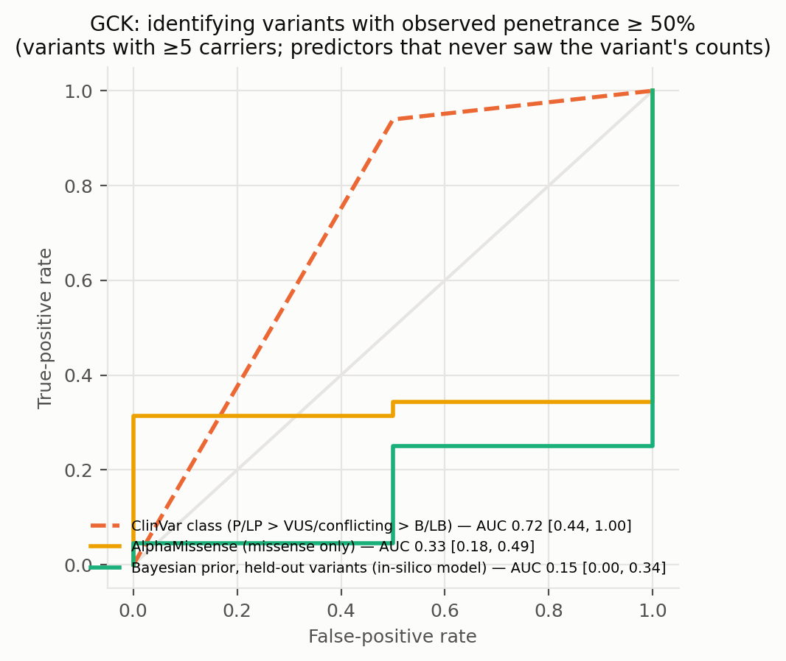
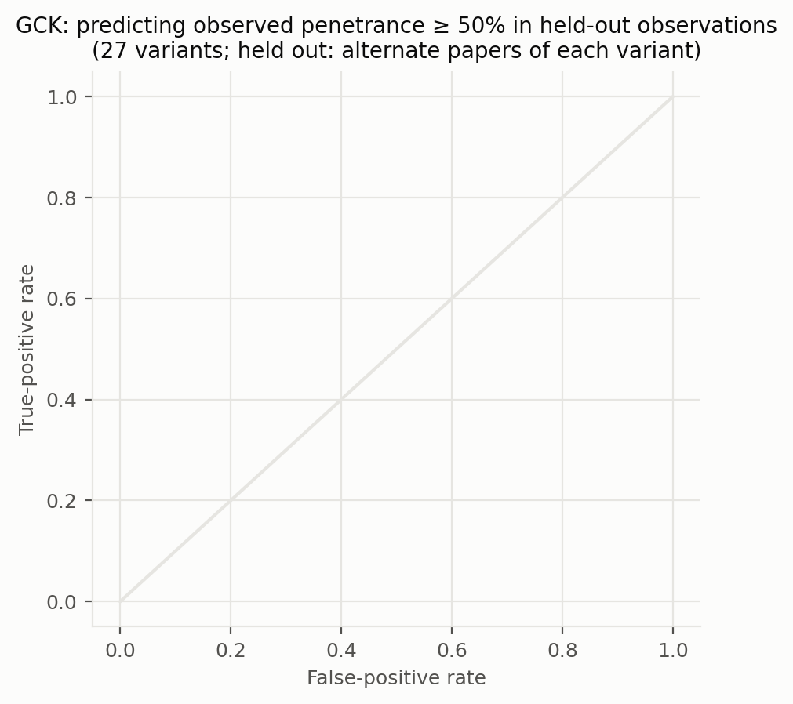
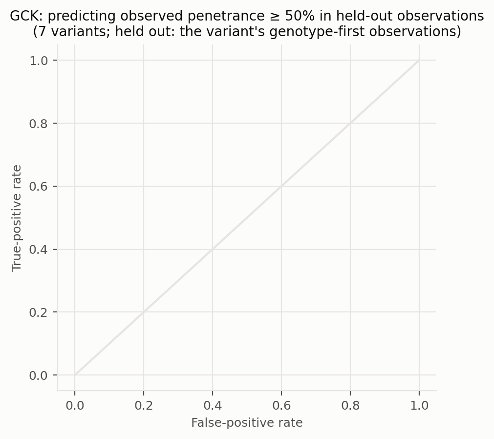
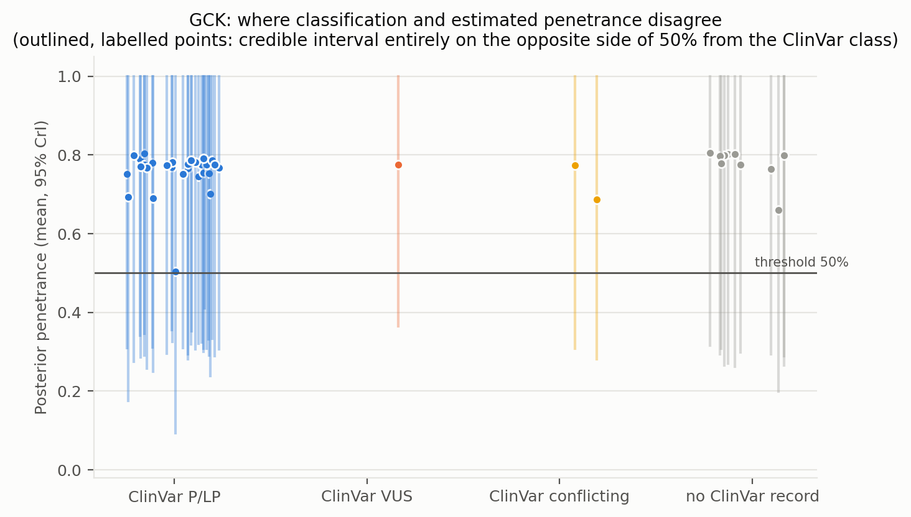
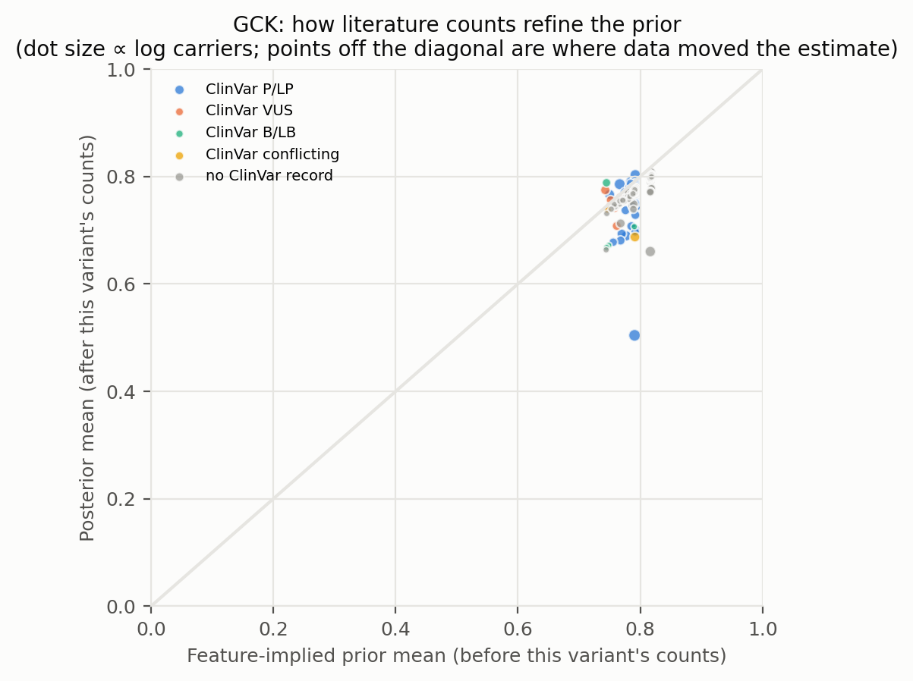
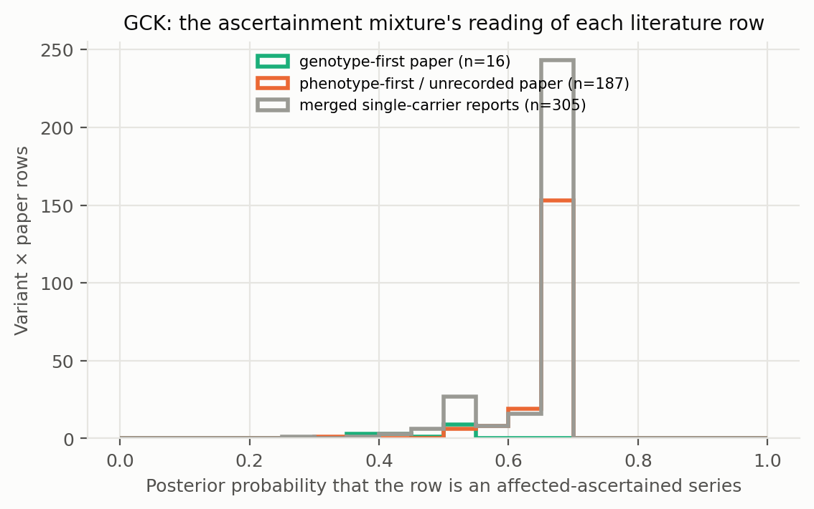

# GCK: literature-derived penetrance with a Bayesian prior — automated report

Generated by `iterations/grant_e2e_20260909/scripts/make_report.py` from the frozen workflow (GeneVariantFetcher tag `grant-freeze-20260909`). All numbers below are produced by code from the run artifacts; none were edited by hand.

## Data

| Quantity | Value |
| --- | ---: |
| Papers in the extraction database | 1050 |
| Variant rows in the database | 25579 |
| Usable carrier observations (variant × paper) | 616 |
| Papers contributing usable observations | 194 |
| Count rows without a usable denominator (excluded) | 20658 |
| Quarantined count rows excluded by the trust gate | 134 |
| Distinct variants with carrier counts | 398 |
| Total literature carriers / affected | 1014 / 932 |
| Variants with ≥5 carriers (evaluation set; carriers = literature) | 46 |
| Share of observations that are single affected probands | 0.66 |
| Missense variants with an AlphaMissense score | 252 / 268 |
| Variants with a ClinVar record | 201 / 398 |
| Feature transcript | ENST00000403799.8 |
| gnomAD carriers added as unaffected | 0 (off) |

Denominator sources: explicit = 75, individual_records = 72, total_derived = 469. Study designs (paper level): case_series = 301, cohort_population = 115, unknown = 76, case_report = 57, family_segregation = 28, other = 15, case_control = 14, functional_invitro = 10.

Excluded count rows by shape: affected_only_no_denominator = 78, other_or_inconsistent = 17, total_only_no_phenotype_split = 20506, unaffected_only = 57. Largest sources of total-only rows (carrier totals with no affected/unaffected split): PMID 37101203 (18020 rows, 18034 carriers, design unrecorded); PMID 36257325 (1022 rows, 3202 carriers, design unrecorded); PMID 34763692 (681 rows, 733 carriers, design unrecorded).

ClinVar classes among variants with counts: B/LB = 8, Conflicting = 4, P/LP = 155, VUS = 34, none = 197.

## Model

Hierarchical logistic-binomial on variant × paper rows (508 rows after merging single-carrier reports per variant, 391 variants). Each row is either an **affected-ascertained series** (probability π, success probability p_asc ≈ 1) or an **informative observation** of the variant's penetrance: `y_r ~ π·Binomial(n_r, p_asc) + (1−π)·Binomial(n_r, p_r)`, `logit(p_r) = α + x_v·β + σ·z_v + τ·e_r`, with a between-variant effect `z_v` and a between-study effect `e_r`; `logit(π_r) = g0 + g1·[genotype-first ascertainment recorded for the paper] + g2·[standardized log10 gnomAD allele frequency of the variant]` (case series of common alleles are ascertainment). gnomAD anchor rows are informative by construction and carry no study effect. Fitted by NUTS (PyMC, 4 chains). The posterior of `p_v = sigmoid(α + x_v·β + σ·z_v)` is the penetrance estimate among carriers not selected for being affected: variants with many informative carriers are driven by their own counts; variants known only from case reports are shrunk toward the feature-implied prior and carry wide intervals. Fixed-effect sets: `base` (intercept only), `class` (truncating), `insilico` (class + AlphaMissense), `clinvar` (class + ClinVar P/LP, B/LB, no-record), `insilico_clinvar`. The primary model is `insilico`.

| Model | Features | σ (between-variant SD, logit) | τ (between-study SD, logit) | π ascertained: phenotype-first / genotype-first rows (typical frequency) | g2 (per SD of log10 AF) | max R̂ | min ESS | divergences |
| --- | --- | ---: | ---: | ---: | ---: | ---: | ---: | ---: |
| base ⚠ chains disagree | — | 0.66 | 0.44 | 0.48 / 0.45 | -0.02 | 1.740 | 6 | 1 |
| class ⚠ chains disagree | trunc | 0.79 | 0.48 | 0.67 / 0.53 | -0.24 | 1.530 | 7 | 5 |
| clinvar ⚠ chains disagree | trunc, clinvar_plp, clinvar_blb, clinvar_none | 0.69 | 0.43 | 0.48 / 0.45 | -0.01 | 1.730 | 6 | 0 |
| insilico ⚠ chains disagree | trunc, am, am_missing | 0.80 | 0.46 | 0.67 / 0.52 | -0.22 | 1.530 | 7 | 0 |
| insilico_clinvar ⚠ chains disagree | trunc, am, am_missing, clinvar_plp, clinvar_blb, clinvar_none | 0.77 | 0.47 | 0.48 / 0.44 | -0.00 | 1.760 | 6 | 20 |

⚠ Convergence: chains disagree (R̂ > 1.05) for base, class, clinvar, insilico, insilico_clinvar. The ascertainment mixture is multimodal when a variant's literature consists of all-affected series with no genotype-first or population anchor (the same rows are explained either as ascertained series or as high penetrance); estimates from those models are not reliable.

**The primary model itself did not converge in this arm (R̂ 1.53). Treat every per-variant estimate below as provisional and use the gnomAD-anchored arm, where population carriers break the ambiguity, as the reportable estimate.**

Primary-model coefficients (posterior mean [94% HDI]): `alpha` 2.12 [-0.01, 6.18]; `sigma` 0.80 [0.00, 1.49]; `beta[trunc]` 0.26 [-1.08, 1.50]; `beta[am]` 0.08 [-0.64, 0.95]; `beta[am_missing]` 0.27 [-1.30, 1.78]; `tau` 0.46 [0.00, 1.05]; `g0` 0.83 [-2.66, 2.61]; `g1` -0.75 [-2.42, 1.97]; `g2` -0.22 [-0.84, 0.58]; `p_asc` 0.88 [0.52, 1.00].

## Held-out predictive performance (5-fold by variant)

| Prior model | NLL / carrier ↓ | Brier / carrier ↓ | log pred. density / row ↑ | calibration slope (1 = ideal) |
| --- | ---: | ---: | ---: | ---: |
| base | 0.2502 | 0.0427 | -0.343 | 1.65 |
| class | 0.2501 | 0.0425 | -0.323 | 1.57 |
| insilico | 0.2522 | 0.0432 | -0.345 | 1.68 |
| clinvar | 0.2501 | 0.0423 | -0.318 | 1.51 |
| insilico_clinvar | 0.2522 | 0.0428 | -0.318 | 1.47 |

Scored on held-out variant × paper rows (each fold's model never saw the held-out variants; predictions integrate both the variant and the study effect).

Paired bootstrap change in NLL per carrier versus the `base` prior (negative = better): `class` -0.0001 [-0.0031, +0.0024]; `insilico` +0.0020 [-0.0001, +0.0045]; `clinvar` -0.0001 [-0.0058, +0.0044]; `insilico_clinvar` +0.0020 [-0.0025, +0.0069].

Paired bootstrap change in NLL per carrier versus the `clinvar` prior (negative = better): `base` +0.0001 [-0.0043, +0.0052]; `class` -0.0001 [-0.0025, +0.0028]; `insilico` +0.0021 [-0.0036, +0.0102]; `insilico_clinvar` +0.0021 [-0.0007, +0.0051].

## Classification performance: identifying variants with observed penetrance ≥ 50%

Evaluation set: variants with ≥5 carriers (literature carriers). Label: observed fraction ≥ 50%. AUC with 95% bootstrap interval.

| Scorer | variants | high-penetrance variants | AUC | 95% CI |
| --- | ---: | ---: | ---: | --- |
| clinvar_ordinal | 35 | 33 | 0.720 | [0.441, 1.000] |
| clinvar_plp_binary | 35 | 33 | 0.720 | [0.441, 1.000] |
| alphamissense_missense_only | 37 | 35 | 0.329 | [0.176, 0.486] |
| insilico_posterior_mean_in_sample_LEAKY | 46 | 44 | 0.989 | [0.953, 1.000] |
| base_oof_prior | 46 | 44 | 0.170 | [0.000, 0.427] |
| class_oof_prior | 46 | 44 | 0.386 | [0.022, 0.800] |
| insilico_oof_prior | 46 | 44 | 0.148 | [0.000, 0.337] |
| clinvar_oof_prior | 46 | 44 | 0.341 | [0.022, 0.711] |
| insilico_clinvar_oof_prior | 46 | 44 | 0.295 | [0.000, 0.689] |

The `_LEAKY` row uses the posterior that already contains the variant's own counts, which also define the label; it is shown only to make the leakage explicit and is not a validation.

Binary rule 'ClinVar P/LP ⇒ high penetrance': sensitivity 0.94, specificity 0.50, PPV 0.97, NPV 0.33 (TP 31, FP 1, FN 2, TN 1).

Other thresholds: ≥25%: clinvar_ordinal 0.46, insilico_oof_prior 0.04; ≥75%: clinvar_ordinal 0.72, insilico_oof_prior 0.13.

## Held-out observations of known variants: penetrance estimate versus classification

**Alternate-paper hold-out.** For each variant reported in ≥2 papers, papers are split alternately by PMID; set A updates the prior, set B is scored (27 variants, 153 held-out carriers). Because B still contains phenotype-first reports, the prediction for B is the mixture prediction (ascertained series with probability π, informative otherwise).

The ClinVar comparator predicts each variant with the observed A-rate of its ClinVar class among the *other* variants; the pooled rate is the A-rate over all variants.

| Predictor for held-out observations | NLL / carrier ↓ | Brier / carrier ↓ |
| --- | ---: | ---: |
| posterior_from_half_A | 0.2480 | 0.0211 |
| prior_only | 0.2488 | 0.0209 |
| pooled_rate_half_A | 0.2036 | 0.0107 |
| clinvar_class_rate_half_A | 0.2156 | 0.0163 |

Paired bootstrap change in NLL per held-out carrier, posterior-from-A minus ClinVar-class rate: +0.0324 [-0.0168, +0.0706] (negative favours the count-informed estimate).

Paired bootstrap change in NLL per held-out carrier, posterior-from-A minus pooled rate: +0.0444 [+0.0195, +0.0709] (negative favours the count-informed estimate).

Paired bootstrap change in NLL per held-out carrier, posterior-from-A minus features-only prior: -0.0008 [-0.0129, +0.0110] (negative favours the count-informed estimate).

**Genotype-first hold-out.** Set B = the variant's observations from papers whose ascertainment the extractor recorded as population screening or cascade testing; set A = its phenotype-first observations (case reports, referral series) plus any gnomAD anchor. A updates the feature prior into a variant posterior (exact grid update; the mixture likelihood per row, study effects integrated, τ/π/p_asc at posterior means); B is scored (7 variants, 31 held-out genotype-first carriers). This is the clinical question: does case-based literature plus features predict the penetrance seen when carriers are found by genotype?

The ClinVar comparator predicts each variant with the observed A-rate of its ClinVar class among the *other* variants; the pooled rate is the A-rate over all variants.

| Predictor for held-out observations | NLL / carrier ↓ | Brier / carrier ↓ |
| --- | ---: | ---: |
| posterior_from_half_A | 0.4637 | 0.0582 |
| prior_only | 0.4364 | 0.0517 |
| pooled_rate_half_A | 0.6479 | 0.0732 |
| clinvar_class_rate_half_A | 0.5768 | 0.0693 |

Paired bootstrap change in NLL per held-out carrier, posterior-from-A minus ClinVar-class rate: -0.1132 [-0.4398, +0.1543] (negative favours the count-informed estimate).

Paired bootstrap change in NLL per held-out carrier, posterior-from-A minus pooled rate: -0.1842 [-0.5504, +0.1573] (negative favours the count-informed estimate).

Paired bootstrap change in NLL per held-out carrier, posterior-from-A minus features-only prior: +0.0272 [-0.0180, +0.0847] (negative favours the count-informed estimate).

Largest genotype-first hold-outs (affected / carriers in B; predictions from A):

| Variant | ClinVar | A: affected / carriers | B (genotype-first): affected / carriers | observed B | posterior from A | features-only prior | ClinVar-class rate |
| --- | --- | ---: | ---: | ---: | ---: | ---: | ---: |
| R191W | P/LP | 12 / 12 | 5 / 8 | 0.62 | 0.89 | 0.81 | 0.96 |
| V389L | P/LP | 2 / 2 | 5 / 5 | 1.00 | 0.83 | 0.82 | 0.98 |
| W99R | P/LP | 3 / 3 | 4 / 4 | 1.00 | 0.84 | 0.83 | 0.98 |
| M235T | P/LP | 1 / 1 | 4 / 4 | 1.00 | 0.84 | 0.83 | 0.98 |
| V455L | none | 1 / 1 | 4 / 4 | 1.00 | 0.84 | 0.83 | 0.98 |
| T206M | P/LP | 4 / 4 | 3 / 3 | 1.00 | 0.85 | 0.82 | 0.97 |
| R392C | P/LP | 1 / 1 | 1 / 3 | 0.33 | 0.83 | 0.82 | 0.98 |

## Common variants: the known-outcome check

Variants with gnomAD allele frequency above 0.001 are common alleles whose outcome is known independently of the literature: at most a GWAS-scale risk, no Mendelian penetrance. They stay in the model as a check. In case-series literature they look penetrant (median literature fraction 1.00; 100% of them are ≥ 50% affected among reported carriers); the model's estimate for them should be near the population risk: median posterior 0.788, 0% with the 97.5% bound below 10%.

| Variant | ClinVar | gnomAD AF | gnomAD carriers added | affected / literature carriers | literature fraction | posterior mean [97.5%] |
| --- | --- | ---: | ---: | ---: | ---: | --- |
| A11T | B/LB | 6.15e-03 | 0 | 3 / 3 | 1.00 | 0.788 [1.000] |

## Examples where the classification is wrong about penetrance

No variant with ≥5 literature carriers has a 95% credible interval entirely on the opposite side of 50% from its ClinVar class.

## Figures

**Figure — Posterior penetrance (dot, 95% credible interval) versus the raw observed fraction (tick) for the best-observed variants, coloured by ClinVar class.**

**Figure — Distribution of posterior mean penetrance across all variants, and by ClinVar class for variants with enough carriers.**

**Figure — Calibration of held-out prior predictions (each model predicts variants it never saw).**

**Figure — ROC curves for identifying observed high-penetrance variants: ClinVar class alone, AlphaMissense alone, the held-out Bayesian prior, and the posterior that includes the variant's own counts.**

**Figure — Alternate-paper hold-out: the posterior built from half of each variant's papers predicts the observed penetrance in the other half; compared with ClinVar class and a features-only prior.**

**Figure — Genotype-first hold-out: the posterior built from a variant's phenotype-first reports predicts the penetrance observed in its genotype-first (screening / cascade) observations.**

**Figure — Where classification and estimated penetrance disagree; outlined, labelled points are the discordant variants listed above.**

**Figure — Prior mean versus posterior mean: how the literature counts refine the feature-implied prior.**

**Figure — How the mixture reads the literature: posterior probability that each variant × paper row is a pure affected series, by the paper's recorded ascertainment.**

## Limitations that travel with these numbers

- Counts are pooled across papers; cohort overlap between publications cannot be resolved from the extraction, so denominators may double count.
- Probands are included; ascertainment inflates penetrance, most strongly for variants known only from single case reports (see the single-proband share above).
- 'Affected' follows each paper's own phenotype definition for the gene–disease pair; ages are not modelled.
- ClinVar classes are as of the variantFeatures snapshot; frameshift/splice alleles often lack a warehouse record and appear as 'no ClinVar record'.
- Held-out metrics score the prior model; posterior values include the variant's own counts and are the estimate a user would see, not a validation.

## Artifacts

`observations.csv`, `variants.csv`, `variants_features.csv`, `fit/posterior_variants.csv`, `fit/oof_predictions.csv`, `fit/metrics.csv`, `fit/classification_metrics.csv`, `fit/discordant_variants.csv`, `fit/coefficients.csv`, `fit/model_diagnostics.csv`, `fit/fit_summary.json` in the analysis directory.
