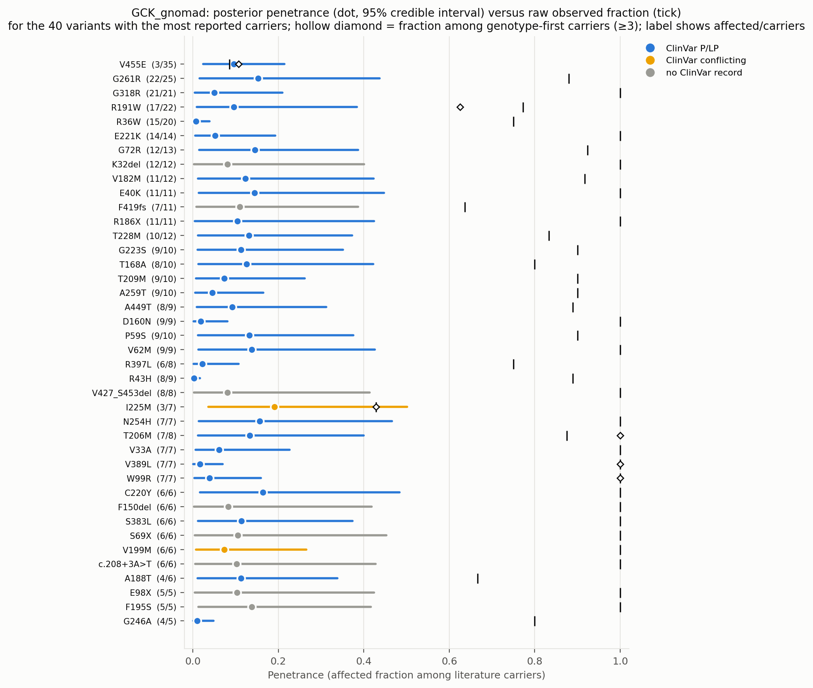
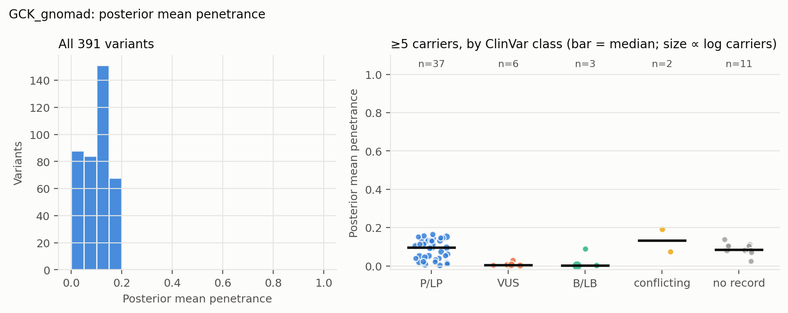
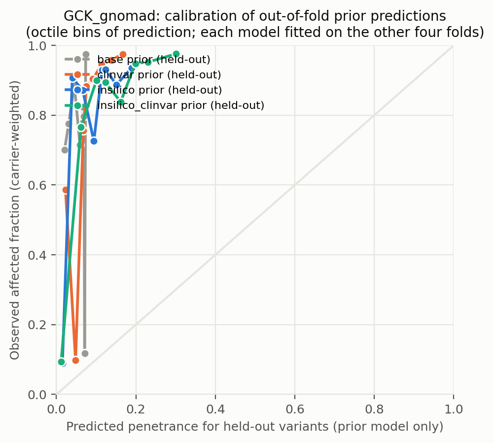
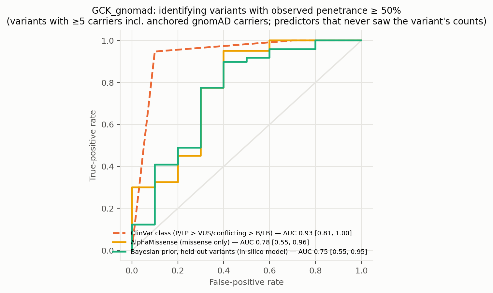
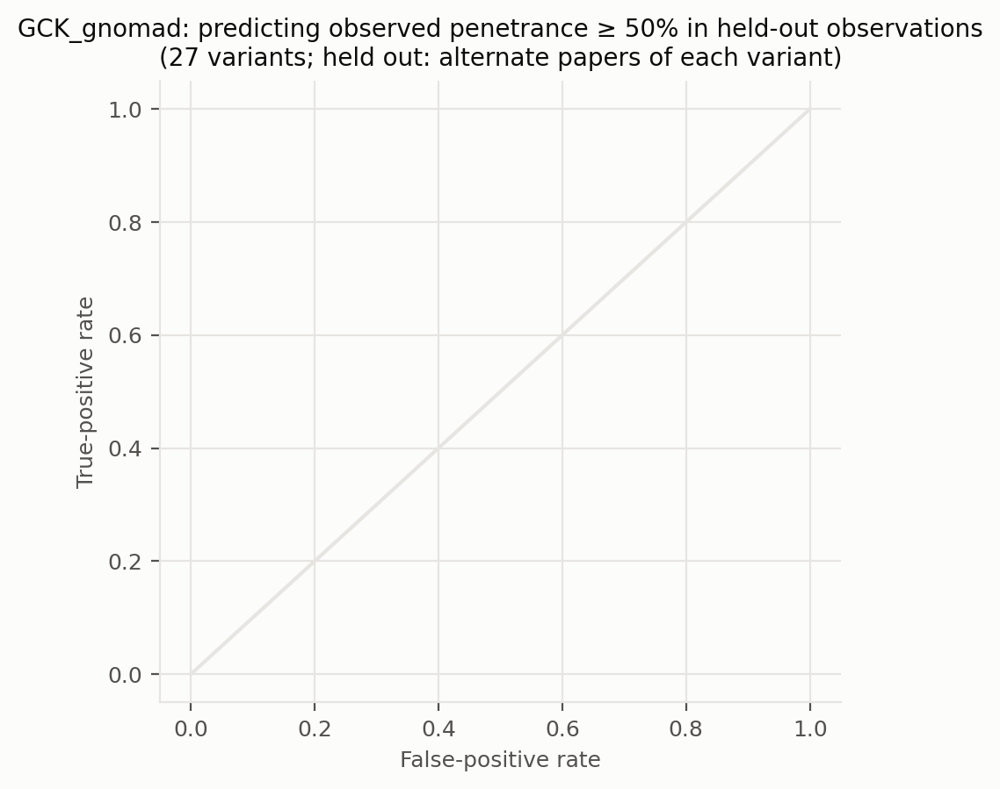
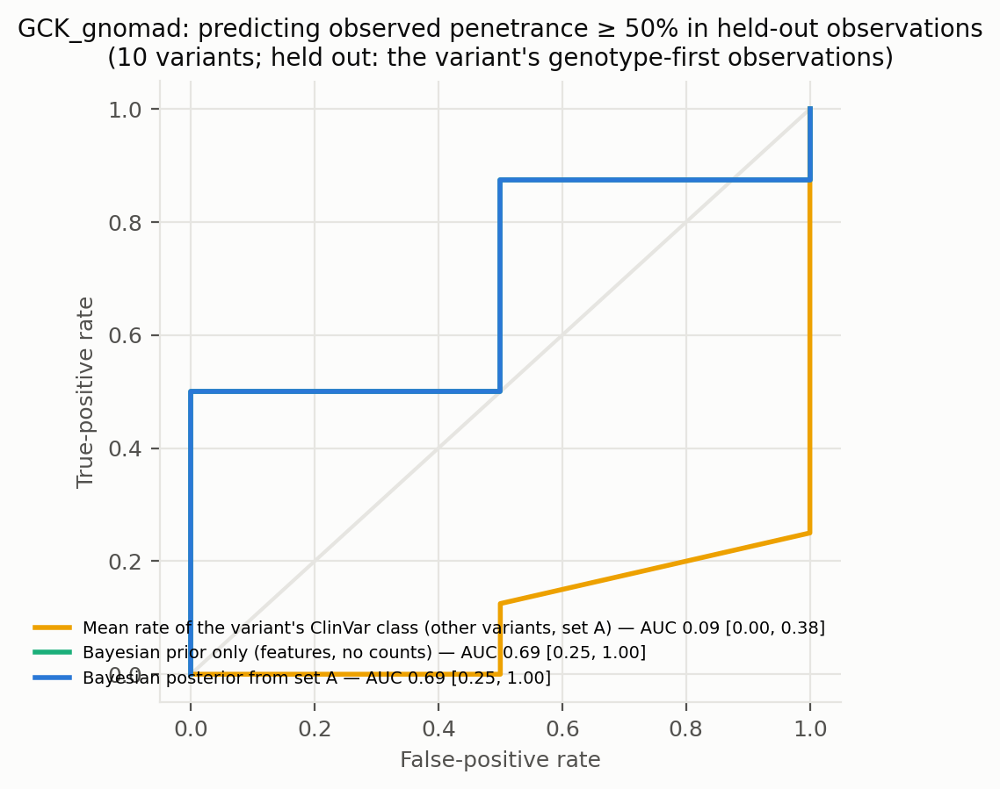
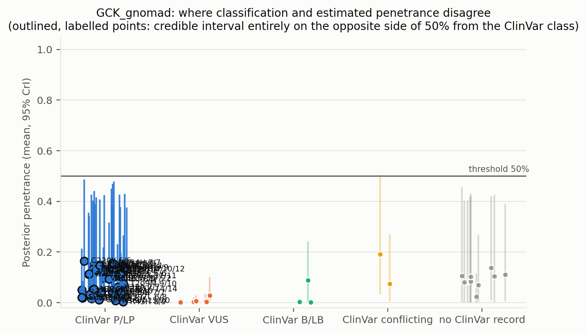
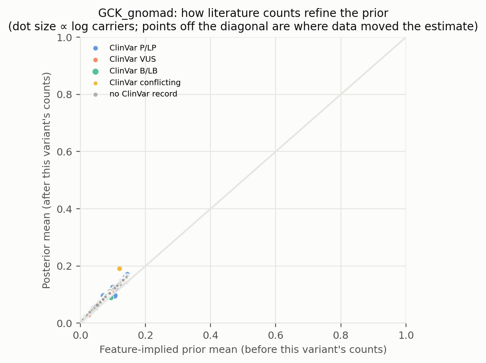
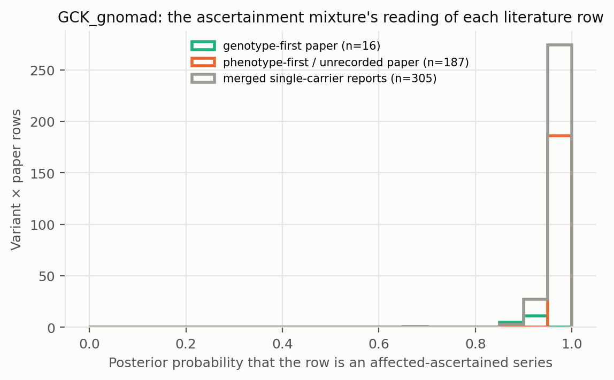

# GCK_gnomad: literature-derived penetrance with a Bayesian prior — automated report

Generated by `iterations/grant_e2e_20260909/scripts/make_report.py` from the frozen workflow (GeneVariantFetcher tag `grant-freeze-20260909`). All numbers below are produced by code from the run artifacts; none were edited by hand.

## Data

| Quantity | Value |
| --- | ---: |
| Papers in the extraction database | 1050 |
| Variant rows in the database | 25579 |
| Usable carrier observations (variant × paper) | 616 |
| Papers contributing usable observations | 194 |
| Count rows without a usable denominator (excluded) | 20658 |
| Quarantined count rows excluded by the trust gate | 134 |
| Distinct variants with carrier counts | 398 |
| Total literature carriers / affected | 1014 / 932 |
| Variants with ≥5 carriers (evaluation set; carriers = literature + anchored gnomAD) | 59 |
| Share of observations that are single affected probands | 0.66 |
| Missense variants with an AlphaMissense score | 252 / 268 |
| Variants with a ClinVar record | 201 / 398 |
| Feature transcript | ENST00000403799.8 |
| gnomAD carriers added as unaffected | 1067 (on) |

Denominator sources: explicit = 75, individual_records = 72, total_derived = 469. Study designs (paper level): case_series = 301, cohort_population = 115, unknown = 76, case_report = 57, family_segregation = 28, other = 15, case_control = 14, functional_invitro = 10.

Excluded count rows by shape: affected_only_no_denominator = 78, other_or_inconsistent = 17, total_only_no_phenotype_split = 20506, unaffected_only = 57. Largest sources of total-only rows (carrier totals with no affected/unaffected split): PMID 37101203 (18020 rows, 18034 carriers, design unrecorded); PMID 36257325 (1022 rows, 3202 carriers, design unrecorded); PMID 34763692 (681 rows, 733 carriers, design unrecorded).

ClinVar classes among variants with counts: B/LB = 8, Conflicting = 4, P/LP = 155, VUS = 34, none = 197.

## Model

Hierarchical logistic-binomial on variant × paper rows (555 rows after merging single-carrier reports per variant, 391 variants). Each row is either an **affected-ascertained series** (probability π, success probability p_asc ≈ 1) or an **informative observation** of the variant's penetrance: `y_r ~ π·Binomial(n_r, p_asc) + (1−π)·Binomial(n_r, p_r)`, `logit(p_r) = α + x_v·β + σ·z_v + τ·e_r`, with a between-variant effect `z_v` and a between-study effect `e_r`; `logit(π_r) = g0 + g1·[genotype-first ascertainment recorded for the paper] + g2·[standardized log10 gnomAD allele frequency of the variant]` (case series of common alleles are ascertainment). gnomAD anchor rows are informative by construction and carry no study effect. Fitted by NUTS (PyMC, 4 chains). The posterior of `p_v = sigmoid(α + x_v·β + σ·z_v)` is the penetrance estimate among carriers not selected for being affected: variants with many informative carriers are driven by their own counts; variants known only from case reports are shrunk toward the feature-implied prior and carry wide intervals. Fixed-effect sets: `base` (intercept only), `class` (truncating), `insilico` (class + AlphaMissense), `clinvar` (class + ClinVar P/LP, B/LB, no-record), `insilico_clinvar`. The primary model is `insilico`.

| Model | Features | σ (between-variant SD, logit) | τ (between-study SD, logit) | π ascertained: phenotype-first / genotype-first rows (typical frequency) | g2 (per SD of log10 AF) | max R̂ | min ESS | divergences |
| --- | --- | ---: | ---: | ---: | ---: | ---: | ---: | ---: |
| base | — | 1.58 | 0.52 | 0.99 / 0.92 | -0.16 | 1.000 | 2069 | 0 |
| class | trunc | 1.56 | 0.52 | 0.99 / 0.92 | -0.15 | 1.000 | 2150 | 0 |
| clinvar | trunc, clinvar_plp, clinvar_blb, clinvar_none | 1.09 | 0.60 | 0.98 / 0.91 | -0.15 | 1.000 | 1335 | 0 |
| insilico | trunc, am, am_missing | 0.62 | 0.48 | 0.99 / 0.92 | -0.14 | 1.000 | 1740 | 0 |
| insilico_clinvar | trunc, am, am_missing, clinvar_plp, clinvar_blb, clinvar_none | 0.57 | 0.48 | 0.98 / 0.91 | -0.15 | 1.000 | 1490 | 0 |

Primary-model coefficients (posterior mean [94% HDI]): `alpha` -3.24 [-4.29, -2.25]; `sigma` 0.62 [0.00, 1.39]; `beta[trunc]` 0.54 [-1.16, 2.20]; `beta[am]` 1.60 [0.77, 2.49]; `beta[am_missing]` 0.09 [-1.78, 2.02]; `tau` 0.48 [0.00, 1.09]; `g0` 4.30 [3.43, 5.21]; `g1` -1.66 [-3.00, -0.33]; `g2` -0.14 [-0.53, 0.26]; `p_asc` 0.96 [0.94, 0.97].

## Held-out predictive performance (5-fold by variant)

| Prior model | NLL / carrier ↓ | Brier / carrier ↓ | log pred. density / row ↑ | calibration slope (1 = ideal) |
| --- | ---: | ---: | ---: | ---: |
| base | 0.1713 | 0.0262 | -0.358 | 1.67 |
| class | 0.1723 | 0.0263 | -0.359 | 1.68 |
| insilico | 0.1446 | 0.0241 | -0.346 | 1.45 |
| clinvar | 0.1605 | 0.0250 | -0.355 | 1.59 |
| insilico_clinvar | 0.1418 | 0.0239 | -0.345 | 1.45 |

Scored on held-out variant × paper rows (each fold's model never saw the held-out variants; predictions integrate both the variant and the study effect).

Paired bootstrap change in NLL per carrier versus the `base` prior (negative = better): `class` +0.0010 [-0.0005, +0.0017]; `insilico` -0.0268 [-0.0416, +0.0006]; `clinvar` -0.0108 [-0.0170, +0.0001]; `insilico_clinvar` -0.0295 [-0.0453, -0.0000].

Paired bootstrap change in NLL per carrier versus the `clinvar` prior (negative = better): `base` +0.0108 [-0.0002, +0.0169]; `class` +0.0118 [-0.0003, +0.0187]; `insilico` -0.0159 [-0.0251, +0.0016]; `insilico_clinvar` -0.0187 [-0.0297, +0.0005].

## Classification performance: identifying variants with observed penetrance ≥ 50%

Evaluation set: variants with ≥5 carriers — literature carriers plus the anchored gnomAD carriers, which also enter the observed fraction that defines the label. Label: observed fraction ≥ 50%. AUC with 95% bootstrap interval.

| Scorer | variants | high-penetrance variants | AUC | 95% CI |
| --- | ---: | ---: | ---: | --- |
| clinvar_ordinal | 48 | 38 | 0.932 | [0.807, 1.000] |
| clinvar_plp_binary | 48 | 38 | 0.924 | [0.808, 1.000] |
| alphamissense_missense_only | 50 | 40 | 0.775 | [0.553, 0.958] |
| insilico_posterior_mean_in_sample_LEAKY | 59 | 49 | 0.771 | [0.523, 0.967] |
| base_oof_prior | 59 | 49 | 0.529 | [0.334, 0.702] |
| class_oof_prior | 59 | 49 | 0.592 | [0.392, 0.789] |
| insilico_oof_prior | 59 | 49 | 0.753 | [0.546, 0.947] |
| clinvar_oof_prior | 59 | 49 | 0.837 | [0.733, 0.925] |
| insilico_clinvar_oof_prior | 59 | 49 | 0.755 | [0.540, 0.922] |

**Literature-only labels.** The table above defines high penetrance over literature carriers plus the anchored gnomAD carriers, so its labels partly encode the anchor assumption. The same scorers against the literature fraction alone (≥5 literature carriers; the 1 common alleles with AF > 0.001 excluded because their literature fraction is known to be ascertainment) — an ascertainment-inflated but anchor-free label:

| Scorer | variants | high-penetrance variants | AUC | 95% CI |
| --- | ---: | ---: | ---: | --- |
| clinvar_ordinal | 35 | 33 | 0.720 | [0.441, 1.000] |
| clinvar_plp_binary | 35 | 33 | 0.720 | [0.439, 1.000] |
| alphamissense_missense_only | 37 | 35 | 0.329 | [0.186, 0.486] |
| insilico_posterior_mean_in_sample_LEAKY | 46 | 44 | 0.250 | [0.000, 0.600] |
| base_oof_prior | 46 | 44 | 0.773 | [0.534, 0.977] |
| class_oof_prior | 46 | 44 | 0.773 | [0.523, 0.978] |
| insilico_oof_prior | 46 | 44 | 0.477 | [0.318, 0.636] |
| clinvar_oof_prior | 46 | 44 | 0.852 | [0.728, 0.977] |
| insilico_clinvar_oof_prior | 46 | 44 | 0.511 | [0.222, 0.800] |

The `_LEAKY` row uses the posterior that already contains the variant's own counts, which also define the label; it is shown only to make the leakage explicit and is not a validation.

Binary rule 'ClinVar P/LP ⇒ high penetrance': sensitivity 0.95, specificity 0.90, PPV 0.97, NPV 0.82 (TP 36, FP 1, FN 2, TN 9).

Other thresholds: ≥25%: clinvar_ordinal 0.88, insilico_oof_prior 0.71; ≥75%: clinvar_ordinal 0.85, insilico_oof_prior 0.71.

## Held-out observations of known variants: penetrance estimate versus classification

**Alternate-paper hold-out.** For each variant reported in ≥2 papers, papers are split alternately by PMID; set A updates the prior, set B is scored (27 variants, 153 held-out carriers). Because B still contains phenotype-first reports, the prediction for B is the mixture prediction (ascertained series with probability π, informative otherwise).

The ClinVar comparator predicts each variant with the observed A-rate of its ClinVar class among the *other* variants; the pooled rate is the A-rate over all variants.

| Predictor for held-out observations | NLL / carrier ↓ | Brier / carrier ↓ |
| --- | ---: | ---: |
| posterior_from_half_A | 0.1831 | 0.0078 |
| prior_only | 0.1831 | 0.0078 |
| pooled_rate_half_A | 0.2663 | 0.0258 |
| clinvar_class_rate_half_A | 0.2711 | 0.0287 |

Paired bootstrap change in NLL per held-out carrier, posterior-from-A minus ClinVar-class rate: -0.0880 [-0.1338, -0.0383] (negative favours the count-informed estimate).

Paired bootstrap change in NLL per held-out carrier, posterior-from-A minus pooled rate: -0.0832 [-0.1258, -0.0340] (negative favours the count-informed estimate).

Paired bootstrap change in NLL per held-out carrier, posterior-from-A minus features-only prior: -0.0000 [-0.0002, +0.0001] (negative favours the count-informed estimate).

**Genotype-first hold-out.** Set B = the variant's observations from papers whose ascertainment the extractor recorded as population screening or cascade testing; set A = its phenotype-first observations (case reports, referral series) plus any gnomAD anchor. A updates the feature prior into a variant posterior (exact grid update; the mixture likelihood per row, study effects integrated, τ/π/p_asc at posterior means); B is scored (10 variants, 68 held-out genotype-first carriers). This is the clinical question: does case-based literature plus features predict the penetrance seen when carriers are found by genotype?

The ClinVar comparator predicts each variant with the observed A-rate of its ClinVar class among the *other* variants; the pooled rate is the A-rate over all variants.

| Predictor for held-out observations | NLL / carrier ↓ | Brier / carrier ↓ |
| --- | ---: | ---: |
| posterior_from_half_A | 0.9154 | 0.2432 |
| prior_only | 0.9288 | 0.2469 |
| pooled_rate_half_A | 0.6895 | 0.1597 |
| clinvar_class_rate_half_A | 1.0051 | 0.2786 |

Paired bootstrap change in NLL per held-out carrier, posterior-from-A minus ClinVar-class rate: -0.0897 [-0.2683, +0.0154] (negative favours the count-informed estimate).

Paired bootstrap change in NLL per held-out carrier, posterior-from-A minus pooled rate: +0.2259 [-0.4078, +0.6033] (negative favours the count-informed estimate).

Paired bootstrap change in NLL per held-out carrier, posterior-from-A minus features-only prior: -0.0134 [-0.0241, +0.0002] (negative favours the count-informed estimate).

| Scorer (label: observed ≥ 50% in set B) | variants | AUC | 95% CI |
| --- | ---: | ---: | --- |
| posterior_from_half_A | 10 | 0.688 | [0.250, 1.000] |
| prior_only | 10 | 0.688 | [0.250, 1.000] |
| pooled_rate_half_A | 10 | 0.500 | [0.500, 0.500] |
| clinvar_class_rate_half_A | 10 | 0.094 | [0.000, 0.375] |
| clinvar_ordinal | 10 | 0.375 | [0.200, 0.500] |

Largest genotype-first hold-outs (affected / carriers in B; predictions from A):

| Variant | ClinVar | A: affected / carriers | B (genotype-first): affected / carriers | observed B | posterior from A | features-only prior | ClinVar-class rate |
| --- | --- | ---: | ---: | ---: | ---: | ---: | ---: |
| V455E | P/LP | 0 / 7 | 3 / 28 | 0.11 | 0.84 | 0.84 | 0.84 |
| R191W | P/LP | 12 / 14 | 5 / 8 | 0.62 | 0.86 | 0.86 | 0.55 |
| V389L | P/LP | 2 / 2 | 5 / 5 | 1.00 | 0.88 | 0.88 | 0.65 |
| Q239R | VUS | 0 / 10 | 4 / 5 | 0.80 | 0.82 | 0.82 | 0.53 |
| W99R | P/LP | 3 / 3 | 4 / 4 | 1.00 | 0.88 | 0.88 | 0.64 |
| M235T | P/LP | 1 / 1 | 4 / 4 | 1.00 | 0.89 | 0.89 | 0.66 |
| V455L | none | 1 / 1 | 4 / 4 | 1.00 | 0.89 | 0.89 | 0.53 |
| A387V | P/LP | 0 / 1 | 4 / 4 | 1.00 | 0.87 | 0.87 | 0.69 |
| T206M | P/LP | 4 / 5 | 3 / 3 | 1.00 | 0.88 | 0.88 | 0.65 |
| R392C | P/LP | 1 / 1 | 1 / 3 | 0.33 | 0.88 | 0.88 | 0.66 |

## Common variants: the known-outcome check

Variants with gnomAD allele frequency above 0.001 are common alleles whose outcome is known independently of the literature: at most a GWAS-scale risk, no Mendelian penetrance. They stay in the model as a check. In case-series literature they look penetrant (median literature fraction 1.00; 100% of them are ≥ 50% affected among reported carriers); the model's estimate for them should be near the population risk: median posterior 0.001, 100% with the 97.5% bound below 10%.

| Variant | ClinVar | gnomAD AF | gnomAD carriers added | affected / literature carriers | literature fraction | posterior mean [97.5%] |
| --- | --- | ---: | ---: | ---: | ---: | --- |
| A11T | B/LB | 6.15e-03 | 936 | 3 / 3 | 1.00 | 0.001 [0.003] |

## Examples where the classification is wrong about penetrance

Variants with ≥5 literature carriers whose 95% credible interval lies entirely on the other side of 50% from what the ClinVar class implies. `literature affected / carriers` are the extracted counts, `gnomAD added` the anchored population carriers (assumed unaffected) that also enter the posterior; `genotype-first` are the affected / carriers in screening or cascade rows, the evidence least affected by ascertainment. PMIDs are the source papers.

| Variant | Class | ClinVar | literature affected / carriers | literature fraction | gnomAD added | genotype-first affected / carriers | posterior mean [95% CrI] | prior mean | papers | PMIDs |
| --- | --- | --- | ---: | ---: | ---: | ---: | --- | ---: | ---: | --- |
| V455E | missense | P/LP | 3 / 28 | 0.11 | 7 | 3 / 28 | 0.10 [0.02, 0.21] | 0.11 | 1 | 36208030 |
| G261R | missense | P/LP | 22 / 24 | 0.92 | 1 | — | 0.15 [0.02, 0.44] | 0.14 | 16 | 1464666, 21518409, 22761713, 25015100, 25174781, 28012402 (+10) |
| G318R | missense | P/LP | 21 / 21 | 1.00 | 0 | 1 / 1 | 0.05 [0.00, 0.21] | 0.04 | 8 | 22493702, 23433541, 30245511, 31595705, 35737141, 37812285 (+2) |
| R191W | missense | P/LP | 17 / 20 | 0.85 | 2 | 5 / 8 | 0.10 [0.01, 0.38] | 0.07 | 10 | 31576961, 32531870, 33450726, 34393998, 35822264, 36208030 (+4) |
| R36W | missense | P/LP | 15 / 16 | 0.94 | 4 | 1 / 2 | 0.01 [0.00, 0.04] | 0.01 | 8 | 22493702, 23433541, 33477506, 34496959, 36178555, 36208030 (+2) |
| E221K | missense | P/LP | 14 / 14 | 1.00 | 0 | — | 0.05 [0.01, 0.19] | 0.04 | 8 | 23295292, 28012402, 30592380, 31092478, 35592779, 37838154 (+2) |
| G72R | missense | P/LP | 12 / 12 | 1.00 | 1 | 1 / 1 | 0.15 [0.01, 0.39] | 0.14 | 8 | 12442280, 22493702, 25015100, 30259503, 32710514, 33242514 (+2) |
| V182M | missense | P/LP | 11 / 12 | 0.92 | 0 | — | 0.12 [0.01, 0.42] | 0.10 | 9 | 23771172, 25494859, 29207974, 29510678, 31595705, 32792356 (+3) |
| E40K | missense | P/LP | 11 / 11 | 1.00 | 0 | — | 0.14 [0.01, 0.45] | 0.13 | 3 | 25015100, 29207974, 35737141 |
| R186X | nonsense | P/LP | 11 / 11 | 1.00 | 0 | — | 0.10 [0.00, 0.42] | 0.09 | 4 | 1360036, 15841481, 36584766, 39420902 |
| T228M | missense | P/LP | 10 / 11 | 0.91 | 1 | 1 / 1 | 0.13 [0.01, 0.37] | 0.12 | 7 | 22493702, 32792356, 34746319, 36584766, 36723869, 37008541 (+1) |
| G223S | missense | P/LP | 9 / 10 | 0.90 | 0 | — | 0.11 [0.01, 0.35] | 0.10 | 8 | 22291974, 22761713, 33294763, 34746319, 36584766, 37875989 (+2) |
| T168A | missense | P/LP | 8 / 10 | 0.80 | 0 | — | 0.13 [0.01, 0.42] | 0.10 | 6 | 18382660, 18571549, 23155716, 30592380, 36584766, 37875989 |
| T209M | missense | P/LP | 9 / 10 | 0.90 | 0 | — | 0.07 [0.01, 0.26] | 0.06 | 6 | 25174781, 25555642, 28012402, 28371533, 34023340, 35737141 |
| A259T | missense | P/LP | 9 / 9 | 1.00 | 1 | — | 0.05 [0.01, 0.16] | 0.04 | 5 | 26287533, 34101350, 36178555, 41112090, 9713013 |
| A449T | missense | P/LP | 8 / 9 | 0.89 | 0 | — | 0.09 [0.01, 0.31] | 0.08 | 6 | 22291974, 22761713, 25015100, 32710514, 33242514, 36723869 |
| D160N | missense | P/LP | 9 / 9 | 1.00 | 0 | — | 0.02 [0.00, 0.08] | 0.01 | 2 | 25015100, 42468610 |
| P59S | missense | P/LP | 9 / 9 | 1.00 | 1 | — | 0.13 [0.01, 0.38] | 0.12 | 2 | 22335469, 26287533 |
| V62M | missense | P/LP | 9 / 9 | 1.00 | 0 | — | 0.14 [0.01, 0.43] | 0.12 | 2 | 15677479, 36880032 |
| R397L | missense | P/LP | 6 / 8 | 0.75 | 0 | — | 0.02 [0.00, 0.11] | 0.01 | 2 | 15644838, 25015100 |
| R43H | missense | P/LP | 8 / 8 | 1.00 | 1 | 1 / 1 | 0.00 [0.00, 0.02] | 0.00 | 5 | 22493702, 22611063, 30245511, 35737141, 38881977 |
| N254H | missense | P/LP | 7 / 7 | 1.00 | 0 | — | 0.16 [0.01, 0.47] | 0.14 | 3 | 26587058, 28012402, 34023340 |
| T206M | missense | P/LP | 7 / 7 | 1.00 | 1 | 3 / 3 | 0.13 [0.01, 0.40] | 0.12 | 5 | 15841481, 24606082, 37838154, 38928025, 39504571 |
| V33A | missense | P/LP | 7 / 7 | 1.00 | 0 | — | 0.06 [0.01, 0.23] | 0.05 | 1 | 35737141 |
| V389L | missense | P/LP | 7 / 7 | 1.00 | 0 | 5 / 5 | 0.02 [0.00, 0.07] | 0.01 | 2 | 21454522, 24890200 |
| W99R | missense | P/LP | 7 / 7 | 1.00 | 0 | 4 / 4 | 0.04 [0.00, 0.16] | 0.03 | 3 | 30352420, 34635134, 34680961 |
| C220Y | missense | P/LP | 6 / 6 | 1.00 | 0 | 1 / 1 | 0.16 [0.02, 0.48] | 0.14 | 5 | 22341299, 31092478, 36342518, 37008541, 42468610 |
| S383L | missense | P/LP | 6 / 6 | 1.00 | 0 | — | 0.11 [0.01, 0.37] | 0.10 | 5 | 15841481, 30259503, 33242514, 35737141, 41409604 |
| A188T | missense | P/LP | 4 / 5 | 0.80 | 1 | — | 0.11 [0.01, 0.34] | 0.10 | 4 | 22493702, 22761713, 29207974, 35592779 |
| G246A | missense | P/LP | 4 / 5 | 0.80 | 0 | 0 / 1 | 0.01 [0.00, 0.05] | 0.01 | 3 | 27256595, 36398453, 37008541 |
| M235T | missense | P/LP | 5 / 5 | 1.00 | 0 | 4 / 4 | 0.13 [0.01, 0.41] | 0.11 | 2 | 30592380, 31704690 |
| R36P | missense | P/LP | 5 / 5 | 1.00 | 0 | — | 0.15 [0.02, 0.48] | 0.13 | 2 | 32710514, 38565685 |

Counts: 32 P/LP variants estimated below 50%; 0 non-P/LP variants estimated above 50% (≥5 literature carriers). Under the frozen rule that also counts anchored gnomAD carriers towards the ≥5 minimum, `fit/discordant_variants.csv` lists 37 and 0.

Reading the table: when a variant's genotype-first carriers are mostly affected but the posterior is low, the population anchor (gnomAD carriers assumed unaffected), not the literature, is driving the estimate — the anchor assumption fails for phenotypes that are common and unmeasured in gnomAD.

Evidence rows behind the first discordant variants (per paper; `ascertained` = posterior probability that the row is an affected-only series):

| Variant | PMID | affected / carriers | ascertainment recorded | ascertained |
| --- | --- | ---: | --- | ---: |
| V455E | 36208030 | 3 / 28 | population_screening | 0.86 |
| V455E | gnomAD | 0 / 7 | population_screening | 0.00 |
| G261R | single_carrier_reports | 11 / 11 | — | 0.98 |
| G261R | 22761713 | 2 / 4 | proband_referral | 0.98 |
| G261R | 33324081 | 3 / 3 | proband_referral | 0.98 |
| G261R | 29329106 | 2 / 2 | proband_referral | 0.98 |
| G261R | 30592380 | 2 / 2 | proband_referral | 0.98 |
| G261R | 38565685 | 2 / 2 | proband_referral | 0.98 |
| G318R | 41409604 | 7 / 7 | proband_referral | 0.99 |
| G318R | 22493702 | 3 / 3 | proband_referral | 0.99 |
| G318R | 35737141 | 3 / 3 | — | 0.99 |
| G318R | 23433541 | 2 / 2 | proband_referral | 0.99 |
| G318R | 31595705 | 2 / 2 | proband_referral | 0.99 |
| G318R | 42468610 | 2 / 2 | proband_referral | 0.99 |
| R191W | 36208030 | 5 / 8 | population_screening | 0.89 |
| R191W | single_carrier_reports | 7 / 7 | — | 0.98 |
| R191W | 33450726 | 3 / 3 | proband_referral | 0.98 |
| R191W | 39089324 | 2 / 2 | proband_referral | 0.98 |
| R191W | gnomAD | 0 / 2 | population_screening | 0.00 |
| R36W | gnomAD | 0 / 4 | population_screening | 0.00 |
| R36W | 38928025 | 3 / 3 | proband_referral | 0.97 |
| R36W | 39504571 | 3 / 3 | — | 0.97 |
| R36W | 23433541 | 2 / 2 | proband_referral | 0.97 |
| R36W | 33477506 | 2 / 2 | proband_referral | 0.97 |
| R36W | 36178555 | 2 / 2 | — | 0.97 |
| E221K | 23295292 | 5 / 5 | proband_referral | 0.99 |
| E221K | single_carrier_reports | 5 / 5 | — | 0.99 |
| E221K | 28012402 | 2 / 2 | — | 0.99 |
| E221K | 39504571 | 2 / 2 | — | 0.99 |
| G72R | single_carrier_reports | 4 / 4 | — | 0.98 |
| G72R | 32710514 | 3 / 3 | proband_referral | 0.98 |
| G72R | 12442280 | 2 / 2 | proband_referral | 0.98 |
| G72R | 33242514 | 2 / 2 | proband_referral | 0.98 |
| G72R | gnomAD | 0 / 1 | population_screening | 0.00 |
| G72R | single_carrier_reports_genotype_first | 1 / 1 | genotype-first | 0.90 |
| V182M | single_carrier_reports | 6 / 6 | — | 0.99 |
| V182M | 25494859 | 2 / 2 | proband_referral | 0.99 |
| V182M | 29510678 | 2 / 2 | proband_referral | 0.99 |
| V182M | 32792356 | 1 / 2 | proband_referral | 0.99 |

## Figures

**Figure — Posterior penetrance (dot, 95% credible interval) versus the raw observed fraction (tick) for the best-observed variants, coloured by ClinVar class.**

**Figure — Distribution of posterior mean penetrance across all variants, and by ClinVar class for variants with enough carriers.**

**Figure — Calibration of held-out prior predictions (each model predicts variants it never saw).**

**Figure — ROC curves for identifying observed high-penetrance variants: ClinVar class alone, AlphaMissense alone, the held-out Bayesian prior, and the posterior that includes the variant's own counts.**

**Figure — Alternate-paper hold-out: the posterior built from half of each variant's papers predicts the observed penetrance in the other half; compared with ClinVar class and a features-only prior.**

**Figure — Genotype-first hold-out: the posterior built from a variant's phenotype-first reports predicts the penetrance observed in its genotype-first (screening / cascade) observations.**

**Figure — Where classification and estimated penetrance disagree; outlined, labelled points are the discordant variants listed above.**

**Figure — Prior mean versus posterior mean: how the literature counts refine the feature-implied prior.**

**Figure — How the mixture reads the literature: posterior probability that each variant × paper row is a pure affected series, by the paper's recorded ascertainment.**

## Limitations that travel with these numbers

- Counts are pooled across papers; cohort overlap between publications cannot be resolved from the extraction, so denominators may double count.
- Probands are included; ascertainment inflates penetrance, most strongly for variants known only from single case reports (see the single-proband share above).
- 'Affected' follows each paper's own phenotype definition for the gene–disease pair; ages are not modelled.
- ClinVar classes are as of the variantFeatures snapshot; frameshift/splice alleles often lack a warehouse record and appear as 'no ClinVar record'.
- Held-out metrics score the prior model; posterior values include the variant's own counts and are the estimate a user would see, not a validation.

- In the anchored arms the frozen evaluation set and the 'observed ≥ threshold' label include the gnomAD carriers assumed unaffected; the literature-only table, the genotype-first hold-out and the common-variant check are the anchor-independent views.

## Artifacts

`observations.csv`, `variants.csv`, `variants_features.csv`, `fit/posterior_variants.csv`, `fit/oof_predictions.csv`, `fit/metrics.csv`, `fit/classification_metrics.csv`, `fit/discordant_variants.csv`, `fit/coefficients.csv`, `fit/model_diagnostics.csv`, `fit/fit_summary.json` in the analysis directory.
