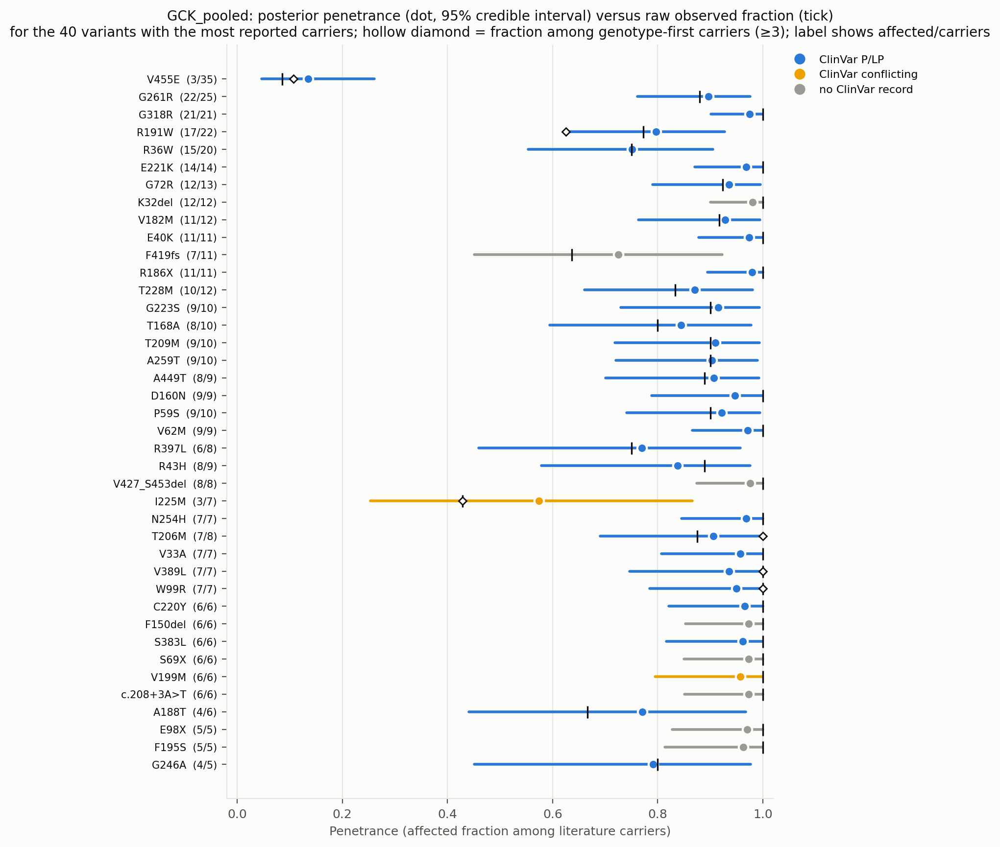
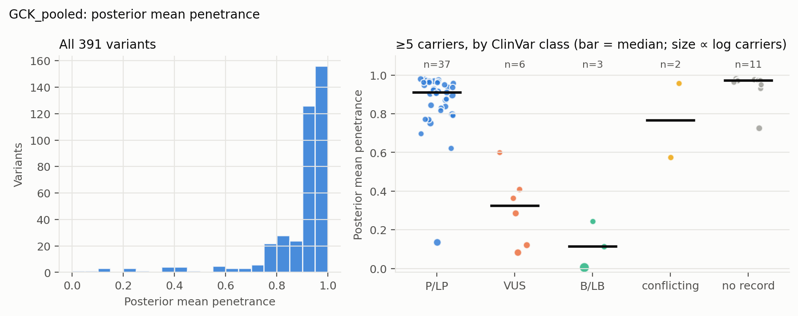
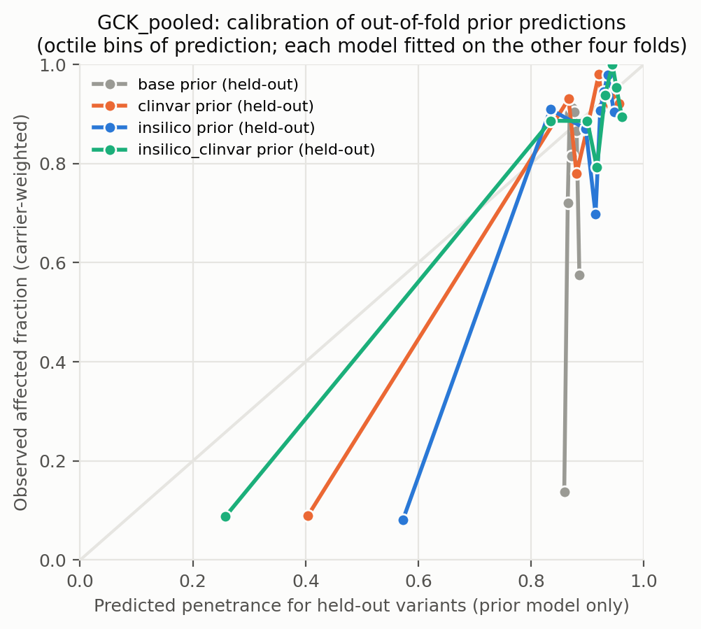
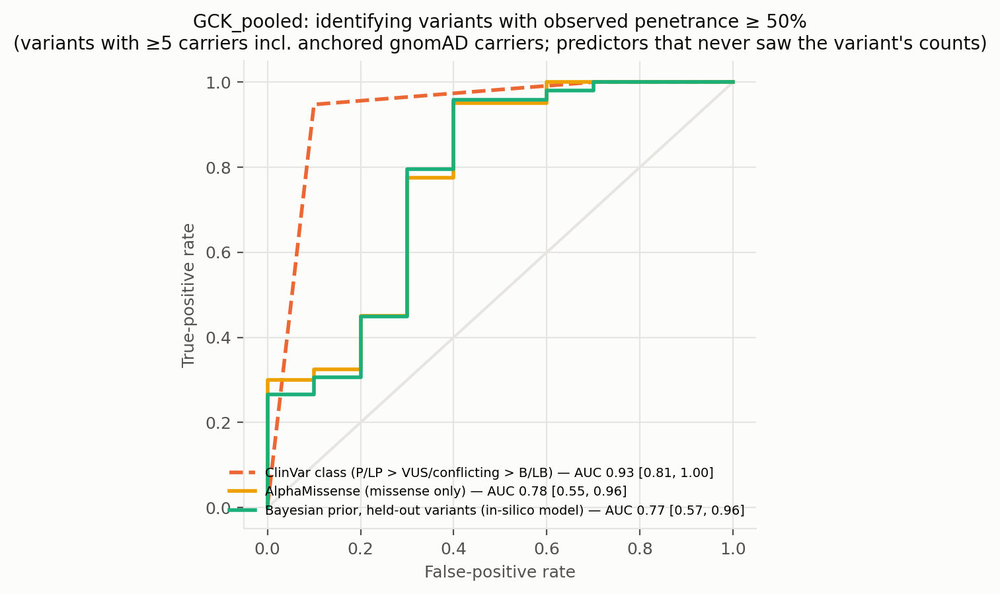
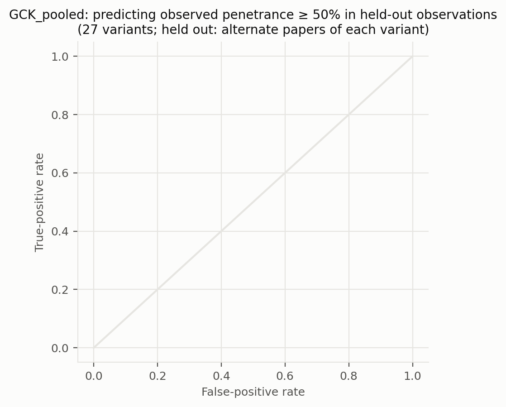
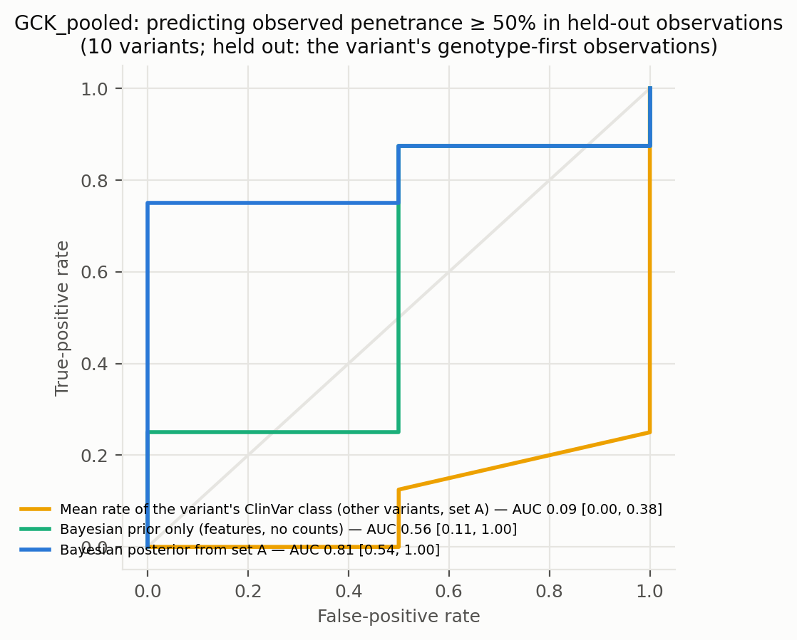
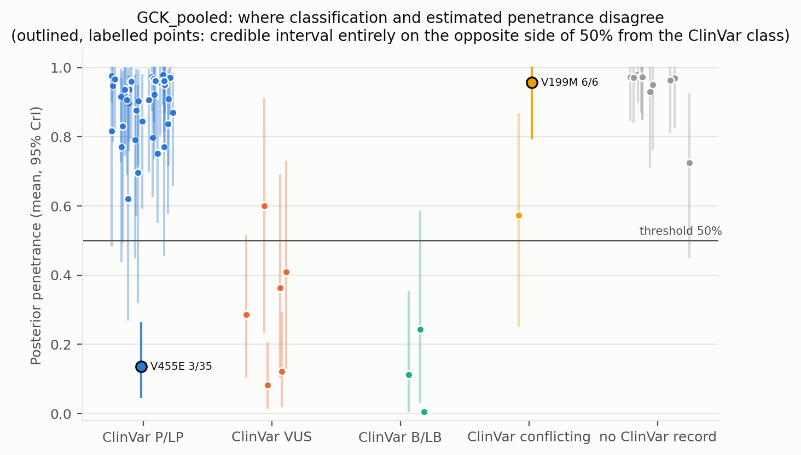
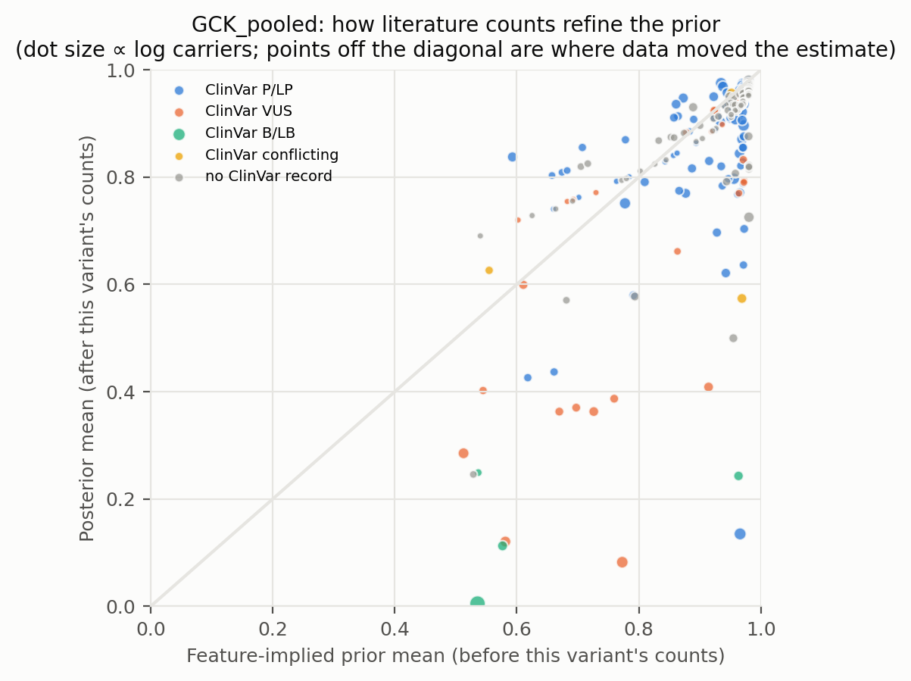
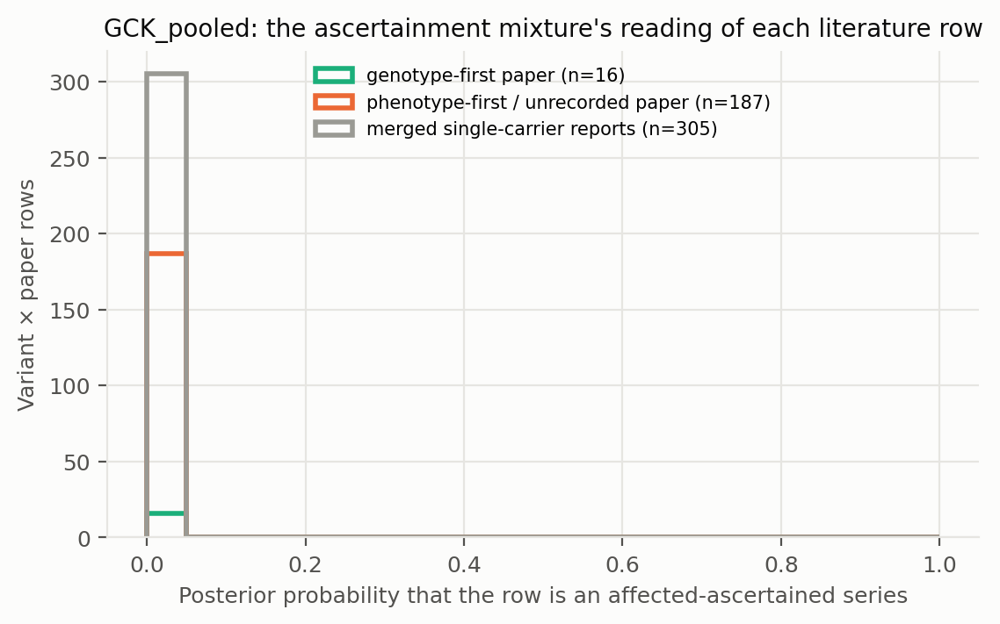

# GCK_pooled: literature-derived penetrance with a Bayesian prior — automated report

Generated by `iterations/grant_e2e_20260909/scripts/make_report.py` from the frozen workflow (GeneVariantFetcher tag `grant-freeze-20260909`). All numbers below are produced by code from the run artifacts; none were edited by hand.

## Data

| Quantity | Value |
| --- | ---: |
| Papers in the extraction database | 1050 |
| Variant rows in the database | 25579 |
| Usable carrier observations (variant × paper) | 616 |
| Papers contributing usable observations | 194 |
| Count rows without a usable denominator (excluded) | 20658 |
| Quarantined count rows excluded by the trust gate | 134 |
| Distinct variants with carrier counts | 398 |
| Total literature carriers / affected | 1014 / 932 |
| Variants with ≥5 carriers (evaluation set; carriers = literature + anchored gnomAD) | 59 |
| Share of observations that are single affected probands | 0.66 |
| Missense variants with an AlphaMissense score | 252 / 268 |
| Variants with a ClinVar record | 201 / 398 |
| Feature transcript | ENST00000403799.8 |
| gnomAD carriers added as unaffected | 1067 (on) |

Denominator sources: explicit = 75, individual_records = 72, total_derived = 469. Study designs (paper level): case_series = 301, cohort_population = 115, unknown = 76, case_report = 57, family_segregation = 28, other = 15, case_control = 14, functional_invitro = 10.

Excluded count rows by shape: affected_only_no_denominator = 78, other_or_inconsistent = 17, total_only_no_phenotype_split = 20506, unaffected_only = 57. Largest sources of total-only rows (carrier totals with no affected/unaffected split): PMID 37101203 (18020 rows, 18034 carriers, design unrecorded); PMID 36257325 (1022 rows, 3202 carriers, design unrecorded); PMID 34763692 (681 rows, 733 carriers, design unrecorded).

ClinVar classes among variants with counts: B/LB = 8, Conflicting = 4, P/LP = 155, VUS = 34, none = 197.

## Model

Hierarchical logistic-binomial on variant × paper rows (555 rows, 391 variants) with a between-variant effect and a between-study effect (no ascertainment mixture). Primary model `insilico`.

| Model | Features | σ (between-variant SD, logit) | τ (between-study SD, logit) | π ascertained: phenotype-first / genotype-first rows (typical frequency) | g2 (per SD of log10 AF) | max R̂ | min ESS | divergences |
| --- | --- | ---: | ---: | ---: | ---: | ---: | ---: | ---: |
| base | — | 2.18 | 0.01 | — | — | 1.000 | 1672 | 0 |
| class | trunc | 2.15 | 0.01 | — | — | 1.000 | 1652 | 0 |
| clinvar | trunc, clinvar_plp, clinvar_blb, clinvar_none | 1.51 | 0.01 | — | — | 1.000 | 1645 | 0 |
| insilico | trunc, am, am_missing | 1.78 | 0.01 | — | — | 1.000 | 1888 | 0 |
| insilico_clinvar | trunc, am, am_missing, clinvar_plp, clinvar_blb, clinvar_none | 1.40 | 0.01 | — | — | 1.000 | 1897 | 0 |

Primary-model coefficients (posterior mean [94% HDI]): `alpha` 2.75 [2.29, 3.24]; `sigma` 1.78 [1.42, 2.14]; `beta[trunc]` 1.27 [0.42, 2.13]; `beta[am]` 1.05 [0.70, 1.38]; `beta[am_missing]` 1.29 [0.30, 2.41]; `tau` 0.01 [0.00, 0.02].

## Held-out predictive performance (5-fold by variant)

| Prior model | NLL / carrier ↓ | Brier / carrier ↓ | log pred. density / row ↑ | calibration slope (1 = ideal) |
| --- | ---: | ---: | ---: | ---: |
| base | 1.1584 | 0.4065 | -0.603 | 16.57 |
| class | 1.1359 | 0.4011 | -0.618 | 3.66 |
| insilico | 0.6122 | 0.2039 | -0.558 | 2.25 |
| clinvar | 0.4210 | 0.1127 | -0.554 | 2.12 |
| insilico_clinvar | 0.3158 | 0.0703 | -0.553 | 1.59 |

Scored on held-out variant × paper rows (each fold's model never saw the held-out variants; predictions integrate both the variant and the study effect).

Paired bootstrap change in NLL per carrier versus the `base` prior (negative = better): `class` -0.0226 [-0.0302, -0.0049]; `insilico` -0.5463 [-0.8358, -0.0235]; `clinvar` -0.7374 [-1.1301, -0.0390]; `insilico_clinvar` -0.8426 [-1.2896, -0.0424].

Paired bootstrap change in NLL per carrier versus the `clinvar` prior (negative = better): `base` +0.7374 [+0.0456, +1.1265]; `class` +0.7148 [+0.0340, +1.0965]; `insilico` +0.1911 [-0.0080, +0.2959]; `insilico_clinvar` -0.1052 [-0.1641, +0.0091].

## Classification performance: identifying variants with observed penetrance ≥ 50%

Evaluation set: variants with ≥5 carriers — literature carriers plus the anchored gnomAD carriers, which also enter the observed fraction that defines the label. Label: observed fraction ≥ 50%. AUC with 95% bootstrap interval.

| Scorer | variants | high-penetrance variants | AUC | 95% CI |
| --- | ---: | ---: | ---: | --- |
| clinvar_ordinal | 48 | 38 | 0.932 | [0.807, 1.000] |
| clinvar_plp_binary | 48 | 38 | 0.924 | [0.808, 1.000] |
| alphamissense_missense_only | 50 | 40 | 0.775 | [0.553, 0.958] |
| insilico_posterior_mean_in_sample_LEAKY | 59 | 49 | 1.000 | [1.000, 1.000] |
| base_oof_prior | 59 | 49 | 0.369 | [0.168, 0.595] |
| class_oof_prior | 59 | 49 | 0.512 | [0.326, 0.703] |
| insilico_oof_prior | 59 | 49 | 0.771 | [0.572, 0.964] |
| clinvar_oof_prior | 59 | 49 | 0.937 | [0.813, 1.000] |
| insilico_clinvar_oof_prior | 59 | 49 | 0.920 | [0.780, 1.000] |

**Literature-only labels.** The table above defines high penetrance over literature carriers plus the anchored gnomAD carriers, so its labels partly encode the anchor assumption. The same scorers against the literature fraction alone (≥5 literature carriers; the 1 common alleles with AF > 0.001 excluded because their literature fraction is known to be ascertainment) — an ascertainment-inflated but anchor-free label:

| Scorer | variants | high-penetrance variants | AUC | 95% CI |
| --- | ---: | ---: | ---: | --- |
| clinvar_ordinal | 35 | 33 | 0.720 | [0.441, 1.000] |
| clinvar_plp_binary | 35 | 33 | 0.720 | [0.439, 1.000] |
| alphamissense_missense_only | 37 | 35 | 0.329 | [0.186, 0.486] |
| insilico_posterior_mean_in_sample_LEAKY | 46 | 44 | 0.989 | [0.946, 1.000] |
| base_oof_prior | 46 | 44 | 0.341 | [0.089, 0.644] |
| class_oof_prior | 46 | 44 | 0.591 | [0.316, 0.822] |
| insilico_oof_prior | 46 | 44 | 0.386 | [0.209, 0.578] |
| clinvar_oof_prior | 46 | 44 | 0.750 | [0.409, 1.000] |
| insilico_clinvar_oof_prior | 46 | 44 | 0.659 | [0.341, 0.953] |

The `_LEAKY` row uses the posterior that already contains the variant's own counts, which also define the label; it is shown only to make the leakage explicit and is not a validation.

Binary rule 'ClinVar P/LP ⇒ high penetrance': sensitivity 0.95, specificity 0.90, PPV 0.97, NPV 0.82 (TP 36, FP 1, FN 2, TN 9).

Other thresholds: ≥25%: clinvar_ordinal 0.88, insilico_oof_prior 0.76; ≥75%: clinvar_ordinal 0.85, insilico_oof_prior 0.72.

## Held-out observations of known variants: penetrance estimate versus classification

**Alternate-paper hold-out.** For each variant reported in ≥2 papers, papers are split alternately by PMID; set A updates the prior, set B is scored (27 variants, 153 held-out carriers). Because B still contains phenotype-first reports, the prediction for B is the mixture prediction (ascertained series with probability π, informative otherwise).

The ClinVar comparator predicts each variant with the observed A-rate of its ClinVar class among the *other* variants; the pooled rate is the A-rate over all variants.

| Predictor for held-out observations | NLL / carrier ↓ | Brier / carrier ↓ |
| --- | ---: | ---: |
| posterior_from_half_A | 0.2743 | 0.0364 |
| prior_only | 0.2289 | 0.0203 |
| pooled_rate_half_A | 0.2663 | 0.0258 |
| clinvar_class_rate_half_A | 0.2711 | 0.0287 |

Paired bootstrap change in NLL per held-out carrier, posterior-from-A minus ClinVar-class rate: +0.0031 [-0.0680, +0.0776] (negative favours the count-informed estimate).

Paired bootstrap change in NLL per held-out carrier, posterior-from-A minus pooled rate: +0.0080 [-0.0559, +0.0740] (negative favours the count-informed estimate).

Paired bootstrap change in NLL per held-out carrier, posterior-from-A minus features-only prior: +0.0454 [-0.0214, +0.1146] (negative favours the count-informed estimate).

**Genotype-first hold-out.** Set B = the variant's observations from papers whose ascertainment the extractor recorded as population screening or cascade testing; set A = its phenotype-first observations (case reports, referral series) plus any gnomAD anchor. A updates the feature prior into a variant posterior (exact grid update; the mixture likelihood per row, study effects integrated, τ/π/p_asc at posterior means); B is scored (10 variants, 68 held-out genotype-first carriers). This is the clinical question: does case-based literature plus features predict the penetrance seen when carriers are found by genotype?

The ClinVar comparator predicts each variant with the observed A-rate of its ClinVar class among the *other* variants; the pooled rate is the A-rate over all variants.

| Predictor for held-out observations | NLL / carrier ↓ | Brier / carrier ↓ |
| --- | ---: | ---: |
| posterior_from_half_A | 0.5157 | 0.0718 |
| prior_only | 1.1448 | 0.2949 |
| pooled_rate_half_A | 0.6895 | 0.1597 |
| clinvar_class_rate_half_A | 1.0051 | 0.2786 |

Paired bootstrap change in NLL per held-out carrier, posterior-from-A minus ClinVar-class rate: -0.4894 [-0.9926, +0.3245] (negative favours the count-informed estimate).

Paired bootstrap change in NLL per held-out carrier, posterior-from-A minus pooled rate: -0.1738 [-0.3996, +0.2676] (negative favours the count-informed estimate).

Paired bootstrap change in NLL per held-out carrier, posterior-from-A minus features-only prior: -0.6291 [-1.3098, +0.3902] (negative favours the count-informed estimate).

| Scorer (label: observed ≥ 50% in set B) | variants | AUC | 95% CI |
| --- | ---: | ---: | --- |
| posterior_from_half_A | 10 | 0.812 | [0.542, 1.000] |
| prior_only | 10 | 0.562 | [0.111, 1.000] |
| pooled_rate_half_A | 10 | 0.500 | [0.500, 0.500] |
| clinvar_class_rate_half_A | 10 | 0.094 | [0.000, 0.375] |
| clinvar_ordinal | 10 | 0.375 | [0.200, 0.500] |

Largest genotype-first hold-outs (affected / carriers in B; predictions from A):

| Variant | ClinVar | A: affected / carriers | B (genotype-first): affected / carriers | observed B | posterior from A | features-only prior | ClinVar-class rate |
| --- | --- | ---: | ---: | ---: | ---: | ---: | ---: |
| V455E | P/LP | 0 / 7 | 3 / 28 | 0.11 | 0.21 | 0.91 | 0.84 |
| R191W | P/LP | 12 / 14 | 5 / 8 | 0.62 | 0.88 | 0.89 | 0.55 |
| V389L | P/LP | 2 / 2 | 5 / 5 | 1.00 | 0.88 | 0.77 | 0.65 |
| Q239R | VUS | 0 / 10 | 4 / 5 | 0.80 | 0.08 | 0.51 | 0.53 |
| W99R | P/LP | 3 / 3 | 4 / 4 | 1.00 | 0.92 | 0.84 | 0.64 |
| M235T | P/LP | 1 / 1 | 4 / 4 | 1.00 | 0.93 | 0.91 | 0.66 |
| V455L | none | 1 / 1 | 4 / 4 | 1.00 | 0.91 | 0.88 | 0.53 |
| A387V | P/LP | 0 / 1 | 4 / 4 | 1.00 | 0.59 | 0.83 | 0.69 |
| T206M | P/LP | 4 / 5 | 3 / 3 | 1.00 | 0.87 | 0.92 | 0.65 |
| R392C | P/LP | 1 / 1 | 1 / 3 | 0.33 | 0.80 | 0.71 | 0.66 |

## Common variants: the known-outcome check

Variants with gnomAD allele frequency above 0.001 are common alleles whose outcome is known independently of the literature: at most a GWAS-scale risk, no Mendelian penetrance. They stay in the model as a check. In case-series literature they look penetrant (median literature fraction 1.00; 100% of them are ≥ 50% affected among reported carriers); the model's estimate for them should be near the population risk: median posterior 0.005, 100% with the 97.5% bound below 10%.

| Variant | ClinVar | gnomAD AF | gnomAD carriers added | affected / literature carriers | literature fraction | posterior mean [97.5%] |
| --- | --- | ---: | ---: | ---: | ---: | --- |
| A11T | B/LB | 6.15e-03 | 936 | 3 / 3 | 1.00 | 0.005 [0.010] |

## Examples where the classification is wrong about penetrance

Variants with ≥5 literature carriers whose 95% credible interval lies entirely on the other side of 50% from what the ClinVar class implies. `literature affected / carriers` are the extracted counts, `gnomAD added` the anchored population carriers (assumed unaffected) that also enter the posterior; `genotype-first` are the affected / carriers in screening or cascade rows, the evidence least affected by ascertainment. PMIDs are the source papers.

| Variant | Class | ClinVar | literature affected / carriers | literature fraction | gnomAD added | genotype-first affected / carriers | posterior mean [95% CrI] | prior mean | papers | PMIDs |
| --- | --- | --- | ---: | ---: | ---: | ---: | --- | ---: | ---: | --- |
| V455E | missense | P/LP | 3 / 28 | 0.11 | 7 | 3 / 28 | 0.14 [0.05, 0.26] | 0.97 | 1 | 36208030 |
| V199M | missense | Conflicting | 6 / 6 | 1.00 | 0 | — | 0.96 [0.80, 1.00] | 0.95 | 2 | 30362177, 40554608 |

Counts: 1 P/LP variants estimated below 50%; 1 non-P/LP variants estimated above 50% (≥5 literature carriers). Under the frozen rule that also counts anchored gnomAD carriers towards the ≥5 minimum, `fit/discordant_variants.csv` lists 1 and 1.

Reading the table: when a variant's genotype-first carriers are mostly affected but the posterior is low, the population anchor (gnomAD carriers assumed unaffected), not the literature, is driving the estimate — the anchor assumption fails for phenotypes that are common and unmeasured in gnomAD.

Evidence rows behind the first discordant variants (per paper; `ascertained` = posterior probability that the row is an affected-only series):

| Variant | PMID | affected / carriers | ascertainment recorded | ascertained |
| --- | --- | ---: | --- | ---: |
| V455E | 36208030 | 3 / 28 | population_screening | 0.00 |
| V455E | gnomAD | 0 / 7 | population_screening | 0.00 |
| V199M | 40554608 | 5 / 5 | proband_referral | 0.00 |
| V199M | single_carrier_reports | 1 / 1 | — | 0.00 |

## Figures

**Figure — Posterior penetrance (dot, 95% credible interval) versus the raw observed fraction (tick) for the best-observed variants, coloured by ClinVar class.**

**Figure — Distribution of posterior mean penetrance across all variants, and by ClinVar class for variants with enough carriers.**

**Figure — Calibration of held-out prior predictions (each model predicts variants it never saw).**

**Figure — ROC curves for identifying observed high-penetrance variants: ClinVar class alone, AlphaMissense alone, the held-out Bayesian prior, and the posterior that includes the variant's own counts.**

**Figure — Alternate-paper hold-out: the posterior built from half of each variant's papers predicts the observed penetrance in the other half; compared with ClinVar class and a features-only prior.**

**Figure — Genotype-first hold-out: the posterior built from a variant's phenotype-first reports predicts the penetrance observed in its genotype-first (screening / cascade) observations.**

**Figure — Where classification and estimated penetrance disagree; outlined, labelled points are the discordant variants listed above.**

**Figure — Prior mean versus posterior mean: how the literature counts refine the feature-implied prior.**

**Figure — How the mixture reads the literature: posterior probability that each variant × paper row is a pure affected series, by the paper's recorded ascertainment.**

## Limitations that travel with these numbers

- Counts are pooled across papers; cohort overlap between publications cannot be resolved from the extraction, so denominators may double count.
- Probands are included; ascertainment inflates penetrance, most strongly for variants known only from single case reports (see the single-proband share above).
- 'Affected' follows each paper's own phenotype definition for the gene–disease pair; ages are not modelled.
- ClinVar classes are as of the variantFeatures snapshot; frameshift/splice alleles often lack a warehouse record and appear as 'no ClinVar record'.
- Held-out metrics score the prior model; posterior values include the variant's own counts and are the estimate a user would see, not a validation.

- In the anchored arms the frozen evaluation set and the 'observed ≥ threshold' label include the gnomAD carriers assumed unaffected; the literature-only table, the genotype-first hold-out and the common-variant check are the anchor-independent views.

## Artifacts

`observations.csv`, `variants.csv`, `variants_features.csv`, `fit/posterior_variants.csv`, `fit/oof_predictions.csv`, `fit/metrics.csv`, `fit/classification_metrics.csv`, `fit/discordant_variants.csv`, `fit/coefficients.csv`, `fit/model_diagnostics.csv`, `fit/fit_summary.json` in the analysis directory.
