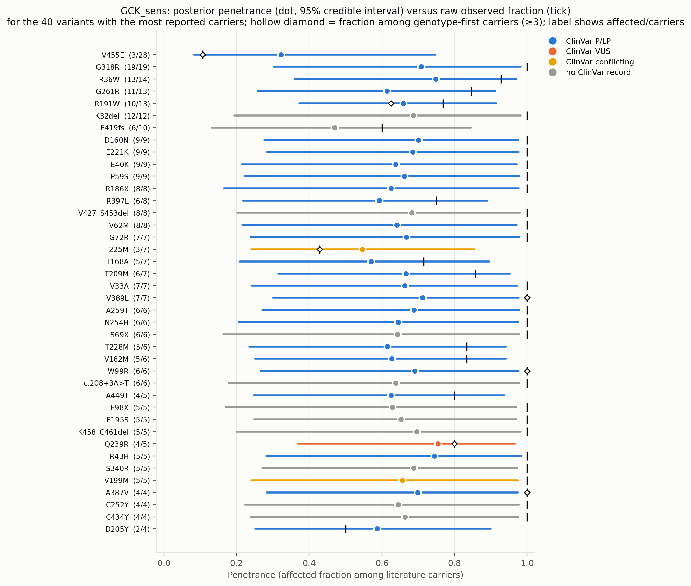
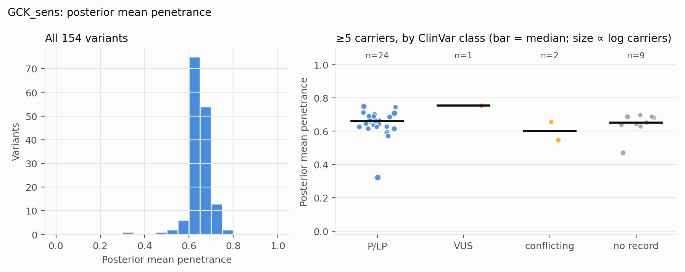
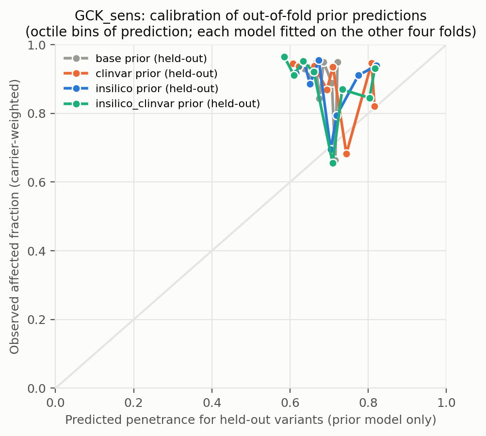
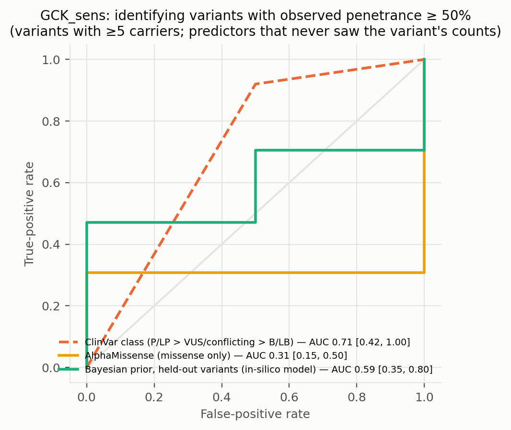
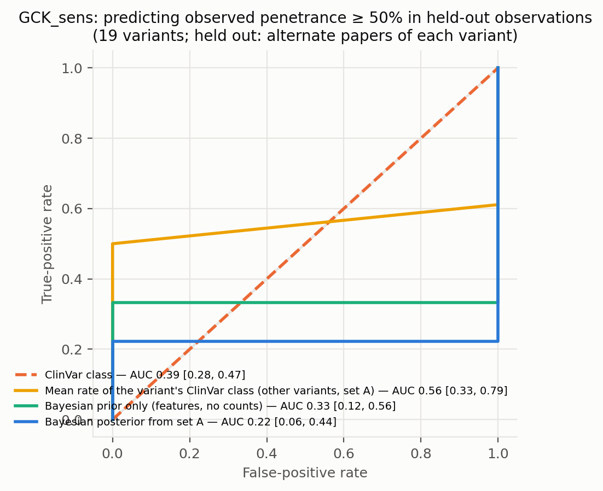
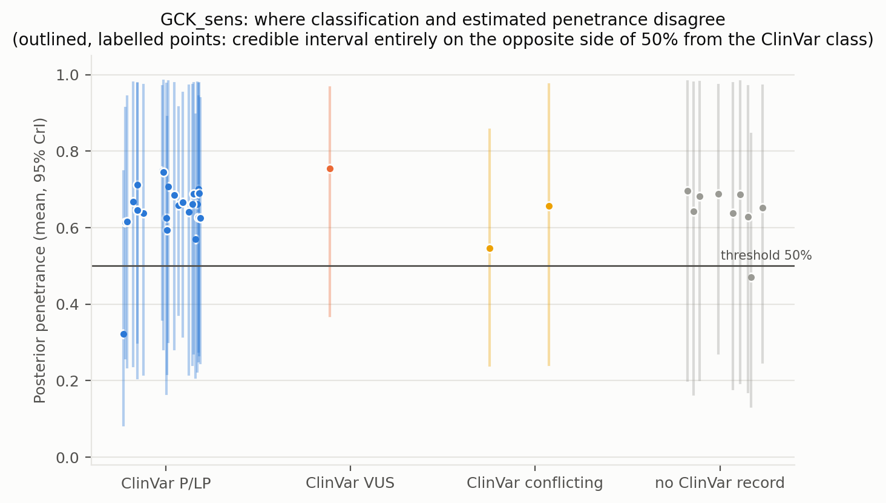
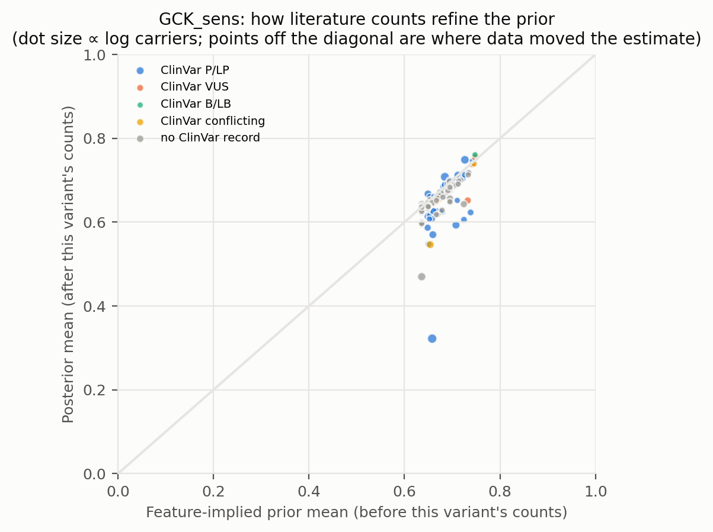
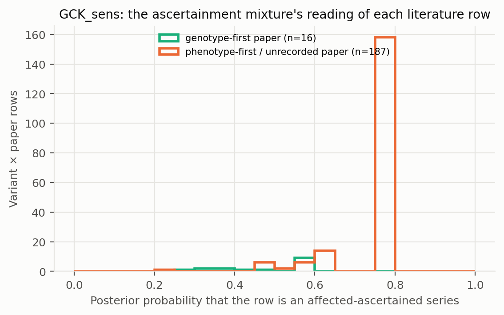

# GCK_sens: literature-derived penetrance with a Bayesian prior — automated report

Generated by `iterations/grant_e2e_20260909/scripts/make_report.py` from the frozen workflow (GeneVariantFetcher tag `grant-freeze-20260909`). All numbers below are produced by code from the run artifacts; none were edited by hand.

## Data

| Quantity | Value |
| --- | ---: |
| Papers in the extraction database | 1050 |
| Variant rows in the database | 25579 |
| Usable carrier observations (variant × paper) | 204 |
| Papers contributing usable observations | 108 |
| Count rows without a usable denominator (excluded) | 20658 |
| Quarantined count rows excluded by the trust gate | 134 |
| Distinct variants with carrier counts | 155 |
| Total literature carriers / affected | 602 / 526 |
| Variants with ≥5 carriers (evaluation set; carriers = literature) | 36 |
| Share of observations that are single affected probands | 0.00 |
| Missense variants with an AlphaMissense score | 113 / 118 |
| Variants with a ClinVar record | 95 / 155 |
| Feature transcript | ENST00000403799.8 |
| gnomAD carriers added as unaffected | 0 (off) |

Denominator sources: explicit = 28, individual_records = 21, total_derived = 155. Study designs (paper level): case_series = 96, unknown = 32, cohort_population = 29, case_report = 24, family_segregation = 19, functional_invitro = 2, other = 2.

Excluded count rows by shape: affected_only_no_denominator = 78, other_or_inconsistent = 17, total_only_no_phenotype_split = 20506, unaffected_only = 57. Largest sources of total-only rows (carrier totals with no affected/unaffected split): PMID 37101203 (18020 rows, 18034 carriers, design unrecorded); PMID 36257325 (1022 rows, 3202 carriers, design unrecorded); PMID 34763692 (681 rows, 733 carriers, design unrecorded).

ClinVar classes among variants with counts: B/LB = 2, Conflicting = 3, P/LP = 80, VUS = 10, none = 60.

## Model

Hierarchical logistic-binomial on variant × paper rows (203 rows after merging single-carrier reports per variant, 154 variants). Each row is either an **affected-ascertained series** (probability π, success probability p_asc ≈ 1) or an **informative observation** of the variant's penetrance: `y_r ~ π·Binomial(n_r, p_asc) + (1−π)·Binomial(n_r, p_r)`, `logit(p_r) = α + x_v·β + σ·z_v + τ·e_r`, with a between-variant effect `z_v` and a between-study effect `e_r`; `logit(π_r) = g0 + g1·[genotype-first ascertainment recorded for the paper] + g2·[standardized log10 gnomAD allele frequency of the variant]` (case series of common alleles are ascertainment). gnomAD anchor rows are informative by construction and carry no study effect. Fitted by NUTS (PyMC, 4 chains). The posterior of `p_v = sigmoid(α + x_v·β + σ·z_v)` is the penetrance estimate among carriers not selected for being affected: variants with many informative carriers are driven by their own counts; variants known only from case reports are shrunk toward the feature-implied prior and carry wide intervals. Fixed-effect sets: `base` (intercept only), `class` (truncating), `insilico` (class + AlphaMissense), `clinvar` (class + ClinVar P/LP, B/LB, no-record), `insilico_clinvar`. The primary model is `insilico`.

| Model | Features | σ (between-variant SD, logit) | τ (between-study SD, logit) | π ascertained: phenotype-first / genotype-first rows (typical frequency) | g2 (per SD of log10 AF) | max R̂ | min ESS | divergences |
| --- | --- | ---: | ---: | ---: | ---: | ---: | ---: | ---: |
| base | — | 0.82 | 0.51 | 0.73 / 0.54 | -0.38 | 1.010 | 699 | 0 |
| class | trunc | 0.83 | 0.50 | 0.73 / 0.54 | -0.42 | 1.000 | 666 | 0 |
| clinvar ⚠ chains disagree | trunc, clinvar_plp, clinvar_blb, clinvar_none | 0.77 | 0.45 | 0.60 / 0.51 | -0.22 | 1.530 | 7 | 0 |
| insilico | trunc, am, am_missing | 0.85 | 0.47 | 0.74 / 0.56 | -0.45 | 1.000 | 802 | 0 |
| insilico_clinvar ⚠ chains disagree | trunc, am, am_missing, clinvar_plp, clinvar_blb, clinvar_none | 0.77 | 0.45 | 0.61 / 0.51 | -0.24 | 1.530 | 7 | 0 |

⚠ Convergence: chains disagree (R̂ > 1.05) for clinvar, insilico_clinvar. The ascertainment mixture is multimodal when a variant's literature consists of all-affected series with no genotype-first or population anchor (the same rows are explained either as ascertained series or as high penetrance); estimates from those models are not reliable.

Primary-model coefficients (posterior mean [94% HDI]): `alpha` 0.82 [-0.17, 2.04]; `sigma` 0.85 [0.01, 1.54]; `beta[trunc]` -0.17 [-1.51, 1.02]; `beta[am]` -0.15 [-0.74, 0.39]; `beta[am_missing]` 0.16 [-1.32, 1.57]; `tau` 0.47 [0.00, 1.02]; `g0` 1.09 [0.12, 1.96]; `g1` -0.83 [-2.08, 0.42]; `g2` -0.45 [-1.16, 0.20]; `p_asc` 0.99 [0.97, 1.00].

## Held-out predictive performance (5-fold by variant)

| Prior model | NLL / carrier ↓ | Brier / carrier ↓ | log pred. density / row ↑ | calibration slope (1 = ideal) |
| --- | ---: | ---: | ---: | ---: |
| base | 0.3626 | 0.0637 | -0.619 | 1.89 |
| class | 0.3634 | 0.0638 | -0.620 | 1.90 |
| insilico | 0.3621 | 0.0632 | -0.621 | 1.79 |
| clinvar | 0.3707 | 0.0652 | -0.632 | 1.31 |
| insilico_clinvar | 0.3719 | 0.0653 | -0.632 | 1.22 |

Scored on held-out variant × paper rows (each fold's model never saw the held-out variants; predictions integrate both the variant and the study effect).

Paired bootstrap change in NLL per carrier versus the `base` prior (negative = better): `class` +0.0009 [-0.0012, +0.0029]; `insilico` -0.0005 [-0.0072, +0.0047]; `clinvar` +0.0081 [+0.0035, +0.0136]; `insilico_clinvar` +0.0093 [+0.0045, +0.0152].

Paired bootstrap change in NLL per carrier versus the `clinvar` prior (negative = better): `base` -0.0081 [-0.0136, -0.0034]; `class` -0.0073 [-0.0123, -0.0031]; `insilico` -0.0086 [-0.0167, -0.0018]; `insilico_clinvar` +0.0012 [-0.0010, +0.0034].

## Classification performance: identifying variants with observed penetrance ≥ 50%

Evaluation set: variants with ≥5 carriers (literature carriers). Label: observed fraction ≥ 50%. AUC with 95% bootstrap interval.

| Scorer | variants | high-penetrance variants | AUC | 95% CI |
| --- | ---: | ---: | ---: | --- |
| clinvar_ordinal | 27 | 25 | 0.710 | [0.423, 1.000] |
| clinvar_plp_binary | 27 | 25 | 0.710 | [0.423, 1.000] |
| alphamissense_missense_only | 28 | 26 | 0.308 | [0.147, 0.500] |
| insilico_posterior_mean_in_sample_LEAKY | 36 | 34 | 0.985 | [0.918, 1.000] |
| base_oof_prior | 36 | 34 | 0.471 | [0.088, 0.857] |
| class_oof_prior | 36 | 34 | 0.412 | [0.171, 0.706] |
| insilico_oof_prior | 36 | 34 | 0.588 | [0.353, 0.800] |
| clinvar_oof_prior | 36 | 34 | 0.279 | [0.131, 0.429] |
| insilico_clinvar_oof_prior | 36 | 34 | 0.294 | [0.150, 0.456] |

The `_LEAKY` row uses the posterior that already contains the variant's own counts, which also define the label; it is shown only to make the leakage explicit and is not a validation.

Binary rule 'ClinVar P/LP ⇒ high penetrance': sensitivity 0.92, specificity 0.50, PPV 0.96, NPV 0.33 (TP 23, FP 1, FN 2, TN 1).

Other thresholds: ≥25%: clinvar_ordinal 0.44, insilico_oof_prior 0.46; ≥75%: clinvar_ordinal 0.62, insilico_oof_prior 0.59.

## Held-out observations of known variants: penetrance estimate versus classification

**Alternate-paper hold-out.** For each variant reported in ≥2 papers, papers are split alternately by PMID; set A updates the prior, set B is scored (19 variants, 87 held-out carriers). Because B still contains phenotype-first reports, the prediction for B is the mixture prediction (ascertained series with probability π, informative otherwise).

The ClinVar comparator predicts each variant with the observed A-rate of its ClinVar class among the *other* variants; the pooled rate is the A-rate over all variants.

| Predictor for held-out observations | NLL / carrier ↓ | Brier / carrier ↓ |
| --- | ---: | ---: |
| posterior_from_half_A | 0.2778 | 0.0264 |
| prior_only | 0.2697 | 0.0244 |
| pooled_rate_half_A | 0.2914 | 0.0295 |
| clinvar_class_rate_half_A | 0.3303 | 0.0471 |

Paired bootstrap change in NLL per held-out carrier, posterior-from-A minus ClinVar-class rate: -0.0525 [-0.1374, +0.0182] (negative favours the count-informed estimate).

Paired bootstrap change in NLL per held-out carrier, posterior-from-A minus pooled rate: -0.0136 [-0.0399, +0.0179] (negative favours the count-informed estimate).

Paired bootstrap change in NLL per held-out carrier, posterior-from-A minus features-only prior: +0.0081 [-0.0011, +0.0180] (negative favours the count-informed estimate).

| Scorer (label: observed ≥ 50% in set B) | variants | AUC | 95% CI |
| --- | ---: | ---: | --- |
| posterior_from_half_A | 19 | 0.222 | [0.056, 0.444] |
| prior_only | 19 | 0.333 | [0.118, 0.562] |
| pooled_rate_half_A | 19 | 0.500 | [0.500, 0.500] |
| clinvar_class_rate_half_A | 19 | 0.556 | [0.333, 0.794] |
| clinvar_ordinal | 19 | 0.389 | [0.284, 0.472] |

## Common variants: the known-outcome check

Variants with gnomAD allele frequency above 0.001 are common alleles whose outcome is known independently of the literature: at most a GWAS-scale risk, no Mendelian penetrance. They stay in the model as a check. In case-series literature they look penetrant (median literature fraction 1.00; 100% of them are ≥ 50% affected among reported carriers); the model's estimate for them should be near the population risk: median posterior 0.761, 0% with the 97.5% bound below 10%.

| Variant | ClinVar | gnomAD AF | gnomAD carriers added | affected / literature carriers | literature fraction | posterior mean [97.5%] |
| --- | --- | ---: | ---: | ---: | ---: | --- |
| A11T | B/LB | 6.15e-03 | 0 | 2 / 2 | 1.00 | 0.761 [0.985] |

## Examples where the classification is wrong about penetrance

No variant with ≥5 literature carriers has a 95% credible interval entirely on the opposite side of 50% from its ClinVar class.

## Figures

**Figure — Posterior penetrance (dot, 95% credible interval) versus the raw observed fraction (tick) for the best-observed variants, coloured by ClinVar class.**

**Figure — Distribution of posterior mean penetrance across all variants, and by ClinVar class for variants with enough carriers.**

**Figure — Calibration of held-out prior predictions (each model predicts variants it never saw).**

**Figure — ROC curves for identifying observed high-penetrance variants: ClinVar class alone, AlphaMissense alone, the held-out Bayesian prior, and the posterior that includes the variant's own counts.**

**Figure — Alternate-paper hold-out: the posterior built from half of each variant's papers predicts the observed penetrance in the other half; compared with ClinVar class and a features-only prior.**

**Figure — Where classification and estimated penetrance disagree; outlined, labelled points are the discordant variants listed above.**

**Figure — Prior mean versus posterior mean: how the literature counts refine the feature-implied prior.**

**Figure — How the mixture reads the literature: posterior probability that each variant × paper row is a pure affected series, by the paper's recorded ascertainment.**

## Limitations that travel with these numbers

- Counts are pooled across papers; cohort overlap between publications cannot be resolved from the extraction, so denominators may double count.
- Probands are included; ascertainment inflates penetrance, most strongly for variants known only from single case reports (see the single-proband share above).
- 'Affected' follows each paper's own phenotype definition for the gene–disease pair; ages are not modelled.
- ClinVar classes are as of the variantFeatures snapshot; frameshift/splice alleles often lack a warehouse record and appear as 'no ClinVar record'.
- Held-out metrics score the prior model; posterior values include the variant's own counts and are the estimate a user would see, not a validation.

## Artifacts

`observations.csv`, `variants.csv`, `variants_features.csv`, `fit/posterior_variants.csv`, `fit/oof_predictions.csv`, `fit/metrics.csv`, `fit/classification_metrics.csv`, `fit/discordant_variants.csv`, `fit/coefficients.csv`, `fit/model_diagnostics.csv`, `fit/fit_summary.json` in the analysis directory.
