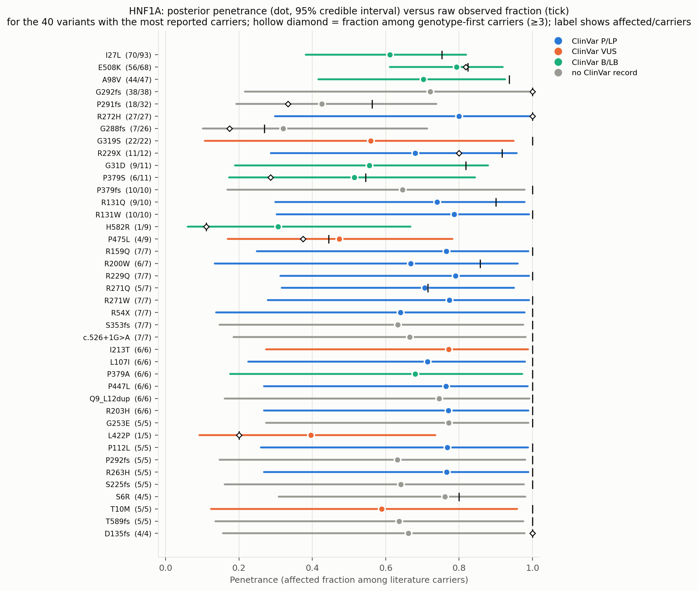
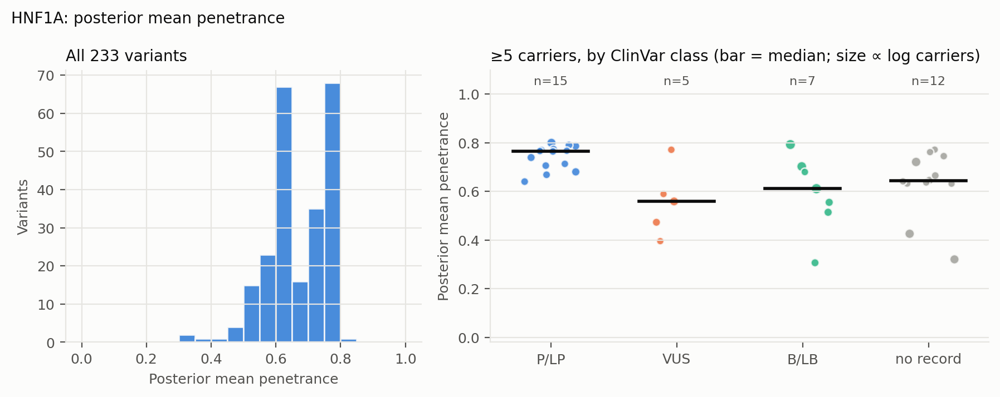
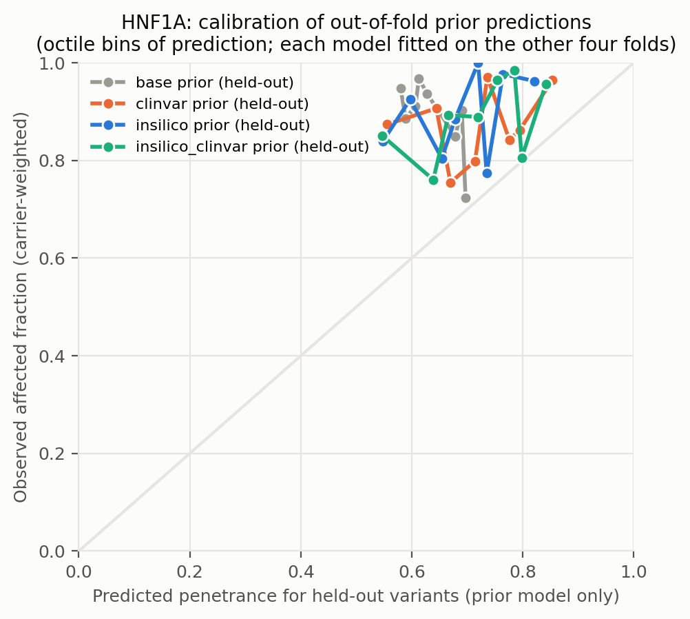
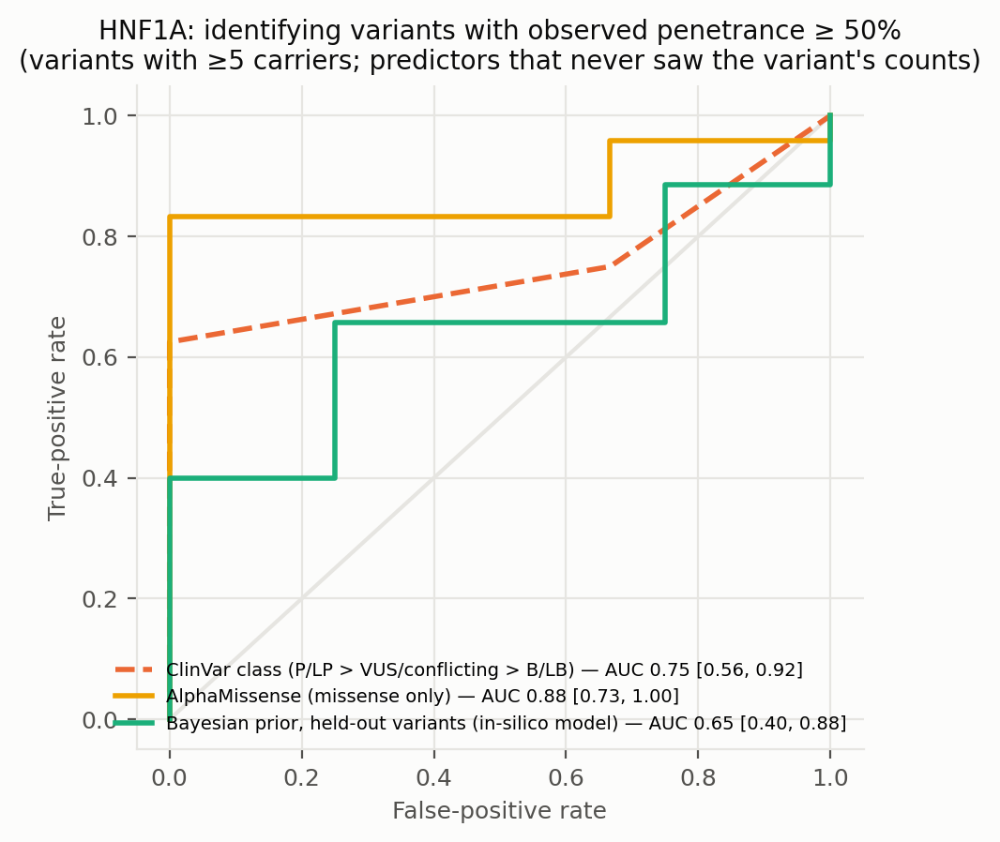
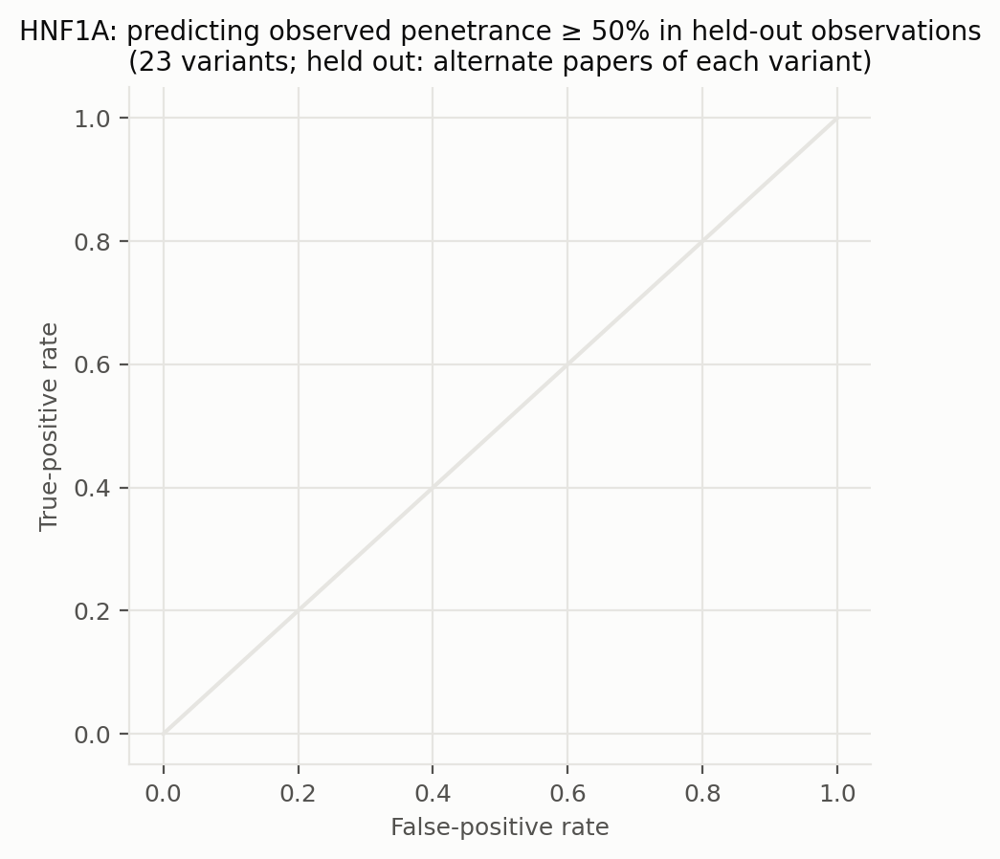
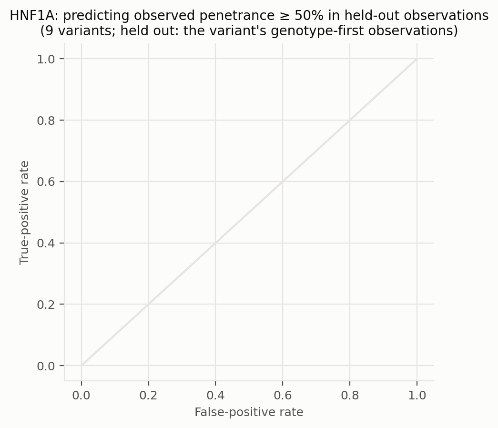
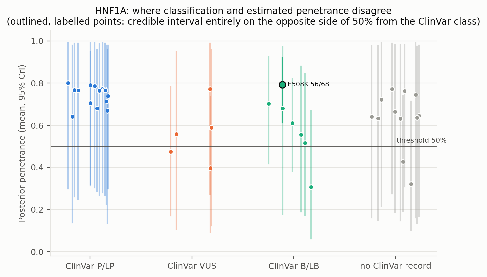
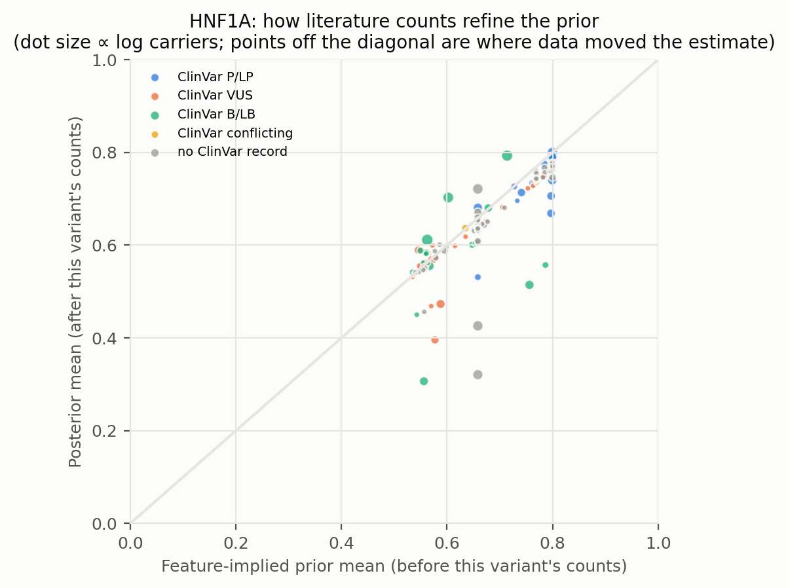
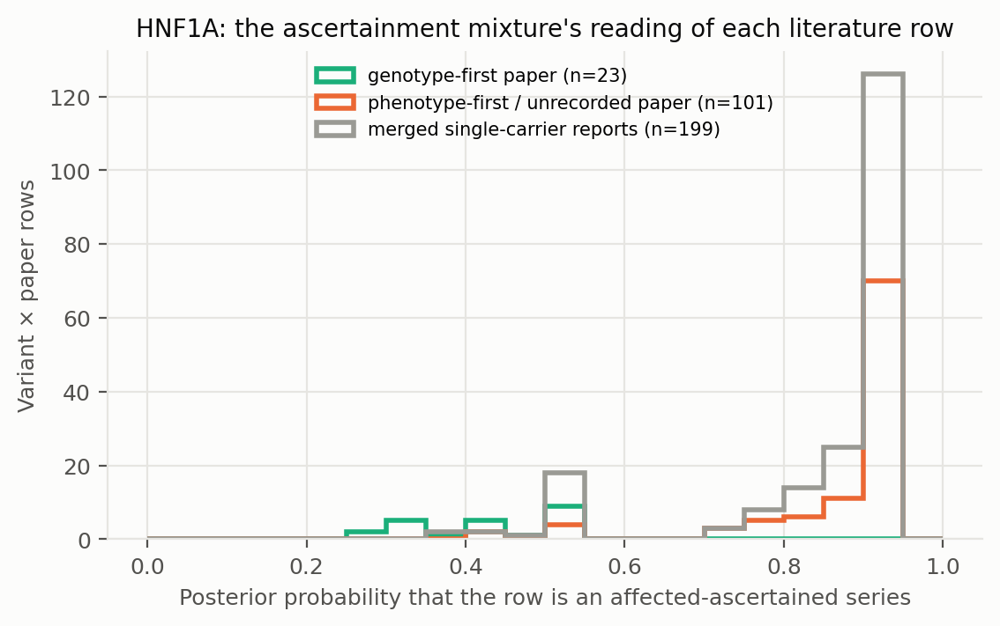

# HNF1A: literature-derived penetrance with a Bayesian prior — automated report

Generated by `iterations/grant_e2e_20260909/scripts/make_report.py` from the frozen workflow (GeneVariantFetcher tag `grant-freeze-20260909`). All numbers below are produced by code from the run artifacts; none were edited by hand.

## Data

| Quantity | Value |
| --- | ---: |
| Papers in the extraction database | 1000 |
| Variant rows in the database | 7882 |
| Usable carrier observations (variant × paper) | 419 |
| Papers contributing usable observations | 173 |
| Count rows without a usable denominator (excluded) | 547 |
| Quarantined count rows excluded by the trust gate | 113 |
| Distinct variants with carrier counts | 234 |
| Total literature carriers / affected | 877 / 762 |
| Variants with ≥5 carriers (evaluation set; carriers = literature) | 39 |
| Share of observations that are single affected probands | 0.69 |
| Missense variants with an AlphaMissense score | 144 / 152 |
| Variants with a ClinVar record | 119 / 234 |
| Feature transcript | ENST00000257555.11 |
| gnomAD carriers added as unaffected | 0 (off) |

Denominator sources: explicit = 56, individual_records = 69, total_derived = 294. Study designs (paper level): case_series = 233, cohort_population = 80, case_report = 51, family_segregation = 15, case_control = 13, other = 11, unknown = 10, functional_invitro = 3, biobank = 1, cohort = 1, cross-sectional = 1.

Excluded count rows by shape: affected_only_no_denominator = 8, other_or_inconsistent = 16, total_only_no_phenotype_split = 495, unaffected_only = 28. Largest sources of total-only rows (carrier totals with no affected/unaffected split): PMID 36257325 (218 rows, 564 carriers, design unrecorded); PMID 36504295 (40 rows, 52 carriers, design unrecorded); PMID 37798422 (14 rows, 28 carriers, design cohort_population).

ClinVar classes among variants with counts: B/LB = 21, Conflicting = 1, P/LP = 59, VUS = 38, none = 115.

## Model

Hierarchical logistic-binomial on variant × paper rows (323 rows after merging single-carrier reports per variant, 233 variants). Each row is either an **affected-ascertained series** (probability π, success probability p_asc ≈ 1) or an **informative observation** of the variant's penetrance: `y_r ~ π·Binomial(n_r, p_asc) + (1−π)·Binomial(n_r, p_r)`, `logit(p_r) = α + x_v·β + σ·z_v + τ·e_r`, with a between-variant effect `z_v` and a between-study effect `e_r`; `logit(π_r) = g0 + g1·[genotype-first ascertainment recorded for the paper] + g2·[standardized log10 gnomAD allele frequency of the variant]` (case series of common alleles are ascertainment). gnomAD anchor rows are informative by construction and carry no study effect. Fitted by NUTS (PyMC, 4 chains). The posterior of `p_v = sigmoid(α + x_v·β + σ·z_v)` is the penetrance estimate among carriers not selected for being affected: variants with many informative carriers are driven by their own counts; variants known only from case reports are shrunk toward the feature-implied prior and carry wide intervals. Fixed-effect sets: `base` (intercept only), `class` (truncating), `insilico` (class + AlphaMissense), `clinvar` (class + ClinVar P/LP, B/LB, no-record), `insilico_clinvar`. The primary model is `insilico`.

| Model | Features | σ (between-variant SD, logit) | τ (between-study SD, logit) | π ascertained: phenotype-first / genotype-first rows (typical frequency) | g2 (per SD of log10 AF) | max R̂ | min ESS | divergences |
| --- | --- | ---: | ---: | ---: | ---: | ---: | ---: | ---: |
| base ⚠ chains disagree | — | 1.07 | 0.51 | 0.73 / 0.49 | -0.30 | 1.360 | 9 | 0 |
| class | trunc | 1.00 | 0.43 | 0.91 / 0.54 | -0.51 | 1.010 | 552 | 0 |
| clinvar | trunc, clinvar_plp, clinvar_blb, clinvar_none | 1.14 | 0.42 | 0.87 / 0.45 | -0.42 | 1.010 | 386 | 0 |
| insilico | trunc, am, am_missing | 1.05 | 0.43 | 0.89 / 0.49 | -0.42 | 1.010 | 250 | 0 |
| insilico_clinvar | trunc, am, am_missing, clinvar_plp, clinvar_blb, clinvar_none | 1.23 | 0.42 | 0.85 / 0.42 | -0.36 | 1.010 | 498 | 0 |

⚠ Convergence: chains disagree (R̂ > 1.05) for base. The ascertainment mixture is multimodal when a variant's literature consists of all-affected series with no genotype-first or population anchor (the same rows are explained either as ascertained series or as high penetrance); estimates from those models are not reliable.

Primary-model coefficients (posterior mean [94% HDI]): `alpha` 1.04 [0.12, 2.04]; `sigma` 1.05 [0.19, 1.84]; `beta[trunc]` -0.30 [-1.50, 0.85]; `beta[am]` 0.56 [-0.15, 1.37]; `beta[am_missing]` 0.43 [-1.39, 2.10]; `tau` 0.43 [0.00, 1.00]; `g0` 2.14 [1.25, 3.06]; `g1` -2.20 [-3.29, -1.20]; `g2` -0.42 [-0.80, -0.08]; `p_asc` 0.99 [0.98, 1.00].

## Held-out predictive performance (5-fold by variant)

| Prior model | NLL / carrier ↓ | Brier / carrier ↓ | log pred. density / row ↑ | calibration slope (1 = ideal) |
| --- | ---: | ---: | ---: | ---: |
| base | 0.3463 | 0.0520 | -0.376 | 0.94 |
| class | 0.3492 | 0.0526 | -0.376 | 0.90 |
| insilico | 0.3478 | 0.0519 | -0.374 | 0.90 |
| clinvar | 0.3560 | 0.0543 | -0.375 | 0.78 |
| insilico_clinvar | 0.3528 | 0.0532 | -0.373 | 0.81 |

Scored on held-out variant × paper rows (each fold's model never saw the held-out variants; predictions integrate both the variant and the study effect).

Paired bootstrap change in NLL per carrier versus the `base` prior (negative = better): `class` +0.0030 [-0.0011, +0.0082]; `insilico` +0.0016 [-0.0074, +0.0113]; `clinvar` +0.0097 [-0.0025, +0.0246]; `insilico_clinvar` +0.0065 [-0.0066, +0.0205].

Paired bootstrap change in NLL per carrier versus the `clinvar` prior (negative = better): `base` -0.0097 [-0.0242, +0.0025]; `class` -0.0067 [-0.0163, +0.0022]; `insilico` -0.0082 [-0.0198, +0.0055]; `insilico_clinvar` -0.0032 [-0.0090, +0.0038].

## Classification performance: identifying variants with observed penetrance ≥ 50%

Evaluation set: variants with ≥5 carriers (literature carriers). Label: observed fraction ≥ 50%. AUC with 95% bootstrap interval.

| Scorer | variants | high-penetrance variants | AUC | 95% CI |
| --- | ---: | ---: | ---: | --- |
| clinvar_ordinal | 27 | 24 | 0.750 | [0.558, 0.920] |
| clinvar_plp_binary | 27 | 24 | 0.812 | [0.714, 0.913] |
| alphamissense_missense_only | 27 | 24 | 0.875 | [0.727, 1.000] |
| insilico_posterior_mean_in_sample_LEAKY | 39 | 35 | 0.993 | [0.955, 1.000] |
| base_oof_prior | 39 | 35 | 0.236 | [0.021, 0.579] |
| class_oof_prior | 39 | 35 | 0.286 | [0.027, 0.595] |
| insilico_oof_prior | 39 | 35 | 0.650 | [0.402, 0.882] |
| clinvar_oof_prior | 39 | 35 | 0.521 | [0.211, 0.752] |
| insilico_clinvar_oof_prior | 39 | 35 | 0.607 | [0.394, 0.820] |

The `_LEAKY` row uses the posterior that already contains the variant's own counts, which also define the label; it is shown only to make the leakage explicit and is not a validation.

Binary rule 'ClinVar P/LP ⇒ high penetrance': sensitivity 0.62, specificity 1.00, PPV 1.00, NPV 0.25 (TP 15, FP 0, FN 9, TN 3).

Other thresholds: ≥25%: clinvar_ordinal 0.78, insilico_oof_prior 0.65; ≥75%: clinvar_ordinal 0.70, insilico_oof_prior 0.54.

## Held-out observations of known variants: penetrance estimate versus classification

**Alternate-paper hold-out.** For each variant reported in ≥2 papers, papers are split alternately by PMID; set A updates the prior, set B is scored (23 variants, 252 held-out carriers). Because B still contains phenotype-first reports, the prediction for B is the mixture prediction (ascertained series with probability π, informative otherwise).

The ClinVar comparator predicts each variant with the observed A-rate of its ClinVar class among the *other* variants; the pooled rate is the A-rate over all variants.

| Predictor for held-out observations | NLL / carrier ↓ | Brier / carrier ↓ |
| --- | ---: | ---: |
| posterior_from_half_A | 0.4162 | 0.0152 |
| prior_only | 0.4204 | 0.0158 |
| pooled_rate_half_A | 0.4547 | 0.0263 |
| clinvar_class_rate_half_A | 0.4818 | 0.0413 |

Paired bootstrap change in NLL per held-out carrier, posterior-from-A minus ClinVar-class rate: -0.0655 [-0.2135, +0.0021] (negative favours the count-informed estimate).

Paired bootstrap change in NLL per held-out carrier, posterior-from-A minus pooled rate: -0.0385 [-0.0974, +0.0107] (negative favours the count-informed estimate).

Paired bootstrap change in NLL per held-out carrier, posterior-from-A minus features-only prior: -0.0042 [-0.0218, +0.0105] (negative favours the count-informed estimate).

**Genotype-first hold-out.** Set B = the variant's observations from papers whose ascertainment the extractor recorded as population screening or cascade testing; set A = its phenotype-first observations (case reports, referral series) plus any gnomAD anchor. A updates the feature prior into a variant posterior (exact grid update; the mixture likelihood per row, study effects integrated, τ/π/p_asc at posterior means); B is scored (9 variants, 146 held-out genotype-first carriers). This is the clinical question: does case-based literature plus features predict the penetrance seen when carriers are found by genotype?

The ClinVar comparator predicts each variant with the observed A-rate of its ClinVar class among the *other* variants; the pooled rate is the A-rate over all variants.

| Predictor for held-out observations | NLL / carrier ↓ | Brier / carrier ↓ |
| --- | ---: | ---: |
| posterior_from_half_A | 0.7328 | 0.1151 |
| prior_only | 0.7526 | 0.1214 |
| pooled_rate_half_A | 1.3105 | 0.2029 |
| clinvar_class_rate_half_A | 1.1674 | 0.1845 |

Paired bootstrap change in NLL per held-out carrier, posterior-from-A minus ClinVar-class rate: -0.4347 [-1.0755, -0.0604] (negative favours the count-informed estimate).

Paired bootstrap change in NLL per held-out carrier, posterior-from-A minus pooled rate: -0.5777 [-1.1706, -0.1966] (negative favours the count-informed estimate).

Paired bootstrap change in NLL per held-out carrier, posterior-from-A minus features-only prior: -0.0198 [-0.0774, +0.0073] (negative favours the count-informed estimate).

Largest genotype-first hold-outs (affected / carriers in B; predictions from A):

| Variant | ClinVar | A: affected / carriers | B (genotype-first): affected / carriers | observed B | posterior from A | features-only prior | ClinVar-class rate |
| --- | --- | ---: | ---: | ---: | ---: | ---: | ---: |
| E508K | B/LB | 2 / 2 | 54 / 66 | 0.82 | 0.77 | 0.76 | 0.90 |
| G288fs | none | 3 / 3 | 4 / 23 | 0.17 | 0.83 | 0.82 | 0.94 |
| P291fs | none | 12 / 14 | 6 / 18 | 0.33 | 0.77 | 0.82 | 0.98 |
| G292fs | none | 27 / 27 | 11 / 11 | 1.00 | 0.84 | 0.82 | 0.87 |
| P475L | VUS | 1 / 1 | 3 / 8 | 0.38 | 0.72 | 0.72 | 0.97 |
| P379S | B/LB | 4 / 4 | 2 / 7 | 0.29 | 0.82 | 0.82 | 0.83 |
| R272H | P/LP | 22 / 22 | 5 / 5 | 1.00 | 0.90 | 0.89 | 0.94 |
| R229X | P/LP | 7 / 7 | 4 / 5 | 0.80 | 0.80 | 0.79 | 0.98 |
| D135fs | none | 1 / 1 | 3 / 3 | 1.00 | 0.83 | 0.82 | 0.94 |

## Common variants: the known-outcome check

Variants with gnomAD allele frequency above 0.001 are common alleles whose outcome is known independently of the literature: at most a GWAS-scale risk, no Mendelian penetrance. They stay in the model as a check. In case-series literature they look penetrant (median literature fraction 0.94; 100% of them are ≥ 50% affected among reported carriers); the model's estimate for them should be near the population risk: median posterior 0.611, 0% with the 97.5% bound below 10%.

| Variant | ClinVar | gnomAD AF | gnomAD carriers added | affected / literature carriers | literature fraction | posterior mean [97.5%] |
| --- | --- | ---: | ---: | ---: | ---: | --- |
| I27L | B/LB | 3.55e-01 | 0 | 70 / 93 | 0.75 | 0.611 [0.819] |
| S487N | B/LB | 3.37e-01 | 0 | 1 / 1 | 1.00 | 0.582 [0.955] |
| A98V | B/LB | 2.90e-02 | 0 | 44 / 47 | 0.94 | 0.703 [0.925] |

## Examples where the classification is wrong about penetrance

Variants with ≥5 literature carriers whose 95% credible interval lies entirely on the other side of 50% from what the ClinVar class implies. `literature affected / carriers` are the extracted counts; `genotype-first` are the affected / carriers in screening or cascade rows, the evidence least affected by ascertainment. PMIDs are the source papers.

| Variant | Class | ClinVar | literature affected / carriers | literature fraction | genotype-first affected / carriers | posterior mean [95% CrI] | prior mean | papers | PMIDs |
| --- | --- | --- | ---: | ---: | ---: | --- | ---: | ---: | --- |
| E508K | missense | B/LB | 56 / 68 | 0.82 | 54 / 66 | 0.79 [0.61, 0.92] | 0.71 | 4 | 20705777, 24915262, 36836406, 38830515 |

Counts: 0 P/LP variants estimated below 50%; 1 non-P/LP variants estimated above 50% (≥5 literature carriers).

Evidence rows behind the first discordant variants (per paper; `ascertained` = posterior probability that the row is an affected-only series):

| Variant | PMID | affected / carriers | ascertainment recorded | ascertained |
| --- | --- | ---: | --- | ---: |
| E508K | 24915262 | 52 / 64 | population_screening | 0.25 |
| E508K | 20705777 | 2 / 2 | family_cascade | 0.25 |
| E508K | single_carrier_reports | 2 / 2 | — | 0.72 |

## Figures

**Figure — Posterior penetrance (dot, 95% credible interval) versus the raw observed fraction (tick) for the best-observed variants, coloured by ClinVar class.**

**Figure — Distribution of posterior mean penetrance across all variants, and by ClinVar class for variants with enough carriers.**

**Figure — Calibration of held-out prior predictions (each model predicts variants it never saw).**

**Figure — ROC curves for identifying observed high-penetrance variants: ClinVar class alone, AlphaMissense alone, the held-out Bayesian prior, and the posterior that includes the variant's own counts.**

**Figure — Alternate-paper hold-out: the posterior built from half of each variant's papers predicts the observed penetrance in the other half; compared with ClinVar class and a features-only prior.**

**Figure — Genotype-first hold-out: the posterior built from a variant's phenotype-first reports predicts the penetrance observed in its genotype-first (screening / cascade) observations.**

**Figure — Where classification and estimated penetrance disagree; outlined, labelled points are the discordant variants listed above.**

**Figure — Prior mean versus posterior mean: how the literature counts refine the feature-implied prior.**

**Figure — How the mixture reads the literature: posterior probability that each variant × paper row is a pure affected series, by the paper's recorded ascertainment.**

## Limitations that travel with these numbers

- Counts are pooled across papers; cohort overlap between publications cannot be resolved from the extraction, so denominators may double count.
- Probands are included; ascertainment inflates penetrance, most strongly for variants known only from single case reports (see the single-proband share above).
- 'Affected' follows each paper's own phenotype definition for the gene–disease pair; ages are not modelled.
- ClinVar classes are as of the variantFeatures snapshot; frameshift/splice alleles often lack a warehouse record and appear as 'no ClinVar record'.
- Held-out metrics score the prior model; posterior values include the variant's own counts and are the estimate a user would see, not a validation.

## Artifacts

`observations.csv`, `variants.csv`, `variants_features.csv`, `fit/posterior_variants.csv`, `fit/oof_predictions.csv`, `fit/metrics.csv`, `fit/classification_metrics.csv`, `fit/discordant_variants.csv`, `fit/coefficients.csv`, `fit/model_diagnostics.csv`, `fit/fit_summary.json` in the analysis directory.
