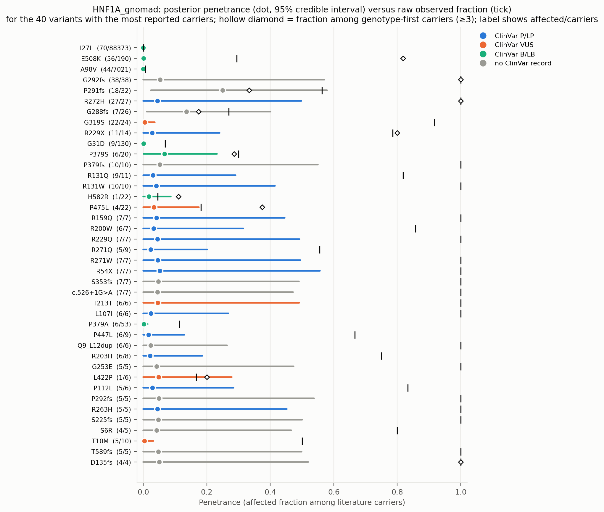
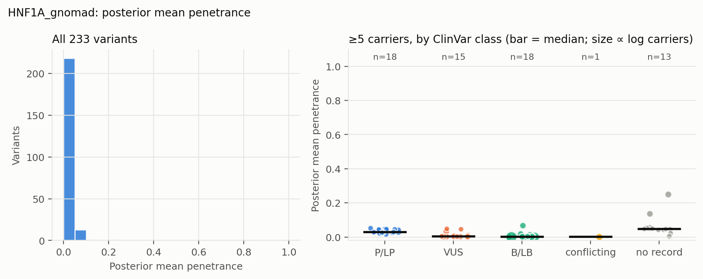
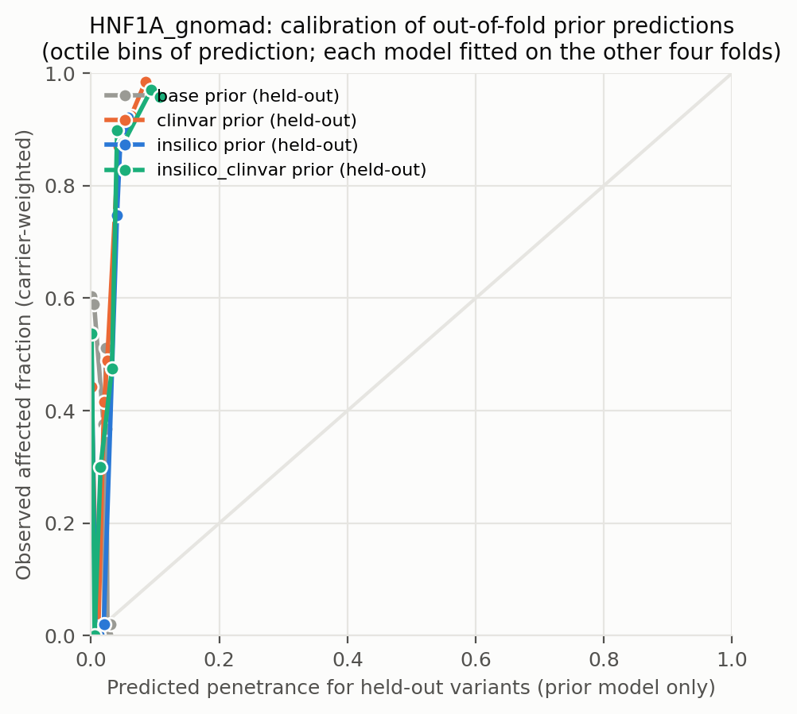
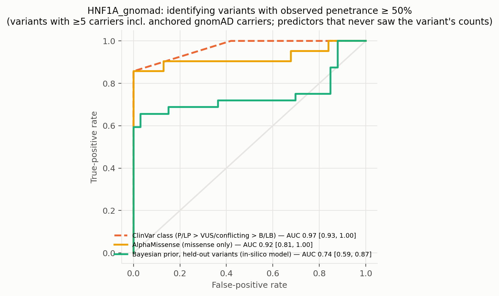
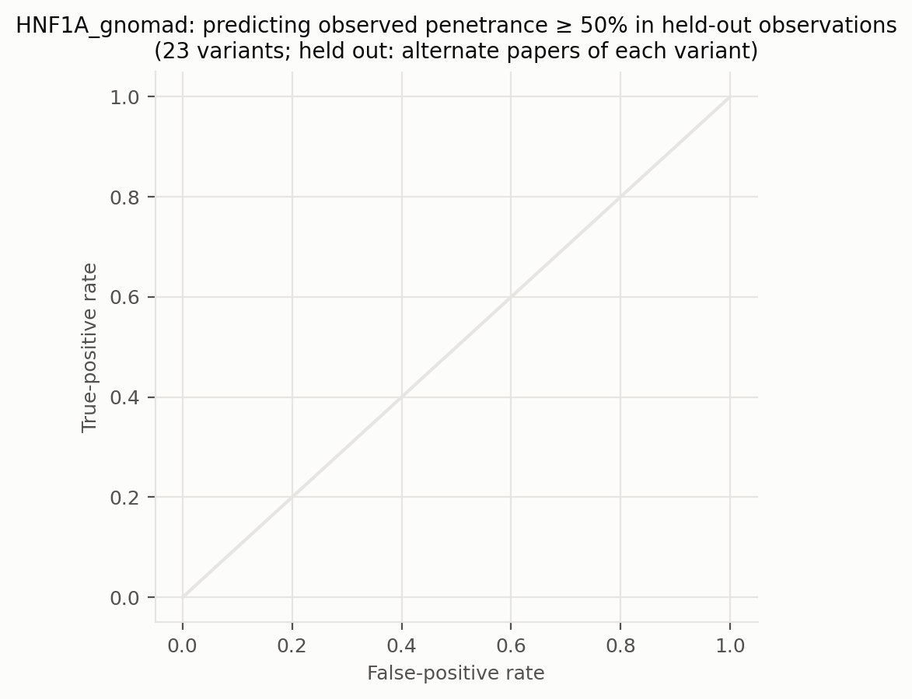
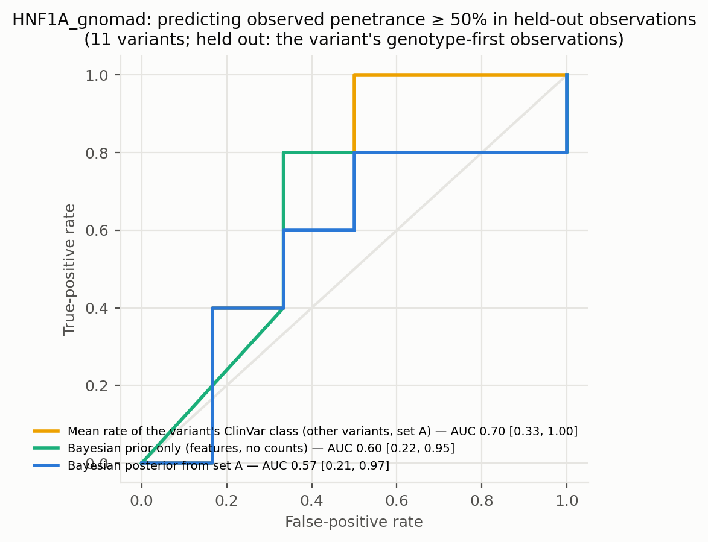
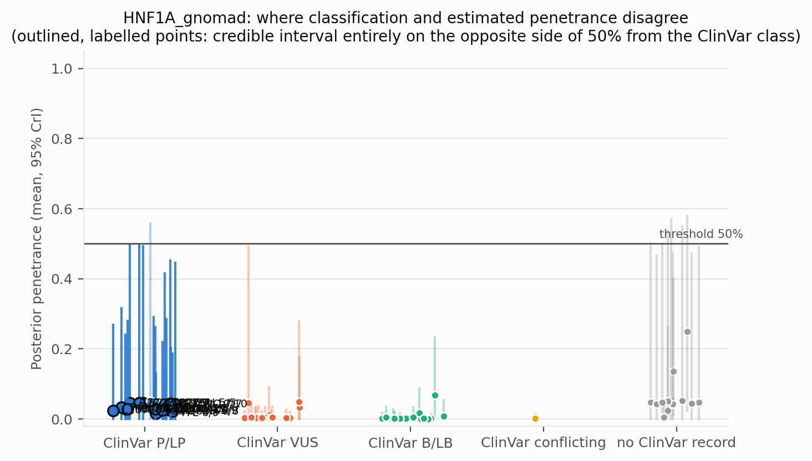
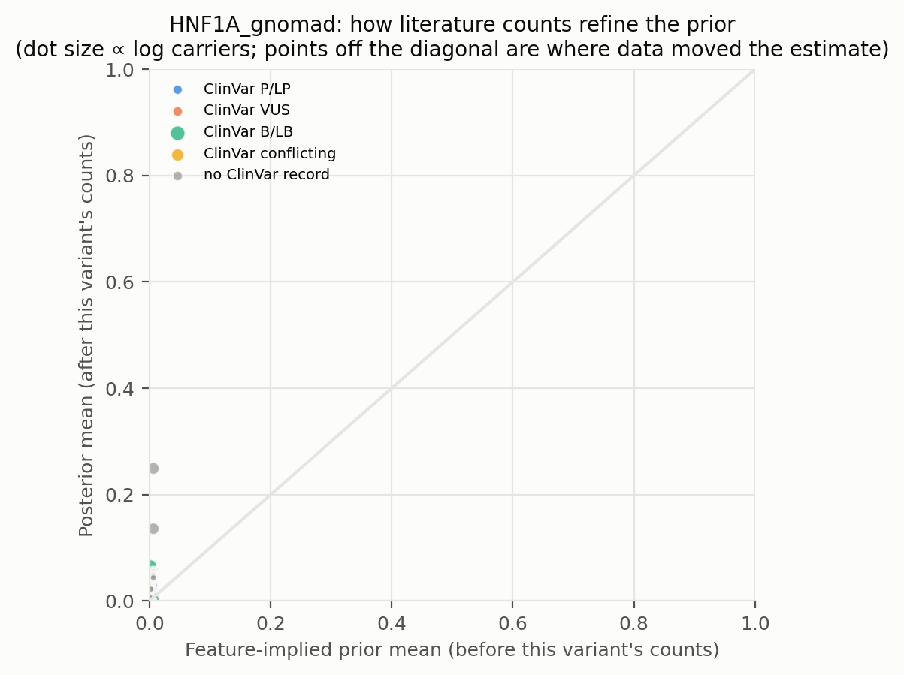
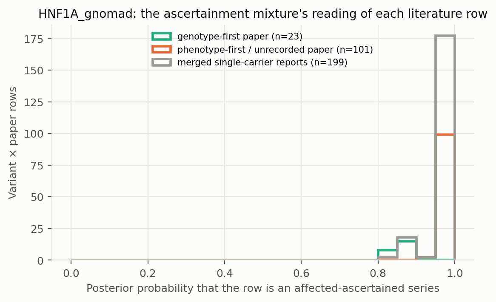

# HNF1A_gnomad: literature-derived penetrance with a Bayesian prior — automated report

Generated by `iterations/grant_e2e_20260909/scripts/make_report.py` from the frozen workflow (GeneVariantFetcher tag `grant-freeze-20260909`). All numbers below are produced by code from the run artifacts; none were edited by hand.

## Data

| Quantity | Value |
| --- | ---: |
| Papers in the extraction database | 1000 |
| Variant rows in the database | 7882 |
| Usable carrier observations (variant × paper) | 419 |
| Papers contributing usable observations | 173 |
| Count rows without a usable denominator (excluded) | 547 |
| Quarantined count rows excluded by the trust gate | 113 |
| Distinct variants with carrier counts | 234 |
| Total literature carriers / affected | 877 / 762 |
| Variants with ≥5 carriers (evaluation set; carriers = literature + anchored gnomAD) | 65 |
| Share of observations that are single affected probands | 0.69 |
| Missense variants with an AlphaMissense score | 144 / 152 |
| Variants with a ClinVar record | 119 / 234 |
| Feature transcript | ENST00000257555.11 |
| gnomAD carriers added as unaffected | 179610 (on) |

Denominator sources: explicit = 56, individual_records = 69, total_derived = 294. Study designs (paper level): case_series = 233, cohort_population = 80, case_report = 51, family_segregation = 15, case_control = 13, other = 11, unknown = 10, functional_invitro = 3, biobank = 1, cohort = 1, cross-sectional = 1.

Excluded count rows by shape: affected_only_no_denominator = 8, other_or_inconsistent = 16, total_only_no_phenotype_split = 495, unaffected_only = 28. Largest sources of total-only rows (carrier totals with no affected/unaffected split): PMID 36257325 (218 rows, 564 carriers, design unrecorded); PMID 36504295 (40 rows, 52 carriers, design unrecorded); PMID 37798422 (14 rows, 28 carriers, design cohort_population).

ClinVar classes among variants with counts: B/LB = 21, Conflicting = 1, P/LP = 59, VUS = 38, none = 115.

## Model

Hierarchical logistic-binomial on variant × paper rows (389 rows after merging single-carrier reports per variant, 233 variants). Each row is either an **affected-ascertained series** (probability π, success probability p_asc ≈ 1) or an **informative observation** of the variant's penetrance: `y_r ~ π·Binomial(n_r, p_asc) + (1−π)·Binomial(n_r, p_r)`, `logit(p_r) = α + x_v·β + σ·z_v + τ·e_r`, with a between-variant effect `z_v` and a between-study effect `e_r`; `logit(π_r) = g0 + g1·[genotype-first ascertainment recorded for the paper] + g2·[standardized log10 gnomAD allele frequency of the variant]` (case series of common alleles are ascertainment). gnomAD anchor rows are informative by construction and carry no study effect. Fitted by NUTS (PyMC, 4 chains). The posterior of `p_v = sigmoid(α + x_v·β + σ·z_v)` is the penetrance estimate among carriers not selected for being affected: variants with many informative carriers are driven by their own counts; variants known only from case reports are shrunk toward the feature-implied prior and carry wide intervals. Fixed-effect sets: `base` (intercept only), `class` (truncating), `insilico` (class + AlphaMissense), `clinvar` (class + ClinVar P/LP, B/LB, no-record), `insilico_clinvar`. The primary model is `insilico`.

| Model | Features | σ (between-variant SD, logit) | τ (between-study SD, logit) | π ascertained: phenotype-first / genotype-first rows (typical frequency) | g2 (per SD of log10 AF) | max R̂ | min ESS | divergences |
| --- | --- | ---: | ---: | ---: | ---: | ---: | ---: | ---: |
| base | — | 2.95 | 0.71 | 0.98 / 0.86 | -0.11 | 1.000 | 1053 | 0 |
| class | trunc | 2.84 | 0.70 | 0.98 / 0.86 | -0.10 | 1.000 | 1175 | 0 |
| clinvar | trunc, clinvar_plp, clinvar_blb, clinvar_none | 2.58 | 0.73 | 0.98 / 0.86 | -0.09 | 1.000 | 957 | 0 |
| insilico | trunc, am, am_missing | 2.67 | 0.70 | 0.98 / 0.86 | -0.09 | 1.000 | 840 | 0 |
| insilico_clinvar | trunc, am, am_missing, clinvar_plp, clinvar_blb, clinvar_none | 2.47 | 0.75 | 0.98 / 0.86 | -0.08 | 1.000 | 1072 | 0 |

Primary-model coefficients (posterior mean [94% HDI]): `alpha` -6.88 [-8.43, -5.34]; `sigma` 2.67 [1.82, 3.56]; `beta[trunc]` 1.14 [-0.67, 2.88]; `beta[am]` 1.10 [-0.10, 2.41]; `beta[am_missing]` 0.01 [-1.88, 1.93]; `tau` 0.70 [0.00, 1.50]; `g0` 4.18 [3.38, 5.05]; `g1` -2.26 [-3.33, -1.09]; `g2` -0.09 [-0.53, 0.41]; `p_asc` 0.93 [0.91, 0.94].

## Held-out predictive performance (5-fold by variant)

| Prior model | NLL / carrier ↓ | Brier / carrier ↓ | log pred. density / row ↑ | calibration slope (1 = ideal) |
| --- | ---: | ---: | ---: | ---: |
| base | 0.0257 | 0.0008 | -0.490 | 2.28 |
| class | 0.0179 | 0.0005 | -0.489 | 2.15 |
| insilico | 0.0117 | 0.0004 | -0.486 | 2.05 |
| clinvar | 0.0120 | 0.0004 | -0.486 | 2.04 |
| insilico_clinvar | 0.0074 | 0.0003 | -0.503 | 1.90 |

Scored on held-out variant × paper rows (each fold's model never saw the held-out variants; predictions integrate both the variant and the study effect).

Paired bootstrap change in NLL per carrier versus the `base` prior (negative = better): `class` -0.0078 [-0.0103, -0.0023]; `insilico` -0.0140 [-0.0142, -0.0034]; `clinvar` -0.0137 [-0.0183, -0.0060]; `insilico_clinvar` -0.0184 [-0.0221, -0.0042].

Paired bootstrap change in NLL per carrier versus the `clinvar` prior (negative = better): `base` +0.0137 [+0.0062, +0.0185]; `class` +0.0059 [+0.0036, +0.0081]; `insilico` -0.0003 [-0.0043, +0.0077]; `insilico_clinvar` -0.0046 [-0.0056, +0.0009].

## Classification performance: identifying variants with observed penetrance ≥ 50%

Evaluation set: variants with ≥5 carriers — literature carriers plus the anchored gnomAD carriers, which also enter the observed fraction that defines the label. Label: observed fraction ≥ 50%. AUC with 95% bootstrap interval.

| Scorer | variants | high-penetrance variants | AUC | 95% CI |
| --- | ---: | ---: | ---: | --- |
| clinvar_ordinal | 52 | 21 | 0.970 | [0.932, 1.000] |
| clinvar_plp_binary | 52 | 21 | 0.929 | [0.842, 1.000] |
| alphamissense_missense_only | 52 | 21 | 0.922 | [0.809, 1.000] |
| insilico_posterior_mean_in_sample_LEAKY | 65 | 32 | 0.888 | [0.785, 0.972] |
| base_oof_prior | 65 | 32 | 0.432 | [0.289, 0.567] |
| class_oof_prior | 65 | 32 | 0.541 | [0.406, 0.685] |
| insilico_oof_prior | 65 | 32 | 0.744 | [0.593, 0.868] |
| clinvar_oof_prior | 65 | 32 | 0.657 | [0.510, 0.798] |
| insilico_clinvar_oof_prior | 65 | 32 | 0.767 | [0.627, 0.892] |

**Literature-only labels.** The table above defines high penetrance over literature carriers plus the anchored gnomAD carriers, so its labels partly encode the anchor assumption. The same scorers against the literature fraction alone (≥5 literature carriers; the 3 common alleles with AF > 0.001 excluded because their literature fraction is known to be ascertainment) — an ascertainment-inflated but anchor-free label:

| Scorer | variants | high-penetrance variants | AUC | 95% CI |
| --- | ---: | ---: | ---: | --- |
| clinvar_ordinal | 25 | 22 | 0.803 | [0.604, 0.938] |
| clinvar_plp_binary | 25 | 22 | 0.841 | [0.738, 0.932] |
| alphamissense_missense_only | 25 | 22 | 0.894 | [0.738, 1.000] |
| insilico_posterior_mean_in_sample_LEAKY | 37 | 33 | 0.402 | [0.053, 0.759] |
| base_oof_prior | 37 | 33 | 0.712 | [0.383, 0.929] |
| class_oof_prior | 37 | 33 | 0.795 | [0.644, 0.933] |
| insilico_oof_prior | 37 | 33 | 0.917 | [0.750, 1.000] |
| clinvar_oof_prior | 37 | 33 | 0.833 | [0.524, 1.000] |
| insilico_clinvar_oof_prior | 37 | 33 | 0.932 | [0.773, 1.000] |

The `_LEAKY` row uses the posterior that already contains the variant's own counts, which also define the label; it is shown only to make the leakage explicit and is not a validation.

Binary rule 'ClinVar P/LP ⇒ high penetrance': sensitivity 0.86, specificity 1.00, PPV 1.00, NPV 0.91 (TP 18, FP 0, FN 3, TN 31).

Other thresholds: ≥25%: clinvar_ordinal 0.90, insilico_oof_prior 0.73; ≥75%: clinvar_ordinal 0.94, insilico_oof_prior 0.74.

## Held-out observations of known variants: penetrance estimate versus classification

**Alternate-paper hold-out.** For each variant reported in ≥2 papers, papers are split alternately by PMID; set A updates the prior, set B is scored (23 variants, 252 held-out carriers). Because B still contains phenotype-first reports, the prediction for B is the mixture prediction (ascertained series with probability π, informative otherwise).

The ClinVar comparator predicts each variant with the observed A-rate of its ClinVar class among the *other* variants; the pooled rate is the A-rate over all variants.

| Predictor for held-out observations | NLL / carrier ↓ | Brier / carrier ↓ |
| --- | ---: | ---: |
| posterior_from_half_A | 0.4539 | 0.0262 |
| prior_only | 0.4538 | 0.0261 |
| pooled_rate_half_A | 5.3105 | 0.7167 |
| clinvar_class_rate_half_A | 3.5385 | 0.4298 |

Paired bootstrap change in NLL per held-out carrier, posterior-from-A minus ClinVar-class rate: -3.0846 [-4.4906, -1.1627] (negative favours the count-informed estimate).

Paired bootstrap change in NLL per held-out carrier, posterior-from-A minus pooled rate: -4.8566 [-5.9331, -4.0905] (negative favours the count-informed estimate).

Paired bootstrap change in NLL per held-out carrier, posterior-from-A minus features-only prior: +0.0001 [-0.0010, +0.0013] (negative favours the count-informed estimate).

**Genotype-first hold-out.** Set B = the variant's observations from papers whose ascertainment the extractor recorded as population screening or cascade testing; set A = its phenotype-first observations (case reports, referral series) plus any gnomAD anchor. A updates the feature prior into a variant posterior (exact grid update; the mixture likelihood per row, study effects integrated, τ/π/p_asc at posterior means); B is scored (11 variants, 160 held-out genotype-first carriers). This is the clinical question: does case-based literature plus features predict the penetrance seen when carriers are found by genotype?

The ClinVar comparator predicts each variant with the observed A-rate of its ClinVar class among the *other* variants; the pooled rate is the A-rate over all variants.

| Predictor for held-out observations | NLL / carrier ↓ | Brier / carrier ↓ |
| --- | ---: | ---: |
| posterior_from_half_A | 0.7968 | 0.1448 |
| prior_only | 0.7968 | 0.1448 |
| pooled_rate_half_A | 0.8183 | 0.1662 |
| clinvar_class_rate_half_A | 1.4387 | 0.3162 |

Paired bootstrap change in NLL per held-out carrier, posterior-from-A minus ClinVar-class rate: -0.6419 [-0.9623, +0.2103] (negative favours the count-informed estimate).

Paired bootstrap change in NLL per held-out carrier, posterior-from-A minus pooled rate: -0.0215 [-0.4076, +0.5760] (negative favours the count-informed estimate).

Paired bootstrap change in NLL per held-out carrier, posterior-from-A minus features-only prior: +0.0000 [-0.0031, +0.0013] (negative favours the count-informed estimate).

| Scorer (label: observed ≥ 50% in set B) | variants | AUC | 95% CI |
| --- | ---: | ---: | --- |
| posterior_from_half_A | 11 | 0.567 | [0.208, 0.968] |
| prior_only | 11 | 0.600 | [0.222, 0.949] |
| pooled_rate_half_A | 11 | 0.500 | [0.500, 0.500] |
| clinvar_class_rate_half_A | 11 | 0.700 | [0.333, 1.000] |
| clinvar_ordinal | 11 | 0.700 | [0.357, 1.000] |

Largest genotype-first hold-outs (affected / carriers in B; predictions from A):

| Variant | ClinVar | A: affected / carriers | B (genotype-first): affected / carriers | observed B | posterior from A | features-only prior | ClinVar-class rate |
| --- | --- | ---: | ---: | ---: | ---: | ---: | ---: |
| E508K | B/LB | 2 / 124 | 54 / 66 | 0.82 | 0.76 | 0.76 | 0.17 |
| G288fs | none | 3 / 3 | 4 / 23 | 0.17 | 0.81 | 0.81 | 0.94 |
| P291fs | none | 12 / 14 | 6 / 18 | 0.33 | 0.81 | 0.81 | 0.98 |
| G292fs | none | 27 / 27 | 11 / 11 | 1.00 | 0.81 | 0.81 | 0.87 |
| H582R | B/LB | 0 / 13 | 1 / 9 | 0.11 | 0.78 | 0.78 | 0.05 |
| P475L | VUS | 1 / 14 | 3 / 8 | 0.38 | 0.78 | 0.78 | 0.25 |
| P379S | B/LB | 4 / 13 | 2 / 7 | 0.29 | 0.78 | 0.79 | 0.02 |
| R272H | P/LP | 22 / 22 | 5 / 5 | 1.00 | 0.81 | 0.81 | 0.75 |
| R229X | P/LP | 7 / 9 | 4 / 5 | 0.80 | 0.80 | 0.80 | 0.98 |
| L422P | VUS | 0 / 1 | 1 / 5 | 0.20 | 0.80 | 0.80 | 0.10 |

## Common variants: the known-outcome check

Variants with gnomAD allele frequency above 0.001 are common alleles whose outcome is known independently of the literature: at most a GWAS-scale risk, no Mendelian penetrance. They stay in the model as a check. In case-series literature they look penetrant (median literature fraction 0.94; 100% of them are ≥ 50% affected among reported carriers); the model's estimate for them should be near the population risk: median posterior 0.000, 100% with the 97.5% bound below 10%.

| Variant | ClinVar | gnomAD AF | gnomAD carriers added | affected / literature carriers | literature fraction | posterior mean [97.5%] |
| --- | --- | ---: | ---: | ---: | ---: | --- |
| I27L | B/LB | 3.55e-01 | 88280 | 70 / 93 | 0.75 | 0.000 [0.000] |
| S487N | B/LB | 3.37e-01 | 83546 | 1 / 1 | 1.00 | 0.000 [0.000] |
| A98V | B/LB | 2.90e-02 | 6974 | 44 / 47 | 0.94 | 0.000 [0.000] |

## Examples where the classification is wrong about penetrance

Variants with ≥5 literature carriers whose 95% credible interval lies entirely on the other side of 50% from what the ClinVar class implies. `literature affected / carriers` are the extracted counts, `gnomAD added` the anchored population carriers (assumed unaffected) that also enter the posterior; `genotype-first` are the affected / carriers in screening or cascade rows, the evidence least affected by ascertainment. PMIDs are the source papers.

| Variant | Class | ClinVar | literature affected / carriers | literature fraction | gnomAD added | genotype-first affected / carriers | posterior mean [95% CrI] | prior mean | papers | PMIDs |
| --- | --- | --- | ---: | ---: | ---: | ---: | --- | ---: | ---: | --- |
| R272H | missense | P/LP | 27 / 27 | 1.00 | 0 | 5 / 5 | 0.05 [0.00, 0.50] | 0.01 | 15 | 12627330, 15114102, 21648289, 21823540, 23610083, 29439679 (+9) |
| R229X | nonsense | P/LP | 11 / 12 | 0.92 | 2 | 4 / 5 | 0.03 [0.00, 0.24] | 0.01 | 6 | 14598263, 22432108, 25411618, 28012402, 29666556, 36504295 |
| R131Q | missense | P/LP | 9 / 10 | 0.90 | 1 | — | 0.03 [0.00, 0.29] | 0.01 | 5 | 23139355, 23607861, 28012402, 35551682, 9287053 |
| R131W | missense | P/LP | 10 / 10 | 1.00 | 0 | 1 / 1 | 0.04 [0.00, 0.41] | 0.01 | 5 | 29207974, 34746319, 36208030, 36504295, 36567880 |
| R159Q | missense | P/LP | 7 / 7 | 1.00 | 0 | — | 0.04 [0.00, 0.45] | 0.00 | 6 | 20132997, 32741144, 33242514, 35737141, 39504571, 41367451 |
| R200W | missense | P/LP | 6 / 7 | 0.86 | 0 | 0 / 1 | 0.03 [0.00, 0.32] | 0.00 | 5 | 17440016, 28012402, 35796342, 36208030, 37396188 |
| R229Q | missense | P/LP | 7 / 7 | 1.00 | 0 | 2 / 2 | 0.04 [0.00, 0.49] | 0.01 | 4 | 28395978, 36208030, 36504295, 36584766 |
| R271Q | missense | P/LP | 5 / 7 | 0.71 | 2 | 2 / 2 | 0.02 [0.00, 0.20] | 0.00 | 3 | 29207974, 36208030, 41614819 |
| R271W | missense | P/LP | 7 / 7 | 1.00 | 0 | — | 0.05 [0.00, 0.50] | 0.01 | 5 | 25716801, 32741144, 34746319, 35592779, 36189138 |
| L107I | missense | P/LP | 6 / 6 | 1.00 | 0 | — | 0.02 [0.00, 0.27] | 0.00 | 2 | 23139355, 23607861 |
| P447L | missense | P/LP | 6 / 6 | 1.00 | 3 | — | 0.02 [0.00, 0.13] | 0.00 | 6 | 29207974, 34496959, 34741762, 38523849, 39504571, 40608360 |
| R203H | missense | P/LP | 6 / 6 | 1.00 | 2 | — | 0.02 [0.00, 0.19] | 0.01 | 6 | 32238361, 35921062, 36584766, 36836406, 39504571, 40274278 |
| P112L | missense | P/LP | 5 / 5 | 1.00 | 1 | — | 0.03 [0.00, 0.28] | 0.00 | 4 | 21518407, 32238361, 39311780, 39504571 |
| R263H | missense | P/LP | 5 / 5 | 1.00 | 0 | — | 0.04 [0.00, 0.45] | 0.01 | 4 | 28012402, 31411171, 33242514, 36782183 |

Counts: 14 P/LP variants estimated below 50%; 0 non-P/LP variants estimated above 50% (≥5 literature carriers). Under the frozen rule that also counts anchored gnomAD carriers towards the ≥5 minimum, `fit/discordant_variants.csv` lists 17 and 0.

Reading the table: when a variant's genotype-first carriers are mostly affected but the posterior is low, the population anchor (gnomAD carriers assumed unaffected), not the literature, is driving the estimate — the anchor assumption fails for phenotypes that are common and unmeasured in gnomAD.

Evidence rows behind the first discordant variants (per paper; `ascertained` = posterior probability that the row is an affected-only series):

| Variant | PMID | affected / carriers | ascertainment recorded | ascertained |
| --- | --- | ---: | --- | ---: |
| R272H | single_carrier_reports | 9 / 9 | — | 0.98 |
| R272H | 31483937 | 5 / 5 | family_cascade | 0.87 |
| R272H | 9796880 | 5 / 5 | unknown | 0.98 |
| R272H | 21648289 | 2 / 2 | proband_referral | 0.98 |
| R272H | 21823540 | 2 / 2 | proband_referral | 0.98 |
| R272H | 29439679 | 2 / 2 | proband_referral | 0.98 |
| R229X | 28012402 | 4 / 4 | proband_referral | 0.98 |
| R229X | 14598263 | 2 / 3 | family_cascade | 0.86 |
| R229X | single_carrier_reports | 3 / 3 | — | 0.98 |
| R229X | 29666556 | 2 / 2 | population_screening | 0.86 |
| R229X | gnomAD | 0 / 2 | population_screening | 0.00 |
| R131Q | 28012402 | 3 / 3 | proband_referral | 0.98 |
| R131Q | 23139355 | 2 / 2 | proband_referral | 0.98 |
| R131Q | 23607861 | 2 / 2 | proband_referral | 0.98 |
| R131Q | 35551682 | 1 / 2 | proband_referral | 0.98 |
| R131Q | gnomAD | 0 / 1 | population_screening | 0.00 |
| R131Q | single_carrier_reports | 1 / 1 | — | 0.98 |
| R131W | 36567880 | 5 / 5 | proband_referral | 0.98 |
| R131W | 36504295 | 2 / 2 | — | 0.98 |
| R131W | single_carrier_reports | 2 / 2 | — | 0.98 |
| R131W | single_carrier_reports_genotype_first | 1 / 1 | genotype-first | 0.87 |
| R159Q | single_carrier_reports | 5 / 5 | — | 0.98 |
| R159Q | 33242514 | 2 / 2 | proband_referral | 0.98 |
| R200W | 17440016 | 2 / 2 | proband_referral | 0.98 |
| R200W | 37396188 | 2 / 2 | proband_referral | 0.98 |
| R200W | single_carrier_reports | 2 / 2 | — | 0.98 |
| R200W | single_carrier_reports_genotype_first | 0 / 1 | genotype-first | 0.87 |
| R229Q | 36208030 | 2 / 2 | population_screening | 0.87 |
| R229Q | 36504295 | 2 / 2 | — | 0.98 |
| R229Q | 36584766 | 2 / 2 | proband_referral | 0.98 |
| R229Q | single_carrier_reports | 1 / 1 | — | 0.98 |
| R271Q | 41614819 | 2 / 4 | proband_referral | 0.98 |
| R271Q | 36208030 | 2 / 2 | population_screening | 0.86 |
| R271Q | gnomAD | 0 / 2 | population_screening | 0.00 |
| R271Q | single_carrier_reports | 1 / 1 | — | 0.98 |

## Figures

**Figure — Posterior penetrance (dot, 95% credible interval) versus the raw observed fraction (tick) for the best-observed variants, coloured by ClinVar class.**

**Figure — Distribution of posterior mean penetrance across all variants, and by ClinVar class for variants with enough carriers.**

**Figure — Calibration of held-out prior predictions (each model predicts variants it never saw).**

**Figure — ROC curves for identifying observed high-penetrance variants: ClinVar class alone, AlphaMissense alone, the held-out Bayesian prior, and the posterior that includes the variant's own counts.**

**Figure — Alternate-paper hold-out: the posterior built from half of each variant's papers predicts the observed penetrance in the other half; compared with ClinVar class and a features-only prior.**

**Figure — Genotype-first hold-out: the posterior built from a variant's phenotype-first reports predicts the penetrance observed in its genotype-first (screening / cascade) observations.**

**Figure — Where classification and estimated penetrance disagree; outlined, labelled points are the discordant variants listed above.**

**Figure — Prior mean versus posterior mean: how the literature counts refine the feature-implied prior.**

**Figure — How the mixture reads the literature: posterior probability that each variant × paper row is a pure affected series, by the paper's recorded ascertainment.**

## Limitations that travel with these numbers

- Counts are pooled across papers; cohort overlap between publications cannot be resolved from the extraction, so denominators may double count.
- Probands are included; ascertainment inflates penetrance, most strongly for variants known only from single case reports (see the single-proband share above).
- 'Affected' follows each paper's own phenotype definition for the gene–disease pair; ages are not modelled.
- ClinVar classes are as of the variantFeatures snapshot; frameshift/splice alleles often lack a warehouse record and appear as 'no ClinVar record'.
- Held-out metrics score the prior model; posterior values include the variant's own counts and are the estimate a user would see, not a validation.

- In the anchored arms the frozen evaluation set and the 'observed ≥ threshold' label include the gnomAD carriers assumed unaffected; the literature-only table, the genotype-first hold-out and the common-variant check are the anchor-independent views.

## Artifacts

`observations.csv`, `variants.csv`, `variants_features.csv`, `fit/posterior_variants.csv`, `fit/oof_predictions.csv`, `fit/metrics.csv`, `fit/classification_metrics.csv`, `fit/discordant_variants.csv`, `fit/coefficients.csv`, `fit/model_diagnostics.csv`, `fit/fit_summary.json` in the analysis directory.
