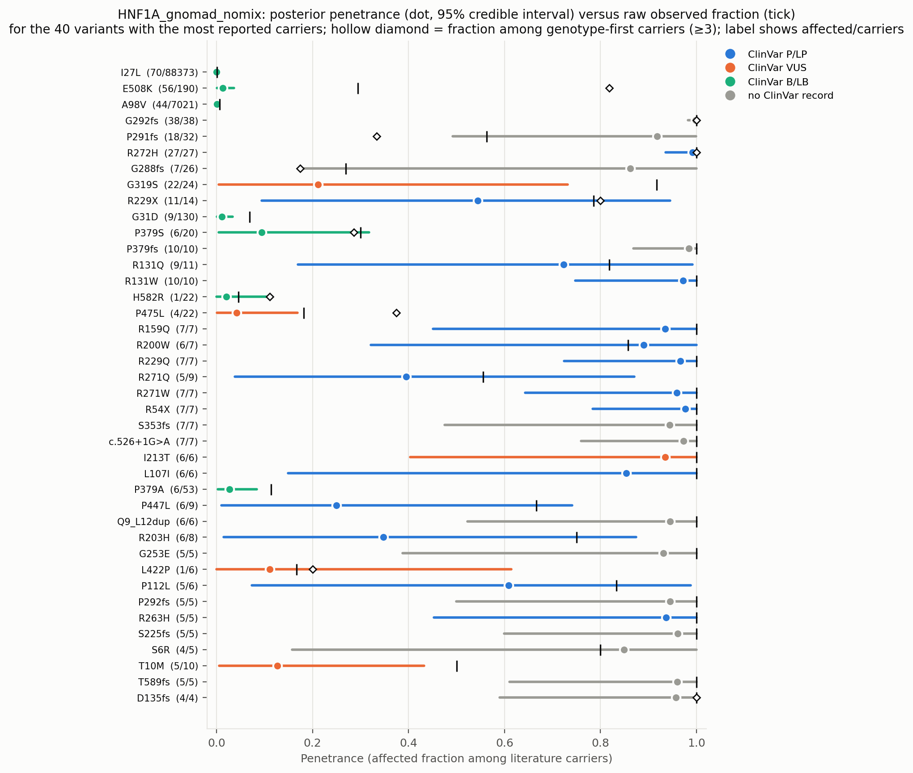
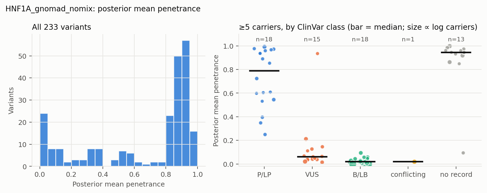
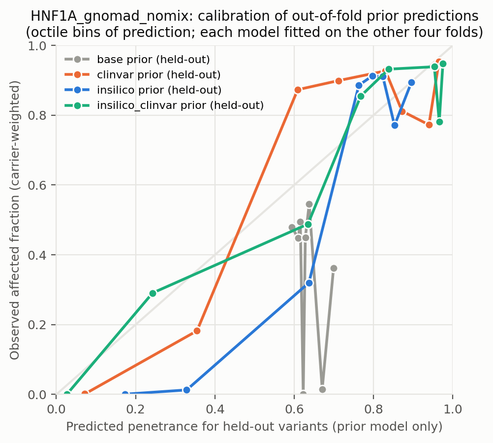
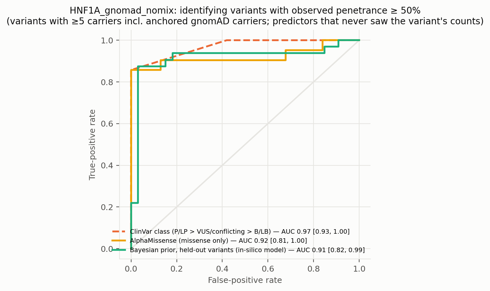
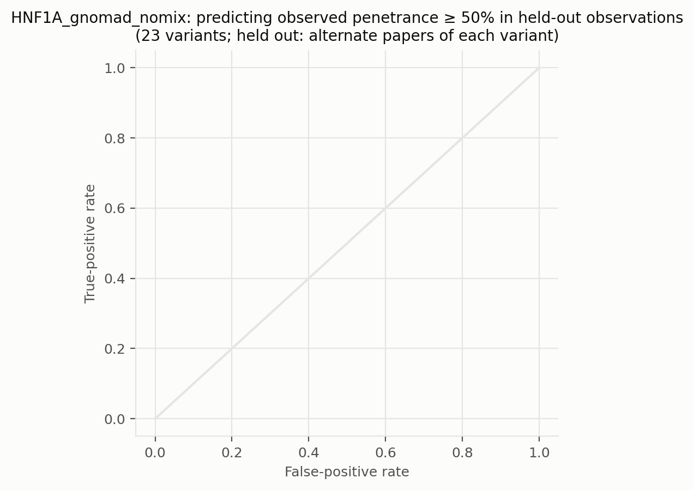
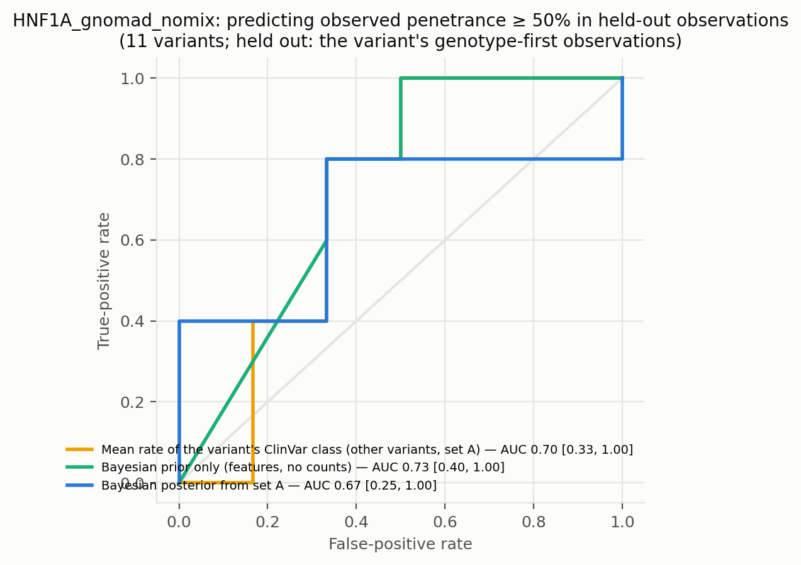
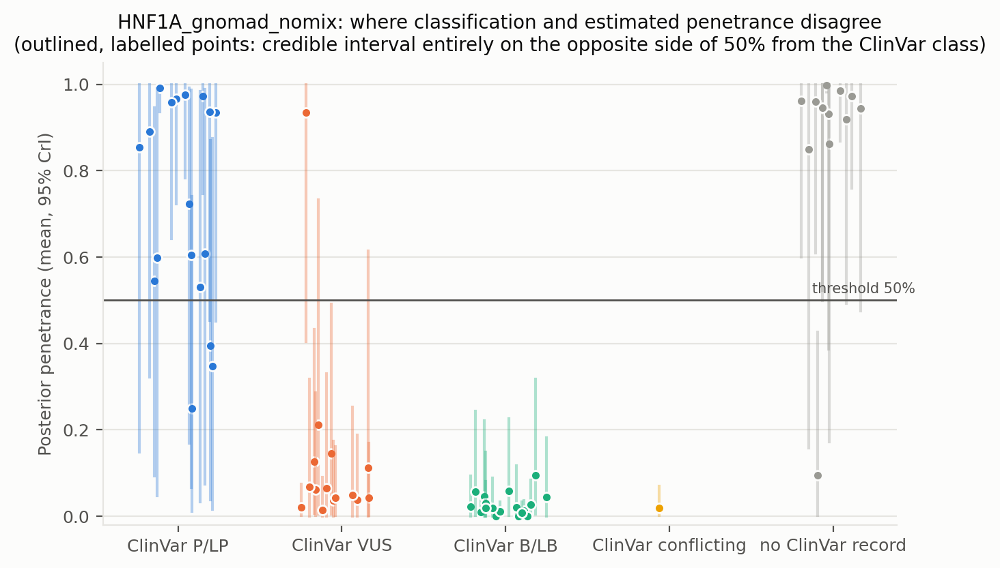
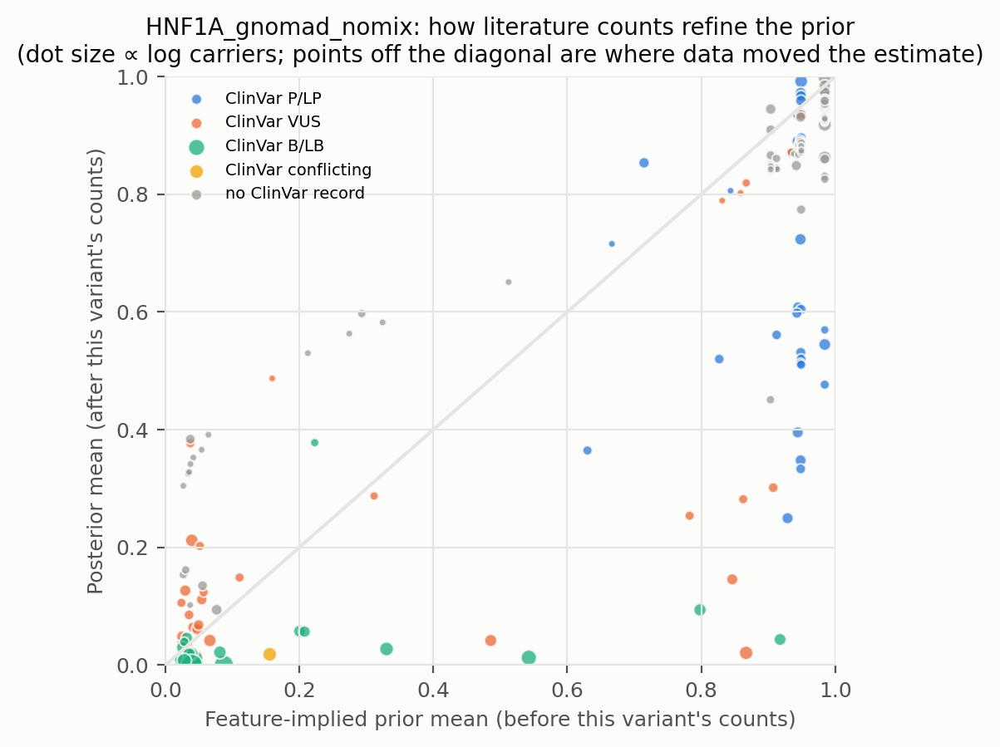
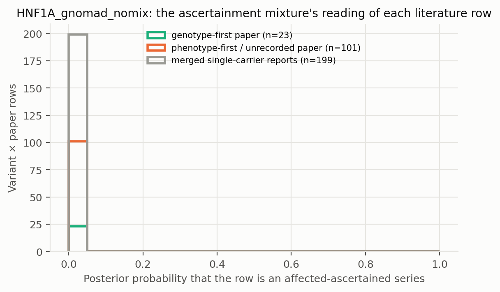

# HNF1A_gnomad_nomix: literature-derived penetrance with a Bayesian prior — automated report

Generated by `iterations/grant_e2e_20260909/scripts/make_report.py` from the frozen workflow (GeneVariantFetcher tag `grant-freeze-20260909`). All numbers below are produced by code from the run artifacts; none were edited by hand.

## Data

| Quantity | Value |
| --- | ---: |
| Papers in the extraction database | 1000 |
| Variant rows in the database | 7882 |
| Usable carrier observations (variant × paper) | 419 |
| Papers contributing usable observations | 173 |
| Count rows without a usable denominator (excluded) | 547 |
| Quarantined count rows excluded by the trust gate | 113 |
| Distinct variants with carrier counts | 234 |
| Total literature carriers / affected | 877 / 762 |
| Variants with ≥5 carriers (evaluation set; carriers = literature + anchored gnomAD) | 65 |
| Share of observations that are single affected probands | 0.69 |
| Missense variants with an AlphaMissense score | 144 / 152 |
| Variants with a ClinVar record | 119 / 234 |
| Feature transcript | ENST00000257555.11 |
| gnomAD carriers added as unaffected | 179610 (on) |

Denominator sources: explicit = 56, individual_records = 69, total_derived = 294. Study designs (paper level): case_series = 233, cohort_population = 80, case_report = 51, family_segregation = 15, case_control = 13, other = 11, unknown = 10, functional_invitro = 3, biobank = 1, cohort = 1, cross-sectional = 1.

Excluded count rows by shape: affected_only_no_denominator = 8, other_or_inconsistent = 16, total_only_no_phenotype_split = 495, unaffected_only = 28. Largest sources of total-only rows (carrier totals with no affected/unaffected split): PMID 36257325 (218 rows, 564 carriers, design unrecorded); PMID 36504295 (40 rows, 52 carriers, design unrecorded); PMID 37798422 (14 rows, 28 carriers, design cohort_population).

ClinVar classes among variants with counts: B/LB = 21, Conflicting = 1, P/LP = 59, VUS = 38, none = 115.

## Model

Hierarchical logistic-binomial on variant × paper rows (389 rows, 233 variants) with a between-variant effect and a between-study effect (no ascertainment mixture). Primary model `insilico`.

| Model | Features | σ (between-variant SD, logit) | τ (between-study SD, logit) | π ascertained: phenotype-first / genotype-first rows (typical frequency) | g2 (per SD of log10 AF) | max R̂ | min ESS | divergences |
| --- | --- | ---: | ---: | ---: | ---: | ---: | ---: | ---: |
| base | — | 4.73 | 4.59 | — | — | 1.000 | 1576 | 0 |
| class | trunc | 4.16 | 4.56 | — | — | 1.000 | 1443 | 0 |
| clinvar | trunc, clinvar_plp, clinvar_blb, clinvar_none | 2.39 | 4.41 | — | — | 1.000 | 1622 | 0 |
| insilico | trunc, am, am_missing | 3.11 | 4.46 | — | — | 1.000 | 1795 | 0 |
| insilico_clinvar | trunc, am, am_missing, clinvar_plp, clinvar_blb, clinvar_none | 2.17 | 4.42 | — | — | 1.000 | 1572 | 0 |

Primary-model coefficients (posterior mean [94% HDI]): `alpha` 0.57 [-0.29, 1.41]; `sigma` 3.11 [2.49, 3.79]; `beta[trunc]` 3.78 [2.53, 5.09]; `beta[am]` 2.83 [2.15, 3.52]; `beta[am_missing]` 1.99 [0.36, 3.68]; `tau` 4.46 [3.98, 4.97].

## Held-out predictive performance (5-fold by variant)

| Prior model | NLL / carrier ↓ | Brier / carrier ↓ | log pred. density / row ↑ | calibration slope (1 = ideal) |
| --- | ---: | ---: | ---: | ---: |
| base | 0.9783 | 0.3891 | -0.928 | -41.38 |
| class | 0.7967 | 0.3012 | -0.908 | 7.94 |
| insilico | 0.2021 | 0.0344 | -0.878 | 3.52 |
| clinvar | 0.0786 | 0.0065 | -0.893 | 3.13 |
| insilico_clinvar | 0.0320 | 0.0022 | -0.874 | 2.27 |

Scored on held-out variant × paper rows (each fold's model never saw the held-out variants; predictions integrate both the variant and the study effect).

Paired bootstrap change in NLL per carrier versus the `base` prior (negative = better): `class` -0.1816 [-0.2183, -0.0821]; `insilico` -0.7762 [-0.7836, -0.2316]; `clinvar` -0.8997 [-0.9170, -0.3060]; `insilico_clinvar` -0.9463 [-0.9659, -0.2523].

Paired bootstrap change in NLL per carrier versus the `clinvar` prior (negative = better): `base` +0.8997 [+0.3481, +0.9251]; `class` +0.7181 [+0.2606, +0.7586]; `insilico` +0.1235 [+0.0589, +0.2658]; `insilico_clinvar` -0.0466 [-0.0503, -0.0019].

## Classification performance: identifying variants with observed penetrance ≥ 50%

Evaluation set: variants with ≥5 carriers — literature carriers plus the anchored gnomAD carriers, which also enter the observed fraction that defines the label. Label: observed fraction ≥ 50%. AUC with 95% bootstrap interval.

| Scorer | variants | high-penetrance variants | AUC | 95% CI |
| --- | ---: | ---: | ---: | --- |
| clinvar_ordinal | 52 | 21 | 0.970 | [0.932, 1.000] |
| clinvar_plp_binary | 52 | 21 | 0.929 | [0.842, 1.000] |
| alphamissense_missense_only | 52 | 21 | 0.922 | [0.809, 1.000] |
| insilico_posterior_mean_in_sample_LEAKY | 65 | 32 | 0.987 | [0.954, 1.000] |
| base_oof_prior | 65 | 32 | 0.384 | [0.249, 0.535] |
| class_oof_prior | 65 | 32 | 0.598 | [0.450, 0.732] |
| insilico_oof_prior | 65 | 32 | 0.915 | [0.815, 0.992] |
| clinvar_oof_prior | 65 | 32 | 0.920 | [0.832, 0.982] |
| insilico_clinvar_oof_prior | 65 | 32 | 0.939 | [0.868, 0.994] |

**Literature-only labels.** The table above defines high penetrance over literature carriers plus the anchored gnomAD carriers, so its labels partly encode the anchor assumption. The same scorers against the literature fraction alone (≥5 literature carriers; the 3 common alleles with AF > 0.001 excluded because their literature fraction is known to be ascertainment) — an ascertainment-inflated but anchor-free label:

| Scorer | variants | high-penetrance variants | AUC | 95% CI |
| --- | ---: | ---: | ---: | --- |
| clinvar_ordinal | 25 | 22 | 0.803 | [0.604, 0.938] |
| clinvar_plp_binary | 25 | 22 | 0.841 | [0.738, 0.932] |
| alphamissense_missense_only | 25 | 22 | 0.894 | [0.738, 1.000] |
| insilico_posterior_mean_in_sample_LEAKY | 37 | 33 | 0.826 | [0.607, 0.972] |
| base_oof_prior | 37 | 33 | 0.652 | [0.280, 0.926] |
| class_oof_prior | 37 | 33 | 0.712 | [0.333, 1.000] |
| insilico_oof_prior | 37 | 33 | 0.750 | [0.257, 1.000] |
| clinvar_oof_prior | 37 | 33 | 0.697 | [0.310, 0.971] |
| insilico_clinvar_oof_prior | 37 | 33 | 0.750 | [0.283, 0.986] |

The `_LEAKY` row uses the posterior that already contains the variant's own counts, which also define the label; it is shown only to make the leakage explicit and is not a validation.

Binary rule 'ClinVar P/LP ⇒ high penetrance': sensitivity 0.86, specificity 1.00, PPV 1.00, NPV 0.91 (TP 18, FP 0, FN 3, TN 31).

Other thresholds: ≥25%: clinvar_ordinal 0.90, insilico_oof_prior 0.91; ≥75%: clinvar_ordinal 0.94, insilico_oof_prior 0.91.

## Held-out observations of known variants: penetrance estimate versus classification

**Alternate-paper hold-out.** For each variant reported in ≥2 papers, papers are split alternately by PMID; set A updates the prior, set B is scored (23 variants, 252 held-out carriers). Because B still contains phenotype-first reports, the prediction for B is the mixture prediction (ascertained series with probability π, informative otherwise).

The ClinVar comparator predicts each variant with the observed A-rate of its ClinVar class among the *other* variants; the pooled rate is the A-rate over all variants.

| Predictor for held-out observations | NLL / carrier ↓ | Brier / carrier ↓ |
| --- | ---: | ---: |
| posterior_from_half_A | 1.3854 | 0.3193 |
| prior_only | 0.6710 | 0.1256 |
| pooled_rate_half_A | 5.3105 | 0.7167 |
| clinvar_class_rate_half_A | 3.5385 | 0.4298 |

Paired bootstrap change in NLL per held-out carrier, posterior-from-A minus ClinVar-class rate: -2.1531 [-3.3601, -0.7361] (negative favours the count-informed estimate).

Paired bootstrap change in NLL per held-out carrier, posterior-from-A minus pooled rate: -3.9251 [-5.4429, -3.0298] (negative favours the count-informed estimate).

Paired bootstrap change in NLL per held-out carrier, posterior-from-A minus features-only prior: +0.7145 [+0.0564, +1.0302] (negative favours the count-informed estimate).

**Genotype-first hold-out.** Set B = the variant's observations from papers whose ascertainment the extractor recorded as population screening or cascade testing; set A = its phenotype-first observations (case reports, referral series) plus any gnomAD anchor. A updates the feature prior into a variant posterior (exact grid update; the mixture likelihood per row, study effects integrated, τ/π/p_asc at posterior means); B is scored (11 variants, 160 held-out genotype-first carriers). This is the clinical question: does case-based literature plus features predict the penetrance seen when carriers are found by genotype?

The ClinVar comparator predicts each variant with the observed A-rate of its ClinVar class among the *other* variants; the pooled rate is the A-rate over all variants.

| Predictor for held-out observations | NLL / carrier ↓ | Brier / carrier ↓ |
| --- | ---: | ---: |
| posterior_from_half_A | 1.1439 | 0.2794 |
| prior_only | 0.7348 | 0.1234 |
| pooled_rate_half_A | 0.8183 | 0.1662 |
| clinvar_class_rate_half_A | 1.4387 | 0.3162 |

Paired bootstrap change in NLL per held-out carrier, posterior-from-A minus ClinVar-class rate: -0.2948 [-0.9176, +0.0788] (negative favours the count-informed estimate).

Paired bootstrap change in NLL per held-out carrier, posterior-from-A minus pooled rate: +0.3256 [-0.3567, +0.5660] (negative favours the count-informed estimate).

Paired bootstrap change in NLL per held-out carrier, posterior-from-A minus features-only prior: +0.4091 [-0.0648, +0.7163] (negative favours the count-informed estimate).

| Scorer (label: observed ≥ 50% in set B) | variants | AUC | 95% CI |
| --- | ---: | ---: | --- |
| posterior_from_half_A | 11 | 0.667 | [0.250, 1.000] |
| prior_only | 11 | 0.733 | [0.400, 1.000] |
| pooled_rate_half_A | 11 | 0.500 | [0.500, 0.500] |
| clinvar_class_rate_half_A | 11 | 0.700 | [0.333, 1.000] |
| clinvar_ordinal | 11 | 0.700 | [0.357, 1.000] |

Largest genotype-first hold-outs (affected / carriers in B; predictions from A):

| Variant | ClinVar | A: affected / carriers | B (genotype-first): affected / carriers | observed B | posterior from A | features-only prior | ClinVar-class rate |
| --- | --- | ---: | ---: | ---: | ---: | ---: | ---: |
| E508K | B/LB | 2 / 124 | 54 / 66 | 0.82 | 0.14 | 0.51 | 0.17 |
| G288fs | none | 3 / 3 | 4 / 23 | 0.17 | 0.81 | 0.76 | 0.94 |
| P291fs | none | 12 / 14 | 6 / 18 | 0.33 | 0.81 | 0.76 | 0.98 |
| G292fs | none | 27 / 27 | 11 / 11 | 1.00 | 0.90 | 0.76 | 0.87 |
| H582R | B/LB | 0 / 13 | 1 / 9 | 0.11 | 0.15 | 0.28 | 0.05 |
| P475L | VUS | 1 / 14 | 3 / 8 | 0.38 | 0.20 | 0.32 | 0.25 |
| P379S | B/LB | 4 / 13 | 2 / 7 | 0.29 | 0.28 | 0.59 | 0.02 |
| R272H | P/LP | 22 / 22 | 5 / 5 | 1.00 | 0.88 | 0.69 | 0.75 |
| R229X | P/LP | 7 / 9 | 4 / 5 | 0.80 | 0.48 | 0.76 | 0.98 |
| L422P | VUS | 0 / 1 | 1 / 5 | 0.20 | 0.24 | 0.31 | 0.10 |

## Common variants: the known-outcome check

Variants with gnomAD allele frequency above 0.001 are common alleles whose outcome is known independently of the literature: at most a GWAS-scale risk, no Mendelian penetrance. They stay in the model as a check. In case-series literature they look penetrant (median literature fraction 0.94; 100% of them are ≥ 50% affected among reported carriers); the model's estimate for them should be near the population risk: median posterior 0.000, 100% with the 97.5% bound below 10%.

| Variant | ClinVar | gnomAD AF | gnomAD carriers added | affected / literature carriers | literature fraction | posterior mean [97.5%] |
| --- | --- | ---: | ---: | ---: | ---: | --- |
| I27L | B/LB | 3.55e-01 | 88280 | 70 / 93 | 0.75 | 0.000 [0.000] |
| S487N | B/LB | 3.37e-01 | 83546 | 1 / 1 | 1.00 | 0.000 [0.000] |
| A98V | B/LB | 2.90e-02 | 6974 | 44 / 47 | 0.94 | 0.000 [0.001] |

## Examples where the classification is wrong about penetrance

No variant with ≥5 literature carriers has a 95% credible interval entirely on the opposite side of 50% from its ClinVar class.

## Figures

**Figure — Posterior penetrance (dot, 95% credible interval) versus the raw observed fraction (tick) for the best-observed variants, coloured by ClinVar class.**

**Figure — Distribution of posterior mean penetrance across all variants, and by ClinVar class for variants with enough carriers.**

**Figure — Calibration of held-out prior predictions (each model predicts variants it never saw).**

**Figure — ROC curves for identifying observed high-penetrance variants: ClinVar class alone, AlphaMissense alone, the held-out Bayesian prior, and the posterior that includes the variant's own counts.**

**Figure — Alternate-paper hold-out: the posterior built from half of each variant's papers predicts the observed penetrance in the other half; compared with ClinVar class and a features-only prior.**

**Figure — Genotype-first hold-out: the posterior built from a variant's phenotype-first reports predicts the penetrance observed in its genotype-first (screening / cascade) observations.**

**Figure — Where classification and estimated penetrance disagree; outlined, labelled points are the discordant variants listed above.**

**Figure — Prior mean versus posterior mean: how the literature counts refine the feature-implied prior.**

**Figure — How the mixture reads the literature: posterior probability that each variant × paper row is a pure affected series, by the paper's recorded ascertainment.**

## Limitations that travel with these numbers

- Counts are pooled across papers; cohort overlap between publications cannot be resolved from the extraction, so denominators may double count.
- Probands are included; ascertainment inflates penetrance, most strongly for variants known only from single case reports (see the single-proband share above).
- 'Affected' follows each paper's own phenotype definition for the gene–disease pair; ages are not modelled.
- ClinVar classes are as of the variantFeatures snapshot; frameshift/splice alleles often lack a warehouse record and appear as 'no ClinVar record'.
- Held-out metrics score the prior model; posterior values include the variant's own counts and are the estimate a user would see, not a validation.

- In the anchored arms the frozen evaluation set and the 'observed ≥ threshold' label include the gnomAD carriers assumed unaffected; the literature-only table, the genotype-first hold-out and the common-variant check are the anchor-independent views.

## Artifacts

`observations.csv`, `variants.csv`, `variants_features.csv`, `fit/posterior_variants.csv`, `fit/oof_predictions.csv`, `fit/metrics.csv`, `fit/classification_metrics.csv`, `fit/discordant_variants.csv`, `fit/coefficients.csv`, `fit/model_diagnostics.csv`, `fit/fit_summary.json` in the analysis directory.
