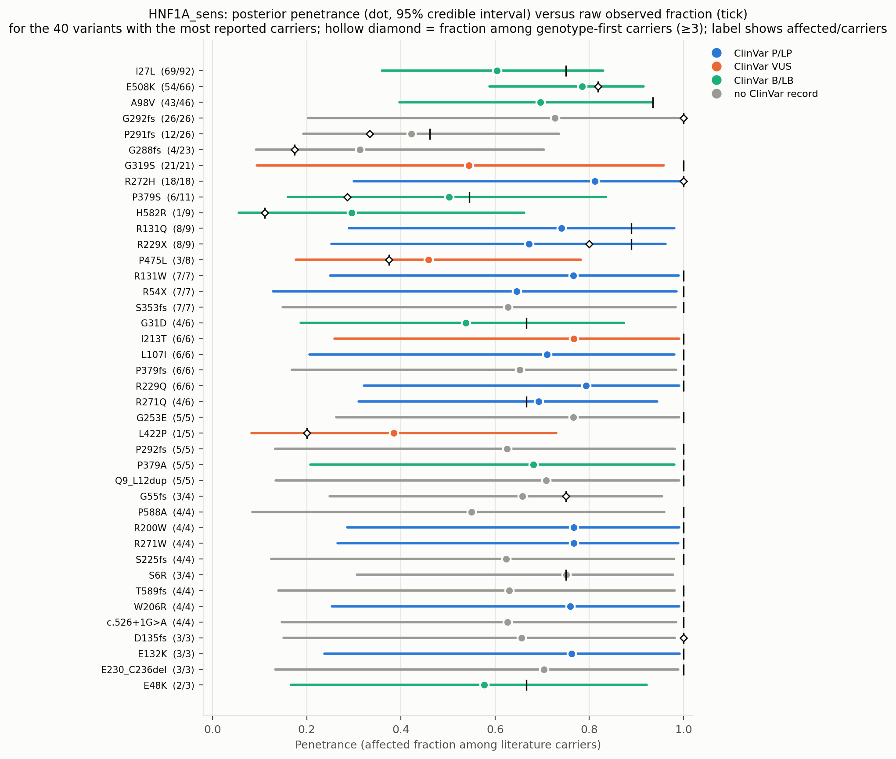
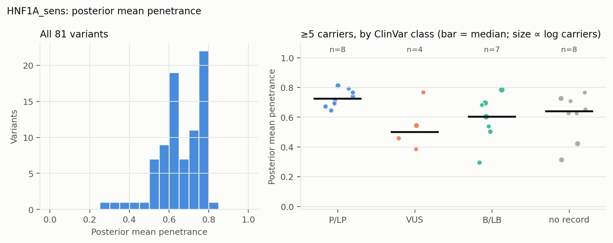
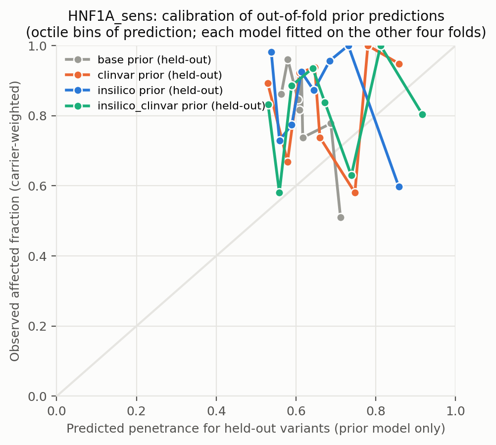
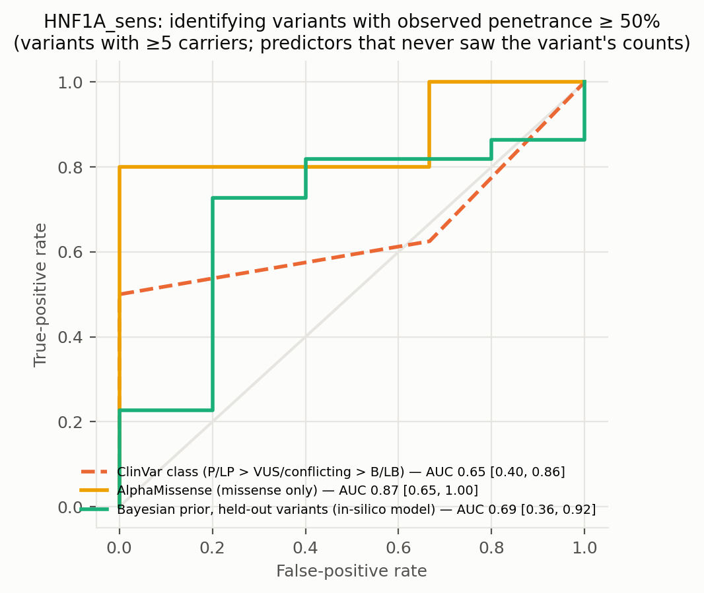
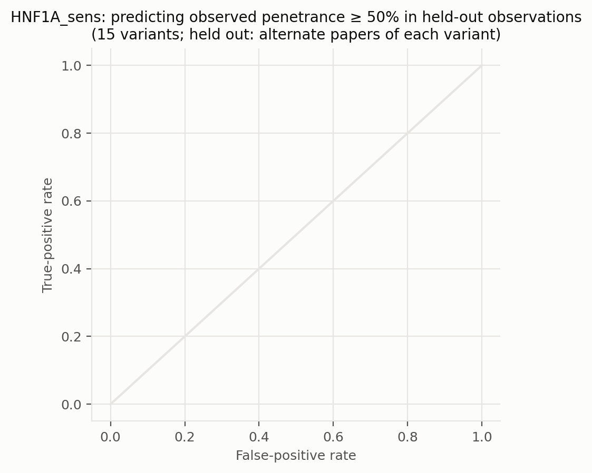
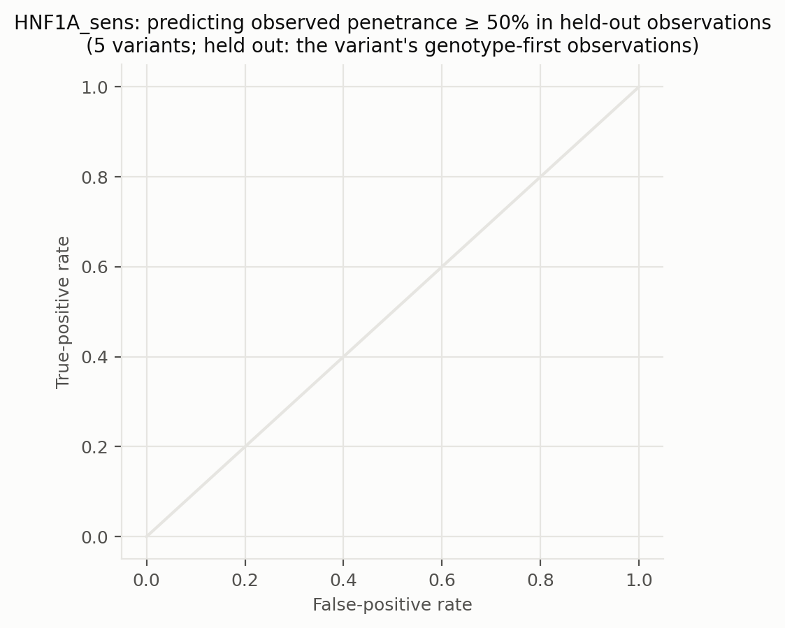
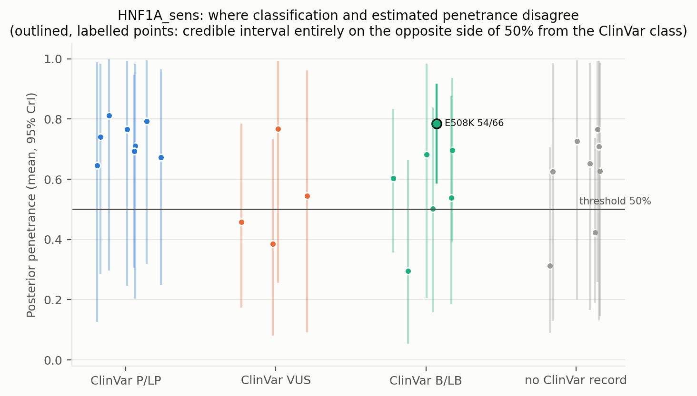
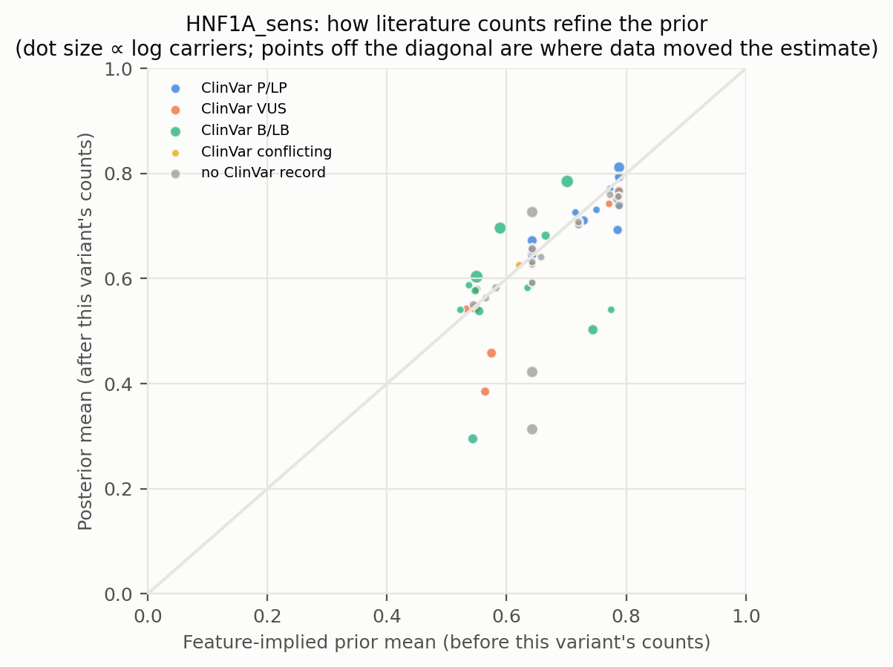
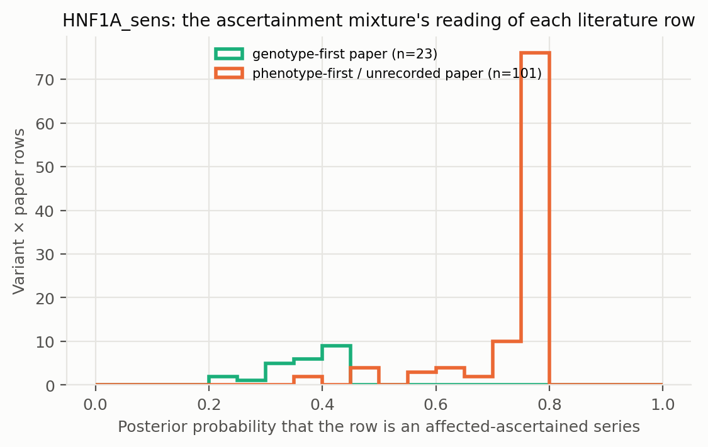

# HNF1A_sens: literature-derived penetrance with a Bayesian prior — automated report

Generated by `iterations/grant_e2e_20260909/scripts/make_report.py` from the frozen workflow (GeneVariantFetcher tag `grant-freeze-20260909`). All numbers below are produced by code from the run artifacts; none were edited by hand.

## Data

| Quantity | Value |
| --- | ---: |
| Papers in the extraction database | 1000 |
| Variant rows in the database | 7882 |
| Usable carrier observations (variant × paper) | 124 |
| Papers contributing usable observations | 76 |
| Count rows without a usable denominator (excluded) | 547 |
| Quarantined count rows excluded by the trust gate | 113 |
| Distinct variants with carrier counts | 81 |
| Total literature carriers / affected | 582 / 472 |
| Variants with ≥5 carriers (evaluation set; carriers = literature) | 27 |
| Share of observations that are single affected probands | 0.00 |
| Missense variants with an AlphaMissense score | 51 / 52 |
| Variants with a ClinVar record | 46 / 81 |
| Feature transcript | ENST00000257555.11 |
| gnomAD carriers added as unaffected | 0 (off) |

Denominator sources: explicit = 25, individual_records = 19, total_derived = 80. Study designs (paper level): case_series = 64, cohort_population = 24, family_segregation = 14, case_report = 13, case_control = 5, unknown = 2, cross-sectional = 1, functional_invitro = 1.

Excluded count rows by shape: affected_only_no_denominator = 8, other_or_inconsistent = 16, total_only_no_phenotype_split = 495, unaffected_only = 28. Largest sources of total-only rows (carrier totals with no affected/unaffected split): PMID 36257325 (218 rows, 564 carriers, design unrecorded); PMID 36504295 (40 rows, 52 carriers, design unrecorded); PMID 37798422 (14 rows, 28 carriers, design cohort_population).

ClinVar classes among variants with counts: B/LB = 13, Conflicting = 1, P/LP = 25, VUS = 7, none = 35.

## Model

Hierarchical logistic-binomial on variant × paper rows (124 rows after merging single-carrier reports per variant, 81 variants). Each row is either an **affected-ascertained series** (probability π, success probability p_asc ≈ 1) or an **informative observation** of the variant's penetrance: `y_r ~ π·Binomial(n_r, p_asc) + (1−π)·Binomial(n_r, p_r)`, `logit(p_r) = α + x_v·β + σ·z_v + τ·e_r`, with a between-variant effect `z_v` and a between-study effect `e_r`; `logit(π_r) = g0 + g1·[genotype-first ascertainment recorded for the paper] + g2·[standardized log10 gnomAD allele frequency of the variant]` (case series of common alleles are ascertainment). gnomAD anchor rows are informative by construction and carry no study effect. Fitted by NUTS (PyMC, 4 chains). The posterior of `p_v = sigmoid(α + x_v·β + σ·z_v)` is the penetrance estimate among carriers not selected for being affected: variants with many informative carriers are driven by their own counts; variants known only from case reports are shrunk toward the feature-implied prior and carry wide intervals. Fixed-effect sets: `base` (intercept only), `class` (truncating), `insilico` (class + AlphaMissense), `clinvar` (class + ClinVar P/LP, B/LB, no-record), `insilico_clinvar`. The primary model is `insilico`.

| Model | Features | σ (between-variant SD, logit) | τ (between-study SD, logit) | π ascertained: phenotype-first / genotype-first rows (typical frequency) | g2 (per SD of log10 AF) | max R̂ | min ESS | divergences |
| --- | --- | ---: | ---: | ---: | ---: | ---: | ---: | ---: |
| base | — | 1.03 | 0.45 | 0.79 / 0.44 | -0.49 | 1.010 | 685 | 0 |
| class | trunc | 1.03 | 0.44 | 0.80 / 0.45 | -0.50 | 1.000 | 421 | 1 |
| clinvar | trunc, clinvar_plp, clinvar_blb, clinvar_none | 1.09 | 0.45 | 0.72 / 0.36 | -0.35 | 1.000 | 439 | 0 |
| insilico | trunc, am, am_missing | 1.08 | 0.43 | 0.76 / 0.39 | -0.38 | 1.000 | 557 | 0 |
| insilico_clinvar | trunc, am, am_missing, clinvar_plp, clinvar_blb, clinvar_none | 1.16 | 0.43 | 0.71 / 0.35 | -0.30 | 1.010 | 736 | 0 |

Primary-model coefficients (posterior mean [94% HDI]): `alpha` 0.99 [-0.06, 2.00]; `sigma` 1.08 [0.22, 1.93]; `beta[trunc]` -0.31 [-1.57, 0.98]; `beta[am]` 0.54 [-0.20, 1.34]; `beta[am_missing]` 0.20 [-1.73, 2.07]; `tau` 0.43 [0.00, 1.01]; `g0` 1.21 [0.18, 2.25]; `g1` -1.69 [-2.90, -0.55]; `g2` -0.38 [-0.88, 0.10]; `p_asc` 0.99 [0.97, 1.00].

## Held-out predictive performance (5-fold by variant)

| Prior model | NLL / carrier ↓ | Brier / carrier ↓ | log pred. density / row ↑ | calibration slope (1 = ideal) |
| --- | ---: | ---: | ---: | ---: |
| base | 0.4684 | 0.0681 | -0.750 | 0.73 |
| class | 0.4663 | 0.0673 | -0.751 | 0.79 |
| insilico | 0.4727 | 0.0681 | -0.775 | 0.63 |
| clinvar | 0.4692 | 0.0688 | -0.750 | 0.67 |
| insilico_clinvar | 0.4740 | 0.0696 | -0.773 | 0.59 |

Scored on held-out variant × paper rows (each fold's model never saw the held-out variants; predictions integrate both the variant and the study effect).

Paired bootstrap change in NLL per carrier versus the `base` prior (negative = better): `class` -0.0021 [-0.0080, +0.0033]; `insilico` +0.0043 [-0.0106, +0.0228]; `clinvar` +0.0008 [-0.0127, +0.0119]; `insilico_clinvar` +0.0056 [-0.0135, +0.0243].

Paired bootstrap change in NLL per carrier versus the `clinvar` prior (negative = better): `base` -0.0008 [-0.0121, +0.0125]; `class` -0.0028 [-0.0130, +0.0099]; `insilico` +0.0035 [-0.0170, +0.0288]; `insilico_clinvar` +0.0048 [-0.0130, +0.0252].

## Classification performance: identifying variants with observed penetrance ≥ 50%

Evaluation set: variants with ≥5 carriers (literature carriers). Label: observed fraction ≥ 50%. AUC with 95% bootstrap interval.

| Scorer | variants | high-penetrance variants | AUC | 95% CI |
| --- | ---: | ---: | ---: | --- |
| clinvar_ordinal | 19 | 16 | 0.646 | [0.397, 0.858] |
| clinvar_plp_binary | 19 | 16 | 0.750 | [0.625, 0.875] |
| alphamissense_missense_only | 18 | 15 | 0.867 | [0.649, 1.000] |
| insilico_posterior_mean_in_sample_LEAKY | 27 | 22 | 1.000 | [1.000, 1.000] |
| base_oof_prior | 27 | 22 | 0.409 | [0.071, 0.804] |
| class_oof_prior | 27 | 22 | 0.418 | [0.139, 0.718] |
| insilico_oof_prior | 27 | 22 | 0.691 | [0.361, 0.922] |
| clinvar_oof_prior | 27 | 22 | 0.500 | [0.208, 0.778] |
| insilico_clinvar_oof_prior | 27 | 22 | 0.618 | [0.373, 0.836] |

The `_LEAKY` row uses the posterior that already contains the variant's own counts, which also define the label; it is shown only to make the leakage explicit and is not a validation.

Binary rule 'ClinVar P/LP ⇒ high penetrance': sensitivity 0.50, specificity 1.00, PPV 1.00, NPV 0.27 (TP 8, FP 0, FN 8, TN 3).

Other thresholds: ≥25%: clinvar_ordinal 0.69, insilico_oof_prior 0.62; ≥75%: clinvar_ordinal 0.67, insilico_oof_prior 0.55.

## Held-out observations of known variants: penetrance estimate versus classification

**Alternate-paper hold-out.** For each variant reported in ≥2 papers, papers are split alternately by PMID; set A updates the prior, set B is scored (15 variants, 213 held-out carriers). Because B still contains phenotype-first reports, the prediction for B is the mixture prediction (ascertained series with probability π, informative otherwise).

The ClinVar comparator predicts each variant with the observed A-rate of its ClinVar class among the *other* variants; the pooled rate is the A-rate over all variants.

| Predictor for held-out observations | NLL / carrier ↓ | Brier / carrier ↓ |
| --- | ---: | ---: |
| posterior_from_half_A | 0.4492 | 0.0143 |
| prior_only | 0.4618 | 0.0181 |
| pooled_rate_half_A | 0.4840 | 0.0253 |
| clinvar_class_rate_half_A | 0.5099 | 0.0364 |

Paired bootstrap change in NLL per held-out carrier, posterior-from-A minus ClinVar-class rate: -0.0607 [-0.2207, +0.0000] (negative favours the count-informed estimate).

Paired bootstrap change in NLL per held-out carrier, posterior-from-A minus pooled rate: -0.0348 [-0.0788, +0.0149] (negative favours the count-informed estimate).

Paired bootstrap change in NLL per held-out carrier, posterior-from-A minus features-only prior: -0.0126 [-0.0351, +0.0035] (negative favours the count-informed estimate).

**Genotype-first hold-out.** Set B = the variant's observations from papers whose ascertainment the extractor recorded as population screening or cascade testing; set A = its phenotype-first observations (case reports, referral series) plus any gnomAD anchor. A updates the feature prior into a variant posterior (exact grid update; the mixture likelihood per row, study effects integrated, τ/π/p_asc at posterior means); B is scored (5 variants, 44 held-out genotype-first carriers). This is the clinical question: does case-based literature plus features predict the penetrance seen when carriers are found by genotype?

The ClinVar comparator predicts each variant with the observed A-rate of its ClinVar class among the *other* variants; the pooled rate is the A-rate over all variants.

| Predictor for held-out observations | NLL / carrier ↓ | Brier / carrier ↓ |
| --- | ---: | ---: |
| posterior_from_half_A | 0.6971 | 0.1115 |
| prior_only | 0.7629 | 0.1352 |
| pooled_rate_half_A | 1.2325 | 0.2268 |
| clinvar_class_rate_half_A | 1.4746 | 0.2565 |

Paired bootstrap change in NLL per held-out carrier, posterior-from-A minus ClinVar-class rate: -0.7775 [-1.2484, -0.0996] (negative favours the count-informed estimate).

Paired bootstrap change in NLL per held-out carrier, posterior-from-A minus pooled rate: -0.5354 [-0.8831, +0.0623] (negative favours the count-informed estimate).

Paired bootstrap change in NLL per held-out carrier, posterior-from-A minus features-only prior: -0.0659 [-0.1164, +0.0139] (negative favours the count-informed estimate).

Largest genotype-first hold-outs (affected / carriers in B; predictions from A):

| Variant | ClinVar | A: affected / carriers | B (genotype-first): affected / carriers | observed B | posterior from A | features-only prior | ClinVar-class rate |
| --- | --- | ---: | ---: | ---: | ---: | ---: | ---: |
| P291fs | none | 6 / 8 | 6 / 18 | 0.33 | 0.72 | 0.78 | 0.97 |
| G292fs | none | 17 / 17 | 9 / 9 | 1.00 | 0.83 | 0.78 | 0.72 |
| P379S | B/LB | 4 / 4 | 2 / 7 | 0.29 | 0.81 | 0.79 | 0.95 |
| R272H | P/LP | 13 / 13 | 5 / 5 | 1.00 | 0.88 | 0.85 | 0.90 |
| R229X | P/LP | 4 / 4 | 4 / 5 | 0.80 | 0.76 | 0.75 | 0.96 |

## Common variants: the known-outcome check

Variants with gnomAD allele frequency above 0.001 are common alleles whose outcome is known independently of the literature: at most a GWAS-scale risk, no Mendelian penetrance. They stay in the model as a check. In case-series literature they look penetrant (median literature fraction 0.84; 100% of them are ≥ 50% affected among reported carriers); the model's estimate for them should be near the population risk: median posterior 0.650, 0% with the 97.5% bound below 10%.

| Variant | ClinVar | gnomAD AF | gnomAD carriers added | affected / literature carriers | literature fraction | posterior mean [97.5%] |
| --- | --- | ---: | ---: | ---: | ---: | --- |
| I27L | B/LB | 3.55e-01 | 0 | 69 / 92 | 0.75 | 0.603 [0.829] |
| A98V | B/LB | 2.90e-02 | 0 | 43 / 46 | 0.93 | 0.696 [0.933] |

## Examples where the classification is wrong about penetrance

Variants with ≥5 literature carriers whose 95% credible interval lies entirely on the other side of 50% from what the ClinVar class implies. `literature affected / carriers` are the extracted counts; `genotype-first` are the affected / carriers in screening or cascade rows, the evidence least affected by ascertainment. PMIDs are the source papers.

| Variant | Class | ClinVar | literature affected / carriers | literature fraction | genotype-first affected / carriers | posterior mean [95% CrI] | prior mean | papers | PMIDs |
| --- | --- | --- | ---: | ---: | ---: | --- | ---: | ---: | --- |
| E508K | missense | B/LB | 54 / 66 | 0.82 | 54 / 66 | 0.78 [0.59, 0.91] | 0.70 | 2 | 20705777, 24915262 |

Counts: 0 P/LP variants estimated below 50%; 1 non-P/LP variants estimated above 50% (≥5 literature carriers).

Evidence rows behind the first discordant variants (per paper; `ascertained` = posterior probability that the row is an affected-only series):

| Variant | PMID | affected / carriers | ascertainment recorded | ascertained |
| --- | --- | ---: | --- | ---: |
| E508K | 24915262 | 52 / 64 | population_screening | 0.25 |
| E508K | 20705777 | 2 / 2 | family_cascade | 0.25 |

## Figures

**Figure — Posterior penetrance (dot, 95% credible interval) versus the raw observed fraction (tick) for the best-observed variants, coloured by ClinVar class.**

**Figure — Distribution of posterior mean penetrance across all variants, and by ClinVar class for variants with enough carriers.**

**Figure — Calibration of held-out prior predictions (each model predicts variants it never saw).**

**Figure — ROC curves for identifying observed high-penetrance variants: ClinVar class alone, AlphaMissense alone, the held-out Bayesian prior, and the posterior that includes the variant's own counts.**

**Figure — Alternate-paper hold-out: the posterior built from half of each variant's papers predicts the observed penetrance in the other half; compared with ClinVar class and a features-only prior.**

**Figure — Genotype-first hold-out: the posterior built from a variant's phenotype-first reports predicts the penetrance observed in its genotype-first (screening / cascade) observations.**

**Figure — Where classification and estimated penetrance disagree; outlined, labelled points are the discordant variants listed above.**

**Figure — Prior mean versus posterior mean: how the literature counts refine the feature-implied prior.**

**Figure — How the mixture reads the literature: posterior probability that each variant × paper row is a pure affected series, by the paper's recorded ascertainment.**

## Limitations that travel with these numbers

- Counts are pooled across papers; cohort overlap between publications cannot be resolved from the extraction, so denominators may double count.
- Probands are included; ascertainment inflates penetrance, most strongly for variants known only from single case reports (see the single-proband share above).
- 'Affected' follows each paper's own phenotype definition for the gene–disease pair; ages are not modelled.
- ClinVar classes are as of the variantFeatures snapshot; frameshift/splice alleles often lack a warehouse record and appear as 'no ClinVar record'.
- Held-out metrics score the prior model; posterior values include the variant's own counts and are the estimate a user would see, not a validation.

## Artifacts

`observations.csv`, `variants.csv`, `variants_features.csv`, `fit/posterior_variants.csv`, `fit/oof_predictions.csv`, `fit/metrics.csv`, `fit/classification_metrics.csv`, `fit/discordant_variants.csv`, `fit/coefficients.csv`, `fit/model_diagnostics.csv`, `fit/fit_summary.json` in the analysis directory.
