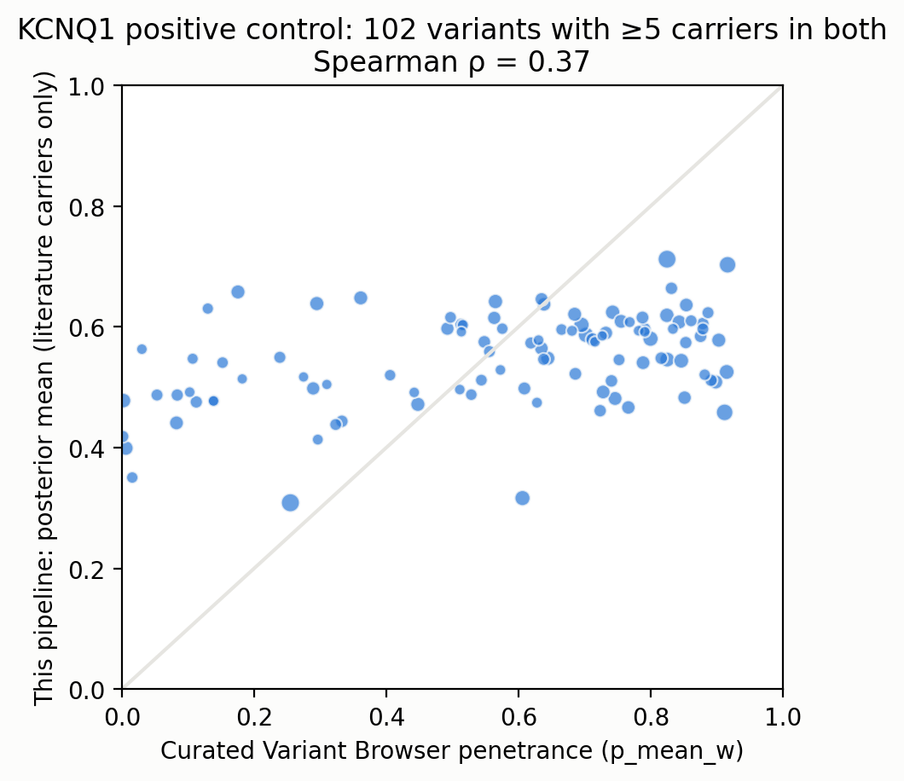

# KCNQ1 positive control

- variants_in_pipeline: 691
- matched_to_reference: 402
- matched_with_ge5_carriers_both: 102
- spearman_posterior_vs_reference_p_mean_w: 0.3740719588806396
- pearson_posterior_vs_reference_p_mean_w: 0.43765103487309803
- spearman_observed_vs_reference_observed: 0.34868554415110403
- median_abs_diff_posterior_vs_reference: 0.20608828997811496
- pipeline_carriers_matched: 8340
- reference_literature_carriers_matched: 2492

