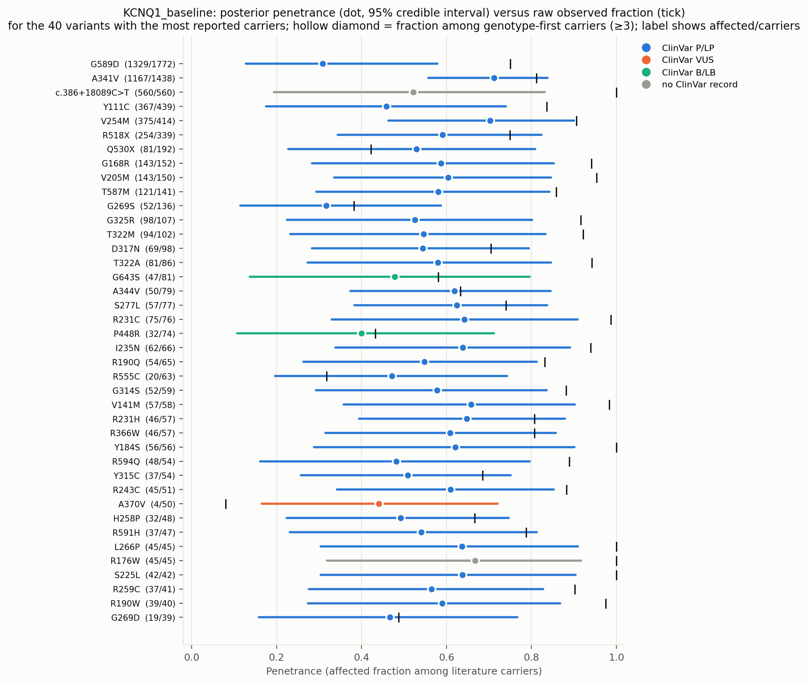
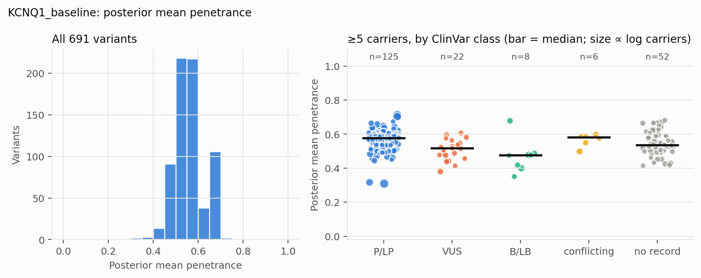
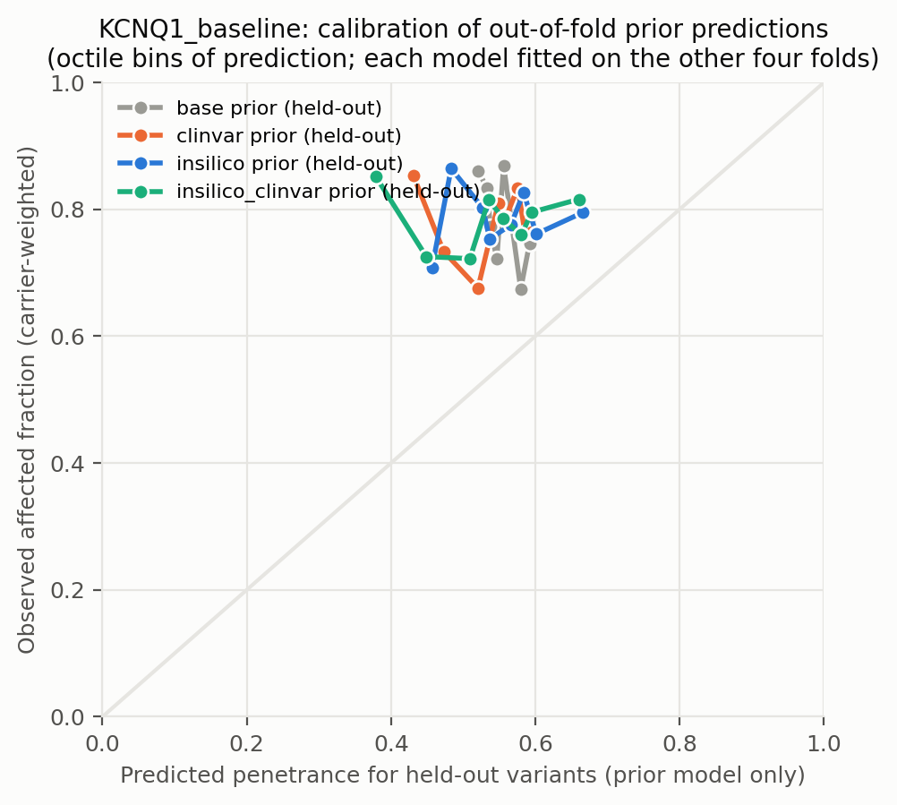
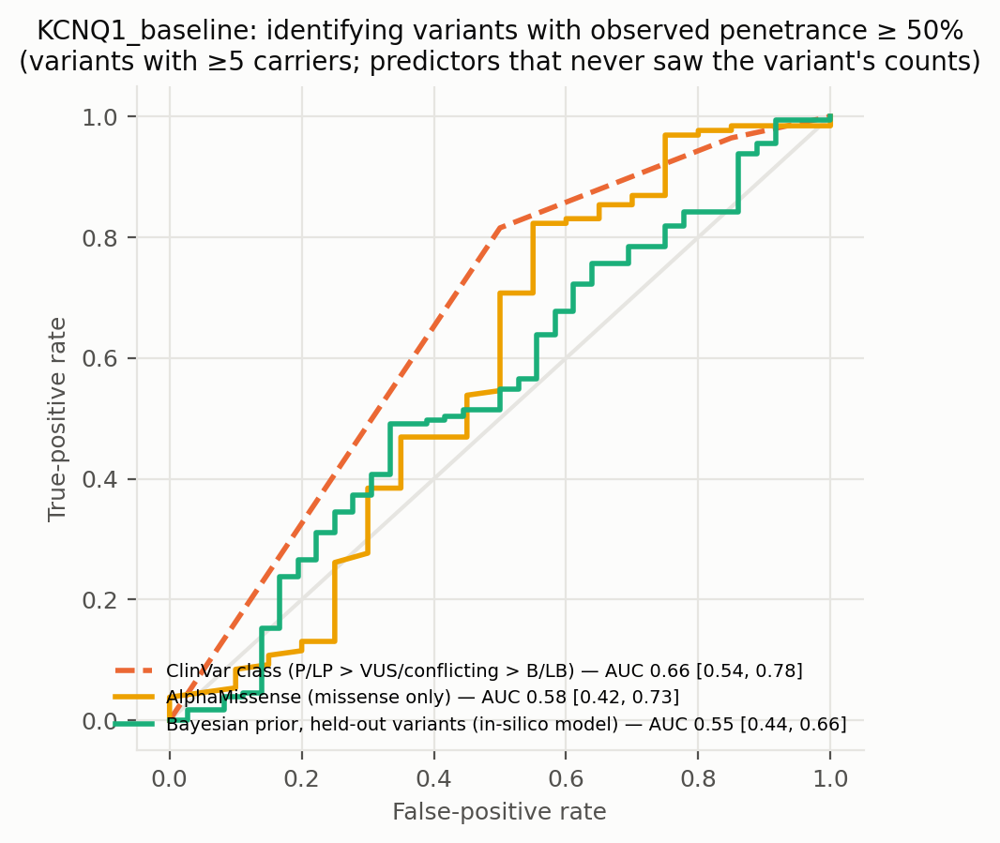
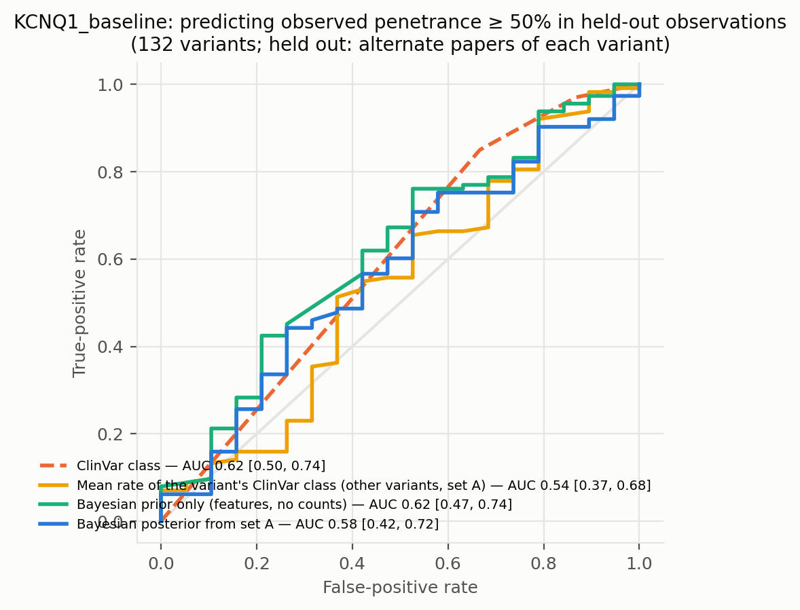
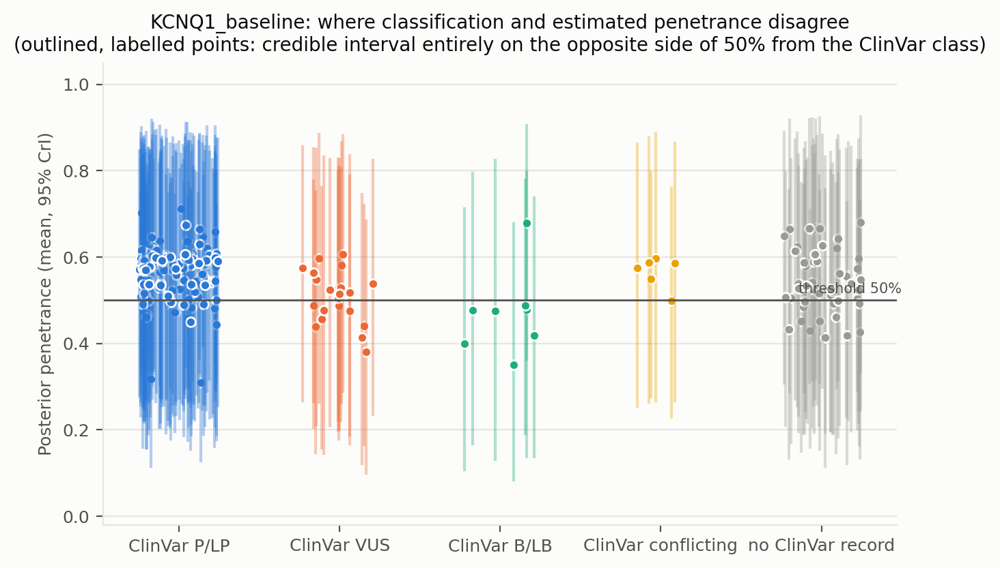
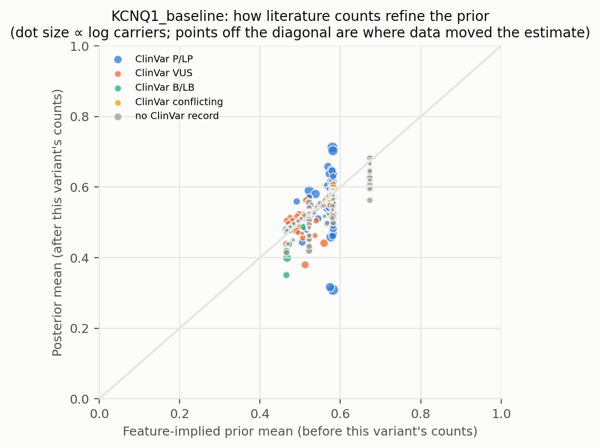
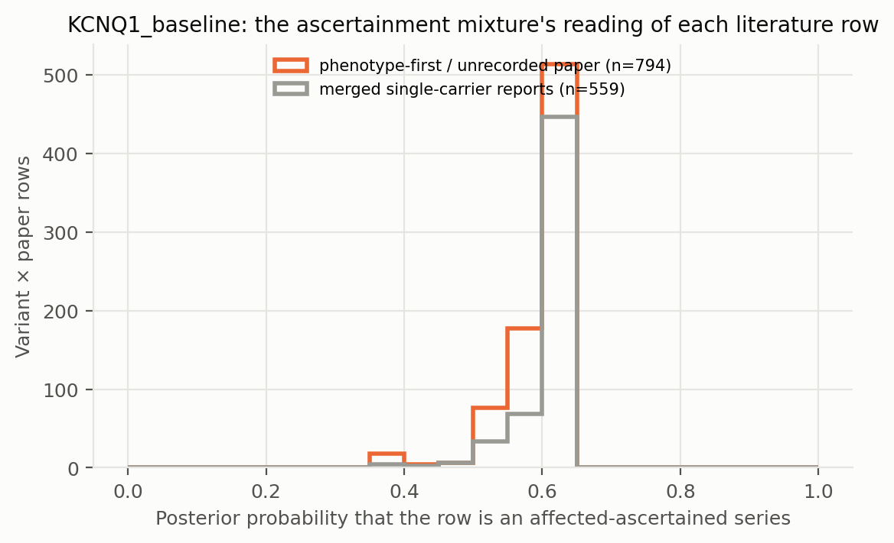

# KCNQ1_baseline: literature-derived penetrance with a Bayesian prior — automated report

Generated by `iterations/grant_e2e_20260909/scripts/make_report.py` from the frozen workflow (GeneVariantFetcher tag `grant-freeze-20260909`). All numbers below are produced by code from the run artifacts; none were edited by hand.

## Data

| Quantity | Value |
| --- | ---: |
| Papers in the extraction database | 2383 |
| Variant rows in the database | 10183 |
| Usable carrier observations (variant × paper) | 1909 |
| Papers contributing usable observations | None |
| Count rows without a usable denominator (excluded) | 423 |
| Quarantined count rows excluded by the trust gate | 0 |
| Distinct variants with carrier counts | 699 |
| Total literature carriers / affected | 10656 / 8392 |
| Variants with ≥5 carriers (evaluation set; carriers = literature) | 213 |
| Share of observations that are single affected probands | 0.54 |
| Missense variants with an AlphaMissense score | 396 / 443 |
| Variants with a ClinVar record | 384 / 699 |
| Feature transcript | ENST00000155840.12 |
| gnomAD carriers added as unaffected | 0 (off) |

Denominator sources: explicit = 1377, individual_records = 3, total_derived = 529. Study designs (paper level): unknown = 1909.

ClinVar classes among variants with counts: B/LB = 15, Conflicting = 17, P/LP = 231, VUS = 121, none = 315.

## Model

Hierarchical logistic-binomial on variant × paper rows (1353 rows after merging single-carrier reports per variant, 691 variants). Each row is either an **affected-ascertained series** (probability π, success probability p_asc ≈ 1) or an **informative observation** of the variant's penetrance: `y_r ~ π·Binomial(n_r, p_asc) + (1−π)·Binomial(n_r, p_r)`, `logit(p_r) = α + x_v·β + σ·z_v + τ·e_r`, with a between-variant effect `z_v` and a between-study effect `e_r`; `logit(π_r) = g0 + g1·[genotype-first ascertainment recorded for the paper] + g2·[standardized log10 gnomAD allele frequency of the variant]` (case series of common alleles are ascertainment). gnomAD anchor rows are informative by construction and carry no study effect. Fitted by NUTS (PyMC, 4 chains). The posterior of `p_v = sigmoid(α + x_v·β + σ·z_v)` is the penetrance estimate among carriers not selected for being affected: variants with many informative carriers are driven by their own counts; variants known only from case reports are shrunk toward the feature-implied prior and carry wide intervals. Fixed-effect sets: `base` (intercept only), `class` (truncating), `insilico` (class + AlphaMissense), `clinvar` (class + ClinVar P/LP, B/LB, no-record), `insilico_clinvar`. The primary model is `insilico`.

| Model | Features | σ (between-variant SD, logit) | τ (between-study SD, logit) | π ascertained: phenotype-first / genotype-first rows (typical frequency) | g2 (per SD of log10 AF) | max R̂ | min ESS | divergences |
| --- | --- | ---: | ---: | ---: | ---: | ---: | ---: | ---: |
| base | — | 0.65 | 1.45 | 0.63 / 0.60 | -0.20 | 1.020 | 434 | 0 |
| class | trunc | 0.66 | 1.45 | 0.63 / 0.61 | -0.21 | 1.010 | 413 | 0 |
| clinvar | trunc, clinvar_plp, clinvar_blb, clinvar_none | 0.69 | 1.38 | 0.64 / 0.61 | -0.19 | 1.010 | 359 | 0 |
| insilico | trunc, am, am_missing | 0.67 | 1.43 | 0.63 / 0.61 | -0.18 | 1.010 | 299 | 0 |
| insilico_clinvar | trunc, am, am_missing, clinvar_plp, clinvar_blb, clinvar_none | 0.67 | 1.33 | 0.64 / 0.62 | -0.17 | 1.010 | 257 | 0 |

Primary-model coefficients (posterior mean [94% HDI]): `alpha` 0.22 [-0.18, 0.64]; `sigma` 0.67 [0.28, 1.04]; `beta[trunc]` -0.13 [-0.66, 0.43]; `beta[am]` 0.17 [-0.15, 0.48]; `beta[am_missing]` 0.53 [-0.16, 1.30]; `tau` 1.43 [1.06, 1.77]; `g0` 0.53 [0.32, 0.77]; `g1` -0.01 [-1.87, 1.77]; `g2` -0.18 [-0.30, -0.05]; `p_asc` 1.00 [1.00, 1.00].

## Held-out predictive performance (5-fold by variant)

| Prior model | NLL / carrier ↓ | Brier / carrier ↓ | log pred. density / row ↑ | calibration slope (1 = ideal) |
| --- | ---: | ---: | ---: | ---: |
| base | 0.5088 | 0.0969 | -0.940 | 1.36 |
| class | 0.5074 | 0.0965 | -0.940 | 1.53 |
| insilico | 0.5099 | 0.0973 | -0.942 | 1.36 |
| clinvar | 0.5091 | 0.0969 | -0.939 | 1.23 |
| insilico_clinvar | 0.5102 | 0.0972 | -0.938 | 1.05 |

Scored on held-out variant × paper rows (each fold's model never saw the held-out variants; predictions integrate both the variant and the study effect).

Paired bootstrap change in NLL per carrier versus the `base` prior (negative = better): `class` -0.0014 [-0.0035, +0.0004]; `insilico` +0.0012 [-0.0044, +0.0075]; `clinvar` +0.0003 [-0.0046, +0.0053]; `insilico_clinvar` +0.0014 [-0.0052, +0.0074].

Paired bootstrap change in NLL per carrier versus the `clinvar` prior (negative = better): `base` -0.0003 [-0.0051, +0.0048]; `class` -0.0017 [-0.0066, +0.0031]; `insilico` +0.0008 [-0.0025, +0.0045]; `insilico_clinvar` +0.0011 [-0.0019, +0.0041].

## Classification performance: identifying variants with observed penetrance ≥ 50%

Evaluation set: variants with ≥5 carriers (literature carriers). Label: observed fraction ≥ 50%. AUC with 95% bootstrap interval.

| Scorer | variants | high-penetrance variants | AUC | 95% CI |
| --- | ---: | ---: | ---: | --- |
| clinvar_ordinal | 161 | 141 | 0.663 | [0.537, 0.775] |
| clinvar_plp_binary | 161 | 141 | 0.658 | [0.548, 0.761] |
| alphamissense_missense_only | 150 | 130 | 0.577 | [0.416, 0.726] |
| insilico_posterior_mean_in_sample_LEAKY | 213 | 177 | 0.822 | [0.718, 0.905] |
| base_oof_prior | 213 | 177 | 0.525 | [0.417, 0.634] |
| class_oof_prior | 213 | 177 | 0.558 | [0.461, 0.656] |
| insilico_oof_prior | 213 | 177 | 0.547 | [0.441, 0.658] |
| clinvar_oof_prior | 213 | 177 | 0.627 | [0.525, 0.725] |
| insilico_clinvar_oof_prior | 213 | 177 | 0.562 | [0.450, 0.675] |

The `_LEAKY` row uses the posterior that already contains the variant's own counts, which also define the label; it is shown only to make the leakage explicit and is not a validation.

Binary rule 'ClinVar P/LP ⇒ high penetrance': sensitivity 0.82, specificity 0.50, PPV 0.92, NPV 0.28 (TP 115, FP 10, FN 26, TN 10).

Other thresholds: ≥25%: clinvar_ordinal 0.70, insilico_oof_prior 0.65; ≥75%: clinvar_ordinal 0.55, insilico_oof_prior 0.51.

## Held-out observations of known variants: penetrance estimate versus classification

**Alternate-paper hold-out.** For each variant reported in ≥2 papers, papers are split alternately by PMID; set A updates the prior, set B is scored (132 variants, 3774 held-out carriers). Because B still contains phenotype-first reports, the prediction for B is the mixture prediction (ascertained series with probability π, informative otherwise).

The ClinVar comparator predicts each variant with the observed A-rate of its ClinVar class among the *other* variants; the pooled rate is the A-rate over all variants.

| Predictor for held-out observations | NLL / carrier ↓ | Brier / carrier ↓ |
| --- | ---: | ---: |
| posterior_from_half_A | 0.5192 | 0.0372 |
| prior_only | 0.5098 | 0.0342 |
| pooled_rate_half_A | 0.5143 | 0.0360 |
| clinvar_class_rate_half_A | 0.5125 | 0.0351 |

Paired bootstrap change in NLL per held-out carrier, posterior-from-A minus ClinVar-class rate: +0.0067 [-0.0077, +0.0205] (negative favours the count-informed estimate).

Paired bootstrap change in NLL per held-out carrier, posterior-from-A minus pooled rate: +0.0049 [-0.0108, +0.0167] (negative favours the count-informed estimate).

Paired bootstrap change in NLL per held-out carrier, posterior-from-A minus features-only prior: +0.0094 [+0.0033, +0.0160] (negative favours the count-informed estimate).

| Scorer (label: observed ≥ 50% in set B) | variants | AUC | 95% CI |
| --- | ---: | ---: | --- |
| posterior_from_half_A | 132 | 0.575 | [0.417, 0.718] |
| prior_only | 132 | 0.616 | [0.470, 0.744] |
| pooled_rate_half_A | 132 | 0.500 | [0.500, 0.500] |
| clinvar_class_rate_half_A | 132 | 0.539 | [0.372, 0.683] |
| clinvar_ordinal | 132 | 0.620 | [0.497, 0.742] |

## Common variants: the known-outcome check

Variants with gnomAD allele frequency above 0.001 are common alleles whose outcome is known independently of the literature: at most a GWAS-scale risk, no Mendelian penetrance. They stay in the model as a check. In case-series literature they look penetrant (median literature fraction 0.51; 50% of them are ≥ 50% affected among reported carriers); the model's estimate for them should be near the population risk: median posterior 0.448, 0% with the 97.5% bound below 10%.

| Variant | ClinVar | gnomAD AF | gnomAD carriers added | affected / literature carriers | literature fraction | posterior mean [97.5%] |
| --- | --- | ---: | ---: | ---: | ---: | --- |
| G643S | B/LB | 7.89e-03 | 0 | 47 / 81 | 0.58 | 0.478 [0.796] |
| P448R | B/LB | 7.54e-03 | 0 | 32 / 74 | 0.43 | 0.399 [0.712] |
| V648I | B/LB | 6.74e-03 | 0 | 0 / 10 | 0.00 | 0.351 [0.677] |
| I145= | B/LB | 4.74e-03 | 0 | 18 / 24 | 0.75 | 0.678 [0.904] |
| P408A | B/LB | 4.18e-03 | 0 | 4 / 14 | 0.29 | 0.419 [0.737] |
| K393N | B/LB | 1.09e-03 | 0 | 9 / 14 | 0.64 | 0.487 [0.779] |

## Examples where the classification is wrong about penetrance

No variant with ≥5 literature carriers has a 95% credible interval entirely on the opposite side of 50% from its ClinVar class.

## Figures

**Figure — Posterior penetrance (dot, 95% credible interval) versus the raw observed fraction (tick) for the best-observed variants, coloured by ClinVar class.**

**Figure — Distribution of posterior mean penetrance across all variants, and by ClinVar class for variants with enough carriers.**

**Figure — Calibration of held-out prior predictions (each model predicts variants it never saw).**

**Figure — ROC curves for identifying observed high-penetrance variants: ClinVar class alone, AlphaMissense alone, the held-out Bayesian prior, and the posterior that includes the variant's own counts.**

**Figure — Alternate-paper hold-out: the posterior built from half of each variant's papers predicts the observed penetrance in the other half; compared with ClinVar class and a features-only prior.**

**Figure — Where classification and estimated penetrance disagree; outlined, labelled points are the discordant variants listed above.**

**Figure — Prior mean versus posterior mean: how the literature counts refine the feature-implied prior.**

**Figure — How the mixture reads the literature: posterior probability that each variant × paper row is a pure affected series, by the paper's recorded ascertainment.**

## Limitations that travel with these numbers

- Counts are pooled across papers; cohort overlap between publications cannot be resolved from the extraction, so denominators may double count.
- Probands are included; ascertainment inflates penetrance, most strongly for variants known only from single case reports (see the single-proband share above).
- 'Affected' follows each paper's own phenotype definition for the gene–disease pair; ages are not modelled.
- ClinVar classes are as of the variantFeatures snapshot; frameshift/splice alleles often lack a warehouse record and appear as 'no ClinVar record'.
- Held-out metrics score the prior model; posterior values include the variant's own counts and are the estimate a user would see, not a validation.

## Artifacts

`observations.csv`, `variants.csv`, `variants_features.csv`, `fit/posterior_variants.csv`, `fit/oof_predictions.csv`, `fit/metrics.csv`, `fit/classification_metrics.csv`, `fit/discordant_variants.csv`, `fit/coefficients.csv`, `fit/model_diagnostics.csv`, `fit/fit_summary.json` in the analysis directory.
