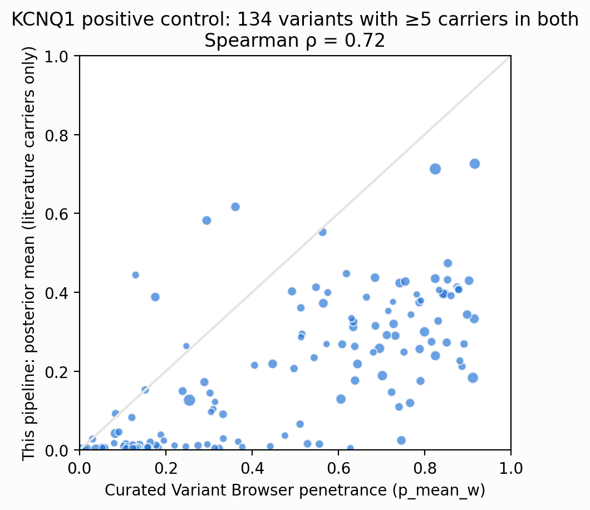

# KCNQ1 positive control

- variants_in_pipeline: 691
- matched_to_reference: 402
- matched_with_ge5_carriers_both: 134
- spearman_posterior_vs_reference_p_mean_w: 0.7245850945772393
- pearson_posterior_vs_reference_p_mean_w: 0.6949469823379688
- spearman_observed_vs_reference_observed: 0.7710932311786342
- median_abs_diff_posterior_vs_reference: 0.28888045220706693
- pipeline_carriers_matched: 14182
- reference_literature_carriers_matched: 2492

