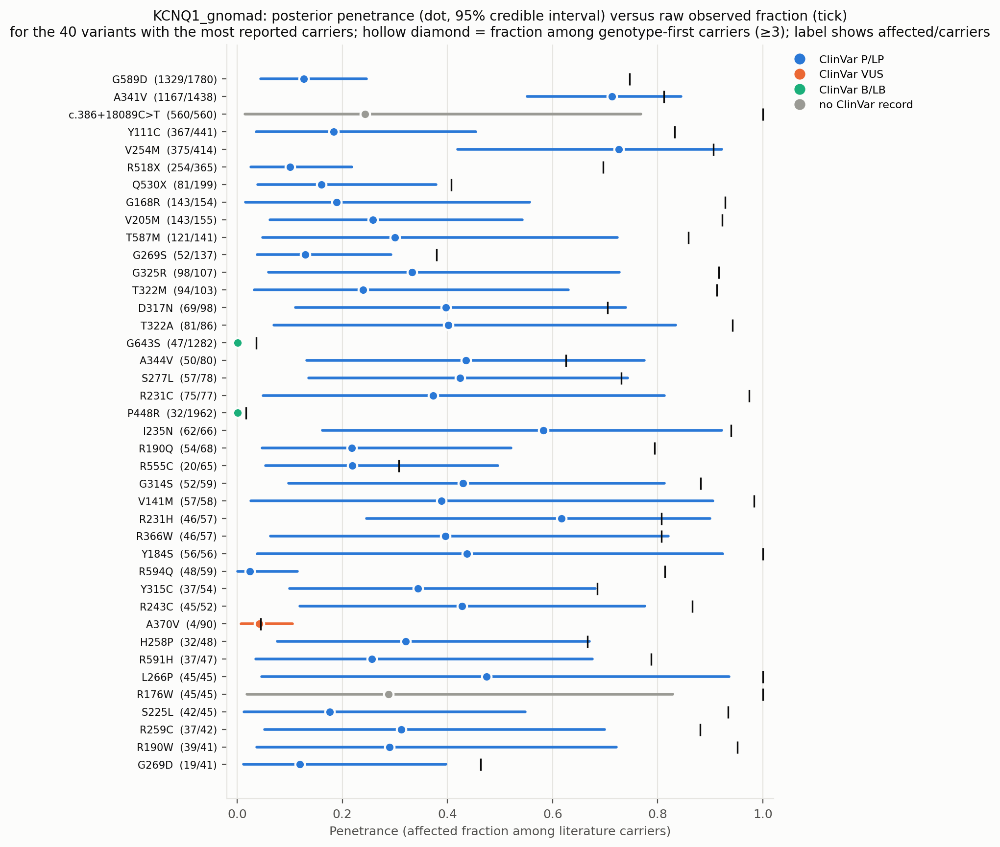
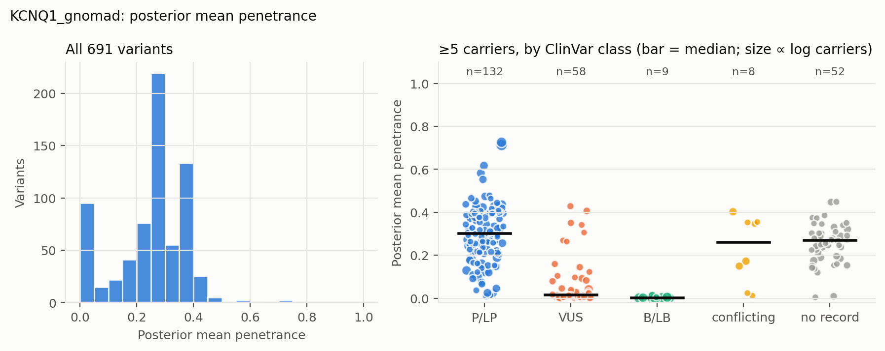
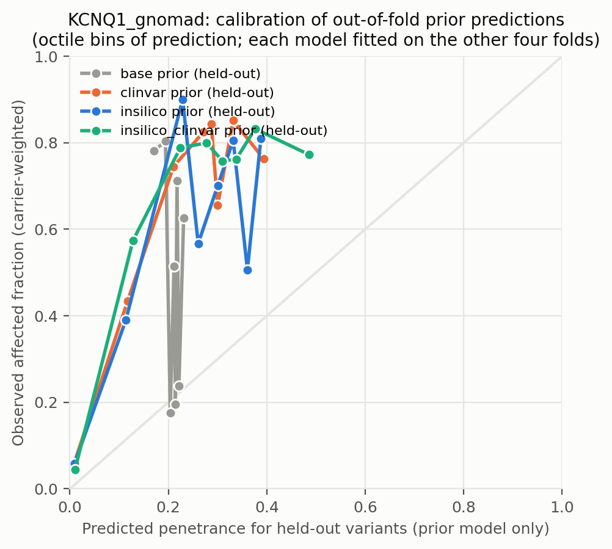
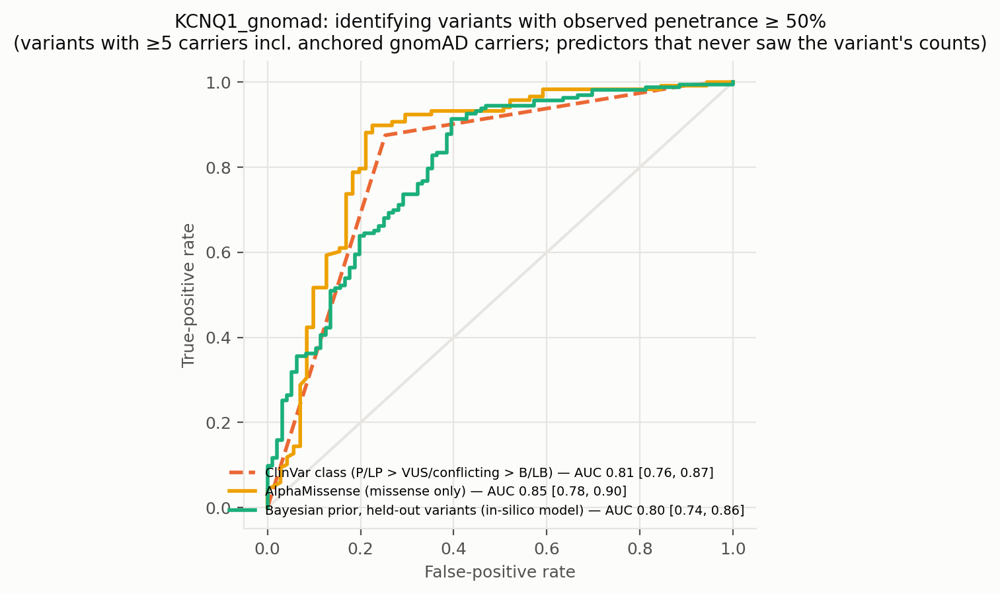
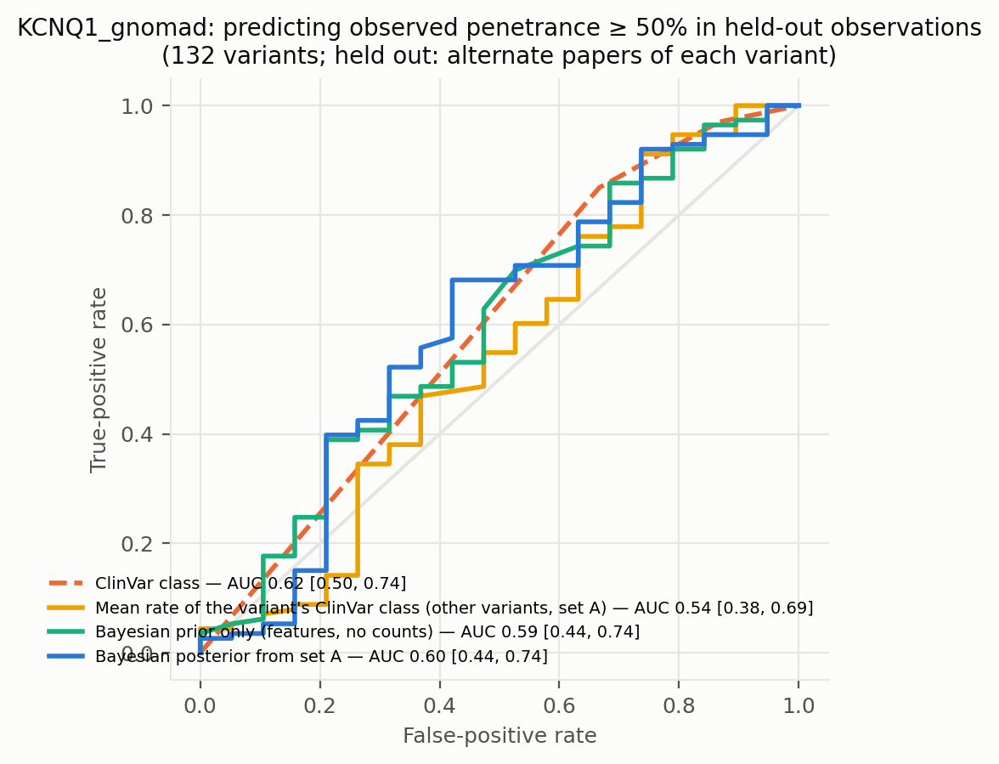
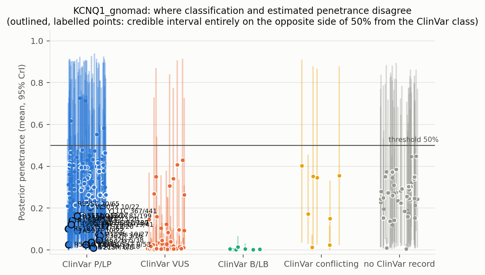
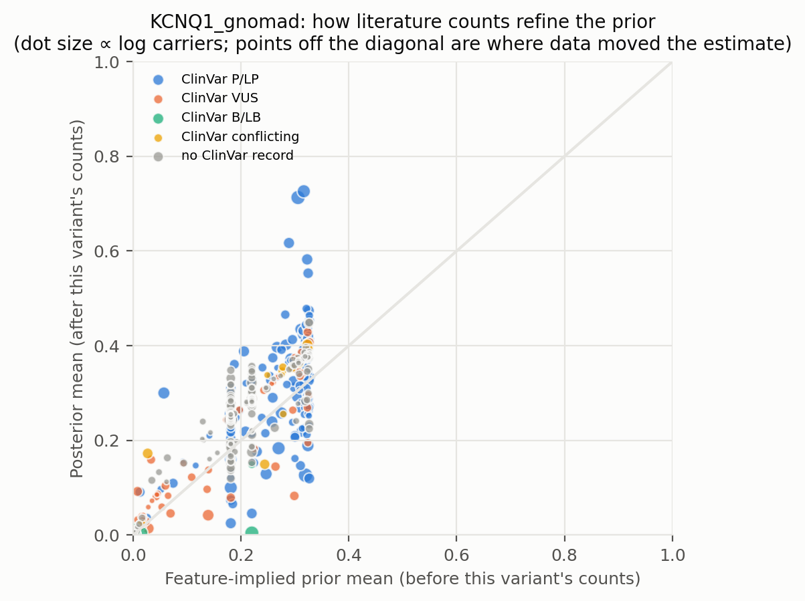
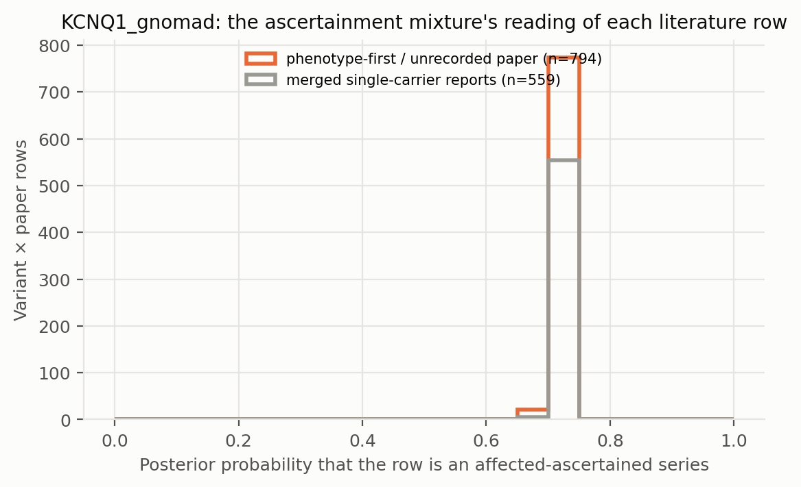

# KCNQ1_gnomad: literature-derived penetrance with a Bayesian prior — automated report

Generated by `iterations/grant_e2e_20260909/scripts/make_report.py` from the frozen workflow (GeneVariantFetcher tag `grant-freeze-20260909`). All numbers below are produced by code from the run artifacts; none were edited by hand.

## Data

| Quantity | Value |
| --- | ---: |
| Papers in the extraction database | 2383 |
| Variant rows in the database | 10183 |
| Usable carrier observations (variant × paper) | 1909 |
| Papers contributing usable observations | None |
| Count rows without a usable denominator (excluded) | 423 |
| Quarantined count rows excluded by the trust gate | 0 |
| Distinct variants with carrier counts | 699 |
| Total literature carriers / affected | 10656 / 8392 |
| Variants with ≥5 carriers (evaluation set; carriers = literature + anchored gnomAD) | 259 |
| Share of observations that are single affected probands | 0.54 |
| Missense variants with an AlphaMissense score | 396 / 443 |
| Variants with a ClinVar record | 384 / 699 |
| Feature transcript | ENST00000155840.12 |
| gnomAD carriers added as unaffected | 7225 (on) |

Denominator sources: explicit = 1377, individual_records = 3, total_derived = 529. Study designs (paper level): unknown = 1909.

ClinVar classes among variants with counts: B/LB = 15, Conflicting = 17, P/LP = 231, VUS = 121, none = 315.

## Model

Hierarchical logistic-binomial on variant × paper rows (1505 rows after merging single-carrier reports per variant, 691 variants). Each row is either an **affected-ascertained series** (probability π, success probability p_asc ≈ 1) or an **informative observation** of the variant's penetrance: `y_r ~ π·Binomial(n_r, p_asc) + (1−π)·Binomial(n_r, p_r)`, `logit(p_r) = α + x_v·β + σ·z_v + τ·e_r`, with a between-variant effect `z_v` and a between-study effect `e_r`; `logit(π_r) = g0 + g1·[genotype-first ascertainment recorded for the paper] + g2·[standardized log10 gnomAD allele frequency of the variant]` (case series of common alleles are ascertainment). gnomAD anchor rows are informative by construction and carry no study effect. Fitted by NUTS (PyMC, 4 chains). The posterior of `p_v = sigmoid(α + x_v·β + σ·z_v)` is the penetrance estimate among carriers not selected for being affected: variants with many informative carriers are driven by their own counts; variants known only from case reports are shrunk toward the feature-implied prior and carry wide intervals. Fixed-effect sets: `base` (intercept only), `class` (truncating), `insilico` (class + AlphaMissense), `clinvar` (class + ClinVar P/LP, B/LB, no-record), `insilico_clinvar`. The primary model is `insilico`.

| Model | Features | σ (between-variant SD, logit) | τ (between-study SD, logit) | π ascertained: phenotype-first / genotype-first rows (typical frequency) | g2 (per SD of log10 AF) | max R̂ | min ESS | divergences |
| --- | --- | ---: | ---: | ---: | ---: | ---: | ---: | ---: |
| base ⚠ chains disagree | — | 2.00 | 1.41 | 0.75 / 0.72 | -0.08 | 1.500 | 7 | 0 |
| class | trunc | 1.94 | 1.58 | 0.75 / 0.72 | -0.08 | 1.000 | 638 | 0 |
| clinvar ⚠ chains disagree | trunc, clinvar_plp, clinvar_blb, clinvar_none | 0.86 | 1.56 | 0.74 / 0.70 | -0.07 | 1.100 | 12 | 0 |
| insilico | trunc, am, am_missing | 1.34 | 1.38 | 0.74 / 0.70 | -0.04 | 1.000 | 884 | 0 |
| insilico_clinvar | trunc, am, am_missing, clinvar_plp, clinvar_blb, clinvar_none | 0.86 | 1.50 | 0.73 / 0.70 | -0.05 | 1.010 | 717 | 0 |

⚠ Convergence: chains disagree (R̂ > 1.05) for base, clinvar. The ascertainment mixture is multimodal when a variant's literature consists of all-affected series with no genotype-first or population anchor (the same rows are explained either as ascertained series or as high penetrance); estimates from those models are not reliable.

Primary-model coefficients (posterior mean [94% HDI]): `alpha` -2.05 [-2.40, -1.69]; `sigma` 1.34 [1.05, 1.62]; `beta[trunc]` 0.51 [-0.10, 1.23]; `beta[am]` 1.96 [1.56, 2.34]; `beta[am_missing]` 0.72 [-0.27, 1.66]; `tau` 1.38 [1.07, 1.71]; `g0` 1.05 [0.89, 1.22]; `g1` -0.01 [-1.94, 1.79]; `g2` -0.04 [-0.15, 0.06]; `p_asc` 0.99 [0.99, 0.99].

## Held-out predictive performance (5-fold by variant)

| Prior model | NLL / carrier ↓ | Brier / carrier ↓ | log pred. density / row ↑ | calibration slope (1 = ideal) |
| --- | ---: | ---: | ---: | ---: |
| base | 0.3998 | 0.0763 | -1.019 | 3.16 |
| class | 0.3981 | 0.0758 | -1.017 | 3.11 |
| insilico | 0.3445 | 0.0689 | -0.977 | 2.25 |
| clinvar | 0.3081 | 0.0584 | -0.979 | 1.84 |
| insilico_clinvar | 0.3105 | 0.0588 | -0.966 | 1.77 |

Scored on held-out variant × paper rows (each fold's model never saw the held-out variants; predictions integrate both the variant and the study effect).

Paired bootstrap change in NLL per carrier versus the `base` prior (negative = better): `class` -0.0017 [-0.0074, +0.0046]; `insilico` -0.0552 [-0.1089, +0.0116]; `clinvar` -0.0916 [-0.1280, -0.0344]; `insilico_clinvar` -0.0893 [-0.1288, -0.0404].

Paired bootstrap change in NLL per carrier versus the `clinvar` prior (negative = better): `base` +0.0916 [+0.0381, +0.1291]; `class` +0.0900 [+0.0401, +0.1302]; `insilico` +0.0364 [+0.0018, +0.0880]; `insilico_clinvar` +0.0023 [-0.0022, +0.0089].

## Classification performance: identifying variants with observed penetrance ≥ 50%

Evaluation set: variants with ≥5 carriers — literature carriers plus the anchored gnomAD carriers, which also enter the observed fraction that defines the label. Label: observed fraction ≥ 50%. AUC with 95% bootstrap interval.

| Scorer | variants | high-penetrance variants | AUC | 95% CI |
| --- | ---: | ---: | ---: | --- |
| clinvar_ordinal | 207 | 128 | 0.814 | [0.757, 0.872] |
| clinvar_plp_binary | 207 | 128 | 0.811 | [0.756, 0.866] |
| alphamissense_missense_only | 189 | 118 | 0.846 | [0.776, 0.905] |
| insilico_posterior_mean_in_sample_LEAKY | 259 | 163 | 0.902 | [0.862, 0.937] |
| base_oof_prior | 259 | 163 | 0.483 | [0.411, 0.551] |
| class_oof_prior | 259 | 163 | 0.490 | [0.417, 0.566] |
| insilico_oof_prior | 259 | 163 | 0.803 | [0.740, 0.861] |
| clinvar_oof_prior | 259 | 163 | 0.736 | [0.667, 0.810] |
| insilico_clinvar_oof_prior | 259 | 163 | 0.789 | [0.722, 0.850] |

**Literature-only labels.** The table above defines high penetrance over literature carriers plus the anchored gnomAD carriers, so its labels partly encode the anchor assumption. The same scorers against the literature fraction alone (≥5 literature carriers; the 6 common alleles with AF > 0.001 excluded because their literature fraction is known to be ascertainment) — an ascertainment-inflated but anchor-free label:

| Scorer | variants | high-penetrance variants | AUC | 95% CI |
| --- | ---: | ---: | ---: | --- |
| clinvar_ordinal | 155 | 138 | 0.620 | [0.502, 0.745] |
| clinvar_plp_binary | 155 | 138 | 0.623 | [0.497, 0.742] |
| alphamissense_missense_only | 145 | 128 | 0.513 | [0.357, 0.673] |
| insilico_posterior_mean_in_sample_LEAKY | 207 | 174 | 0.727 | [0.640, 0.800] |
| base_oof_prior | 207 | 174 | 0.521 | [0.409, 0.628] |
| class_oof_prior | 207 | 174 | 0.428 | [0.312, 0.548] |
| insilico_oof_prior | 207 | 174 | 0.598 | [0.495, 0.699] |
| clinvar_oof_prior | 207 | 174 | 0.465 | [0.353, 0.581] |
| insilico_clinvar_oof_prior | 207 | 174 | 0.490 | [0.373, 0.607] |

The `_LEAKY` row uses the posterior that already contains the variant's own counts, which also define the label; it is shown only to make the leakage explicit and is not a validation.

Binary rule 'ClinVar P/LP ⇒ high penetrance': sensitivity 0.88, specificity 0.75, PPV 0.85, NPV 0.79 (TP 112, FP 20, FN 16, TN 59).

Other thresholds: ≥25%: clinvar_ordinal 0.83, insilico_oof_prior 0.79; ≥75%: clinvar_ordinal 0.70, insilico_oof_prior 0.71.

## Held-out observations of known variants: penetrance estimate versus classification

**Alternate-paper hold-out.** For each variant reported in ≥2 papers, papers are split alternately by PMID; set A updates the prior, set B is scored (132 variants, 3774 held-out carriers). Because B still contains phenotype-first reports, the prediction for B is the mixture prediction (ascertained series with probability π, informative otherwise).

The ClinVar comparator predicts each variant with the observed A-rate of its ClinVar class among the *other* variants; the pooled rate is the A-rate over all variants.

| Predictor for held-out observations | NLL / carrier ↓ | Brier / carrier ↓ |
| --- | ---: | ---: |
| posterior_from_half_A | 0.5190 | 0.0361 |
| prior_only | 0.5123 | 0.0350 |
| pooled_rate_half_A | 0.8818 | 0.2121 |
| clinvar_class_rate_half_A | 0.5767 | 0.0458 |

Paired bootstrap change in NLL per held-out carrier, posterior-from-A minus ClinVar-class rate: -0.0577 [-0.1735, +0.0018] (negative favours the count-informed estimate).

Paired bootstrap change in NLL per held-out carrier, posterior-from-A minus pooled rate: -0.3629 [-0.4585, -0.2852] (negative favours the count-informed estimate).

Paired bootstrap change in NLL per held-out carrier, posterior-from-A minus features-only prior: +0.0066 [-0.0075, +0.0263] (negative favours the count-informed estimate).

| Scorer (label: observed ≥ 50% in set B) | variants | AUC | 95% CI |
| --- | ---: | ---: | --- |
| posterior_from_half_A | 132 | 0.595 | [0.440, 0.742] |
| prior_only | 132 | 0.592 | [0.444, 0.742] |
| pooled_rate_half_A | 132 | 0.500 | [0.500, 0.500] |
| clinvar_class_rate_half_A | 132 | 0.538 | [0.378, 0.693] |
| clinvar_ordinal | 132 | 0.620 | [0.500, 0.741] |

## Common variants: the known-outcome check

Variants with gnomAD allele frequency above 0.001 are common alleles whose outcome is known independently of the literature: at most a GWAS-scale risk, no Mendelian penetrance. They stay in the model as a check. In case-series literature they look penetrant (median literature fraction 0.51; 50% of them are ≥ 50% affected among reported carriers); the model's estimate for them should be near the population risk: median posterior 0.001, 100% with the 97.5% bound below 10%.

| Variant | ClinVar | gnomAD AF | gnomAD carriers added | affected / literature carriers | literature fraction | posterior mean [97.5%] |
| --- | --- | ---: | ---: | ---: | ---: | --- |
| G643S | B/LB | 7.89e-03 | 1201 | 47 / 81 | 0.58 | 0.001 [0.002] |
| P448R | B/LB | 7.54e-03 | 1888 | 32 / 74 | 0.43 | 0.000 [0.002] |
| V648I | B/LB | 6.74e-03 | 1025 | 0 / 10 | 0.00 | 0.001 [0.002] |
| I145= | B/LB | 4.74e-03 | 1192 | 18 / 24 | 0.75 | 0.004 [0.009] |
| P408A | B/LB | 4.18e-03 | 636 | 4 / 14 | 0.29 | 0.001 [0.003] |
| K393N | B/LB | 1.09e-03 | 275 | 9 / 14 | 0.64 | 0.005 [0.015] |

## Examples where the classification is wrong about penetrance

Variants with ≥5 literature carriers whose 95% credible interval lies entirely on the other side of 50% from what the ClinVar class implies. `literature affected / carriers` are the extracted counts, `gnomAD added` the anchored population carriers (assumed unaffected) that also enter the posterior; `genotype-first` are the affected / carriers in screening or cascade rows, the evidence least affected by ascertainment. PMIDs are the source papers.

| Variant | Class | ClinVar | literature affected / carriers | literature fraction | gnomAD added | genotype-first affected / carriers | posterior mean [95% CrI] | prior mean | papers | PMIDs |
| --- | --- | --- | ---: | ---: | ---: | ---: | --- | ---: | ---: | --- |
| G589D | missense | P/LP | 1329 / 1772 | 0.75 | 8 | — | 0.13 [0.04, 0.25] | 0.32 | 22 | 10483966, 11216980, 14499861, 15541256, 16754261, 16882680 (+16) |
| Y111C | missense | P/LP | 367 / 439 | 0.84 | 2 | — | 0.18 [0.04, 0.45] | 0.27 | 12 | 10973849, 20031635, 22677073, 23098067, 25471708, 28720088 (+6) |
| R518X | nonsense | P/LP | 254 / 339 | 0.75 | 26 | — | 0.10 [0.03, 0.22] | 0.18 | 31 | 10482963, 10737999, 10973849, 14510661, 17905336, 18441444 (+25) |
| Q530X | nonsense | P/LP | 81 / 192 | 0.42 | 7 | — | 0.16 [0.04, 0.38] | 0.18 | 12 | 10973849, 14510661, 23098067, 24357532, 24552659, 24606995 (+6) |
| G269S | missense | P/LP | 52 / 136 | 0.38 | 1 | — | 0.13 [0.04, 0.29] | 0.25 | 21 | 10973849, 12205113, 12702160, 15466642, 16436635, 17023080 (+15) |
| R555C | missense | P/LP | 20 / 63 | 0.32 | 2 | — | 0.22 [0.05, 0.50] | 0.31 | 8 | 10973849, 14998624, 26715165, 30758498, 32893267, 37568094 (+2) |
| R594Q | missense | P/LP | 48 / 54 | 0.89 | 5 | — | 0.02 [0.00, 0.11] | 0.02 | 24 | 10973849, 19841300, 22199116, 22885918, 22956155, 24218437 (+18) |
| G269D | missense | P/LP | 19 / 39 | 0.49 | 2 | — | 0.12 [0.01, 0.40] | 0.33 | 8 | 10973849, 12051962, 15466642, 22199116, 22360817, 32893267 (+2) |
| I567T | missense | P/LP | 13 / 20 | 0.65 | 0 | — | 0.11 [0.00, 0.45] | 0.07 | 9 | 16414944, 24372464, 28438721, 29925740, 30758498, 31424047 (+3) |
| A302V | missense | P/LP | 13 / 19 | 0.68 | 1 | — | 0.15 [0.01, 0.45] | 0.31 | 11 | 15466642, 17222736, 19808498, 22677073, 24606995, 25786344 (+5) |
| A590T | missense | P/LP | 10 / 19 | 0.53 | 3 | — | 0.09 [0.01, 0.27] | 0.01 | 9 | 14998624, 16623272, 19841300, 24713462, 28491806, 32893267 (+3) |
| W305X | nonsense | P/LP | 10 / 18 | 0.56 | 4 | — | 0.20 [0.04, 0.48] | 0.18 | 5 | 12702160, 29876285, 32893267, 36140355, 41940510 |
| Y171X | nonsense | P/LP | 11 / 15 | 0.73 | 2 | — | 0.16 [0.02, 0.49] | 0.18 | 7 | 11216980, 12051962, 21244686, 26187847, 32893267, 33504163 (+1) |
| R583H | missense | P/LP | 12 / 13 | 0.92 | 5 | — | 0.02 [0.00, 0.09] | 0.01 | 6 | 15851171, 16414944, 24606995, 26496715, 32893267, 38657442 |
| M159fs | splice | P/LP | 10 / 11 | 0.91 | 16 | — | 0.07 [0.01, 0.21] | 0.18 | 7 | 10973849, 24552659, 25471708, 29037160, 32893267, 33552729 (+1) |
| R259H | missense | P/LP | 8 / 11 | 0.73 | 4 | — | 0.15 [0.02, 0.43] | 0.22 | 7 | 24291113, 25974115, 26346102, 31315195, 34557911, 38653189 (+1) |
| K362R | missense | P/LP | 3 / 6 | 0.50 | 10 | — | 0.07 [0.01, 0.21] | 0.18 | 4 | 19841300, 22949429, 32893267, 34135346 |
| R632fs | indel_cdna | P/LP | 5 / 6 | 0.83 | 32 | — | 0.05 [0.00, 0.13] | 0.22 | 4 | 23098067, 25187895, 32893267, 34691145 |
| V215M | missense | P/LP | 6 / 6 | 1.00 | 2 | — | 0.01 [0.00, 0.05] | 0.00 | 6 | 16414944, 19841300, 22949429, 25576780, 32893267, 41013213 |
| R190fs | frameshift | P/LP | 5 / 5 | 1.00 | 3 | — | 0.14 [0.01, 0.47] | 0.18 | 3 | 21118729, 29688407, 32893267 |

Counts: 20 P/LP variants estimated below 50%; 0 non-P/LP variants estimated above 50% (≥5 literature carriers). Under the frozen rule that also counts anchored gnomAD carriers towards the ≥5 minimum, `fit/discordant_variants.csv` lists 24 and 0.

Reading the table: when a variant's genotype-first carriers are mostly affected but the posterior is low, the population anchor (gnomAD carriers assumed unaffected), not the literature, is driving the estimate — the anchor assumption fails for phenotypes that are common and unmeasured in gnomAD.

Evidence rows behind the first discordant variants (per paper; `ascertained` = posterior probability that the row is an affected-only series):

| Variant | PMID | affected / carriers | ascertainment recorded | ascertained |
| --- | --- | ---: | --- | ---: |
| G589D | 21244686 | 492 / 492 | — | 0.72 |
| G589D | 11216980 | 83 / 316 | — | 0.72 |
| G589D | 20659946 | 295 / 295 | — | 0.72 |
| G589D | 17192539 | 243 / 243 | — | 0.72 |
| G589D | 23856471 | 63 / 184 | — | 0.72 |
| G589D | 16754261 | 66 / 66 | — | 0.72 |
| Y111C | 28720088 | 148 / 148 | — | 0.73 |
| Y111C | 42128250 | 122 / 122 | — | 0.73 |
| Y111C | 20031635 | 24 / 80 | — | 0.73 |
| Y111C | 29270100 | 26 / 26 | — | 0.73 |
| Y111C | 23098067 | 20 / 20 | — | 0.73 |
| Y111C | 32173736 | 1 / 17 | — | 0.73 |
| R518X | 24552659 | 28 / 101 | — | 0.72 |
| R518X | 28720088 | 79 / 79 | — | 0.72 |
| R518X | gnomAD | 0 / 26 | population_screening | 0.00 |
| R518X | 37975542 | 24 / 24 | — | 0.72 |
| R518X | 26318259 | 20 / 20 | — | 0.72 |
| R518X | 22539601 | 19 / 19 | — | 0.72 |
| Q530X | 41881367 | 30 / 139 | — | 0.72 |
| Q530X | 26318259 | 28 / 28 | — | 0.72 |
| Q530X | gnomAD | 0 / 7 | population_screening | 0.00 |
| Q530X | 14510661 | 2 / 4 | — | 0.72 |
| Q530X | 24357532 | 4 / 4 | — | 0.72 |
| Q530X | 32893267 | 4 / 4 | — | 0.72 |
| G269S | 36277779 | 0 / 25 | — | 0.73 |
| G269S | 29439887 | 3 / 20 | — | 0.73 |
| G269S | 30758498 | 6 / 20 | — | 0.73 |
| G269S | 32893267 | 17 / 17 | — | 0.73 |
| G269S | 12702160 | 1 / 11 | — | 0.73 |
| G269S | 24184248 | 1 / 11 | — | 0.73 |
| R555C | 9386136 | 7 / 44 | — | 0.73 |
| R555C | 30758498 | 1 / 6 | — | 0.73 |
| R555C | 32893267 | 5 / 5 | — | 0.73 |
| R555C | 10973849 | 3 / 3 | — | 0.73 |
| R555C | single_carrier_reports | 3 / 3 | — | 0.73 |
| R555C | 37568094 | 1 / 2 | — | 0.73 |
| R594Q | single_carrier_reports | 16 / 16 | — | 0.73 |
| R594Q | 32893267 | 11 / 11 | — | 0.73 |
| R594Q | 30758498 | 0 / 6 | — | 0.73 |
| R594Q | 38489124 | 5 / 5 | — | 0.73 |
| R594Q | gnomAD | 0 / 5 | population_screening | 0.00 |
| R594Q | 22199116 | 4 / 4 | — | 0.73 |
| G269D | 36277779 | 0 / 20 | — | 0.73 |
| G269D | 12051962 | 10 / 10 | — | 0.73 |
| G269D | single_carrier_reports | 4 / 4 | — | 0.73 |
| G269D | 10973849 | 3 / 3 | — | 0.73 |
| G269D | 22199116 | 2 / 2 | — | 0.73 |
| G269D | gnomAD | 0 / 2 | population_screening | 0.00 |

## Figures

**Figure — Posterior penetrance (dot, 95% credible interval) versus the raw observed fraction (tick) for the best-observed variants, coloured by ClinVar class.**

**Figure — Distribution of posterior mean penetrance across all variants, and by ClinVar class for variants with enough carriers.**

**Figure — Calibration of held-out prior predictions (each model predicts variants it never saw).**

**Figure — ROC curves for identifying observed high-penetrance variants: ClinVar class alone, AlphaMissense alone, the held-out Bayesian prior, and the posterior that includes the variant's own counts.**

**Figure — Alternate-paper hold-out: the posterior built from half of each variant's papers predicts the observed penetrance in the other half; compared with ClinVar class and a features-only prior.**

**Figure — Where classification and estimated penetrance disagree; outlined, labelled points are the discordant variants listed above.**

**Figure — Prior mean versus posterior mean: how the literature counts refine the feature-implied prior.**

**Figure — How the mixture reads the literature: posterior probability that each variant × paper row is a pure affected series, by the paper's recorded ascertainment.**

## Limitations that travel with these numbers

- Counts are pooled across papers; cohort overlap between publications cannot be resolved from the extraction, so denominators may double count.
- Probands are included; ascertainment inflates penetrance, most strongly for variants known only from single case reports (see the single-proband share above).
- 'Affected' follows each paper's own phenotype definition for the gene–disease pair; ages are not modelled.
- ClinVar classes are as of the variantFeatures snapshot; frameshift/splice alleles often lack a warehouse record and appear as 'no ClinVar record'.
- Held-out metrics score the prior model; posterior values include the variant's own counts and are the estimate a user would see, not a validation.

- In the anchored arms the frozen evaluation set and the 'observed ≥ threshold' label include the gnomAD carriers assumed unaffected; the literature-only table, the genotype-first hold-out and the common-variant check are the anchor-independent views.

## Artifacts

`observations.csv`, `variants.csv`, `variants_features.csv`, `fit/posterior_variants.csv`, `fit/oof_predictions.csv`, `fit/metrics.csv`, `fit/classification_metrics.csv`, `fit/discordant_variants.csv`, `fit/coefficients.csv`, `fit/model_diagnostics.csv`, `fit/fit_summary.json` in the analysis directory.
