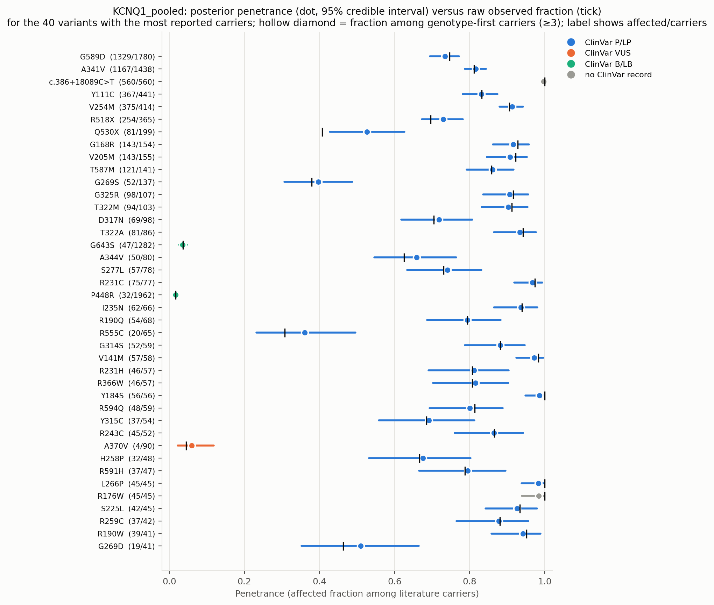
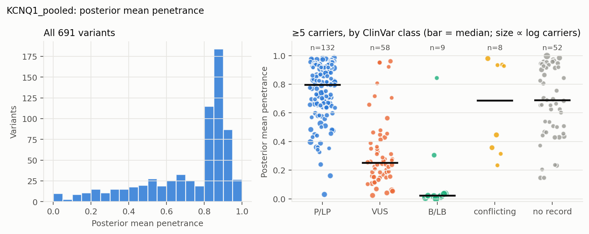
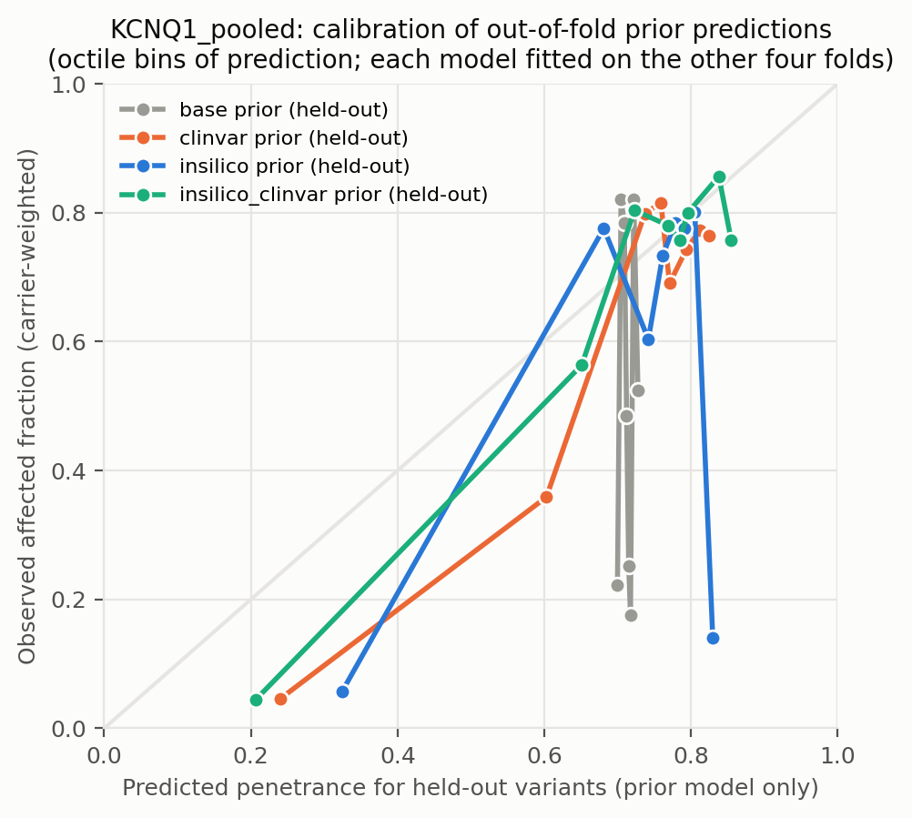
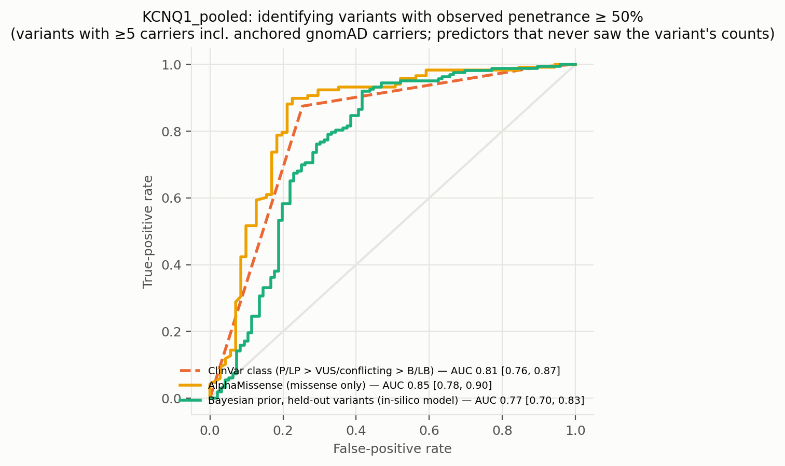
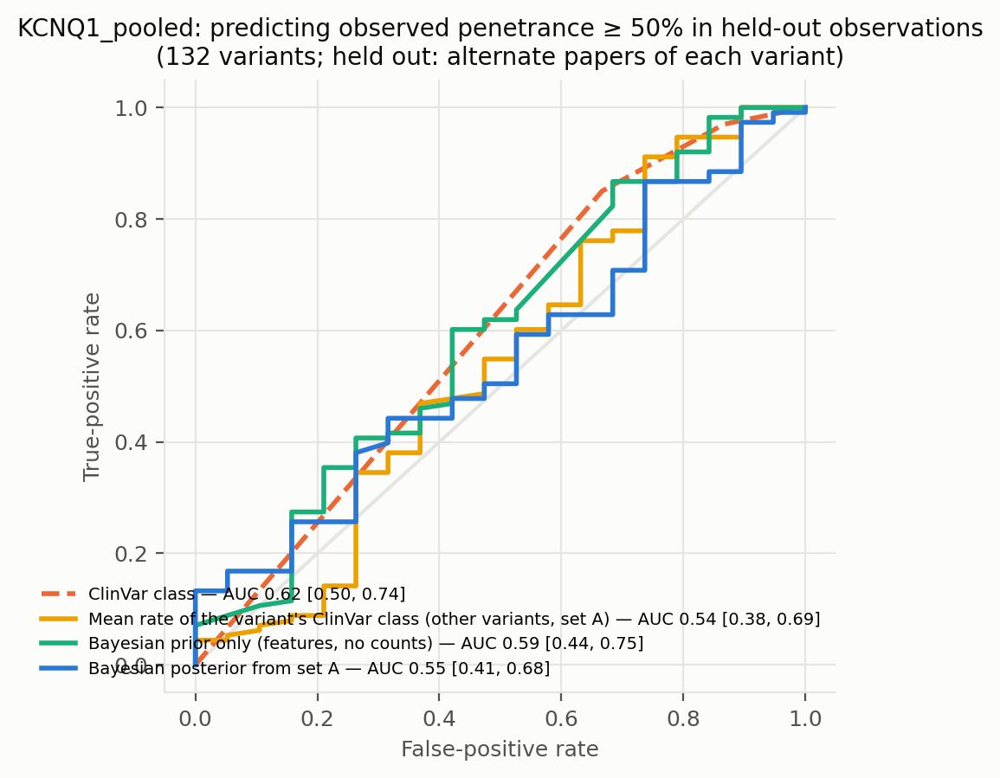
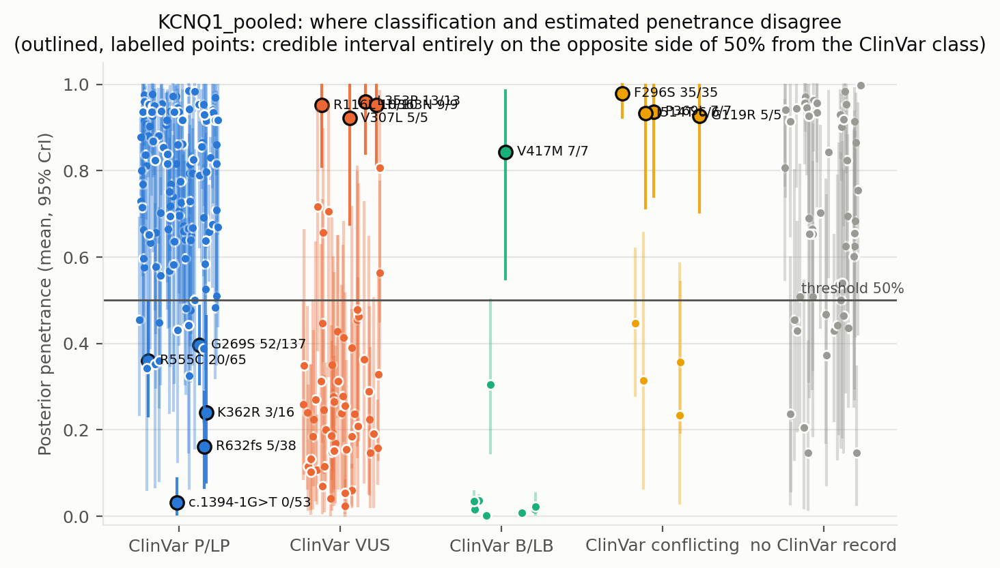
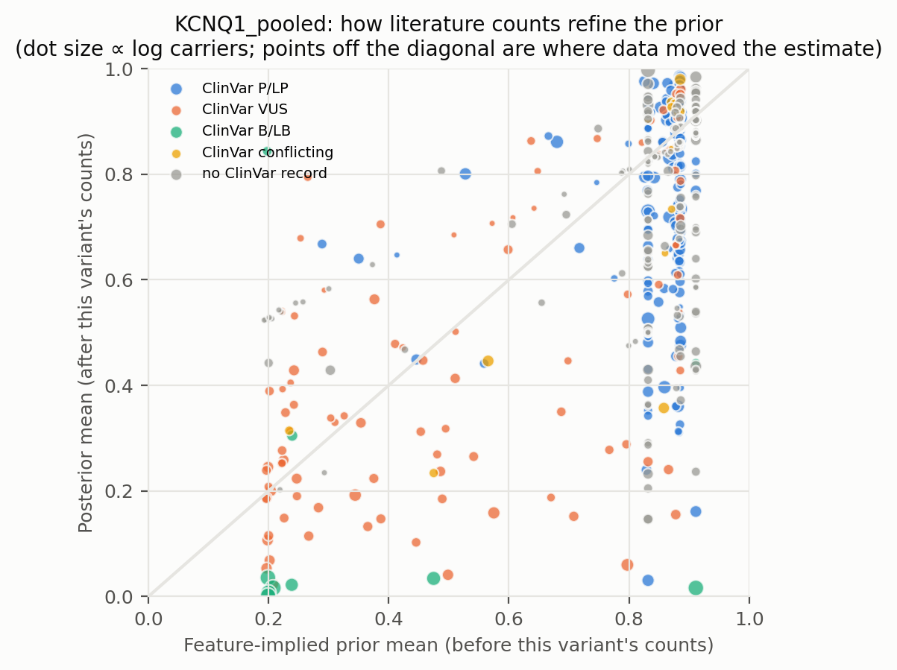
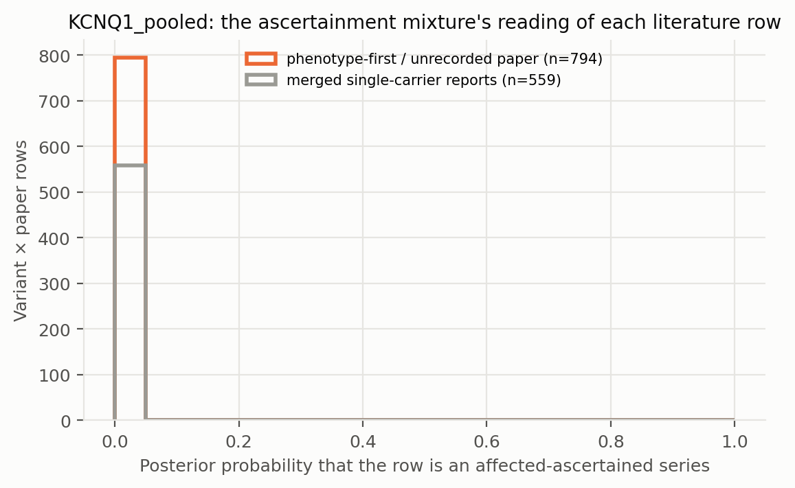

# KCNQ1_pooled: literature-derived penetrance with a Bayesian prior — automated report

Generated by `iterations/grant_e2e_20260909/scripts/make_report.py` from the frozen workflow (GeneVariantFetcher tag `grant-freeze-20260909`). All numbers below are produced by code from the run artifacts; none were edited by hand.

## Data

| Quantity | Value |
| --- | ---: |
| Papers in the extraction database | 2383 |
| Variant rows in the database | 10183 |
| Usable carrier observations (variant × paper) | 1909 |
| Papers contributing usable observations | None |
| Count rows without a usable denominator (excluded) | 423 |
| Quarantined count rows excluded by the trust gate | 0 |
| Distinct variants with carrier counts | 699 |
| Total literature carriers / affected | 10656 / 8392 |
| Variants with ≥5 carriers (evaluation set; carriers = literature + anchored gnomAD) | 259 |
| Share of observations that are single affected probands | 0.54 |
| Missense variants with an AlphaMissense score | 396 / 443 |
| Variants with a ClinVar record | 384 / 699 |
| Feature transcript | ENST00000155840.12 |
| gnomAD carriers added as unaffected | 7225 (on) |

Denominator sources: explicit = 1377, individual_records = 3, total_derived = 529. Study designs (paper level): unknown = 1909.

ClinVar classes among variants with counts: B/LB = 15, Conflicting = 17, P/LP = 231, VUS = 121, none = 315.

## Model

Hierarchical logistic-binomial on variant × paper rows (1505 rows, 691 variants) with a between-variant effect and a between-study effect (no ascertainment mixture). Primary model `insilico`.

| Model | Features | σ (between-variant SD, logit) | τ (between-study SD, logit) | π ascertained: phenotype-first / genotype-first rows (typical frequency) | g2 (per SD of log10 AF) | max R̂ | min ESS | divergences |
| --- | --- | ---: | ---: | ---: | ---: | ---: | ---: | ---: |
| base | — | 2.23 | 0.22 | — | — | 1.010 | 429 | 0 |
| class | trunc | 2.22 | 0.22 | — | — | 1.020 | 264 | 0 |
| clinvar | trunc, clinvar_plp, clinvar_blb, clinvar_none | 1.79 | 0.22 | — | — | 1.010 | 710 | 0 |
| insilico | trunc, am, am_missing | 1.82 | 0.22 | — | — | 1.010 | 480 | 0 |
| insilico_clinvar | trunc, am, am_missing, clinvar_plp, clinvar_blb, clinvar_none | 1.70 | 0.22 | — | — | 1.010 | 912 | 0 |

Primary-model coefficients (posterior mean [94% HDI]): `alpha` 1.24 [0.99, 1.48]; `sigma` 1.82 [1.61, 2.00]; `beta[trunc]` 0.37 [-0.09, 0.83]; `beta[am]` 1.22 [1.02, 1.45]; `beta[am_missing]` 1.12 [0.55, 1.67]; `tau` 0.22 [0.21, 0.24].

## Held-out predictive performance (5-fold by variant)

| Prior model | NLL / carrier ↓ | Brier / carrier ↓ | log pred. density / row ↑ | calibration slope (1 = ideal) |
| --- | ---: | ---: | ---: | ---: |
| base | 0.8228 | 0.2697 | -1.219 | nan |
| class | 0.8213 | 0.2690 | -1.211 | 2.01 |
| insilico | 0.5846 | 0.1539 | -1.217 | 1.54 |
| clinvar | 0.4447 | 0.0961 | -1.223 | 2.07 |
| insilico_clinvar | 0.4324 | 0.0955 | -1.232 | 1.76 |

Scored on held-out variant × paper rows (each fold's model never saw the held-out variants; predictions integrate both the variant and the study effect).

Paired bootstrap change in NLL per carrier versus the `base` prior (negative = better): `class` -0.0016 [-0.0118, +0.0090]; `insilico` -0.2382 [-0.4227, -0.0169]; `clinvar` -0.3781 [-0.5333, -0.1312]; `insilico_clinvar` -0.3904 [-0.5717, -0.1608].

Paired bootstrap change in NLL per carrier versus the `clinvar` prior (negative = better): `base` +0.3781 [+0.1438, +0.5395]; `class` +0.3765 [+0.1526, +0.5482]; `insilico` +0.1399 [+0.0080, +0.3158]; `insilico_clinvar` -0.0123 [-0.0583, +0.0568].

## Classification performance: identifying variants with observed penetrance ≥ 50%

Evaluation set: variants with ≥5 carriers — literature carriers plus the anchored gnomAD carriers, which also enter the observed fraction that defines the label. Label: observed fraction ≥ 50%. AUC with 95% bootstrap interval.

| Scorer | variants | high-penetrance variants | AUC | 95% CI |
| --- | ---: | ---: | ---: | --- |
| clinvar_ordinal | 207 | 128 | 0.814 | [0.757, 0.872] |
| clinvar_plp_binary | 207 | 128 | 0.811 | [0.756, 0.866] |
| alphamissense_missense_only | 189 | 118 | 0.846 | [0.776, 0.905] |
| insilico_posterior_mean_in_sample_LEAKY | 259 | 163 | 0.997 | [0.993, 1.000] |
| base_oof_prior | 259 | 163 | 0.527 | [0.451, 0.605] |
| class_oof_prior | 259 | 163 | 0.474 | [0.402, 0.550] |
| insilico_oof_prior | 259 | 163 | 0.767 | [0.699, 0.831] |
| clinvar_oof_prior | 259 | 163 | 0.722 | [0.647, 0.792] |
| insilico_clinvar_oof_prior | 259 | 163 | 0.764 | [0.691, 0.830] |

**Literature-only labels.** The table above defines high penetrance over literature carriers plus the anchored gnomAD carriers, so its labels partly encode the anchor assumption. The same scorers against the literature fraction alone (≥5 literature carriers; the 6 common alleles with AF > 0.001 excluded because their literature fraction is known to be ascertainment) — an ascertainment-inflated but anchor-free label:

| Scorer | variants | high-penetrance variants | AUC | 95% CI |
| --- | ---: | ---: | ---: | --- |
| clinvar_ordinal | 155 | 138 | 0.620 | [0.502, 0.745] |
| clinvar_plp_binary | 155 | 138 | 0.623 | [0.497, 0.742] |
| alphamissense_missense_only | 145 | 128 | 0.513 | [0.357, 0.673] |
| insilico_posterior_mean_in_sample_LEAKY | 207 | 174 | 0.936 | [0.901, 0.965] |
| base_oof_prior | 207 | 174 | 0.530 | [0.405, 0.650] |
| class_oof_prior | 207 | 174 | 0.371 | [0.264, 0.473] |
| insilico_oof_prior | 207 | 174 | 0.505 | [0.382, 0.621] |
| clinvar_oof_prior | 207 | 174 | 0.384 | [0.271, 0.508] |
| insilico_clinvar_oof_prior | 207 | 174 | 0.410 | [0.292, 0.537] |

The `_LEAKY` row uses the posterior that already contains the variant's own counts, which also define the label; it is shown only to make the leakage explicit and is not a validation.

Binary rule 'ClinVar P/LP ⇒ high penetrance': sensitivity 0.88, specificity 0.75, PPV 0.85, NPV 0.79 (TP 112, FP 20, FN 16, TN 59).

Other thresholds: ≥25%: clinvar_ordinal 0.83, insilico_oof_prior 0.78; ≥75%: clinvar_ordinal 0.70, insilico_oof_prior 0.69.

## Held-out observations of known variants: penetrance estimate versus classification

**Alternate-paper hold-out.** For each variant reported in ≥2 papers, papers are split alternately by PMID; set A updates the prior, set B is scored (132 variants, 3774 held-out carriers). Because B still contains phenotype-first reports, the prediction for B is the mixture prediction (ascertained series with probability π, informative otherwise).

The ClinVar comparator predicts each variant with the observed A-rate of its ClinVar class among the *other* variants; the pooled rate is the A-rate over all variants.

| Predictor for held-out observations | NLL / carrier ↓ | Brier / carrier ↓ |
| --- | ---: | ---: |
| posterior_from_half_A | 0.8135 | 0.1427 |
| prior_only | 0.5234 | 0.0401 |
| pooled_rate_half_A | 0.8818 | 0.2121 |
| clinvar_class_rate_half_A | 0.5767 | 0.0458 |

Paired bootstrap change in NLL per held-out carrier, posterior-from-A minus ClinVar-class rate: +0.2368 [+0.0691, +0.3492] (negative favours the count-informed estimate).

Paired bootstrap change in NLL per held-out carrier, posterior-from-A minus pooled rate: -0.0684 [-0.2843, +0.0862] (negative favours the count-informed estimate).

Paired bootstrap change in NLL per held-out carrier, posterior-from-A minus features-only prior: +0.2901 [+0.1170, +0.4205] (negative favours the count-informed estimate).

| Scorer (label: observed ≥ 50% in set B) | variants | AUC | 95% CI |
| --- | ---: | ---: | --- |
| posterior_from_half_A | 132 | 0.546 | [0.407, 0.678] |
| prior_only | 132 | 0.592 | [0.438, 0.752] |
| pooled_rate_half_A | 132 | 0.500 | [0.500, 0.500] |
| clinvar_class_rate_half_A | 132 | 0.538 | [0.378, 0.693] |
| clinvar_ordinal | 132 | 0.620 | [0.500, 0.741] |

## Common variants: the known-outcome check

Variants with gnomAD allele frequency above 0.001 are common alleles whose outcome is known independently of the literature: at most a GWAS-scale risk, no Mendelian penetrance. They stay in the model as a check. In case-series literature they look penetrant (median literature fraction 0.51; 50% of them are ≥ 50% affected among reported carriers); the model's estimate for them should be near the population risk: median posterior 0.016, 100% with the 97.5% bound below 10%.

| Variant | ClinVar | gnomAD AF | gnomAD carriers added | affected / literature carriers | literature fraction | posterior mean [97.5%] |
| --- | --- | ---: | ---: | ---: | ---: | --- |
| G643S | B/LB | 7.89e-03 | 1201 | 47 / 81 | 0.58 | 0.036 [0.047] |
| P448R | B/LB | 7.54e-03 | 1888 | 32 / 74 | 0.43 | 0.016 [0.023] |
| V648I | B/LB | 6.74e-03 | 1025 | 0 / 10 | 0.00 | 0.002 [0.004] |
| I145= | B/LB | 4.74e-03 | 1192 | 18 / 24 | 0.75 | 0.016 [0.024] |
| P408A | B/LB | 4.18e-03 | 636 | 4 / 14 | 0.29 | 0.008 [0.015] |
| K393N | B/LB | 1.09e-03 | 275 | 9 / 14 | 0.64 | 0.034 [0.057] |

## Examples where the classification is wrong about penetrance

Variants with ≥5 literature carriers whose 95% credible interval lies entirely on the other side of 50% from what the ClinVar class implies. `literature affected / carriers` are the extracted counts, `gnomAD added` the anchored population carriers (assumed unaffected) that also enter the posterior; `genotype-first` are the affected / carriers in screening or cascade rows, the evidence least affected by ascertainment. PMIDs are the source papers.

| Variant | Class | ClinVar | literature affected / carriers | literature fraction | gnomAD added | genotype-first affected / carriers | posterior mean [95% CrI] | prior mean | papers | PMIDs |
| --- | --- | --- | ---: | ---: | ---: | ---: | --- | ---: | ---: | --- |
| G269S | missense | P/LP | 52 / 136 | 0.38 | 1 | — | 0.40 [0.31, 0.49] | 0.86 | 21 | 10973849, 12205113, 12702160, 15466642, 16436635, 17023080 (+15) |
| R555C | missense | P/LP | 20 / 63 | 0.32 | 2 | — | 0.36 [0.23, 0.50] | 0.88 | 8 | 10973849, 14998624, 26715165, 30758498, 32893267, 37568094 (+2) |
| F296S | missense | Conflicting | 35 / 35 | 1.00 | 0 | — | 0.98 [0.92, 1.00] | 0.89 | 4 | 21350584, 22199116, 29688407, 32893267 |
| L353P | missense | VUS | 13 / 13 | 1.00 | 0 | — | 0.96 [0.84, 1.00] | 0.89 | 5 | 10973849, 19841300, 22949429, 32893267, 36496179 |
| R116L | missense | VUS | 10 / 10 | 1.00 | 0 | — | 0.95 [0.81, 1.00] | 0.88 | 1 | 29097701 |
| H363N | missense | VUS | 9 / 9 | 1.00 | 0 | — | 0.95 [0.80, 1.00] | 0.89 | 4 | 24357532, 24606995, 32893267, 34531279 |
| P369L | missense | Conflicting | 7 / 7 | 1.00 | 0 | — | 0.94 [0.74, 1.00] | 0.87 | 2 | 29097701, 36077086 |
| V417M | missense | B/LB | 7 / 7 | 1.00 | 0 | — | 0.84 [0.55, 0.99] | 0.20 | 1 | 14756674 |
| I514T | missense | Conflicting | 6 / 6 | 1.00 | 0 | — | 0.93 [0.71, 1.00] | 0.88 | 1 | 32893267 |
| K362R | missense | P/LP | 3 / 6 | 0.50 | 10 | — | 0.24 [0.08, 0.46] | 0.83 | 4 | 19841300, 22949429, 32893267, 34135346 |
| R632fs | indel_cdna | P/LP | 5 / 6 | 0.83 | 32 | — | 0.16 [0.07, 0.29] | 0.91 | 4 | 23098067, 25187895, 32893267, 34691145 |
| G119R | missense | Conflicting | 5 / 5 | 1.00 | 0 | — | 0.93 [0.70, 1.00] | 0.87 | 3 | 27379800, 32893267, 41013213 |
| V307L | missense | VUS | 5 / 5 | 1.00 | 0 | — | 0.92 [0.68, 1.00] | 0.86 | 5 | 20126594, 25974115, 31315195, 34557911, 39503779 |

Counts: 4 P/LP variants estimated below 50%; 9 non-P/LP variants estimated above 50% (≥5 literature carriers). Under the frozen rule that also counts anchored gnomAD carriers towards the ≥5 minimum, `fit/discordant_variants.csv` lists 5 and 9.

Reading the table: when a variant's genotype-first carriers are mostly affected but the posterior is low, the population anchor (gnomAD carriers assumed unaffected), not the literature, is driving the estimate — the anchor assumption fails for phenotypes that are common and unmeasured in gnomAD.

Evidence rows behind the first discordant variants (per paper; `ascertained` = posterior probability that the row is an affected-only series):

| Variant | PMID | affected / carriers | ascertainment recorded | ascertained |
| --- | --- | ---: | --- | ---: |
| G269S | 36277779 | 0 / 25 | — | 0.00 |
| G269S | 29439887 | 3 / 20 | — | 0.00 |
| G269S | 30758498 | 6 / 20 | — | 0.00 |
| G269S | 32893267 | 17 / 17 | — | 0.00 |
| G269S | 12702160 | 1 / 11 | — | 0.00 |
| G269S | 24184248 | 1 / 11 | — | 0.00 |
| R555C | 9386136 | 7 / 44 | — | 0.00 |
| R555C | 30758498 | 1 / 6 | — | 0.00 |
| R555C | 32893267 | 5 / 5 | — | 0.00 |
| R555C | 10973849 | 3 / 3 | — | 0.00 |
| R555C | single_carrier_reports | 3 / 3 | — | 0.00 |
| R555C | 37568094 | 1 / 2 | — | 0.00 |
| F296S | 21350584 | 20 / 20 | — | 0.00 |
| F296S | 22199116 | 9 / 9 | — | 0.00 |
| F296S | 32893267 | 5 / 5 | — | 0.00 |
| F296S | single_carrier_reports | 1 / 1 | — | 0.00 |
| L353P | 36496179 | 8 / 8 | — | 0.00 |
| L353P | single_carrier_reports | 3 / 3 | — | 0.00 |
| L353P | 32893267 | 2 / 2 | — | 0.00 |
| R116L | 29097701 | 10 / 10 | — | 0.00 |
| H363N | 24357532 | 4 / 4 | — | 0.00 |
| H363N | 32893267 | 2 / 2 | — | 0.00 |
| H363N | 34531279 | 2 / 2 | — | 0.00 |
| H363N | single_carrier_reports | 1 / 1 | — | 0.00 |
| P369L | 29097701 | 6 / 6 | — | 0.00 |
| P369L | single_carrier_reports | 1 / 1 | — | 0.00 |
| V417M | 14756674 | 7 / 7 | — | 0.00 |

## Figures

**Figure — Posterior penetrance (dot, 95% credible interval) versus the raw observed fraction (tick) for the best-observed variants, coloured by ClinVar class.**

**Figure — Distribution of posterior mean penetrance across all variants, and by ClinVar class for variants with enough carriers.**

**Figure — Calibration of held-out prior predictions (each model predicts variants it never saw).**

**Figure — ROC curves for identifying observed high-penetrance variants: ClinVar class alone, AlphaMissense alone, the held-out Bayesian prior, and the posterior that includes the variant's own counts.**

**Figure — Alternate-paper hold-out: the posterior built from half of each variant's papers predicts the observed penetrance in the other half; compared with ClinVar class and a features-only prior.**

**Figure — Where classification and estimated penetrance disagree; outlined, labelled points are the discordant variants listed above.**

**Figure — Prior mean versus posterior mean: how the literature counts refine the feature-implied prior.**

**Figure — How the mixture reads the literature: posterior probability that each variant × paper row is a pure affected series, by the paper's recorded ascertainment.**

## Limitations that travel with these numbers

- Counts are pooled across papers; cohort overlap between publications cannot be resolved from the extraction, so denominators may double count.
- Probands are included; ascertainment inflates penetrance, most strongly for variants known only from single case reports (see the single-proband share above).
- 'Affected' follows each paper's own phenotype definition for the gene–disease pair; ages are not modelled.
- ClinVar classes are as of the variantFeatures snapshot; frameshift/splice alleles often lack a warehouse record and appear as 'no ClinVar record'.
- Held-out metrics score the prior model; posterior values include the variant's own counts and are the estimate a user would see, not a validation.

- In the anchored arms the frozen evaluation set and the 'observed ≥ threshold' label include the gnomAD carriers assumed unaffected; the literature-only table, the genotype-first hold-out and the common-variant check are the anchor-independent views.

## Artifacts

`observations.csv`, `variants.csv`, `variants_features.csv`, `fit/posterior_variants.csv`, `fit/oof_predictions.csv`, `fit/metrics.csv`, `fit/classification_metrics.csv`, `fit/discordant_variants.csv`, `fit/coefficients.csv`, `fit/model_diagnostics.csv`, `fit/fit_summary.json` in the analysis directory.
