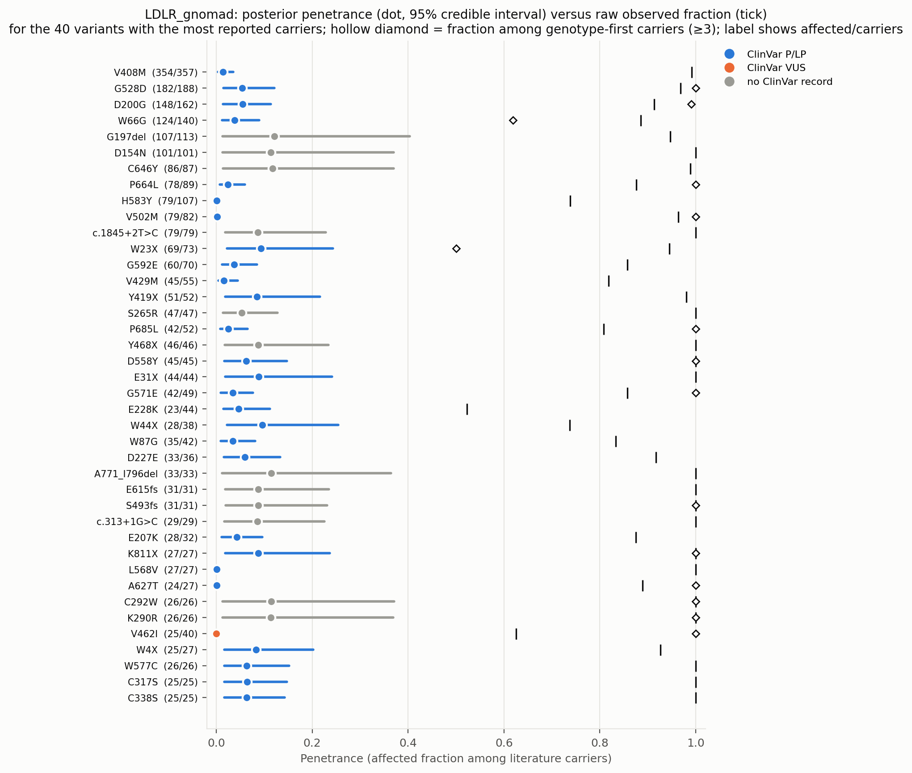
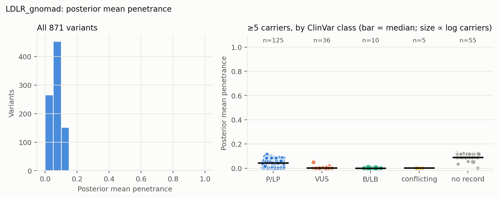
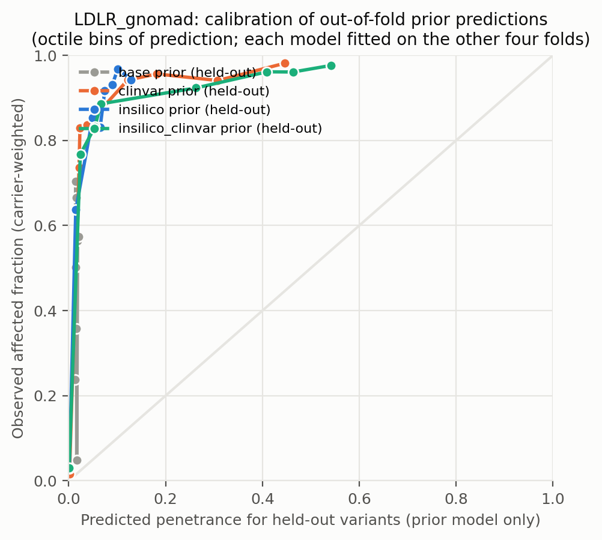
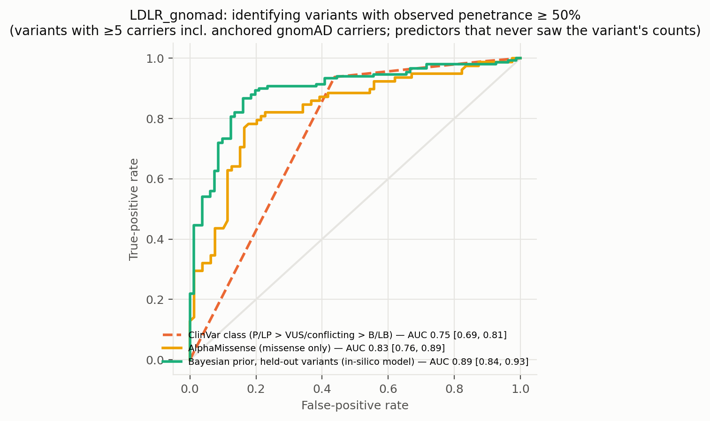
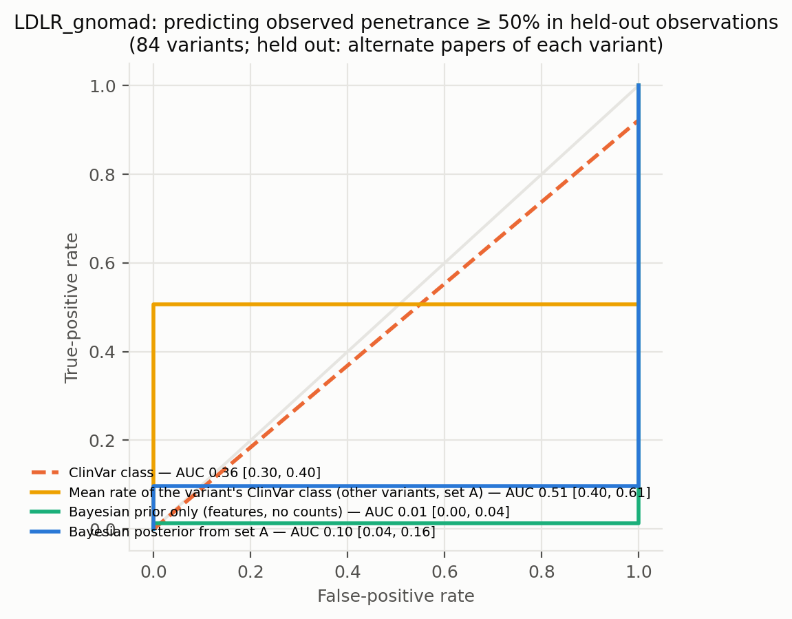
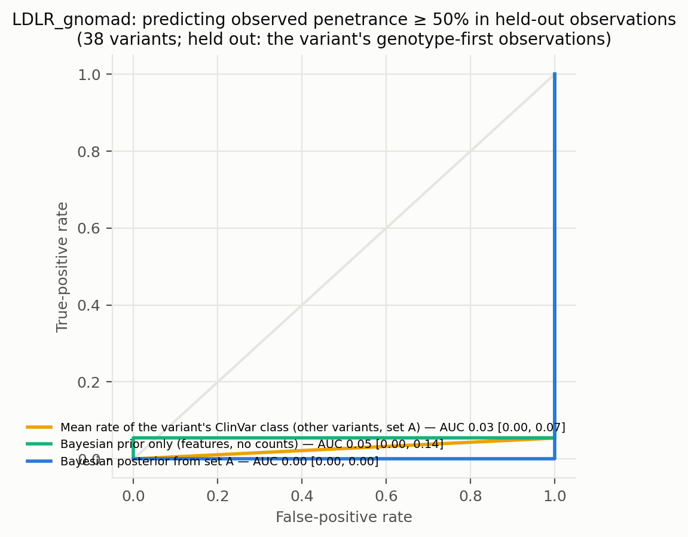
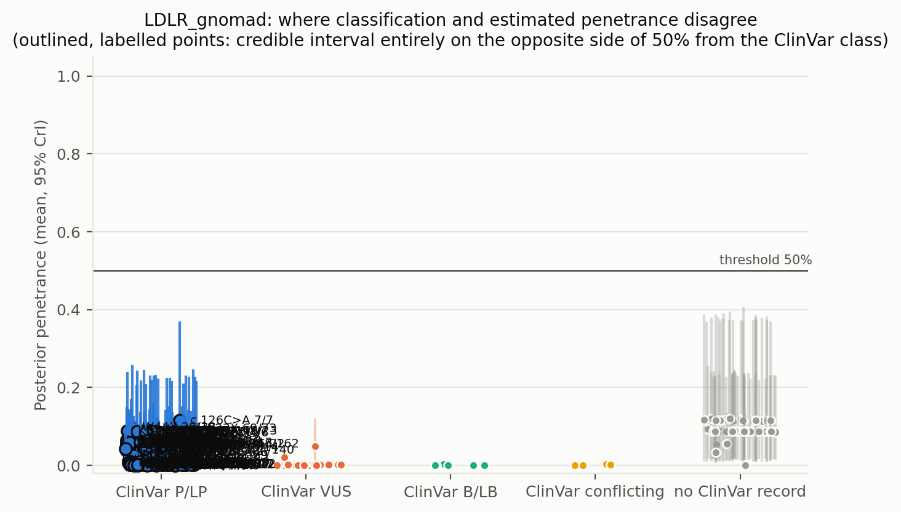
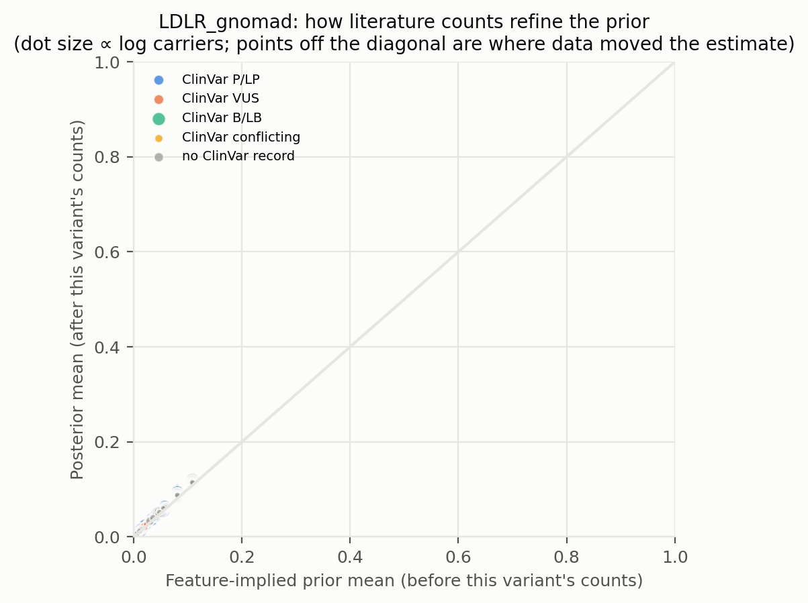
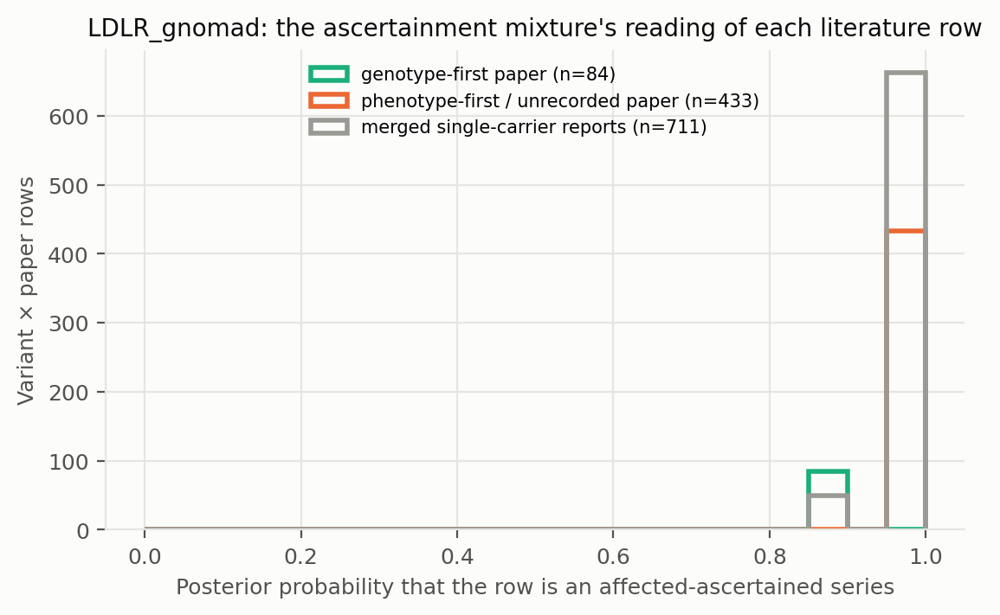

# LDLR_gnomad: literature-derived penetrance with a Bayesian prior — automated report

Generated by `iterations/grant_e2e_20260909/scripts/make_report.py` from the frozen workflow (GeneVariantFetcher tag `grant-freeze-20260909`). All numbers below are produced by code from the run artifacts; none were edited by hand.

## Data

| Quantity | Value |
| --- | ---: |
| Papers in the extraction database | 2431 |
| Variant rows in the database | 30433 |
| Usable carrier observations (variant × paper) | 1554 |
| Papers contributing usable observations | 433 |
| Count rows without a usable denominator (excluded) | 3899 |
| Quarantined count rows excluded by the trust gate | 813 |
| Distinct variants with carrier counts | 880 |
| Total literature carriers / affected | 4811 / 4595 |
| Variants with ≥5 carriers (evaluation set; carriers = literature + anchored gnomAD) | 231 |
| Share of observations that are single affected probands | 0.66 |
| Missense variants with an AlphaMissense score | 434 / 522 |
| Variants with a ClinVar record | 479 / 880 |
| Feature transcript | ENST00000558518.6 |
| gnomAD carriers added as unaffected | 17079 (on) |

Denominator sources: explicit = 246, individual_records = 128, total_derived = 1180. Study designs (paper level): case_series = 696, cohort_population = 384, unknown = 178, case_report = 147, family_segregation = 75, case_control = 42, clinical_trial = 15, functional_invitro = 6, other = 6, cohort = 3, cohort_biobank = 1, review_meta = 1.

Excluded count rows by shape: affected_only_no_denominator = 42, other_or_inconsistent = 57, total_only_no_phenotype_split = 3777, unaffected_only = 23. Largest sources of total-only rows (carrier totals with no affected/unaffected split): PMID 33418990 (412 rows, 546 carriers, design unrecorded); PMID 33508743 (272 rows, 736 carriers, design unrecorded); PMID 38506081 (206 rows, 548 carriers, design unrecorded).

ClinVar classes among variants with counts: B/LB = 18, Conflicting = 17, P/LP = 363, VUS = 81, none = 401.

## Model

Hierarchical logistic-binomial on variant × paper rows (1449 rows after merging single-carrier reports per variant, 871 variants). Each row is either an **affected-ascertained series** (probability π, success probability p_asc ≈ 1) or an **informative observation** of the variant's penetrance: `y_r ~ π·Binomial(n_r, p_asc) + (1−π)·Binomial(n_r, p_r)`, `logit(p_r) = α + x_v·β + σ·z_v + τ·e_r`, with a between-variant effect `z_v` and a between-study effect `e_r`; `logit(π_r) = g0 + g1·[genotype-first ascertainment recorded for the paper] + g2·[standardized log10 gnomAD allele frequency of the variant]` (case series of common alleles are ascertainment). gnomAD anchor rows are informative by construction and carry no study effect. Fitted by NUTS (PyMC, 4 chains). The posterior of `p_v = sigmoid(α + x_v·β + σ·z_v)` is the penetrance estimate among carriers not selected for being affected: variants with many informative carriers are driven by their own counts; variants known only from case reports are shrunk toward the feature-implied prior and carry wide intervals. Fixed-effect sets: `base` (intercept only), `class` (truncating), `insilico` (class + AlphaMissense), `clinvar` (class + ClinVar P/LP, B/LB, no-record), `insilico_clinvar`. The primary model is `insilico`.

| Model | Features | σ (between-variant SD, logit) | τ (between-study SD, logit) | π ascertained: phenotype-first / genotype-first rows (typical frequency) | g2 (per SD of log10 AF) | max R̂ | min ESS | divergences |
| --- | --- | ---: | ---: | ---: | ---: | ---: | ---: | ---: |
| base | — | 1.47 | 3.01 | 0.97 / 0.88 | -0.09 | 1.000 | 1418 | 0 |
| class | trunc | 1.37 | 2.87 | 0.97 / 0.88 | -0.06 | 1.000 | 1259 | 0 |
| clinvar | trunc, clinvar_plp, clinvar_blb, clinvar_none | 0.28 | 2.32 | 0.96 / 0.84 | +0.04 | 1.000 | 624 | 0 |
| insilico | trunc, am, am_missing | 0.37 | 2.44 | 0.97 / 0.86 | +0.03 | 1.000 | 977 | 0 |
| insilico_clinvar | trunc, am, am_missing, clinvar_plp, clinvar_blb, clinvar_none | 0.24 | 2.18 | 0.96 / 0.84 | +0.11 | 1.000 | 1333 | 0 |

Primary-model coefficients (posterior mean [94% HDI]): `alpha` -4.68 [-5.23, -4.17]; `sigma` 0.37 [0.00, 0.83]; `beta[trunc]` 2.14 [1.15, 3.08]; `beta[am]` 1.99 [1.45, 2.48]; `beta[am_missing]` 2.31 [0.71, 3.82]; `tau` 2.44 [1.88, 2.96]; `g0` 3.39 [3.02, 3.81]; `g1` -1.51 [-2.17, -0.91]; `g2` 0.03 [-0.23, 0.27]; `p_asc` 0.99 [0.99, 0.99].

## Held-out predictive performance (5-fold by variant)

| Prior model | NLL / carrier ↓ | Brier / carrier ↓ | log pred. density / row ↑ | calibration slope (1 = ideal) |
| --- | ---: | ---: | ---: | ---: |
| base | 0.0538 | 0.0054 | -0.362 | 1.46 |
| class | 0.0506 | 0.0053 | -0.358 | 1.42 |
| insilico | 0.0425 | 0.0052 | -0.343 | 1.23 |
| clinvar | 0.0429 | 0.0052 | -0.339 | 1.21 |
| insilico_clinvar | 0.0421 | 0.0052 | -0.333 | 1.19 |

Scored on held-out variant × paper rows (each fold's model never saw the held-out variants; predictions integrate both the variant and the study effect).

Paired bootstrap change in NLL per carrier versus the `base` prior (negative = better): `class` -0.0032 [-0.0043, -0.0002]; `insilico` -0.0113 [-0.0136, -0.0036]; `clinvar` -0.0109 [-0.0134, -0.0019]; `insilico_clinvar` -0.0117 [-0.0142, -0.0031].

Paired bootstrap change in NLL per carrier versus the `clinvar` prior (negative = better): `base` +0.0109 [+0.0020, +0.0135]; `class` +0.0077 [+0.0011, +0.0093]; `insilico` -0.0004 [-0.0024, +0.0002]; `insilico_clinvar` -0.0008 [-0.0019, -0.0002].

## Classification performance: identifying variants with observed penetrance ≥ 50%

Evaluation set: variants with ≥5 carriers — literature carriers plus the anchored gnomAD carriers, which also enter the observed fraction that defines the label. Label: observed fraction ≥ 50%. AUC with 95% bootstrap interval.

| Scorer | variants | high-penetrance variants | AUC | 95% CI |
| --- | ---: | ---: | ---: | --- |
| clinvar_ordinal | 176 | 96 | 0.751 | [0.692, 0.813] |
| clinvar_plp_binary | 176 | 96 | 0.750 | [0.688, 0.812] |
| alphamissense_missense_only | 157 | 78 | 0.828 | [0.757, 0.893] |
| insilico_posterior_mean_in_sample_LEAKY | 231 | 150 | 0.902 | [0.862, 0.940] |
| base_oof_prior | 231 | 150 | 0.473 | [0.397, 0.547] |
| class_oof_prior | 231 | 150 | 0.673 | [0.602, 0.742] |
| insilico_oof_prior | 231 | 150 | 0.892 | [0.843, 0.934] |
| clinvar_oof_prior | 231 | 150 | 0.866 | [0.818, 0.909] |
| insilico_clinvar_oof_prior | 231 | 150 | 0.912 | [0.872, 0.947] |

**Literature-only labels.** The table above defines high penetrance over literature carriers plus the anchored gnomAD carriers, so its labels partly encode the anchor assumption. The same scorers against the literature fraction alone (≥5 literature carriers; the 5 common alleles with AF > 0.001 excluded because their literature fraction is known to be ascertainment) — an ascertainment-inflated but anchor-free label:

| Scorer | variants | high-penetrance variants | AUC | 95% CI |
| --- | ---: | ---: | ---: | --- |
| clinvar_ordinal | 98 | 95 | 0.447 | [0.417, 0.479] |
| clinvar_plp_binary | 98 | 95 | 0.447 | [0.419, 0.474] |
| alphamissense_missense_only | 84 | 81 | 0.531 | [0.241, 0.744] |
| insilico_posterior_mean_in_sample_LEAKY | 153 | 149 | 0.552 | [0.044, 0.841] |
| base_oof_prior | 153 | 149 | 0.471 | [0.064, 0.771] |
| class_oof_prior | 153 | 149 | 0.663 | [0.375, 0.884] |
| insilico_oof_prior | 153 | 149 | 0.565 | [0.225, 0.842] |
| clinvar_oof_prior | 153 | 149 | 0.547 | [0.330, 0.720] |
| insilico_clinvar_oof_prior | 153 | 149 | 0.648 | [0.364, 0.851] |

The `_LEAKY` row uses the posterior that already contains the variant's own counts, which also define the label; it is shown only to make the leakage explicit and is not a validation.

Binary rule 'ClinVar P/LP ⇒ high penetrance': sensitivity 0.94, specificity 0.56, PPV 0.72, NPV 0.88 (TP 90, FP 35, FN 6, TN 45).

Other thresholds: ≥25%: clinvar_ordinal 0.82, insilico_oof_prior 0.87; ≥75%: clinvar_ordinal 0.68, insilico_oof_prior 0.84.

## Held-out observations of known variants: penetrance estimate versus classification

**Alternate-paper hold-out.** For each variant reported in ≥2 papers, papers are split alternately by PMID; set A updates the prior, set B is scored (84 variants, 1645 held-out carriers). Because B still contains phenotype-first reports, the prediction for B is the mixture prediction (ascertained series with probability π, informative otherwise).

The ClinVar comparator predicts each variant with the observed A-rate of its ClinVar class among the *other* variants; the pooled rate is the A-rate over all variants.

| Predictor for held-out observations | NLL / carrier ↓ | Brier / carrier ↓ |
| --- | ---: | ---: |
| posterior_from_half_A | 0.1201 | 0.0080 |
| prior_only | 0.1200 | 0.0080 |
| pooled_rate_half_A | 0.4058 | 0.0973 |
| clinvar_class_rate_half_A | 0.2792 | 0.0525 |

Paired bootstrap change in NLL per held-out carrier, posterior-from-A minus ClinVar-class rate: -0.1591 [-0.2180, -0.0957] (negative favours the count-informed estimate).

Paired bootstrap change in NLL per held-out carrier, posterior-from-A minus pooled rate: -0.2857 [-0.3173, -0.2332] (negative favours the count-informed estimate).

Paired bootstrap change in NLL per held-out carrier, posterior-from-A minus features-only prior: +0.0001 [-0.0001, +0.0004] (negative favours the count-informed estimate).

| Scorer (label: observed ≥ 50% in set B) | variants | AUC | 95% CI |
| --- | ---: | ---: | --- |
| posterior_from_half_A | 84 | 0.096 | [0.037, 0.161] |
| prior_only | 84 | 0.012 | [0.000, 0.037] |
| pooled_rate_half_A | 84 | 0.500 | [0.500, 0.500] |
| clinvar_class_rate_half_A | 84 | 0.506 | [0.398, 0.614] |
| clinvar_ordinal | 84 | 0.355 | [0.301, 0.401] |

**Genotype-first hold-out.** Set B = the variant's observations from papers whose ascertainment the extractor recorded as population screening or cascade testing; set A = its phenotype-first observations (case reports, referral series) plus any gnomAD anchor. A updates the feature prior into a variant posterior (exact grid update; the mixture likelihood per row, study effects integrated, τ/π/p_asc at posterior means); B is scored (38 variants, 565 held-out genotype-first carriers). This is the clinical question: does case-based literature plus features predict the penetrance seen when carriers are found by genotype?

The ClinVar comparator predicts each variant with the observed A-rate of its ClinVar class among the *other* variants; the pooled rate is the A-rate over all variants.

| Predictor for held-out observations | NLL / carrier ↓ | Brier / carrier ↓ |
| --- | ---: | ---: |
| posterior_from_half_A | 0.2543 | 0.0287 |
| prior_only | 0.2537 | 0.0285 |
| pooled_rate_half_A | 1.2339 | 0.4654 |
| clinvar_class_rate_half_A | 0.4707 | 0.0928 |

Paired bootstrap change in NLL per held-out carrier, posterior-from-A minus ClinVar-class rate: -0.2164 [-0.5337, -0.0411] (negative favours the count-informed estimate).

Paired bootstrap change in NLL per held-out carrier, posterior-from-A minus pooled rate: -0.9796 [-1.0996, -0.7550] (negative favours the count-informed estimate).

Paired bootstrap change in NLL per held-out carrier, posterior-from-A minus features-only prior: +0.0005 [-0.0002, +0.0012] (negative favours the count-informed estimate).

| Scorer (label: observed ≥ 50% in set B) | variants | AUC | 95% CI |
| --- | ---: | ---: | --- |
| posterior_from_half_A | 38 | 0.000 | [0.000, 0.000] |
| prior_only | 38 | 0.054 | [0.000, 0.135] |
| pooled_rate_half_A | 38 | 0.500 | [0.500, 0.500] |
| clinvar_class_rate_half_A | 38 | 0.027 | [0.000, 0.068] |
| clinvar_ordinal | 38 | 0.811 | [0.719, 0.897] |

Largest genotype-first hold-outs (affected / carriers in B; predictions from A):

| Variant | ClinVar | A: affected / carriers | B (genotype-first): affected / carriers | observed B | posterior from A | features-only prior | ClinVar-class rate |
| --- | --- | ---: | ---: | ---: | ---: | ---: | ---: |
| D200G | P/LP | 38 / 51 | 110 / 111 | 0.99 | 0.88 | 0.88 | 0.85 |
| G528D | P/LP | 101 / 107 | 81 / 81 | 1.00 | 0.88 | 0.88 | 0.82 |
| V502M | P/LP | 30 / 33 | 49 / 49 | 1.00 | 0.86 | 0.86 | 0.84 |
| D558Y | P/LP | 4 / 4 | 41 / 41 | 1.00 | 0.88 | 0.88 | 0.84 |
| P664L | P/LP | 46 / 57 | 32 / 32 | 1.00 | 0.87 | 0.87 | 0.84 |
| S493fs | none | 4 / 4 | 27 / 27 | 1.00 | 0.88 | 0.88 | 0.97 |
| W66G | P/LP | 111 / 119 | 13 / 21 | 0.62 | 0.88 | 0.88 | 0.82 |
| V462I | VUS | 7 / 22 | 18 / 18 | 1.00 | 0.86 | 0.86 | 0.05 |
| c.1845+1G>A | none | 1 / 1 | 17 / 17 | 1.00 | 0.88 | 0.88 | 0.98 |
| E10X | none | 3 / 3 | 8 / 14 | 0.57 | 0.88 | 0.88 | 0.97 |

## Common variants: the known-outcome check

Variants with gnomAD allele frequency above 0.001 are common alleles whose outcome is known independently of the literature: at most a GWAS-scale risk, no Mendelian penetrance. They stay in the model as a check. In case-series literature they look penetrant (median literature fraction 1.00; 100% of them are ≥ 50% affected among reported carriers); the model's estimate for them should be near the population risk: median posterior 0.000, 100% with the 97.5% bound below 10%.

| Variant | ClinVar | gnomAD AF | gnomAD carriers added | affected / literature carriers | literature fraction | posterior mean [97.5%] |
| --- | --- | ---: | ---: | ---: | ---: | --- |
| A391T | B/LB | 8.01e-02 | 12192 | 2 / 2 | 1.00 | 0.000 [0.001] |
| T726I | B/LB | 5.48e-03 | 1378 | 7 / 8 | 0.88 | 0.000 [0.001] |
| T705I | B/LB | 5.48e-03 | 1378 | 1 / 1 | 1.00 | 0.000 [0.001] |
| R814Q | VUS | 1.11e-03 | 168 | 1 / 1 | 1.00 | 0.000 [0.001] |
| V827I | VUS | 1.01e-03 | 253 | 12 / 12 | 1.00 | 0.000 [0.001] |

## Examples where the classification is wrong about penetrance

Variants with ≥5 literature carriers whose 95% credible interval lies entirely on the other side of 50% from what the ClinVar class implies. `literature affected / carriers` are the extracted counts, `gnomAD added` the anchored population carriers (assumed unaffected) that also enter the posterior; `genotype-first` are the affected / carriers in screening or cascade rows, the evidence least affected by ascertainment. PMIDs are the source papers.

| Variant | Class | ClinVar | literature affected / carriers | literature fraction | gnomAD added | genotype-first affected / carriers | posterior mean [95% CrI] | prior mean | papers | PMIDs |
| --- | --- | --- | ---: | ---: | ---: | ---: | --- | ---: | ---: | --- |
| V408M | missense | P/LP | 354 / 354 | 1.00 | 3 | — | 0.01 [0.00, 0.04] | 0.01 | 13 | 11139254, 11317361, 11668627, 15556094, 16466730, 16828076 (+7) |
| G528D | missense | P/LP | 182 / 182 | 1.00 | 6 | 81 / 81 | 0.05 [0.01, 0.12] | 0.05 | 5 | 11317361, 15135251, 16828076, 17140581, 19446849 |
| D200G | missense | P/LP | 148 / 149 | 0.99 | 13 | 110 / 111 | 0.05 [0.01, 0.11] | 0.06 | 7 | 10208479, 10208484, 15135251, 17140581, 18279815, 19446849 (+1) |
| W66G | missense | P/LP | 124 / 133 | 0.93 | 7 | 13 / 21 | 0.04 [0.01, 0.09] | 0.03 | 14 | 10208479, 10208484, 10208489, 11139254, 11849659, 12121347 (+8) |
| P664L | missense | P/LP | 78 / 83 | 0.94 | 6 | 32 / 32 | 0.02 [0.01, 0.06] | 0.02 | 15 | 10208479, 10563483, 11030204, 11472754, 12052488, 15135251 (+9) |
| H583Y | missense | P/LP | 79 / 80 | 0.99 | 27 | 1 / 1 | 0.00 [0.00, 0.00] | 0.00 | 16 | 23155708, 28028493, 29233637, 29353225, 30526649, 32800790 (+10) |
| V502M | missense | P/LP | 79 / 79 | 1.00 | 3 | 49 / 49 | 0.00 [0.00, 0.01] | 0.00 | 7 | 11472754, 15135251, 17140581, 19446849, 21146822, 7616128 (+1) |
| W23X | nonsense | P/LP | 69 / 73 | 0.95 | 0 | 4 / 8 | 0.09 [0.02, 0.24] | 0.08 | 9 | 10208484, 11668627, 12121347, 15556094, 15823280, 21146822 (+3) |
| G592E | missense | P/LP | 60 / 63 | 0.95 | 7 | — | 0.04 [0.01, 0.09] | 0.03 | 21 | 18263977, 25463123, 27998977, 28161202, 28965614, 30312929 (+15) |
| V429M | missense | P/LP | 45 / 52 | 0.87 | 3 | — | 0.02 [0.01, 0.04] | 0.01 | 7 | 24916650, 25463123, 33599434, 36805168, 37217153, 39778611 (+1) |
| Y419X | nonsense | P/LP | 51 / 51 | 1.00 | 1 | — | 0.09 [0.02, 0.22] | 0.08 | 3 | 16183066, 23375686, 28965616 |
| P685L | missense | P/LP | 42 / 46 | 0.91 | 6 | 3 / 3 | 0.03 [0.01, 0.07] | 0.02 | 19 | 20045108, 23155708, 23669246, 24916650, 25962062, 28161202 (+13) |
| D558Y | missense | P/LP | 45 / 45 | 1.00 | 0 | 41 / 41 | 0.06 [0.02, 0.15] | 0.06 | 2 | 15135251, 17140581 |
| E31X | nonsense | P/LP | 44 / 44 | 1.00 | 0 | — | 0.09 [0.02, 0.24] | 0.08 | 2 | 19007590, 22244043 |
| G571E | missense | P/LP | 42 / 42 | 1.00 | 7 | 5 / 5 | 0.03 [0.01, 0.08] | 0.03 | 5 | 11139254, 11317361, 11472754, 17140581, 19446849 |
| E228K | missense | P/LP | 23 / 40 | 0.57 | 4 | 2 / 2 | 0.05 [0.01, 0.11] | 0.04 | 10 | 24916650, 25962062, 26343872, 28965616, 30270055, 33027386 (+4) |
| W44X | nonsense | P/LP | 28 / 38 | 0.74 | 0 | — | 0.10 [0.02, 0.25] | 0.08 | 4 | 22698793, 24916650, 31102204, 34327453 |
| W87G | missense | P/LP | 35 / 35 | 1.00 | 7 | — | 0.03 [0.01, 0.08] | 0.03 | 6 | 23669246, 34327453, 36727130, 37607748, 38939573, 41542120 |
| D227E | missense | P/LP | 33 / 34 | 0.97 | 2 | — | 0.06 [0.02, 0.13] | 0.06 | 7 | 23669246, 28965616, 29802317, 30270076, 32922439, 38169062 (+1) |
| E207K | missense | P/LP | 28 / 28 | 1.00 | 4 | — | 0.04 [0.01, 0.10] | 0.04 | 8 | 10208489, 12618273, 15899484, 16546193, 26371983, 31372158 (+2) |
| K811X | nonsense | P/LP | 27 / 27 | 1.00 | 0 | 4 / 4 | 0.09 [0.02, 0.24] | 0.08 | 4 | 21872251, 31491741, 40128994, 41905938 |
| L568V | missense | P/LP | 27 / 27 | 1.00 | 0 | — | 0.00 [0.00, 0.00] | 0.00 | 5 | 25962062, 26343872, 31491741, 33168860, 34011801 |
| A627T | missense | P/LP | 24 / 26 | 0.92 | 1 | 4 / 4 | 0.00 [0.00, 0.00] | 0.00 | 10 | 27206941, 28502510, 30526649, 36226792, 37397863, 38487640 (+4) |
| W4X | nonsense | P/LP | 25 / 26 | 0.96 | 1 | 0 / 1 | 0.08 [0.02, 0.20] | 0.08 | 7 | 16314194, 19318025, 21868016, 30270082, 30270083, 30292637 (+1) |
| W577C | missense | P/LP | 26 / 26 | 1.00 | 0 | — | 0.06 [0.02, 0.15] | 0.06 | 2 | 40339360, 40537310 |
| C317S | missense | P/LP | 25 / 25 | 1.00 | 0 | — | 0.06 [0.02, 0.15] | 0.06 | 4 | 15967338, 27206942, 7583548, 8568489 |
| C338S | missense | P/LP | 25 / 25 | 1.00 | 0 | — | 0.06 [0.02, 0.14] | 0.06 | 3 | 31491741, 38507394, 39519519 |
| E228X | nonsense | P/LP | 24 / 24 | 1.00 | 2 | — | 0.08 [0.02, 0.22] | 0.08 | 11 | 21376320, 24987033, 25962062, 26343872, 27680772, 28028493 (+5) |
| D433H | missense | P/LP | 23 / 23 | 1.00 | 0 | — | 0.05 [0.01, 0.12] | 0.05 | 2 | 31491741, 38507394 |
| S177L | missense | P/LP | 22 / 23 | 0.96 | 6 | 6 / 6 | 0.02 [0.01, 0.05] | 0.02 | 14 | 18263977, 27816806, 28161202, 30975109, 32443900, 32660911 (+8) |
| C681X | nonsense | P/LP | 19 / 21 | 0.90 | 2 | — | 0.09 [0.02, 0.22] | 0.08 | 10 | 22698793, 25463123, 27365335, 32906018, 33640001, 36261084 (+4) |
| S306L | missense | P/LP | 7 / 21 | 0.33 | 0 | — | 0.02 [0.01, 0.05] | 0.01 | 2 | 24916650, 36325897 |
| D221G | missense | P/LP | 20 / 20 | 1.00 | 13 | — | 0.05 [0.01, 0.11] | 0.06 | 4 | 26894473, 30592719, 32443900, 33137929 |
| G343S | missense | P/LP | 13 / 20 | 0.65 | 7 | 5 / 5 | 0.00 [0.00, 0.01] | 0.00 | 4 | 24916650, 27578128, 32897268, 39392848 |
| E101K | missense | P/LP | 17 / 17 | 1.00 | 3 | 8 / 8 | 0.04 [0.01, 0.09] | 0.04 | 7 | 23669246, 34176852, 36499307, 36980993, 40339360, 40520914 (+1) |
| D266E | missense | P/LP | 16 / 16 | 1.00 | 6 | — | 0.06 [0.01, 0.12] | 0.05 | 6 | 27596133, 30795984, 32443900, 36648309, 39380044, 42491512 |
| G549D | missense | P/LP | 16 / 16 | 1.00 | 6 | 2 / 2 | 0.06 [0.01, 0.12] | 0.05 | 10 | 20045108, 27578128, 28161202, 28391899, 34105316, 35194765 (+4) |
| D90N | missense | P/LP | 15 / 15 | 1.00 | 14 | 1 / 1 | 0.00 [0.00, 0.01] | 0.00 | 8 | 24956927, 25962062, 26343872, 33168860, 36580209, 37607748 (+2) |
| D206E | missense | P/LP | 14 / 14 | 1.00 | 2 | 2 / 2 | 0.06 [0.02, 0.13] | 0.06 | 8 | 11491306, 15556094, 16466730, 2352257, 2569482, 7616546 (+2) |
| E80K | missense | P/LP | 14 / 14 | 1.00 | 3 | — | 0.04 [0.01, 0.09] | 0.04 | 4 | 11668627, 15556094, 16314194, 7562961 |

Counts: 88 P/LP variants estimated below 50%; 0 non-P/LP variants estimated above 50% (≥5 literature carriers). Under the frozen rule that also counts anchored gnomAD carriers towards the ≥5 minimum, `fit/discordant_variants.csv` lists 125 and 0.

Reading the table: when a variant's genotype-first carriers are mostly affected but the posterior is low, the population anchor (gnomAD carriers assumed unaffected), not the literature, is driving the estimate — the anchor assumption fails for phenotypes that are common and unmeasured in gnomAD.

Evidence rows behind the first discordant variants (per paper; `ascertained` = posterior probability that the row is an affected-only series):

| Variant | PMID | affected / carriers | ascertainment recorded | ascertained |
| --- | --- | ---: | --- | ---: |
| V408M | 31746944 | 239 / 239 | proband_referral | 0.97 |
| V408M | 16828076 | 48 / 48 | proband_referral | 0.97 |
| V408M | 16466730 | 29 / 29 | — | 0.97 |
| V408M | 7903269 | 19 / 19 | proband_referral | 0.97 |
| V408M | 11317361 | 11 / 11 | proband_referral | 0.97 |
| V408M | single_carrier_reports | 8 / 8 | — | 0.97 |
| G528D | 15135251 | 81 / 81 | family_cascade | 0.87 |
| G528D | 16828076 | 50 / 50 | proband_referral | 0.97 |
| G528D | 19446849 | 30 / 30 | proband_referral | 0.97 |
| G528D | 11317361 | 17 / 17 | proband_referral | 0.97 |
| G528D | gnomAD | 0 / 6 | population_screening | 0.00 |
| G528D | 17140581 | 4 / 4 | proband_referral | 0.97 |
| D200G | 15135251 | 109 / 109 | family_cascade | 0.87 |
| D200G | 19446849 | 28 / 28 | proband_referral | 0.97 |
| D200G | gnomAD | 0 / 13 | population_screening | 0.00 |
| D200G | 17140581 | 6 / 6 | proband_referral | 0.97 |
| D200G | 10208484 | 1 / 2 | family_cascade | 0.87 |
| D200G | 7682459 | 2 / 2 | proband_referral | 0.97 |
| W66G | 10208489 | 40 / 40 | proband_referral | 0.97 |
| W66G | 12121347 | 31 / 31 | proband_referral | 0.97 |
| W66G | 10208484 | 8 / 16 | family_cascade | 0.87 |
| W66G | 11849659 | 14 / 14 | proband_referral | 0.97 |
| W66G | 9633944 | 14 / 14 | proband_referral | 0.97 |
| W66G | gnomAD | 0 / 7 | population_screening | 0.00 |
| P664L | 15135251 | 29 / 29 | family_cascade | 0.87 |
| P664L | 16466730 | 13 / 13 | — | 0.97 |
| P664L | 17196209 | 3 / 8 | proband_referral | 0.97 |
| P664L | 18718593 | 6 / 6 | — | 0.97 |
| P664L | gnomAD | 0 / 6 | population_screening | 0.00 |
| P664L | 17094996 | 5 / 5 | proband_referral | 0.97 |
| H583Y | 33994402 | 48 / 48 | proband_referral | 0.97 |
| H583Y | gnomAD | 0 / 27 | population_screening | 0.00 |
| H583Y | single_carrier_reports | 10 / 10 | — | 0.97 |
| H583Y | 29353225 | 9 / 9 | proband_referral | 0.97 |
| H583Y | 36325061 | 5 / 5 | proband_referral | 0.97 |
| H583Y | 36338372 | 5 / 5 | proband_referral | 0.97 |
| V502M | 15135251 | 44 / 44 | family_cascade | 0.87 |
| V502M | 19446849 | 24 / 24 | proband_referral | 0.97 |
| V502M | 11472754 | 5 / 5 | family_cascade | 0.87 |
| V502M | 17140581 | 3 / 3 | proband_referral | 0.97 |
| V502M | gnomAD | 0 / 3 | population_screening | 0.00 |
| V502M | single_carrier_reports | 3 / 3 | — | 0.97 |
| W23X | 12121347 | 31 / 31 | proband_referral | 0.97 |
| W23X | 15823280 | 28 / 28 | proband_referral | 0.97 |
| W23X | 10208484 | 4 / 8 | family_cascade | 0.86 |
| W23X | single_carrier_reports | 6 / 6 | — | 0.97 |

## Figures

**Figure — Posterior penetrance (dot, 95% credible interval) versus the raw observed fraction (tick) for the best-observed variants, coloured by ClinVar class.**

**Figure — Distribution of posterior mean penetrance across all variants, and by ClinVar class for variants with enough carriers.**

**Figure — Calibration of held-out prior predictions (each model predicts variants it never saw).**

**Figure — ROC curves for identifying observed high-penetrance variants: ClinVar class alone, AlphaMissense alone, the held-out Bayesian prior, and the posterior that includes the variant's own counts.**

**Figure — Alternate-paper hold-out: the posterior built from half of each variant's papers predicts the observed penetrance in the other half; compared with ClinVar class and a features-only prior.**

**Figure — Genotype-first hold-out: the posterior built from a variant's phenotype-first reports predicts the penetrance observed in its genotype-first (screening / cascade) observations.**

**Figure — Where classification and estimated penetrance disagree; outlined, labelled points are the discordant variants listed above.**

**Figure — Prior mean versus posterior mean: how the literature counts refine the feature-implied prior.**

**Figure — How the mixture reads the literature: posterior probability that each variant × paper row is a pure affected series, by the paper's recorded ascertainment.**

## Limitations that travel with these numbers

- Counts are pooled across papers; cohort overlap between publications cannot be resolved from the extraction, so denominators may double count.
- Probands are included; ascertainment inflates penetrance, most strongly for variants known only from single case reports (see the single-proband share above).
- 'Affected' follows each paper's own phenotype definition for the gene–disease pair; ages are not modelled.
- ClinVar classes are as of the variantFeatures snapshot; frameshift/splice alleles often lack a warehouse record and appear as 'no ClinVar record'.
- Held-out metrics score the prior model; posterior values include the variant's own counts and are the estimate a user would see, not a validation.

- In the anchored arms the frozen evaluation set and the 'observed ≥ threshold' label include the gnomAD carriers assumed unaffected; the literature-only table, the genotype-first hold-out and the common-variant check are the anchor-independent views.

## Artifacts

`observations.csv`, `variants.csv`, `variants_features.csv`, `fit/posterior_variants.csv`, `fit/oof_predictions.csv`, `fit/metrics.csv`, `fit/classification_metrics.csv`, `fit/discordant_variants.csv`, `fit/coefficients.csv`, `fit/model_diagnostics.csv`, `fit/fit_summary.json` in the analysis directory.
