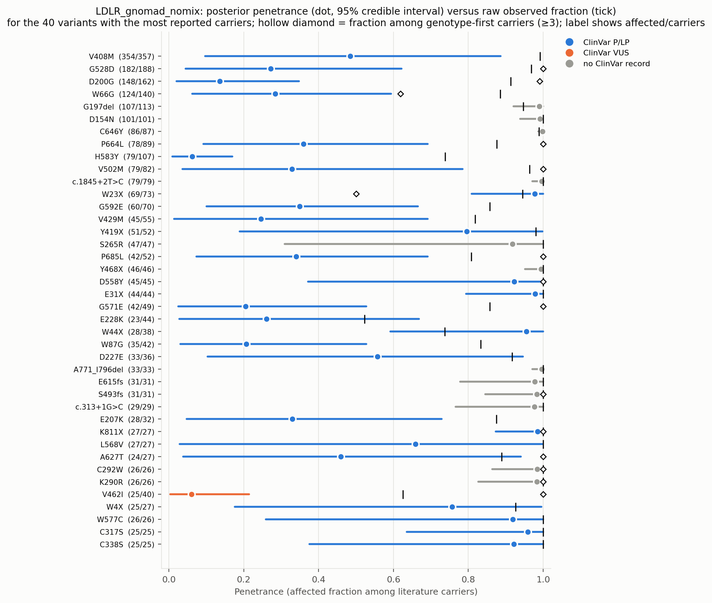
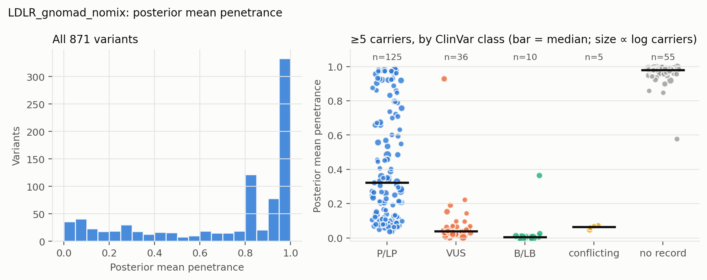
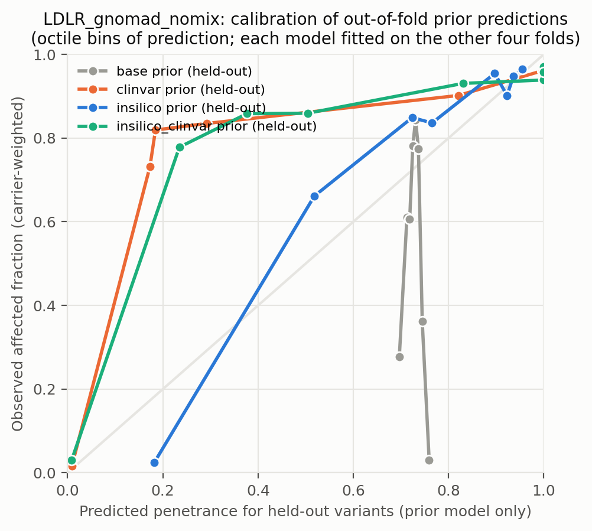
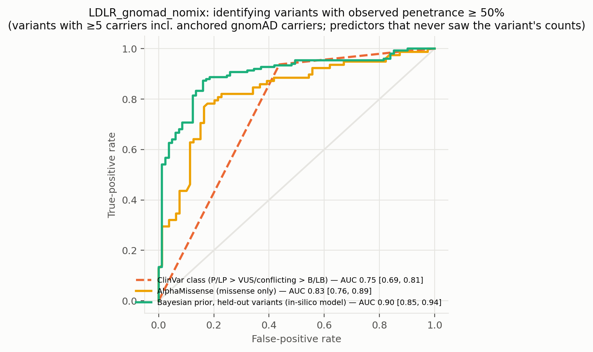
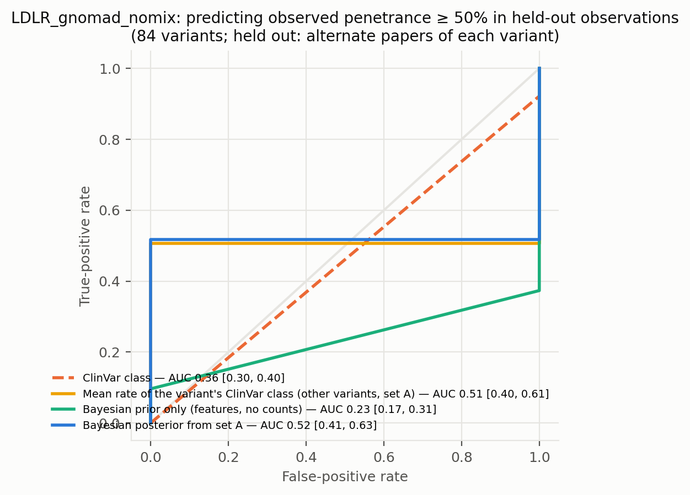
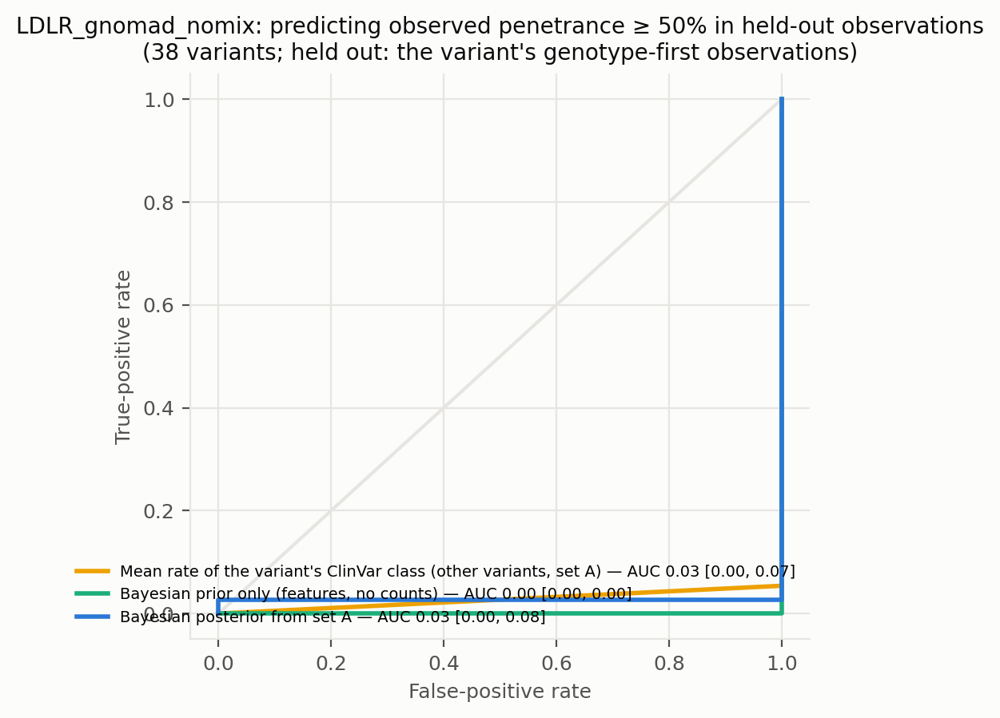
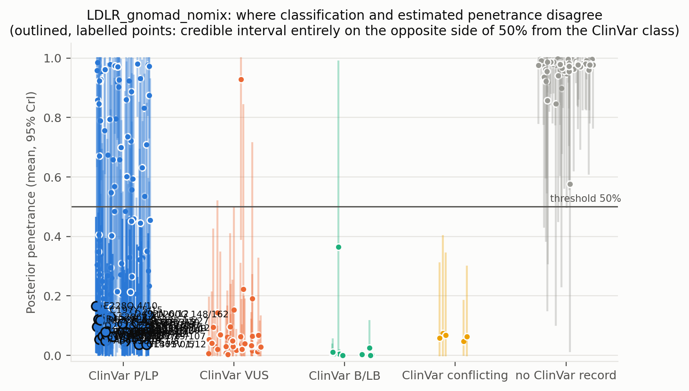
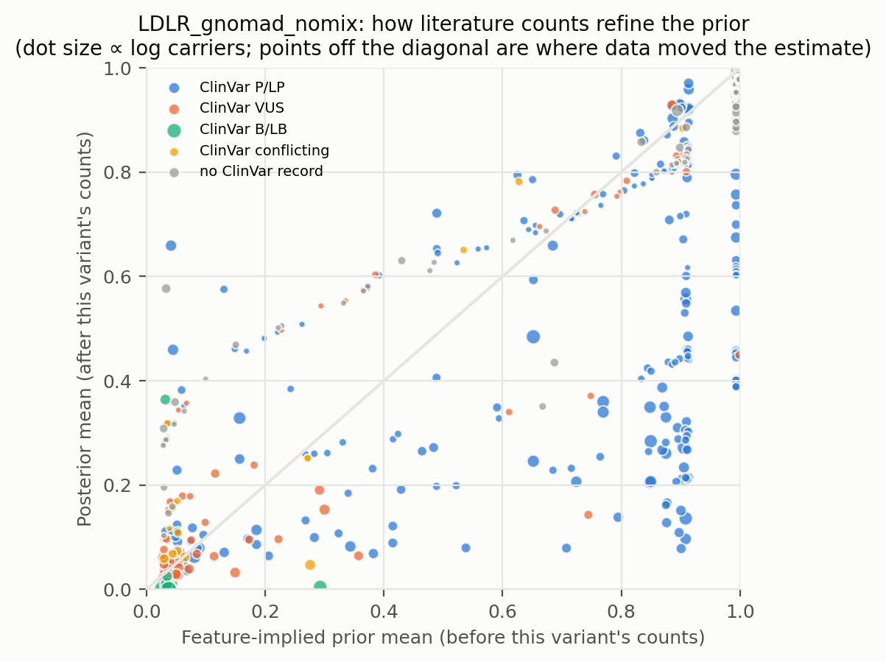
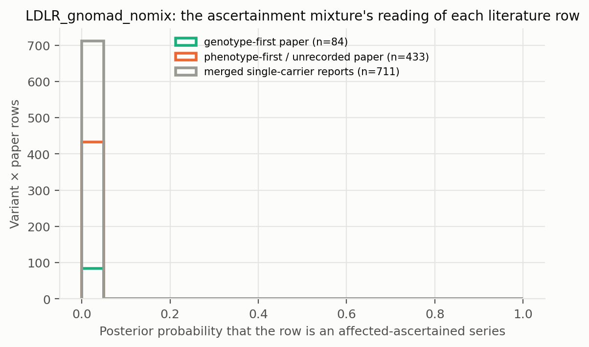

# LDLR_gnomad_nomix: literature-derived penetrance with a Bayesian prior — automated report

Generated by `iterations/grant_e2e_20260909/scripts/make_report.py` from the frozen workflow (GeneVariantFetcher tag `grant-freeze-20260909`). All numbers below are produced by code from the run artifacts; none were edited by hand.

## Data

| Quantity | Value |
| --- | ---: |
| Papers in the extraction database | 2431 |
| Variant rows in the database | 30433 |
| Usable carrier observations (variant × paper) | 1554 |
| Papers contributing usable observations | 433 |
| Count rows without a usable denominator (excluded) | 3899 |
| Quarantined count rows excluded by the trust gate | 813 |
| Distinct variants with carrier counts | 880 |
| Total literature carriers / affected | 4811 / 4595 |
| Variants with ≥5 carriers (evaluation set; carriers = literature + anchored gnomAD) | 231 |
| Share of observations that are single affected probands | 0.66 |
| Missense variants with an AlphaMissense score | 434 / 522 |
| Variants with a ClinVar record | 479 / 880 |
| Feature transcript | ENST00000558518.6 |
| gnomAD carriers added as unaffected | 17079 (on) |

Denominator sources: explicit = 246, individual_records = 128, total_derived = 1180. Study designs (paper level): case_series = 696, cohort_population = 384, unknown = 178, case_report = 147, family_segregation = 75, case_control = 42, clinical_trial = 15, functional_invitro = 6, other = 6, cohort = 3, cohort_biobank = 1, review_meta = 1.

Excluded count rows by shape: affected_only_no_denominator = 42, other_or_inconsistent = 57, total_only_no_phenotype_split = 3777, unaffected_only = 23. Largest sources of total-only rows (carrier totals with no affected/unaffected split): PMID 33418990 (412 rows, 546 carriers, design unrecorded); PMID 33508743 (272 rows, 736 carriers, design unrecorded); PMID 38506081 (206 rows, 548 carriers, design unrecorded).

ClinVar classes among variants with counts: B/LB = 18, Conflicting = 17, P/LP = 363, VUS = 81, none = 401.

## Model

Hierarchical logistic-binomial on variant × paper rows (1449 rows, 871 variants) with a between-variant effect and a between-study effect (no ascertainment mixture). Primary model `insilico`.

| Model | Features | σ (between-variant SD, logit) | τ (between-study SD, logit) | π ascertained: phenotype-first / genotype-first rows (typical frequency) | g2 (per SD of log10 AF) | max R̂ | min ESS | divergences |
| --- | --- | ---: | ---: | ---: | ---: | ---: | ---: | ---: |
| base | — | 5.71 | 6.05 | — | — | 1.000 | 1587 | 0 |
| class | trunc | 4.89 | 5.97 | — | — | 1.000 | 1352 | 0 |
| clinvar | trunc, clinvar_plp, clinvar_blb, clinvar_none | 0.53 | 6.58 | — | — | 1.000 | 602 | 0 |
| insilico | trunc, am, am_missing | 3.04 | 5.58 | — | — | 1.010 | 549 | 0 |
| insilico_clinvar | trunc, am, am_missing, clinvar_plp, clinvar_blb, clinvar_none | 0.52 | 6.45 | — | — | 1.010 | 371 | 0 |

Primary-model coefficients (posterior mean [94% HDI]): `alpha` 0.33 [-0.34, 0.92]; `sigma` 3.04 [2.51, 3.58]; `beta[trunc]` 4.78 [4.00, 5.66]; `beta[am]` 2.27 [1.82, 2.73]; `beta[am_missing]` 6.16 [4.94, 7.31]; `tau` 5.58 [5.11, 6.09].

## Held-out predictive performance (5-fold by variant)

| Prior model | NLL / carrier ↓ | Brier / carrier ↓ | log pred. density / row ↑ | calibration slope (1 = ideal) |
| --- | ---: | ---: | ---: | ---: |
| base | 1.1839 | 0.4641 | -0.805 | -26.63 |
| class | 0.9753 | 0.3802 | -0.805 | -1.64 |
| insilico | 0.2834 | 0.0639 | -0.805 | 2.74 |
| clinvar | 0.1592 | 0.0511 | -0.862 | 2.38 |
| insilico_clinvar | 0.1535 | 0.0491 | -0.833 | 1.75 |

Scored on held-out variant × paper rows (each fold's model never saw the held-out variants; predictions integrate both the variant and the study effect).

Paired bootstrap change in NLL per carrier versus the `base` prior (negative = better): `class` -0.2086 [-0.2492, -0.0611]; `insilico` -0.9005 [-1.0866, -0.2313]; `clinvar` -1.0247 [-1.2470, -0.1886]; `insilico_clinvar` -1.0304 [-1.2519, -0.2222].

Paired bootstrap change in NLL per carrier versus the `clinvar` prior (negative = better): `base` +1.0247 [+0.2230, +1.2555]; `class` +0.8161 [+0.1538, +0.9985]; `insilico` +0.1242 [-0.0350, +0.1630]; `insilico_clinvar` -0.0057 [-0.0223, -0.0013].

## Classification performance: identifying variants with observed penetrance ≥ 50%

Evaluation set: variants with ≥5 carriers — literature carriers plus the anchored gnomAD carriers, which also enter the observed fraction that defines the label. Label: observed fraction ≥ 50%. AUC with 95% bootstrap interval.

| Scorer | variants | high-penetrance variants | AUC | 95% CI |
| --- | ---: | ---: | ---: | --- |
| clinvar_ordinal | 176 | 96 | 0.751 | [0.692, 0.813] |
| clinvar_plp_binary | 176 | 96 | 0.750 | [0.688, 0.812] |
| alphamissense_missense_only | 157 | 78 | 0.828 | [0.757, 0.893] |
| insilico_posterior_mean_in_sample_LEAKY | 231 | 150 | 0.964 | [0.941, 0.986] |
| base_oof_prior | 231 | 150 | 0.446 | [0.366, 0.525] |
| class_oof_prior | 231 | 150 | 0.655 | [0.578, 0.724] |
| insilico_oof_prior | 231 | 150 | 0.898 | [0.848, 0.938] |
| clinvar_oof_prior | 231 | 150 | 0.856 | [0.803, 0.902] |
| insilico_clinvar_oof_prior | 231 | 150 | 0.900 | [0.854, 0.941] |

**Literature-only labels.** The table above defines high penetrance over literature carriers plus the anchored gnomAD carriers, so its labels partly encode the anchor assumption. The same scorers against the literature fraction alone (≥5 literature carriers; the 5 common alleles with AF > 0.001 excluded because their literature fraction is known to be ascertainment) — an ascertainment-inflated but anchor-free label:

| Scorer | variants | high-penetrance variants | AUC | 95% CI |
| --- | ---: | ---: | ---: | --- |
| clinvar_ordinal | 98 | 95 | 0.447 | [0.417, 0.479] |
| clinvar_plp_binary | 98 | 95 | 0.447 | [0.419, 0.474] |
| alphamissense_missense_only | 84 | 81 | 0.531 | [0.241, 0.744] |
| insilico_posterior_mean_in_sample_LEAKY | 153 | 149 | 0.629 | [0.401, 0.914] |
| base_oof_prior | 153 | 149 | 0.424 | [0.131, 0.748] |
| class_oof_prior | 153 | 149 | 0.601 | [0.362, 0.803] |
| insilico_oof_prior | 153 | 149 | 0.601 | [0.168, 0.851] |
| clinvar_oof_prior | 153 | 149 | 0.596 | [0.259, 0.880] |
| insilico_clinvar_oof_prior | 153 | 149 | 0.607 | [0.086, 0.860] |

The `_LEAKY` row uses the posterior that already contains the variant's own counts, which also define the label; it is shown only to make the leakage explicit and is not a validation.

Binary rule 'ClinVar P/LP ⇒ high penetrance': sensitivity 0.94, specificity 0.56, PPV 0.72, NPV 0.88 (TP 90, FP 35, FN 6, TN 45).

Other thresholds: ≥25%: clinvar_ordinal 0.82, insilico_oof_prior 0.89; ≥75%: clinvar_ordinal 0.68, insilico_oof_prior 0.84.

## Held-out observations of known variants: penetrance estimate versus classification

**Alternate-paper hold-out.** For each variant reported in ≥2 papers, papers are split alternately by PMID; set A updates the prior, set B is scored (84 variants, 1645 held-out carriers). Because B still contains phenotype-first reports, the prediction for B is the mixture prediction (ascertained series with probability π, informative otherwise).

The ClinVar comparator predicts each variant with the observed A-rate of its ClinVar class among the *other* variants; the pooled rate is the A-rate over all variants.

| Predictor for held-out observations | NLL / carrier ↓ | Brier / carrier ↓ |
| --- | ---: | ---: |
| posterior_from_half_A | 0.7050 | 0.2461 |
| prior_only | 0.5023 | 0.1461 |
| pooled_rate_half_A | 0.4058 | 0.0973 |
| clinvar_class_rate_half_A | 0.2792 | 0.0525 |

Paired bootstrap change in NLL per held-out carrier, posterior-from-A minus ClinVar-class rate: +0.4258 [+0.2875, +0.5259] (negative favours the count-informed estimate).

Paired bootstrap change in NLL per held-out carrier, posterior-from-A minus pooled rate: +0.2992 [+0.1470, +0.4112] (negative favours the count-informed estimate).

Paired bootstrap change in NLL per held-out carrier, posterior-from-A minus features-only prior: +0.2027 [+0.1013, +0.2984] (negative favours the count-informed estimate).

| Scorer (label: observed ≥ 50% in set B) | variants | AUC | 95% CI |
| --- | ---: | ---: | --- |
| posterior_from_half_A | 84 | 0.518 | [0.415, 0.627] |
| prior_only | 84 | 0.235 | [0.169, 0.313] |
| pooled_rate_half_A | 84 | 0.500 | [0.500, 0.500] |
| clinvar_class_rate_half_A | 84 | 0.506 | [0.398, 0.614] |
| clinvar_ordinal | 84 | 0.355 | [0.301, 0.401] |

**Genotype-first hold-out.** Set B = the variant's observations from papers whose ascertainment the extractor recorded as population screening or cascade testing; set A = its phenotype-first observations (case reports, referral series) plus any gnomAD anchor. A updates the feature prior into a variant posterior (exact grid update; the mixture likelihood per row, study effects integrated, τ/π/p_asc at posterior means); B is scored (38 variants, 565 held-out genotype-first carriers). This is the clinical question: does case-based literature plus features predict the penetrance seen when carriers are found by genotype?

The ClinVar comparator predicts each variant with the observed A-rate of its ClinVar class among the *other* variants; the pooled rate is the A-rate over all variants.

| Predictor for held-out observations | NLL / carrier ↓ | Brier / carrier ↓ |
| --- | ---: | ---: |
| posterior_from_half_A | 0.8184 | 0.2761 |
| prior_only | 0.5773 | 0.1602 |
| pooled_rate_half_A | 1.2339 | 0.4654 |
| clinvar_class_rate_half_A | 0.4707 | 0.0928 |

Paired bootstrap change in NLL per held-out carrier, posterior-from-A minus ClinVar-class rate: +0.3478 [-0.0710, +0.5737] (negative favours the count-informed estimate).

Paired bootstrap change in NLL per held-out carrier, posterior-from-A minus pooled rate: -0.4155 [-0.6032, -0.2804] (negative favours the count-informed estimate).

Paired bootstrap change in NLL per held-out carrier, posterior-from-A minus features-only prior: +0.2412 [+0.0677, +0.3812] (negative favours the count-informed estimate).

| Scorer (label: observed ≥ 50% in set B) | variants | AUC | 95% CI |
| --- | ---: | ---: | --- |
| posterior_from_half_A | 38 | 0.027 | [0.000, 0.083] |
| prior_only | 38 | 0.000 | [0.000, 0.000] |
| pooled_rate_half_A | 38 | 0.500 | [0.500, 0.500] |
| clinvar_class_rate_half_A | 38 | 0.027 | [0.000, 0.068] |
| clinvar_ordinal | 38 | 0.811 | [0.719, 0.897] |

Largest genotype-first hold-outs (affected / carriers in B; predictions from A):

| Variant | ClinVar | A: affected / carriers | B (genotype-first): affected / carriers | observed B | posterior from A | features-only prior | ClinVar-class rate |
| --- | --- | ---: | ---: | ---: | ---: | ---: | ---: |
| D200G | P/LP | 38 / 51 | 110 / 111 | 0.99 | 0.35 | 0.63 | 0.85 |
| G528D | P/LP | 101 / 107 | 81 / 81 | 1.00 | 0.41 | 0.63 | 0.82 |
| V502M | P/LP | 30 / 33 | 49 / 49 | 1.00 | 0.39 | 0.40 | 0.84 |
| D558Y | P/LP | 4 / 4 | 41 / 41 | 1.00 | 0.69 | 0.64 | 0.84 |
| P664L | P/LP | 46 / 57 | 32 / 32 | 1.00 | 0.42 | 0.57 | 0.84 |
| S493fs | none | 4 / 4 | 27 / 27 | 1.00 | 0.81 | 0.76 | 0.97 |
| W66G | P/LP | 111 / 119 | 13 / 21 | 0.62 | 0.43 | 0.60 | 0.82 |
| V462I | VUS | 7 / 22 | 18 / 18 | 1.00 | 0.27 | 0.30 | 0.05 |
| c.1845+1G>A | none | 1 / 1 | 17 / 17 | 1.00 | 0.78 | 0.76 | 0.98 |
| E10X | none | 3 / 3 | 8 / 14 | 0.57 | 0.79 | 0.76 | 0.97 |

## Common variants: the known-outcome check

Variants with gnomAD allele frequency above 0.001 are common alleles whose outcome is known independently of the literature: at most a GWAS-scale risk, no Mendelian penetrance. They stay in the model as a check. In case-series literature they look penetrant (median literature fraction 1.00; 100% of them are ≥ 50% affected among reported carriers); the model's estimate for them should be near the population risk: median posterior 0.001, 100% with the 97.5% bound below 10%.

| Variant | ClinVar | gnomAD AF | gnomAD carriers added | affected / literature carriers | literature fraction | posterior mean [97.5%] |
| --- | --- | ---: | ---: | ---: | ---: | --- |
| A391T | B/LB | 8.01e-02 | 12192 | 2 / 2 | 1.00 | 0.000 [0.000] |
| T726I | B/LB | 5.48e-03 | 1378 | 7 / 8 | 0.88 | 0.001 [0.003] |
| T705I | B/LB | 5.48e-03 | 1378 | 1 / 1 | 1.00 | 0.001 [0.002] |
| R814Q | VUS | 1.11e-03 | 168 | 1 / 1 | 1.00 | 0.003 [0.015] |
| V827I | VUS | 1.01e-03 | 253 | 12 / 12 | 1.00 | 0.005 [0.016] |

## Examples where the classification is wrong about penetrance

Variants with ≥5 literature carriers whose 95% credible interval lies entirely on the other side of 50% from what the ClinVar class implies. `literature affected / carriers` are the extracted counts, `gnomAD added` the anchored population carriers (assumed unaffected) that also enter the posterior; `genotype-first` are the affected / carriers in screening or cascade rows, the evidence least affected by ascertainment. PMIDs are the source papers.

| Variant | Class | ClinVar | literature affected / carriers | literature fraction | gnomAD added | genotype-first affected / carriers | posterior mean [95% CrI] | prior mean | papers | PMIDs |
| --- | --- | --- | ---: | ---: | ---: | ---: | --- | ---: | ---: | --- |
| D200G | missense | P/LP | 148 / 149 | 0.99 | 13 | 110 / 111 | 0.14 [0.02, 0.35] | 0.91 | 7 | 10208479, 10208484, 15135251, 17140581, 18279815, 19446849 (+1) |
| H583Y | missense | P/LP | 79 / 80 | 0.99 | 27 | 1 / 1 | 0.06 [0.01, 0.17] | 0.08 | 16 | 23155708, 28028493, 29233637, 29353225, 30526649, 32800790 (+10) |
| D221G | missense | P/LP | 20 / 20 | 1.00 | 13 | — | 0.10 [0.01, 0.29] | 0.91 | 4 | 26894473, 30592719, 32443900, 33137929 |
| G343S | missense | P/LP | 13 / 20 | 0.65 | 7 | 5 / 5 | 0.11 [0.01, 0.38] | 0.19 | 4 | 24916650, 27578128, 32897268, 39392848 |
| D90N | missense | P/LP | 15 / 15 | 1.00 | 14 | 1 / 1 | 0.08 [0.01, 0.26] | 0.34 | 8 | 24956927, 25962062, 26343872, 33168860, 36580209, 37607748 (+2) |
| C197Y | missense | P/LP | 5 / 10 | 0.50 | 5 | 3 / 3 | 0.15 [0.01, 0.49] | 0.90 | 2 | 27816806, 32505727 |
| R416W | missense | P/LP | 9 / 10 | 0.90 | 6 | 2 / 3 | 0.08 [0.00, 0.32] | 0.09 | 8 | 25921077, 25962062, 26343872, 29531935, 29802317, 33168860 (+2) |
| R416Q | missense | P/LP | 7 / 8 | 0.88 | 4 | 1 / 1 | 0.11 [0.00, 0.44] | 0.03 | 3 | 29802317, 32660911, 38003014 |
| R574H | missense | P/LP | 7 / 7 | 1.00 | 5 | — | 0.09 [0.00, 0.38] | 0.05 | 2 | 20018285, 39331889 |
| D492N | missense | P/LP | 6 / 6 | 1.00 | 6 | — | 0.14 [0.01, 0.46] | 0.79 | 5 | 29802317, 33640001, 35222550, 37217153, 41404428 |
| G335S | missense | P/LP | 5 / 6 | 0.83 | 7 | 4 / 5 | 0.07 [0.00, 0.29] | 0.13 | 2 | 27578127, 28502510 |
| E240K | missense | P/LP | 3 / 5 | 0.60 | 5 | 1 / 1 | 0.10 [0.00, 0.42] | 0.28 | 2 | 24956927, 25463123 |
| R385W | missense | P/LP | 1 / 5 | 0.20 | 4 | — | 0.09 [0.00, 0.41] | 0.41 | 1 | 30876530 |

Counts: 13 P/LP variants estimated below 50%; 0 non-P/LP variants estimated above 50% (≥5 literature carriers). Under the frozen rule that also counts anchored gnomAD carriers towards the ≥5 minimum, `fit/discordant_variants.csv` lists 37 and 0.

Reading the table: when a variant's genotype-first carriers are mostly affected but the posterior is low, the population anchor (gnomAD carriers assumed unaffected), not the literature, is driving the estimate — the anchor assumption fails for phenotypes that are common and unmeasured in gnomAD.

Evidence rows behind the first discordant variants (per paper; `ascertained` = posterior probability that the row is an affected-only series):

| Variant | PMID | affected / carriers | ascertainment recorded | ascertained |
| --- | --- | ---: | --- | ---: |
| D200G | 15135251 | 109 / 109 | family_cascade | 0.00 |
| D200G | 19446849 | 28 / 28 | proband_referral | 0.00 |
| D200G | gnomAD | 0 / 13 | population_screening | 0.00 |
| D200G | 17140581 | 6 / 6 | proband_referral | 0.00 |
| D200G | 10208484 | 1 / 2 | family_cascade | 0.00 |
| D200G | 7682459 | 2 / 2 | proband_referral | 0.00 |
| H583Y | 33994402 | 48 / 48 | proband_referral | 0.00 |
| H583Y | gnomAD | 0 / 27 | population_screening | 0.00 |
| H583Y | single_carrier_reports | 10 / 10 | — | 0.00 |
| H583Y | 29353225 | 9 / 9 | proband_referral | 0.00 |
| H583Y | 36325061 | 5 / 5 | proband_referral | 0.00 |
| H583Y | 36338372 | 5 / 5 | proband_referral | 0.00 |
| D221G | 30592719 | 14 / 14 | proband_referral | 0.00 |
| D221G | gnomAD | 0 / 13 | population_screening | 0.00 |
| D221G | 32443900 | 4 / 4 | proband_referral | 0.00 |
| D221G | single_carrier_reports | 2 / 2 | — | 0.00 |
| G343S | 24916650 | 5 / 12 | proband_referral | 0.00 |
| G343S | gnomAD | 0 / 7 | population_screening | 0.00 |
| G343S | 39392848 | 5 / 5 | family_cascade | 0.00 |
| G343S | 32897268 | 2 / 2 | proband_referral | 0.00 |
| G343S | single_carrier_reports | 1 / 1 | — | 0.00 |
| D90N | gnomAD | 0 / 14 | population_screening | 0.00 |
| D90N | 41542120 | 5 / 5 | proband_referral | 0.00 |
| D90N | single_carrier_reports | 5 / 5 | — | 0.00 |
| D90N | 37607748 | 4 / 4 | proband_referral | 0.00 |
| D90N | single_carrier_reports_genotype_first | 1 / 1 | genotype-first | 0.00 |
| C197Y | 27816806 | 2 / 7 | proband_referral | 0.00 |
| C197Y | gnomAD | 0 / 5 | population_screening | 0.00 |
| C197Y | 32505727 | 3 / 3 | family_cascade | 0.00 |
| R416W | single_carrier_reports | 7 / 7 | — | 0.00 |
| R416W | gnomAD | 0 / 6 | population_screening | 0.00 |
| R416W | 25921077 | 2 / 3 | family_cascade | 0.00 |
| R416Q | 29802317 | 5 / 5 | — | 0.00 |
| R416Q | gnomAD | 0 / 4 | population_screening | 0.00 |
| R416Q | 38003014 | 1 / 2 | proband_referral | 0.00 |
| R416Q | single_carrier_reports_genotype_first | 1 / 1 | genotype-first | 0.00 |

## Figures

**Figure — Posterior penetrance (dot, 95% credible interval) versus the raw observed fraction (tick) for the best-observed variants, coloured by ClinVar class.**

**Figure — Distribution of posterior mean penetrance across all variants, and by ClinVar class for variants with enough carriers.**

**Figure — Calibration of held-out prior predictions (each model predicts variants it never saw).**

**Figure — ROC curves for identifying observed high-penetrance variants: ClinVar class alone, AlphaMissense alone, the held-out Bayesian prior, and the posterior that includes the variant's own counts.**

**Figure — Alternate-paper hold-out: the posterior built from half of each variant's papers predicts the observed penetrance in the other half; compared with ClinVar class and a features-only prior.**

**Figure — Genotype-first hold-out: the posterior built from a variant's phenotype-first reports predicts the penetrance observed in its genotype-first (screening / cascade) observations.**

**Figure — Where classification and estimated penetrance disagree; outlined, labelled points are the discordant variants listed above.**

**Figure — Prior mean versus posterior mean: how the literature counts refine the feature-implied prior.**

**Figure — How the mixture reads the literature: posterior probability that each variant × paper row is a pure affected series, by the paper's recorded ascertainment.**

## Limitations that travel with these numbers

- Counts are pooled across papers; cohort overlap between publications cannot be resolved from the extraction, so denominators may double count.
- Probands are included; ascertainment inflates penetrance, most strongly for variants known only from single case reports (see the single-proband share above).
- 'Affected' follows each paper's own phenotype definition for the gene–disease pair; ages are not modelled.
- ClinVar classes are as of the variantFeatures snapshot; frameshift/splice alleles often lack a warehouse record and appear as 'no ClinVar record'.
- Held-out metrics score the prior model; posterior values include the variant's own counts and are the estimate a user would see, not a validation.

- In the anchored arms the frozen evaluation set and the 'observed ≥ threshold' label include the gnomAD carriers assumed unaffected; the literature-only table, the genotype-first hold-out and the common-variant check are the anchor-independent views.

## Artifacts

`observations.csv`, `variants.csv`, `variants_features.csv`, `fit/posterior_variants.csv`, `fit/oof_predictions.csv`, `fit/metrics.csv`, `fit/classification_metrics.csv`, `fit/discordant_variants.csv`, `fit/coefficients.csv`, `fit/model_diagnostics.csv`, `fit/fit_summary.json` in the analysis directory.
