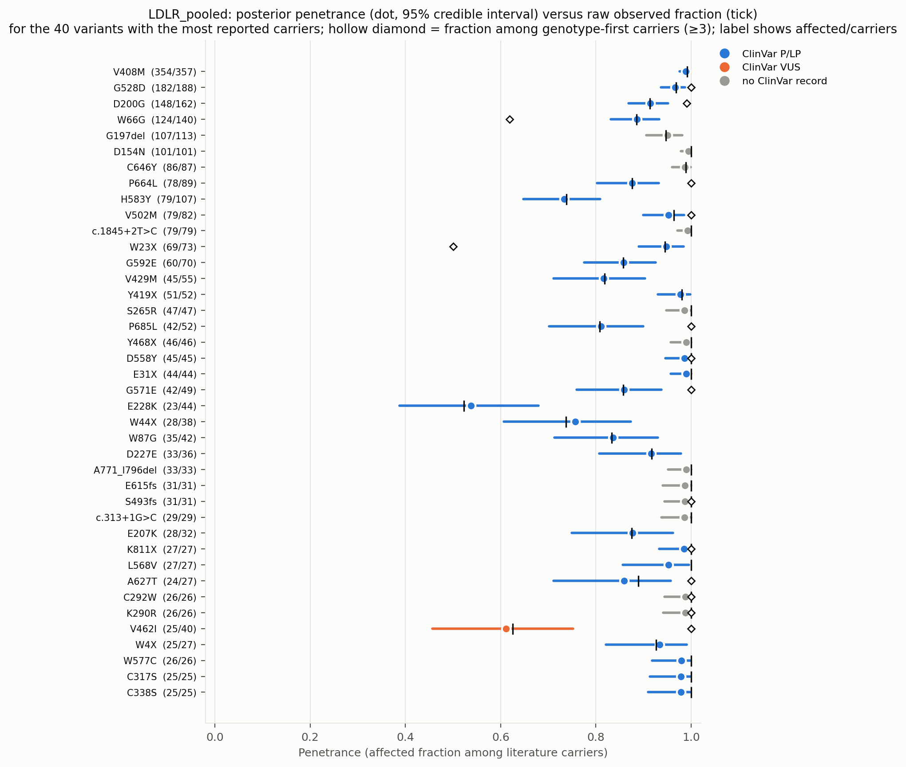
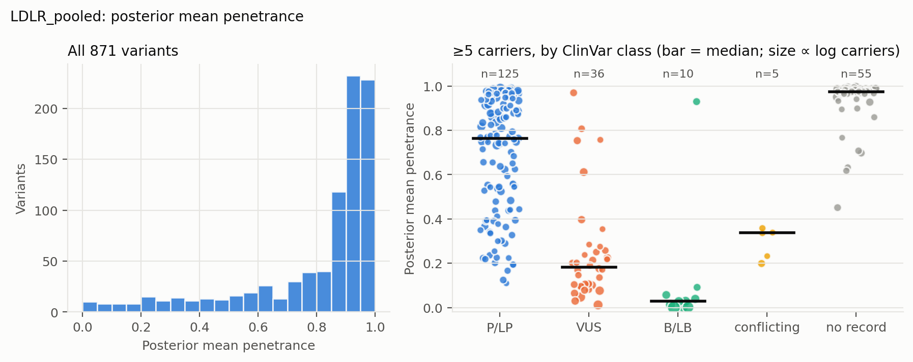
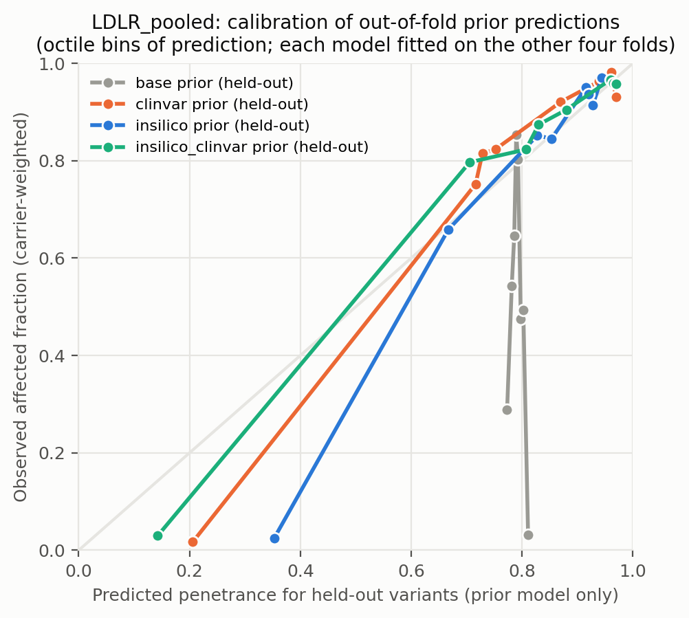
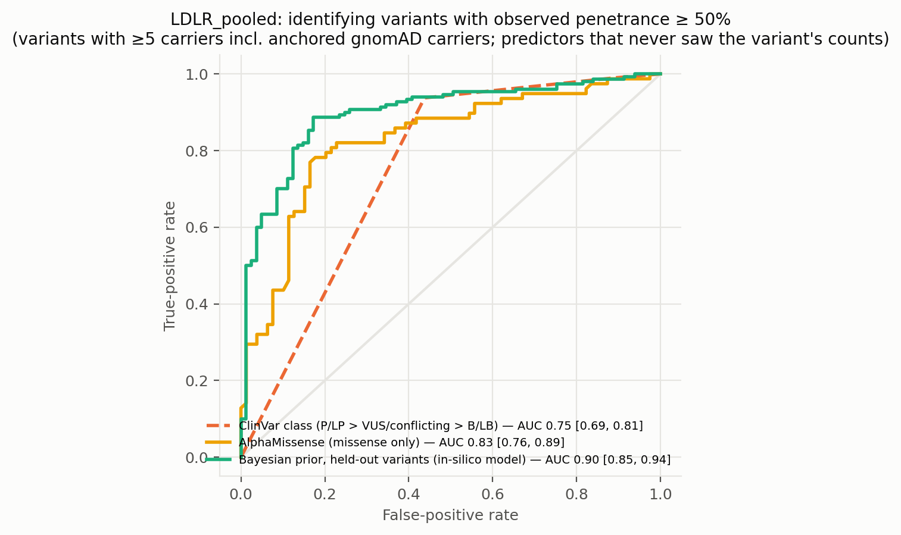
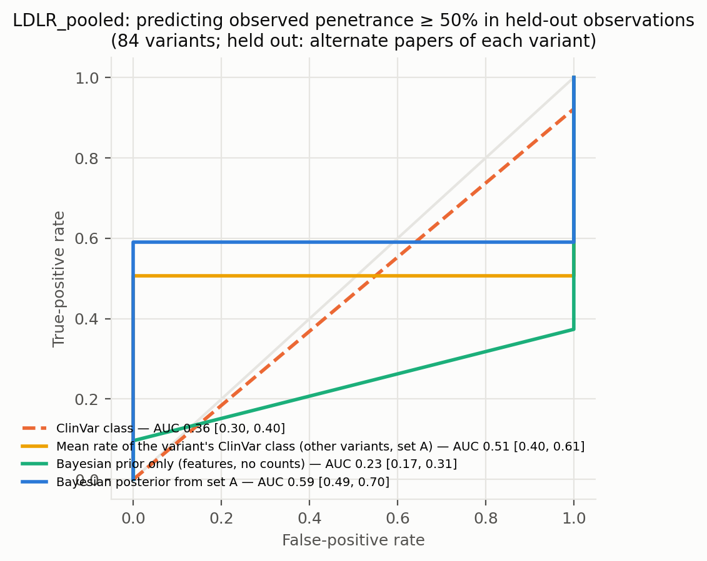
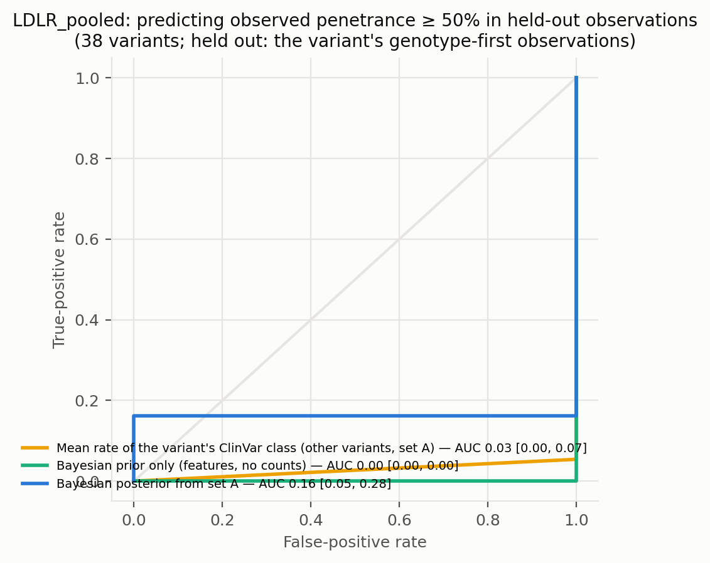
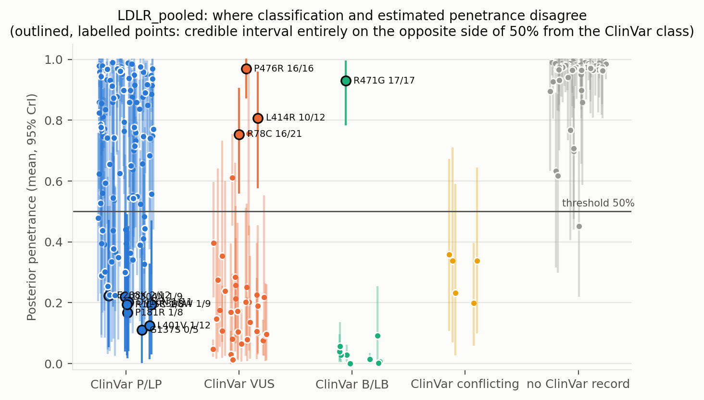
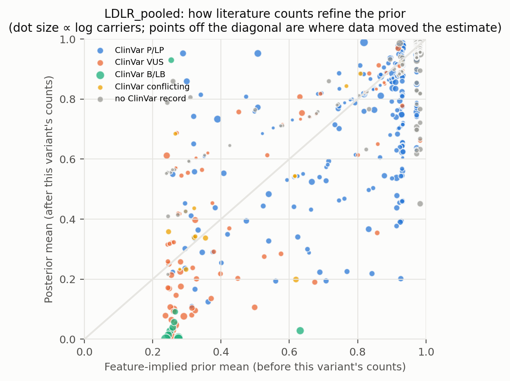
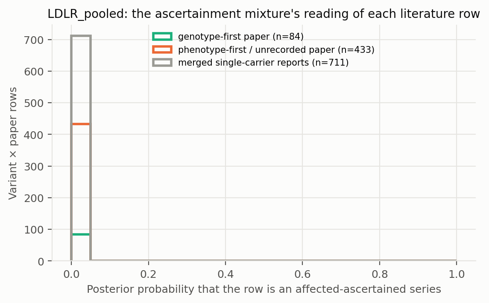

# LDLR_pooled: literature-derived penetrance with a Bayesian prior — automated report

Generated by `iterations/grant_e2e_20260909/scripts/make_report.py` from the frozen workflow (GeneVariantFetcher tag `grant-freeze-20260909`). All numbers below are produced by code from the run artifacts; none were edited by hand.

## Data

| Quantity | Value |
| --- | ---: |
| Papers in the extraction database | 2431 |
| Variant rows in the database | 30433 |
| Usable carrier observations (variant × paper) | 1554 |
| Papers contributing usable observations | 433 |
| Count rows without a usable denominator (excluded) | 3899 |
| Quarantined count rows excluded by the trust gate | 813 |
| Distinct variants with carrier counts | 880 |
| Total literature carriers / affected | 4811 / 4595 |
| Variants with ≥5 carriers (evaluation set; carriers = literature + anchored gnomAD) | 231 |
| Share of observations that are single affected probands | 0.66 |
| Missense variants with an AlphaMissense score | 434 / 522 |
| Variants with a ClinVar record | 479 / 880 |
| Feature transcript | ENST00000558518.6 |
| gnomAD carriers added as unaffected | 17079 (on) |

Denominator sources: explicit = 246, individual_records = 128, total_derived = 1180. Study designs (paper level): case_series = 696, cohort_population = 384, unknown = 178, case_report = 147, family_segregation = 75, case_control = 42, clinical_trial = 15, functional_invitro = 6, other = 6, cohort = 3, cohort_biobank = 1, review_meta = 1.

Excluded count rows by shape: affected_only_no_denominator = 42, other_or_inconsistent = 57, total_only_no_phenotype_split = 3777, unaffected_only = 23. Largest sources of total-only rows (carrier totals with no affected/unaffected split): PMID 33418990 (412 rows, 546 carriers, design unrecorded); PMID 33508743 (272 rows, 736 carriers, design unrecorded); PMID 38506081 (206 rows, 548 carriers, design unrecorded).

ClinVar classes among variants with counts: B/LB = 18, Conflicting = 17, P/LP = 363, VUS = 81, none = 401.

## Model

Hierarchical logistic-binomial on variant × paper rows (1449 rows, 871 variants) with a between-variant effect and a between-study effect (no ascertainment mixture). Primary model `insilico`.

| Model | Features | σ (between-variant SD, logit) | τ (between-study SD, logit) | π ascertained: phenotype-first / genotype-first rows (typical frequency) | g2 (per SD of log10 AF) | max R̂ | min ESS | divergences |
| --- | --- | ---: | ---: | ---: | ---: | ---: | ---: | ---: |
| base | — | 2.61 | 0.01 | — | — | 1.000 | 830 | 0 |
| class | trunc | 2.42 | 0.01 | — | — | 1.010 | 571 | 0 |
| clinvar | trunc, clinvar_plp, clinvar_blb, clinvar_none | 1.75 | 0.01 | — | — | 1.010 | 737 | 0 |
| insilico | trunc, am, am_missing | 1.81 | 0.01 | — | — | 1.010 | 863 | 0 |
| insilico_clinvar | trunc, am, am_missing, clinvar_plp, clinvar_blb, clinvar_none | 1.60 | 0.01 | — | — | 1.010 | 624 | 0 |

Primary-model coefficients (posterior mean [94% HDI]): `alpha` 1.32 [1.07, 1.56]; `sigma` 1.81 [1.62, 2.00]; `beta[trunc]` 2.28 [1.80, 2.73]; `beta[am]` 1.43 [1.20, 1.64]; `beta[am_missing]` 2.79 [2.14, 3.42]; `tau` 0.01 [0.00, 0.02].

## Held-out predictive performance (5-fold by variant)

| Prior model | NLL / carrier ↓ | Brier / carrier ↓ | log pred. density / row ↑ | calibration slope (1 = ideal) |
| --- | ---: | ---: | ---: | ---: |
| base | 1.3465 | 0.5184 | -0.971 | -13.45 |
| class | 1.1559 | 0.4536 | -0.879 | 2.06 |
| insilico | 0.4337 | 0.1233 | -0.861 | 2.39 |
| clinvar | 0.2777 | 0.0626 | -0.864 | 2.45 |
| insilico_clinvar | 0.2123 | 0.0435 | -0.865 | 1.85 |

Scored on held-out variant × paper rows (each fold's model never saw the held-out variants; predictions integrate both the variant and the study effect).

Paired bootstrap change in NLL per carrier versus the `base` prior (negative = better): `class` -0.1906 [-0.2258, -0.0605]; `insilico` -0.9128 [-1.0949, -0.2459]; `clinvar` -1.0688 [-1.2860, -0.2449]; `insilico_clinvar` -1.1342 [-1.3625, -0.2855].

Paired bootstrap change in NLL per carrier versus the `clinvar` prior (negative = better): `base` +1.0688 [+0.2666, +1.2953]; `class` +0.8782 [+0.1985, +1.0602]; `insilico` +0.1560 [-0.0029, +0.1922]; `insilico_clinvar` -0.0654 [-0.0792, -0.0215].

## Classification performance: identifying variants with observed penetrance ≥ 50%

Evaluation set: variants with ≥5 carriers — literature carriers plus the anchored gnomAD carriers, which also enter the observed fraction that defines the label. Label: observed fraction ≥ 50%. AUC with 95% bootstrap interval.

| Scorer | variants | high-penetrance variants | AUC | 95% CI |
| --- | ---: | ---: | ---: | --- |
| clinvar_ordinal | 176 | 96 | 0.751 | [0.692, 0.813] |
| clinvar_plp_binary | 176 | 96 | 0.750 | [0.688, 0.812] |
| alphamissense_missense_only | 157 | 78 | 0.828 | [0.757, 0.893] |
| insilico_posterior_mean_in_sample_LEAKY | 231 | 150 | 0.999 | [0.998, 1.000] |
| base_oof_prior | 231 | 150 | 0.433 | [0.357, 0.509] |
| class_oof_prior | 231 | 150 | 0.644 | [0.573, 0.714] |
| insilico_oof_prior | 231 | 150 | 0.897 | [0.847, 0.938] |
| clinvar_oof_prior | 231 | 150 | 0.857 | [0.807, 0.903] |
| insilico_clinvar_oof_prior | 231 | 150 | 0.903 | [0.857, 0.940] |

**Literature-only labels.** The table above defines high penetrance over literature carriers plus the anchored gnomAD carriers, so its labels partly encode the anchor assumption. The same scorers against the literature fraction alone (≥5 literature carriers; the 5 common alleles with AF > 0.001 excluded because their literature fraction is known to be ascertainment) — an ascertainment-inflated but anchor-free label:

| Scorer | variants | high-penetrance variants | AUC | 95% CI |
| --- | ---: | ---: | ---: | --- |
| clinvar_ordinal | 98 | 95 | 0.447 | [0.417, 0.479] |
| clinvar_plp_binary | 98 | 95 | 0.447 | [0.419, 0.474] |
| alphamissense_missense_only | 84 | 81 | 0.531 | [0.241, 0.744] |
| insilico_posterior_mean_in_sample_LEAKY | 153 | 149 | 0.968 | [0.934, 0.993] |
| base_oof_prior | 153 | 149 | 0.403 | [0.060, 0.757] |
| class_oof_prior | 153 | 149 | 0.549 | [0.381, 0.705] |
| insilico_oof_prior | 153 | 149 | 0.559 | [0.132, 0.848] |
| clinvar_oof_prior | 153 | 149 | 0.597 | [0.295, 0.853] |
| insilico_clinvar_oof_prior | 153 | 149 | 0.587 | [0.296, 0.843] |

The `_LEAKY` row uses the posterior that already contains the variant's own counts, which also define the label; it is shown only to make the leakage explicit and is not a validation.

Binary rule 'ClinVar P/LP ⇒ high penetrance': sensitivity 0.94, specificity 0.56, PPV 0.72, NPV 0.88 (TP 90, FP 35, FN 6, TN 45).

Other thresholds: ≥25%: clinvar_ordinal 0.82, insilico_oof_prior 0.88; ≥75%: clinvar_ordinal 0.68, insilico_oof_prior 0.84.

## Held-out observations of known variants: penetrance estimate versus classification

**Alternate-paper hold-out.** For each variant reported in ≥2 papers, papers are split alternately by PMID; set A updates the prior, set B is scored (84 variants, 1645 held-out carriers). Because B still contains phenotype-first reports, the prediction for B is the mixture prediction (ascertained series with probability π, informative otherwise).

The ClinVar comparator predicts each variant with the observed A-rate of its ClinVar class among the *other* variants; the pooled rate is the A-rate over all variants.

| Predictor for held-out observations | NLL / carrier ↓ | Brier / carrier ↓ |
| --- | ---: | ---: |
| posterior_from_half_A | 0.2908 | 0.0723 |
| prior_only | 0.2724 | 0.0560 |
| pooled_rate_half_A | 0.4058 | 0.0973 |
| clinvar_class_rate_half_A | 0.2792 | 0.0525 |

Paired bootstrap change in NLL per held-out carrier, posterior-from-A minus ClinVar-class rate: +0.0115 [-0.1142, +0.1535] (negative favours the count-informed estimate).

Paired bootstrap change in NLL per held-out carrier, posterior-from-A minus pooled rate: -0.1150 [-0.2322, +0.0298] (negative favours the count-informed estimate).

Paired bootstrap change in NLL per held-out carrier, posterior-from-A minus features-only prior: +0.0184 [-0.1049, +0.1711] (negative favours the count-informed estimate).

| Scorer (label: observed ≥ 50% in set B) | variants | AUC | 95% CI |
| --- | ---: | ---: | --- |
| posterior_from_half_A | 84 | 0.590 | [0.494, 0.695] |
| prior_only | 84 | 0.235 | [0.169, 0.313] |
| pooled_rate_half_A | 84 | 0.500 | [0.500, 0.500] |
| clinvar_class_rate_half_A | 84 | 0.506 | [0.398, 0.614] |
| clinvar_ordinal | 84 | 0.355 | [0.301, 0.401] |

**Genotype-first hold-out.** Set B = the variant's observations from papers whose ascertainment the extractor recorded as population screening or cascade testing; set A = its phenotype-first observations (case reports, referral series) plus any gnomAD anchor. A updates the feature prior into a variant posterior (exact grid update; the mixture likelihood per row, study effects integrated, τ/π/p_asc at posterior means); B is scored (38 variants, 565 held-out genotype-first carriers). This is the clinical question: does case-based literature plus features predict the penetrance seen when carriers are found by genotype?

The ClinVar comparator predicts each variant with the observed A-rate of its ClinVar class among the *other* variants; the pooled rate is the A-rate over all variants.

| Predictor for held-out observations | NLL / carrier ↓ | Brier / carrier ↓ |
| --- | ---: | ---: |
| posterior_from_half_A | 0.4473 | 0.0887 |
| prior_only | 0.3922 | 0.0816 |
| pooled_rate_half_A | 1.2339 | 0.4654 |
| clinvar_class_rate_half_A | 0.4707 | 0.0928 |

Paired bootstrap change in NLL per held-out carrier, posterior-from-A minus ClinVar-class rate: -0.0233 [-0.2252, +0.1329] (negative favours the count-informed estimate).

Paired bootstrap change in NLL per held-out carrier, posterior-from-A minus pooled rate: -0.7866 [-0.9814, -0.4353] (negative favours the count-informed estimate).

Paired bootstrap change in NLL per held-out carrier, posterior-from-A minus features-only prior: +0.0551 [-0.0837, +0.2271] (negative favours the count-informed estimate).

| Scorer (label: observed ≥ 50% in set B) | variants | AUC | 95% CI |
| --- | ---: | ---: | --- |
| posterior_from_half_A | 38 | 0.162 | [0.054, 0.278] |
| prior_only | 38 | 0.000 | [0.000, 0.000] |
| pooled_rate_half_A | 38 | 0.500 | [0.500, 0.500] |
| clinvar_class_rate_half_A | 38 | 0.027 | [0.000, 0.068] |
| clinvar_ordinal | 38 | 0.811 | [0.719, 0.897] |

Largest genotype-first hold-outs (affected / carriers in B; predictions from A):

| Variant | ClinVar | A: affected / carriers | B (genotype-first): affected / carriers | observed B | posterior from A | features-only prior | ClinVar-class rate |
| --- | --- | ---: | ---: | ---: | ---: | ---: | ---: |
| D200G | P/LP | 38 / 51 | 110 / 111 | 0.99 | 0.75 | 0.85 | 0.85 |
| G528D | P/LP | 101 / 107 | 81 / 81 | 1.00 | 0.94 | 0.85 | 0.82 |
| V502M | P/LP | 30 / 33 | 49 / 49 | 1.00 | 0.89 | 0.51 | 0.84 |
| D558Y | P/LP | 4 / 4 | 41 / 41 | 1.00 | 0.94 | 0.85 | 0.84 |
| P664L | P/LP | 46 / 57 | 32 / 32 | 1.00 | 0.81 | 0.77 | 0.84 |
| S493fs | none | 4 / 4 | 27 / 27 | 1.00 | 0.96 | 0.92 | 0.97 |
| W66G | P/LP | 111 / 119 | 13 / 21 | 0.62 | 0.93 | 0.81 | 0.82 |
| V462I | VUS | 7 / 22 | 18 / 18 | 1.00 | 0.31 | 0.32 | 0.05 |
| c.1845+1G>A | none | 1 / 1 | 17 / 17 | 1.00 | 0.94 | 0.92 | 0.98 |
| E10X | none | 3 / 3 | 8 / 14 | 0.57 | 0.96 | 0.92 | 0.97 |

## Common variants: the known-outcome check

Variants with gnomAD allele frequency above 0.001 are common alleles whose outcome is known independently of the literature: at most a GWAS-scale risk, no Mendelian penetrance. They stay in the model as a check. In case-series literature they look penetrant (median literature fraction 1.00; 100% of them are ≥ 50% affected among reported carriers); the model's estimate for them should be near the population risk: median posterior 0.006, 100% with the 97.5% bound below 10%.

| Variant | ClinVar | gnomAD AF | gnomAD carriers added | affected / literature carriers | literature fraction | posterior mean [97.5%] |
| --- | --- | ---: | ---: | ---: | ---: | --- |
| A391T | B/LB | 8.01e-02 | 12192 | 2 / 2 | 1.00 | 0.000 [0.001] |
| T726I | B/LB | 5.48e-03 | 1378 | 7 / 8 | 0.88 | 0.006 [0.011] |
| T705I | B/LB | 5.48e-03 | 1378 | 1 / 1 | 1.00 | 0.002 [0.005] |
| R814Q | VUS | 1.11e-03 | 168 | 1 / 1 | 1.00 | 0.012 [0.032] |
| V827I | VUS | 1.01e-03 | 253 | 12 / 12 | 1.00 | 0.048 [0.075] |

## Examples where the classification is wrong about penetrance

Variants with ≥5 literature carriers whose 95% credible interval lies entirely on the other side of 50% from what the ClinVar class implies. `literature affected / carriers` are the extracted counts, `gnomAD added` the anchored population carriers (assumed unaffected) that also enter the posterior; `genotype-first` are the affected / carriers in screening or cascade rows, the evidence least affected by ascertainment. PMIDs are the source papers.

| Variant | Class | ClinVar | literature affected / carriers | literature fraction | gnomAD added | genotype-first affected / carriers | posterior mean [95% CrI] | prior mean | papers | PMIDs |
| --- | --- | --- | ---: | ---: | ---: | ---: | --- | ---: | ---: | --- |
| R471G | missense | B/LB | 17 / 17 | 1.00 | 0 | — | 0.93 [0.79, 0.99] | 0.25 | 1 | 21418584 |
| P476R | missense | VUS | 16 / 16 | 1.00 | 0 | — | 0.97 [0.87, 1.00] | 0.92 | 3 | 30270076, 32922439, 40520914 |
| R78C | missense | VUS | 16 / 16 | 1.00 | 5 | 14 / 14 | 0.75 [0.56, 0.90] | 0.64 | 4 | 24956927, 27680772, 29353225, 40017868 |
| L414R | missense | VUS | 10 / 10 | 1.00 | 2 | — | 0.81 [0.58, 0.96] | 0.63 | 1 | 30592178 |
| R385W | missense | P/LP | 1 / 5 | 0.20 | 4 | — | 0.19 [0.03, 0.47] | 0.71 | 1 | 30876530 |

Counts: 1 P/LP variants estimated below 50%; 4 non-P/LP variants estimated above 50% (≥5 literature carriers). Under the frozen rule that also counts anchored gnomAD carriers towards the ≥5 minimum, `fit/discordant_variants.csv` lists 8 and 4.

Reading the table: when a variant's genotype-first carriers are mostly affected but the posterior is low, the population anchor (gnomAD carriers assumed unaffected), not the literature, is driving the estimate — the anchor assumption fails for phenotypes that are common and unmeasured in gnomAD.

Evidence rows behind the first discordant variants (per paper; `ascertained` = posterior probability that the row is an affected-only series):

| Variant | PMID | affected / carriers | ascertainment recorded | ascertained |
| --- | --- | ---: | --- | ---: |
| R471G | 21418584 | 17 / 17 | proband_referral | 0.00 |
| P476R | 32922439 | 13 / 13 | proband_referral | 0.00 |
| P476R | 30270076 | 2 / 2 | proband_referral | 0.00 |
| P476R | single_carrier_reports | 1 / 1 | — | 0.00 |
| R78C | 40017868 | 13 / 13 | population_screening | 0.00 |
| R78C | gnomAD | 0 / 5 | population_screening | 0.00 |
| R78C | single_carrier_reports | 2 / 2 | — | 0.00 |
| R78C | single_carrier_reports_genotype_first | 1 / 1 | genotype-first | 0.00 |
| L414R | 30592178 | 10 / 10 | proband_referral | 0.00 |
| L414R | gnomAD | 0 / 2 | population_screening | 0.00 |
| R385W | 30876530 | 1 / 5 | proband_referral | 0.00 |
| R385W | gnomAD | 0 / 4 | population_screening | 0.00 |

## Figures

**Figure — Posterior penetrance (dot, 95% credible interval) versus the raw observed fraction (tick) for the best-observed variants, coloured by ClinVar class.**

**Figure — Distribution of posterior mean penetrance across all variants, and by ClinVar class for variants with enough carriers.**

**Figure — Calibration of held-out prior predictions (each model predicts variants it never saw).**

**Figure — ROC curves for identifying observed high-penetrance variants: ClinVar class alone, AlphaMissense alone, the held-out Bayesian prior, and the posterior that includes the variant's own counts.**

**Figure — Alternate-paper hold-out: the posterior built from half of each variant's papers predicts the observed penetrance in the other half; compared with ClinVar class and a features-only prior.**

**Figure — Genotype-first hold-out: the posterior built from a variant's phenotype-first reports predicts the penetrance observed in its genotype-first (screening / cascade) observations.**

**Figure — Where classification and estimated penetrance disagree; outlined, labelled points are the discordant variants listed above.**

**Figure — Prior mean versus posterior mean: how the literature counts refine the feature-implied prior.**

**Figure — How the mixture reads the literature: posterior probability that each variant × paper row is a pure affected series, by the paper's recorded ascertainment.**

## Limitations that travel with these numbers

- Counts are pooled across papers; cohort overlap between publications cannot be resolved from the extraction, so denominators may double count.
- Probands are included; ascertainment inflates penetrance, most strongly for variants known only from single case reports (see the single-proband share above).
- 'Affected' follows each paper's own phenotype definition for the gene–disease pair; ages are not modelled.
- ClinVar classes are as of the variantFeatures snapshot; frameshift/splice alleles often lack a warehouse record and appear as 'no ClinVar record'.
- Held-out metrics score the prior model; posterior values include the variant's own counts and are the estimate a user would see, not a validation.

- In the anchored arms the frozen evaluation set and the 'observed ≥ threshold' label include the gnomAD carriers assumed unaffected; the literature-only table, the genotype-first hold-out and the common-variant check are the anchor-independent views.

## Artifacts

`observations.csv`, `variants.csv`, `variants_features.csv`, `fit/posterior_variants.csv`, `fit/oof_predictions.csv`, `fit/metrics.csv`, `fit/classification_metrics.csv`, `fit/discordant_variants.csv`, `fit/coefficients.csv`, `fit/model_diagnostics.csv`, `fit/fit_summary.json` in the analysis directory.
