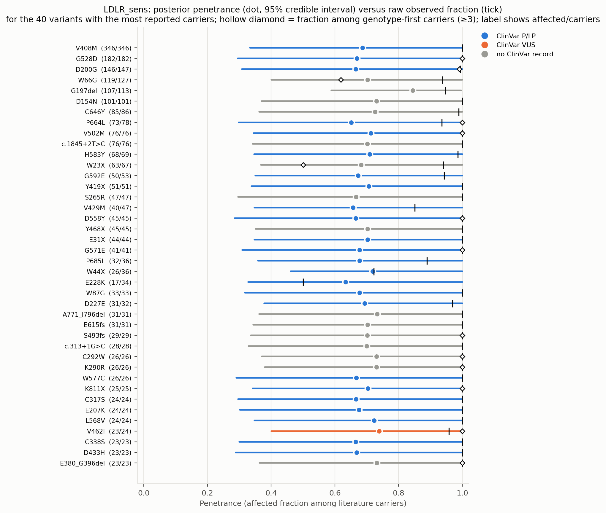
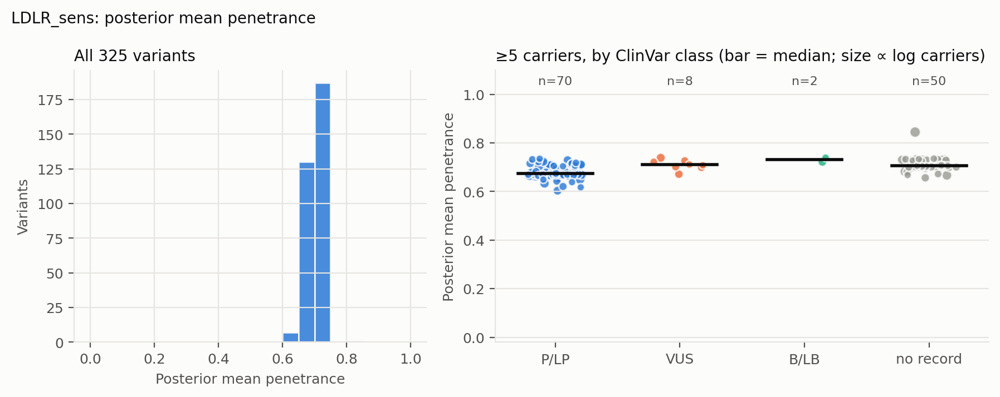
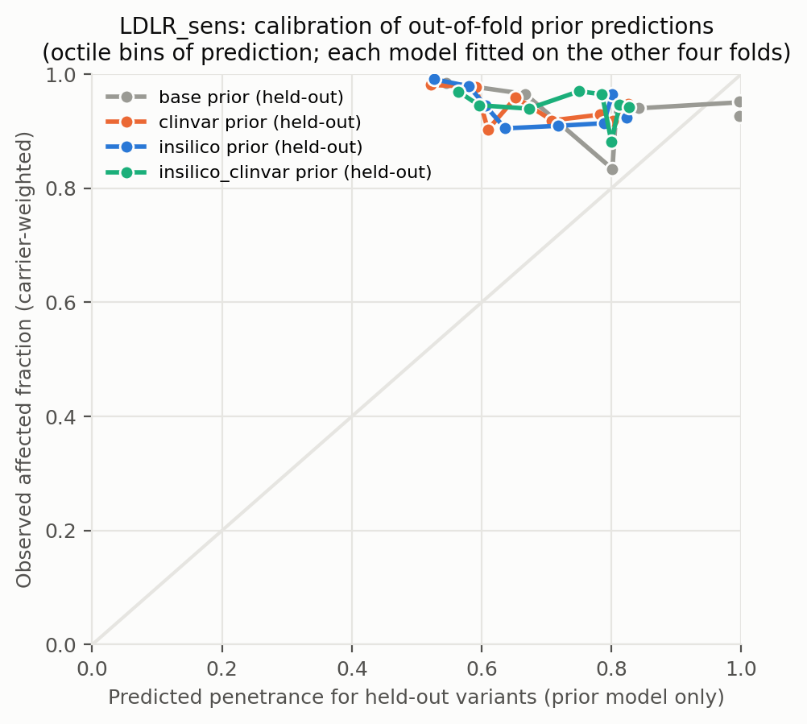
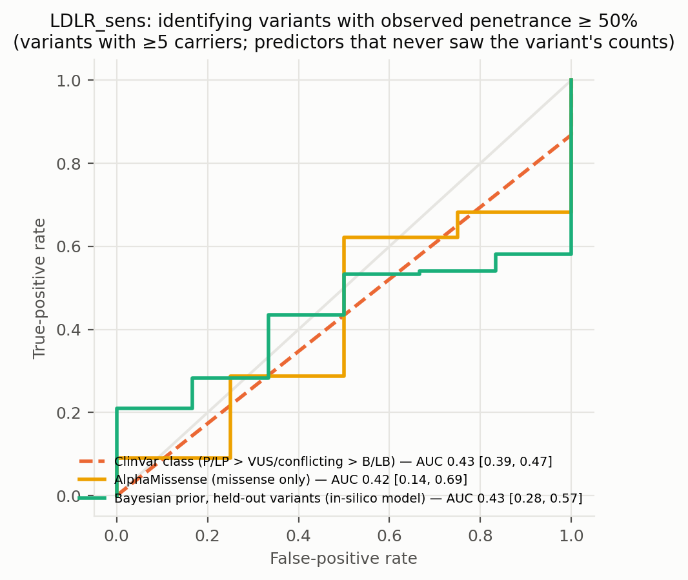
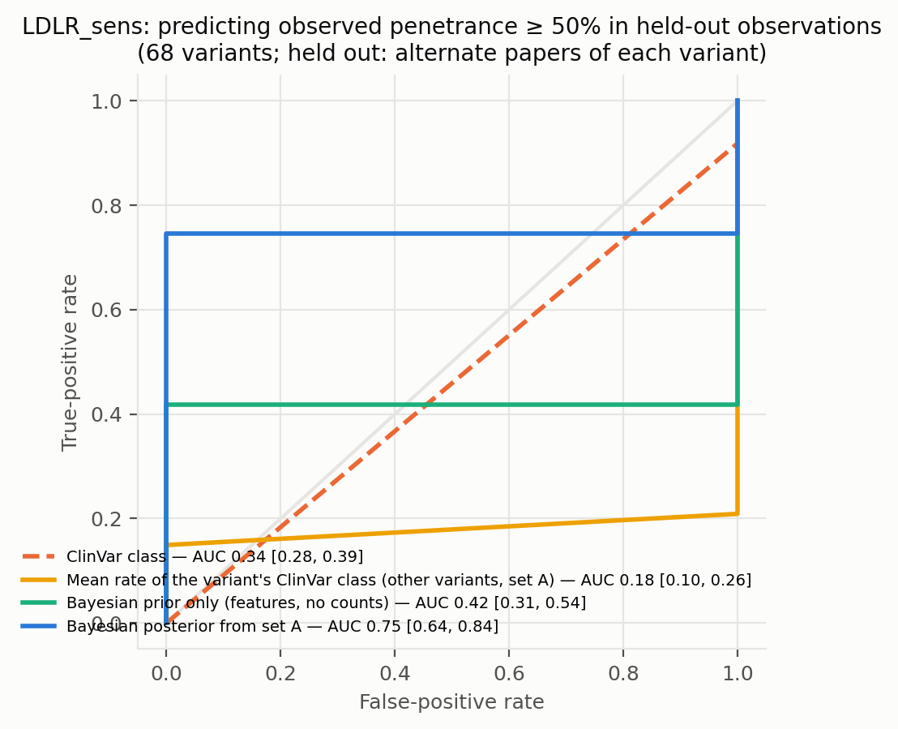
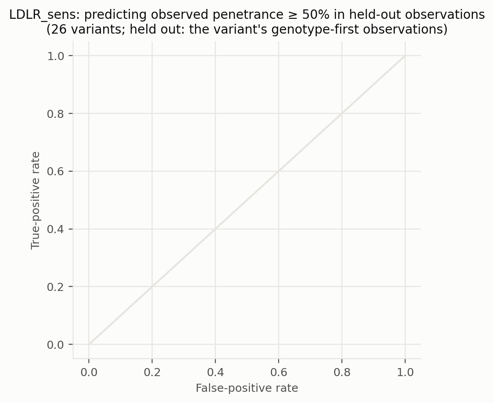
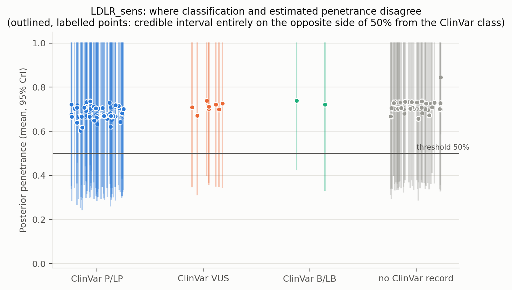
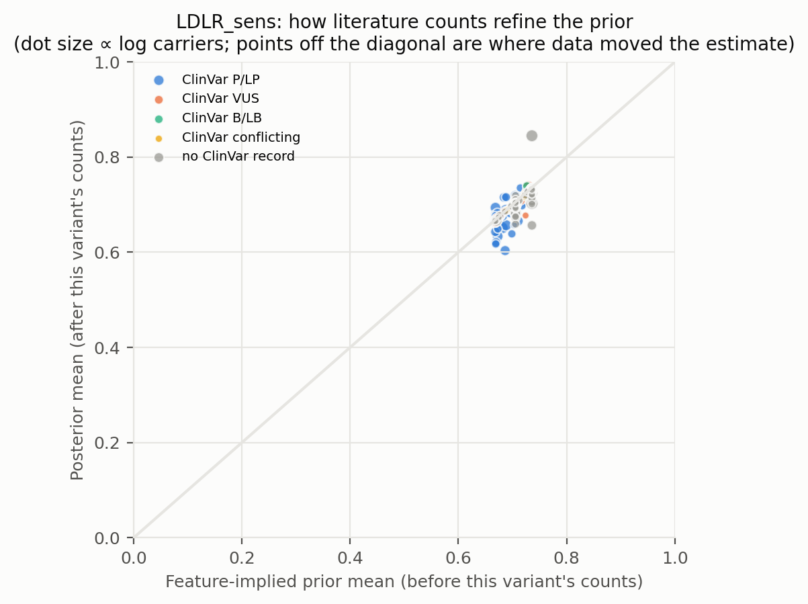
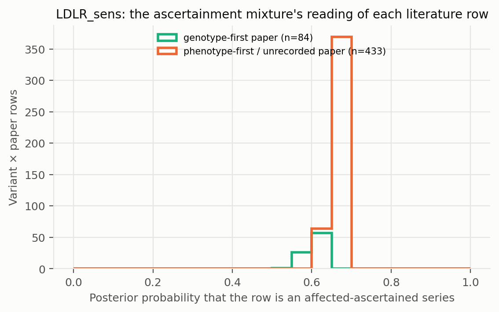

# LDLR_sens: literature-derived penetrance with a Bayesian prior — automated report

Generated by `iterations/grant_e2e_20260909/scripts/make_report.py` from the frozen workflow (GeneVariantFetcher tag `grant-freeze-20260909`). All numbers below are produced by code from the run artifacts; none were edited by hand.

## Data

| Quantity | Value |
| --- | ---: |
| Papers in the extraction database | 2431 |
| Variant rows in the database | 30433 |
| Usable carrier observations (variant × paper) | 523 |
| Papers contributing usable observations | 231 |
| Count rows without a usable denominator (excluded) | 3899 |
| Quarantined count rows excluded by the trust gate | 813 |
| Distinct variants with carrier counts | 329 |
| Total literature carriers / affected | 3780 / 3575 |
| Variants with ≥5 carriers (evaluation set; carriers = literature) | 130 |
| Share of observations that are single affected probands | 0.00 |
| Missense variants with an AlphaMissense score | 169 / 203 |
| Variants with a ClinVar record | 186 / 329 |
| Feature transcript | ENST00000558518.6 |
| gnomAD carriers added as unaffected | 0 (off) |

Denominator sources: explicit = 86, individual_records = 55, total_derived = 382. Study designs (paper level): case_series = 209, cohort_population = 132, unknown = 61, family_segregation = 55, case_report = 41, case_control = 21, other = 4.

Excluded count rows by shape: affected_only_no_denominator = 42, other_or_inconsistent = 57, total_only_no_phenotype_split = 3777, unaffected_only = 23. Largest sources of total-only rows (carrier totals with no affected/unaffected split): PMID 33418990 (412 rows, 546 carriers, design unrecorded); PMID 33508743 (272 rows, 736 carriers, design unrecorded); PMID 38506081 (206 rows, 548 carriers, design unrecorded).

ClinVar classes among variants with counts: B/LB = 8, Conflicting = 7, P/LP = 146, VUS = 25, none = 143.

## Model

Hierarchical logistic-binomial on variant × paper rows (517 rows after merging single-carrier reports per variant, 325 variants). Each row is either an **affected-ascertained series** (probability π, success probability p_asc ≈ 1) or an **informative observation** of the variant's penetrance: `y_r ~ π·Binomial(n_r, p_asc) + (1−π)·Binomial(n_r, p_r)`, `logit(p_r) = α + x_v·β + σ·z_v + τ·e_r`, with a between-variant effect `z_v` and a between-study effect `e_r`; `logit(π_r) = g0 + g1·[genotype-first ascertainment recorded for the paper] + g2·[standardized log10 gnomAD allele frequency of the variant]` (case series of common alleles are ascertainment). gnomAD anchor rows are informative by construction and carry no study effect. Fitted by NUTS (PyMC, 4 chains). The posterior of `p_v = sigmoid(α + x_v·β + σ·z_v)` is the penetrance estimate among carriers not selected for being affected: variants with many informative carriers are driven by their own counts; variants known only from case reports are shrunk toward the feature-implied prior and carry wide intervals. Fixed-effect sets: `base` (intercept only), `class` (truncating), `insilico` (class + AlphaMissense), `clinvar` (class + ClinVar P/LP, B/LB, no-record), `insilico_clinvar`. The primary model is `insilico`.

| Model | Features | σ (between-variant SD, logit) | τ (between-study SD, logit) | π ascertained: phenotype-first / genotype-first rows (typical frequency) | g2 (per SD of log10 AF) | max R̂ | min ESS | divergences |
| --- | --- | ---: | ---: | ---: | ---: | ---: | ---: | ---: |
| base | — | 1.30 | 0.50 | 0.13 / 0.25 | +0.12 | 1.000 | 977 | 0 |
| class ⚠ chains disagree | trunc | 0.68 | 0.44 | 0.67 / 0.61 | -0.06 | 1.530 | 7 | 0 |
| clinvar ⚠ chains disagree | trunc, clinvar_plp, clinvar_blb, clinvar_none | 0.68 | 0.42 | 0.67 / 0.61 | -0.06 | 1.530 | 7 | 0 |
| insilico ⚠ chains disagree | trunc, am, am_missing | 0.64 | 0.44 | 0.67 / 0.61 | -0.06 | 1.530 | 7 | 0 |
| insilico_clinvar ⚠ chains disagree | trunc, am, am_missing, clinvar_plp, clinvar_blb, clinvar_none | 0.65 | 0.44 | 0.67 / 0.61 | -0.06 | 1.530 | 7 | 0 |

⚠ Convergence: chains disagree (R̂ > 1.05) for class, clinvar, insilico, insilico_clinvar. The ascertainment mixture is multimodal when a variant's literature consists of all-affected series with no genotype-first or population anchor (the same rows are explained either as ascertained series or as high penetrance); estimates from those models are not reliable.

**The primary model itself did not converge in this arm (R̂ 1.53). Treat every per-variant estimate below as provisional and use the gnomAD-anchored arm, where population carriers break the ambiguity, as the reportable estimate.**

Primary-model coefficients (posterior mean [94% HDI]): `alpha` 2.02 [-0.11, 7.50]; `sigma` 0.64 [0.00, 1.55]; `beta[trunc]` 0.23 [-0.73, 1.46]; `beta[am]` 0.03 [-0.69, 1.21]; `beta[am_missing]` 0.08 [-1.14, 1.14]; `tau` 0.44 [0.00, 0.87]; `g0` 0.80 [-2.08, 1.99]; `g1` -0.33 [-1.20, 1.08]; `g2` -0.06 [-0.35, 0.23]; `p_asc` 0.89 [0.53, 1.00].

## Held-out predictive performance (5-fold by variant)

| Prior model | NLL / carrier ↓ | Brier / carrier ↓ | log pred. density / row ↑ | calibration slope (1 = ideal) |
| --- | ---: | ---: | ---: | ---: |
| base | 0.2207 | 0.0276 | -0.588 | -0.66 |
| class | 0.2203 | 0.0275 | -0.592 | -0.73 |
| insilico | 0.2232 | 0.0280 | -0.593 | -1.08 |
| clinvar | 0.2216 | 0.0277 | -0.597 | -0.75 |
| insilico_clinvar | 0.2228 | 0.0279 | -0.591 | -0.87 |

Scored on held-out variant × paper rows (each fold's model never saw the held-out variants; predictions integrate both the variant and the study effect).

Paired bootstrap change in NLL per carrier versus the `base` prior (negative = better): `class` -0.0004 [-0.0012, +0.0004]; `insilico` +0.0026 [+0.0006, +0.0053]; `clinvar` +0.0009 [-0.0008, +0.0027]; `insilico_clinvar` +0.0021 [+0.0001, +0.0048].

Paired bootstrap change in NLL per carrier versus the `clinvar` prior (negative = better): `base` -0.0009 [-0.0028, +0.0009]; `class` -0.0013 [-0.0029, +0.0004]; `insilico` +0.0016 [+0.0002, +0.0034]; `insilico_clinvar` +0.0012 [-0.0002, +0.0027].

## Classification performance: identifying variants with observed penetrance ≥ 50%

Evaluation set: variants with ≥5 carriers (literature carriers). Label: observed fraction ≥ 50%. AUC with 95% bootstrap interval.

| Scorer | variants | high-penetrance variants | AUC | 95% CI |
| --- | ---: | ---: | ---: | --- |
| clinvar_ordinal | 80 | 76 | 0.434 | [0.395, 0.468] |
| clinvar_plp_binary | 80 | 76 | 0.434 | [0.390, 0.468] |
| alphamissense_missense_only | 70 | 66 | 0.420 | [0.139, 0.689] |
| insilico_posterior_mean_in_sample_LEAKY | 130 | 124 | 0.948 | [0.845, 1.000] |
| base_oof_prior | 130 | 124 | 0.423 | [0.246, 0.609] |
| class_oof_prior | 130 | 124 | 0.485 | [0.295, 0.663] |
| insilico_oof_prior | 130 | 124 | 0.430 | [0.281, 0.570] |
| clinvar_oof_prior | 130 | 124 | 0.503 | [0.286, 0.709] |
| insilico_clinvar_oof_prior | 130 | 124 | 0.419 | [0.229, 0.637] |

The `_LEAKY` row uses the posterior that already contains the variant's own counts, which also define the label; it is shown only to make the leakage explicit and is not a validation.

Binary rule 'ClinVar P/LP ⇒ high penetrance': sensitivity 0.87, specificity 0.00, PPV 0.94, NPV 0.00 (TP 66, FP 4, FN 10, TN 0).

Other thresholds: ≥25%: clinvar_ordinal 0.44, insilico_oof_prior 0.41; ≥75%: clinvar_ordinal 0.47, insilico_oof_prior 0.32.

## Held-out observations of known variants: penetrance estimate versus classification

**Alternate-paper hold-out.** For each variant reported in ≥2 papers, papers are split alternately by PMID; set A updates the prior, set B is scored (68 variants, 1490 held-out carriers). Because B still contains phenotype-first reports, the prediction for B is the mixture prediction (ascertained series with probability π, informative otherwise).

The ClinVar comparator predicts each variant with the observed A-rate of its ClinVar class among the *other* variants; the pooled rate is the A-rate over all variants.

| Predictor for held-out observations | NLL / carrier ↓ | Brier / carrier ↓ |
| --- | ---: | ---: |
| posterior_from_half_A | 0.1892 | 0.0214 |
| prior_only | 0.2384 | 0.0330 |
| pooled_rate_half_A | 0.1194 | 0.0074 |
| clinvar_class_rate_half_A | 0.1232 | 0.0077 |

Paired bootstrap change in NLL per held-out carrier, posterior-from-A minus ClinVar-class rate: +0.0660 [+0.0312, +0.1048] (negative favours the count-informed estimate).

Paired bootstrap change in NLL per held-out carrier, posterior-from-A minus pooled rate: +0.0697 [+0.0367, +0.1044] (negative favours the count-informed estimate).

Paired bootstrap change in NLL per held-out carrier, posterior-from-A minus features-only prior: -0.0493 [-0.0781, -0.0165] (negative favours the count-informed estimate).

| Scorer (label: observed ≥ 50% in set B) | variants | AUC | 95% CI |
| --- | ---: | ---: | --- |
| posterior_from_half_A | 68 | 0.746 | [0.642, 0.843] |
| prior_only | 68 | 0.418 | [0.313, 0.537] |
| pooled_rate_half_A | 68 | 0.500 | [0.500, 0.500] |
| clinvar_class_rate_half_A | 68 | 0.179 | [0.104, 0.262] |
| clinvar_ordinal | 68 | 0.336 | [0.277, 0.392] |

**Genotype-first hold-out.** Set B = the variant's observations from papers whose ascertainment the extractor recorded as population screening or cascade testing; set A = its phenotype-first observations (case reports, referral series) plus any gnomAD anchor. A updates the feature prior into a variant posterior (exact grid update; the mixture likelihood per row, study effects integrated, τ/π/p_asc at posterior means); B is scored (26 variants, 484 held-out genotype-first carriers). This is the clinical question: does case-based literature plus features predict the penetrance seen when carriers are found by genotype?

The ClinVar comparator predicts each variant with the observed A-rate of its ClinVar class among the *other* variants; the pooled rate is the A-rate over all variants.

| Predictor for held-out observations | NLL / carrier ↓ | Brier / carrier ↓ |
| --- | ---: | ---: |
| posterior_from_half_A | 0.2333 | 0.0268 |
| prior_only | 0.2890 | 0.0411 |
| pooled_rate_half_A | 0.1852 | 0.0163 |
| clinvar_class_rate_half_A | 0.2812 | 0.0208 |

Paired bootstrap change in NLL per held-out carrier, posterior-from-A minus ClinVar-class rate: -0.0479 [-0.2239, +0.0707] (negative favours the count-informed estimate).

Paired bootstrap change in NLL per held-out carrier, posterior-from-A minus pooled rate: +0.0481 [-0.0181, +0.1098] (negative favours the count-informed estimate).

Paired bootstrap change in NLL per held-out carrier, posterior-from-A minus features-only prior: -0.0557 [-0.1041, +0.0328] (negative favours the count-informed estimate).

Largest genotype-first hold-outs (affected / carriers in B; predictions from A):

| Variant | ClinVar | A: affected / carriers | B (genotype-first): affected / carriers | observed B | posterior from A | features-only prior | ClinVar-class rate |
| --- | --- | ---: | ---: | ---: | ---: | ---: | ---: |
| D200G | P/LP | 36 / 36 | 110 / 111 | 0.99 | 0.92 | 0.79 | 0.93 |
| G528D | P/LP | 101 / 101 | 81 / 81 | 1.00 | 0.93 | 0.79 | 0.91 |
| V502M | P/LP | 27 / 27 | 49 / 49 | 1.00 | 0.90 | 0.81 | 0.93 |
| D558Y | P/LP | 4 / 4 | 41 / 41 | 1.00 | 0.82 | 0.80 | 0.94 |
| P664L | P/LP | 41 / 46 | 32 / 32 | 1.00 | 0.79 | 0.80 | 0.95 |
| S493fs | none | 2 / 2 | 27 / 27 | 1.00 | 0.82 | 0.81 | 1.00 |
| W66G | none | 106 / 106 | 13 / 21 | 0.62 | 0.93 | 0.82 | 0.99 |
| V462I | VUS | 5 / 6 | 18 / 18 | 1.00 | 0.82 | 0.82 | 0.83 |
| E10X | none | 3 / 3 | 8 / 14 | 0.57 | 0.82 | 0.81 | 1.00 |
| G676fs | none | 2 / 2 | 12 / 12 | 1.00 | 0.83 | 0.82 | 1.00 |

## Common variants: the known-outcome check

Variants with gnomAD allele frequency above 0.001 are common alleles whose outcome is known independently of the literature: at most a GWAS-scale risk, no Mendelian penetrance. They stay in the model as a check. In case-series literature they look penetrant (median literature fraction 0.92; 100% of them are ≥ 50% affected among reported carriers); the model's estimate for them should be near the population risk: median posterior 0.733, 0% with the 97.5% bound below 10%.

| Variant | ClinVar | gnomAD AF | gnomAD carriers added | affected / literature carriers | literature fraction | posterior mean [97.5%] |
| --- | --- | ---: | ---: | ---: | ---: | --- |
| T726I | B/LB | 5.48e-03 | 0 | 5 / 6 | 0.83 | 0.739 [1.000] |
| V827I | VUS | 1.01e-03 | 0 | 10 / 10 | 1.00 | 0.727 [1.000] |

## Examples where the classification is wrong about penetrance

No variant with ≥5 literature carriers has a 95% credible interval entirely on the opposite side of 50% from its ClinVar class.

## Figures

**Figure — Posterior penetrance (dot, 95% credible interval) versus the raw observed fraction (tick) for the best-observed variants, coloured by ClinVar class.**

**Figure — Distribution of posterior mean penetrance across all variants, and by ClinVar class for variants with enough carriers.**

**Figure — Calibration of held-out prior predictions (each model predicts variants it never saw).**

**Figure — ROC curves for identifying observed high-penetrance variants: ClinVar class alone, AlphaMissense alone, the held-out Bayesian prior, and the posterior that includes the variant's own counts.**

**Figure — Alternate-paper hold-out: the posterior built from half of each variant's papers predicts the observed penetrance in the other half; compared with ClinVar class and a features-only prior.**

**Figure — Genotype-first hold-out: the posterior built from a variant's phenotype-first reports predicts the penetrance observed in its genotype-first (screening / cascade) observations.**

**Figure — Where classification and estimated penetrance disagree; outlined, labelled points are the discordant variants listed above.**

**Figure — Prior mean versus posterior mean: how the literature counts refine the feature-implied prior.**

**Figure — How the mixture reads the literature: posterior probability that each variant × paper row is a pure affected series, by the paper's recorded ascertainment.**

## Limitations that travel with these numbers

- Counts are pooled across papers; cohort overlap between publications cannot be resolved from the extraction, so denominators may double count.
- Probands are included; ascertainment inflates penetrance, most strongly for variants known only from single case reports (see the single-proband share above).
- 'Affected' follows each paper's own phenotype definition for the gene–disease pair; ages are not modelled.
- ClinVar classes are as of the variantFeatures snapshot; frameshift/splice alleles often lack a warehouse record and appear as 'no ClinVar record'.
- Held-out metrics score the prior model; posterior values include the variant's own counts and are the estimate a user would see, not a validation.

## Artifacts

`observations.csv`, `variants.csv`, `variants_features.csv`, `fit/posterior_variants.csv`, `fit/oof_predictions.csv`, `fit/metrics.csv`, `fit/classification_metrics.csv`, `fit/discordant_variants.csv`, `fit/coefficients.csv`, `fit/model_diagnostics.csv`, `fit/fit_summary.json` in the analysis directory.
