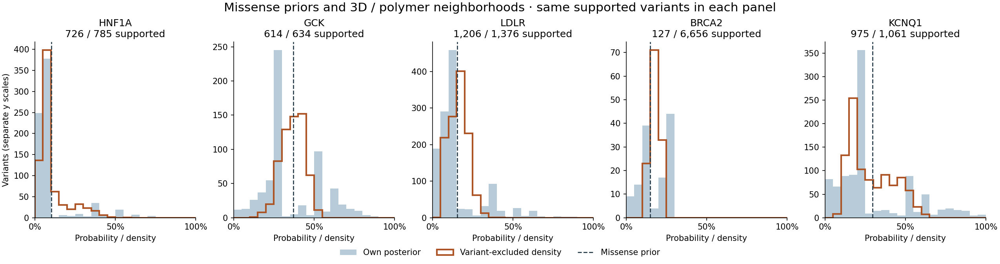
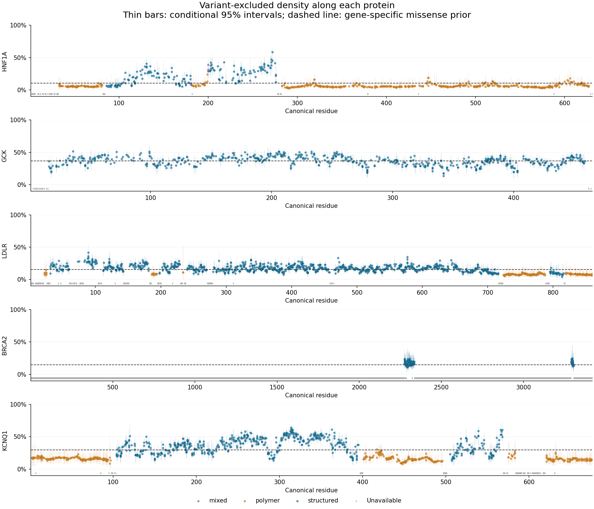

# Structural analysis with the new missense data

The structural extension is complete for HNF1A, LDLR, KCNQ1, and the experimentally
resolved BRCA2 regions. GCK reuses its completed class-specific replay. The
strongest internal predictive improvements are in **HNF1A and KCNQ1**. Sequence
neighborhoods capture much of the same improvement; the additional benefit of
3D geometry is smaller. GCK and LDLR change little, and the small BRCA2 subset
does not show an improvement.

These are research diagnostics under the requested assumption that all included
gnomAD carriers are unaffected. They are not independently validated disease
risks. The full gene-specific missense prior remains fixed during variant-only
LOO, and the literature counts retain the upstream endpoint/ascertainment limits.

## Coverage and distributions

Only canonical, WT-matching **missense** variants enter either the empirical
missense prior or the structural donor pool. Nonsense has a separate upstream
prior and contributes no donors. Population-only observed variants remain in
the pool; unavailable geometry remains missing, never zero.

| Gene | Missense variants | Supported | 3D only | Polymer only | Mixed | Median density among supported |
|---|---:|---:|---:|---:|---:|---:|
| HNF1A | 785 | 726 | 183 | 536 | 7 | 6.35% |
| GCK | 634 | 614 | 614 | 0 | 0 | 37.41% |
| LDLR | 1,376 | 1,206 | 1,027 | 179 | 0 | 16.25% |
| BRCA2 | 6,656 | 127 | 127 | 0 | 0 | 17.78% |
| KCNQ1 | 1,061 | 975 | 586 | 389 | 0 | 24.62% |

“Supported” includes polymer-only estimates. HNF1A's apparent broad coverage is
mostly polymer; its seven mixed variants have different geometry states across
the two chain contexts. BRCA2's median describes just 127 mapped variants, not
the whole gene. “3D” for LDLR is predicted monomer geometry.



The two histograms within each panel use the same supported variants. Own
posterior means are shown in blue, target-excluded neighborhood density in
orange, and the corresponding gene-specific missense prior as a dashed line.
Different genes have different count axes. Discrete own-posterior spikes reflect
recurring small count combinations; smoothing those means does not create new
carrier evidence.



The residue map distinguishes actual/predicted 3D contacts, candidate-IDR
polymer estimates, mixed contexts, and unavailable variants. Thin bars are
conditional 95% intervals from 8,192 Beta draws with seed 20260912. They condition
on the selected counts, fixed prior, geometry and kernel; they do not include
uncertainty in those choices or in source ascertainment.

## Biological units and mapping

- **HNF1A:** [8PI8](https://www.rcsb.org/structure/8PI8) biological assembly 1,
  a partial DNA-bound dimer, with [1IC8](https://www.rcsb.org/structure/1IC8)
  as a separate conformation. Canonical P20823 mapping and WT checks are explicit.
  Missing positions require independent AF/UniProt support before candidate-IDR
  polymer use. The known N-terminal dimerization domain is not relabeled as IDR
  merely because the monomer prediction has low confidence.
- **GCK:** the frozen [class-specific replay](../class_matched_penetrance_20260912/structural/README.md)
  uses the 1V4S biological monomer and its documented canonical isoform mapping.
- **LDLR:** full P01130 AlphaFold monomer, with a domain-separated sensitivity
  because interdomain packing can be uncertain. Among high-pLDDT close nonlocal
  C-alpha pairs, 1,975 of 16,113 have maximum directional PAE above 10 Å.
  [1N7D](https://www.rcsb.org/structure/1N7D) provides a separate partial low-pH
  ectodomain comparison. Engineered N515Q/N657Q and incomplete side-chain COMs
  are withheld; the C-alpha sensitivity retains complete WT C-alpha positions.
- **KCNQ1:** [9U7F](https://www.rcsb.org/structure/9U7F) and
  [9UC8](https://www.rcsb.org/structure/9UC8), actual tetramers with KCNE1 and CaM.
  The [primary study](https://www.nature.com/articles/s41422-025-01182-9) uses
  engineered KCNE1-linked KCNQ1 constructs containing residues 76–620. These are
  partial resolved units, despite full canonical reference SEQRES. Primary COM
  coverage is 359 positions per KCNQ1 copy; missing side-chain atoms at Lys569
  are not replaced with an incomplete centroid.
- **BRCA2:** [7LDG](https://www.rcsb.org/structure/7LDG) and
  [8PBC](https://www.rcsb.org/structure/8PBC) are retained as **separate coordinate
  frames** for domain-local exploratory analysis. They cover only 72 of 3,418
  canonical positions with eligible COM geometry (2.11%). There is no invented
  full-length frame, no inter-domain distance, and no polymer outside these
  constructs. 7LDG contains separately modeled BRCA2 fragments whose deposited
  chain count must not be interpreted as four native full-length molecules.
  Chemically modified MSE2322 COM is withheld; C-alpha sensitivity adds that
  position and supports three more variants.

Each gene's `geometry/` README and identity report preserve source URLs, raw-byte
hashes, actual partner identities, construct limitations, mapping, residue
exclusions and reproduction commands. Raw structures stay in the ignored
`results/missense_structural_extension_20260912/raw/` cache. This explicitly
partial-geometry analysis does not claim successful completion of PPA's strict
full-functional-unit pipeline for incomplete proteins.

## Exact fitting and spatial rules

The accepted [type-specific empirical priors](../class_matched_penetrance_20260912/README.md)
are reused unchanged. For each variant:

```
posterior_alpha = alpha_missense + affected
posterior_beta  = beta_missense + literature_unaffected + gnomAD_carriers
```

The prior uses all eligible observed variants in that gene/type, including
population-only variants, even if their geometry is unavailable. The historical
moment formula and its small n=1 fitting weight remain unchanged. AlphaMissense
does not enter this prior or the empirical posterior.

Primary distances use complete side-chain heavy-atom mass-weighted COM (glycine
uses C-alpha). The kernel is `2 / (1 + exp(log(3) * distance / h))`, with h=3 Å
primary and h=2/5 Å sensitivity. It has positive tails beyond 20 Å. There is no
distance cutoff, neighbor-count cap, carrier-count multiplier or uncertainty
multiplier. Candidate-IDR pairs use `3.8 * sqrt(abs(i-j))` only within the same
contiguous segment and same chain; mixed ordered/IDR and cross-chain IDR pairs
do not receive invented distances.

The held-out **variant identity** is excluded across all chains/aliases. Other
variants at its residue remain donors, including distinct DNA alleles encoding
the same substitution under the frozen upstream unit policy. Per target chain
context, each distinct donor uses its nearest eligible biological copy. Weights
normalize within each supported context, then contexts are averaged equally.
Repeated assembly copies are not independent observations or independent Beta
draws. Different structural frames never generate cross-frame distances.

Outer LOO removes the held-out identity from **every training neighborhood**,
recomputes context normalizers, and retains each training row's own exclusion.
All models in a fold use identical training/evaluation targets. LDLR A234T and
A234V occupy an isolated one-residue candidate-IDR segment: holding one out
removes the other's final donor. That newly unsupported training row is dropped
from every model in the fold; it is not filled with zero. The held-out evaluation
remains present. Fixed-ridge fractional logistic fits use equal-variant posterior
means and training-only feature scaling.

## Predictive comparison

Lower MAE is better. Each row compares the same available targets using h=3 Å
COM. Hyperparameters were not selected from these results.

| Gene | AM-common targets | AlphaMissense MAE | AM + density MAE | AM + sequence MAE |
|---|---:|---:|---:|---:|
| HNF1A | 720 | 0.076637 | 0.065383 | 0.066919 |
| GCK | 610 | 0.124636 | 0.123400 | 0.122818 |
| LDLR | 1,199 | 0.089952 | 0.089658 | 0.089345 |
| BRCA2 | 44 | 0.001604 | 0.001629 | 0.001699 |
| KCNQ1 | 969 | 0.136959 | 0.130348 | 0.131109 |

HNF1A improves 14.7% and KCNQ1 4.8% relative to AM-only MAE. Their improvements
over AM plus sequence are much smaller. In the 3D-only evaluated strata, HNF1A
MAE changes 0.163039→0.144030 (182 variants) and KCNQ1 0.175648→0.168083 (581).
These are stratifications of the same LOO predictions, not separately retrained
models. Observed-fraction MSE and Beta-binomial count scores also improve for
HNF1A/KCNQ1; the complete tables include all-supported baselines and these metrics.

BRCA2's 44 AM-common targets are **all literature-only archive fallbacks**.
Population AM version conflicts remain missing. Their posterior means are
highly concentrated, so the tiny MAE is not evidence of a strong predictor.
Across all 127 mapped BRCA2 targets, density-fit MAE is 0.077106 versus 0.075924
for the fitted intercept baseline. There is no demonstrated gain in this subset.
Intercept-only LOO rank correlation is suppressed because the changing training
mean produces a mechanical inverse relationship with the held-out label.

There are 60 new geometry/kernel scenarios, plus GCK's frozen 20. At h=3 Å COM,
changing HNF1A's conformation shifts density by 0.35 percentage points on average;
changing KCNQ1's state shifts it by 0.93 points. LDLR's domain-separated sensitivity
shifts it by 0.37 points on average, with individual changes up to 7.91 points.
Changing h=3 to h=2/5 shifts KCNQ1 by about 3.13/2.70 points on average. Feature
sensitivity is material for individual variants even when average changes are
small. These are feature sensitivities, not bandwidth-tuned predictive results.

## Next work

Prioritize HNF1A and KCNQ1 for disease-specific endpoint/count curation and the
next fixed variant-only LOO comparison. Keep AM plus sequence as a required
comparator, since most of the apparent neighborhood signal is not unique to 3D.
Resolve BRCA2's AM versions and acquire a validated full-length functional-unit
prediction before making gene-wide structural claims. Retain LDLR's domain/PAE
checks and the pending GCK MODY-versus-hypoglycemia identity/endpoint review.
The structural signal is promising in two genes, but independent outcome data
are still needed to assess clinical calibration.

## Reproduction and checks

```
../BayesianPenetranceEstimator/.venv/bin/python docs/evidence/missense_structural_extension_20260912/run_structure.py
../BayesianPenetranceEstimator/.venv/bin/python docs/evidence/missense_structural_extension_20260912/validate_outputs.py
../BayesianPenetranceEstimator/.venv/bin/python docs/evidence/missense_structural_extension_20260912/summarize.py
python3 docs/evidence/missense_structural_extension_20260912/freeze.py --verify
```

PPA commit `1fd57c1` adds exact multi-context global exclusion and bounded target
batches; all 218 engine tests pass. Independent output reconstruction verifies
1,564,564 positive normalized donor pairs, all new primary means/variances and
the count-score/error calculations. Other variants at the same residue account
for 4,026 retained target/donor pairs. An additional independent geometry
implementation reconstructs all HNF1A/KCNQ1 primary weights and 45 selected LOO
predictions. Complete primary weights and predictions are sharded without a
distance-tail threshold; every artifact is below 1.2 MB. Both scientific figures
were visually inspected. `manifest.json` pins all final evidence and source
snapshots; `freeze.py --git` verifies committed artifact blobs.
