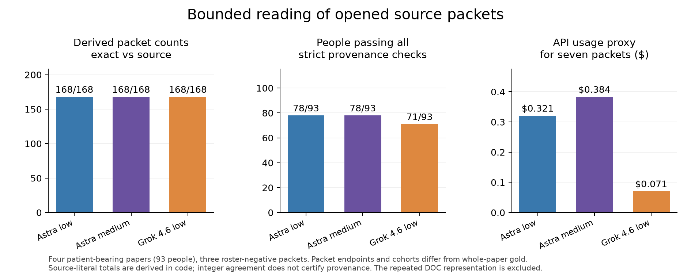

# Grok availability and expanded bounded Astra test — 2026-09-06

**Grok 4.6 returned successfully in this retry. Astra low reads the bounded patient
records; medium added no count accuracy in this test.** These results support a
patient-record stage with explicit source/cohort/endpoint rules. They do not
support replacing the full extraction pipeline or claiming a human-performance
ceiling.

## What was tested

Eight frozen packets from seven previously opened papers, each read once by
Astra low, Astra medium and Grok 4.6 low: **24 completed, valid JSON requests**.
Four papers supply **93 distinct identified people**: MYBPC3 20433692 (48),
MYBPC3 21302287 (22), RYR2 30403697 (15), RYR2 25435091 (8). The 48-person DOC
was also tested as an original rowspan-expanded grid, giving 141 row appearances
per arm. Three packets test refusal to invent people from an aggregate-only
abstract, a missing-table narrative, and a functional-assay section. These
packets can contain aggregate counts; an empty roster is not an all-NA extraction.

Sources, source-derived reference records and endpoint rules were fixed before
API dispatch. All 24 outputs were locked before grading or opening the existing
gold overlap. Models saw source only. This is investigator-adjudicated, opened
calibration with one draw per cell, not blinded human validation. Packet selection
and hand-preparation are part of the intervention, not an automated acquisition
success. [Contract](contract.md), [source preparation](prepared.json),
[Astra locks](outputs_locked.json), [Grok locks](grok_outputs_locked.json).

| Seven distinct-paper packets | Valid responses | Derived fields exact vs source | Decorated source-ID rows | Missing cohort-citation rows | API proxy |
| --- | ---: | ---: | ---: | ---: | ---: |
| Astra low | 7/7 | 168/168 | 15 | 0 | $0.321 |
| Astra medium | 7/7 | 168/168 | 15 | 0 | $0.384 |
| Grok 4.6 low | 7/7 | 168/168 | 0 | 22 | $0.071 |

Those 168 fields cover 56 variant-packet groups, including **122/122 exact
positive-valued reference fields**. They are carriers plus positive/negative
values under the **packet's specified endpoint**, with unique people summed in
code, not independent observations or whole-paper gold recall. Three of the
seven packets have no identified-person roster; all arms correctly leave them
empty. The four patient-bearing papers carry the quantitative result.

The separate DOC representation adds one request per arm. Including that
repeated workload gives 216/216 derived fields per arm and total proxies of
$0.441 / $0.530 / $0.088. The all-requirements gate passes 126/141 Astra row
appearances and 91/141 Grok appearances, but that combines different failure
types; the citation and index-metadata causes below should be considered
separately. It is not a ranked clinical-accuracy score.

## What still failed

Astra recovered all patient values but decorated RYR2 30403697 citations as
`Table 1, L107` rather than the strict `L107` identifier. Both efforts therefore
failed the registered locator check for all 15 people. A separate post-hoc,
format-only sensitivity fixes 14/15; one decorated footnote remains rejected.
Those numbers are reported separately, not substituted into the primary result.

Grok omitted the enrollment citation needed to support HCM classification for
22 MYBPC3 21302287 patient records. On the structured DOC representation it used
null instead of false for 28 unstarred index flags. The prompt's general
missing-status rule and the table's star convention make this a metadata
interpretation issue, not an incorrect carrier total. Person identities,
genotypes, phenotype values and derived counts remained correct. Integer
agreement alone would have hidden all these provenance/metadata differences.

[Source scores and every difference](source_scores.json),
[format sensitivity](locator_sensitivity.json). Source-validated counts in these
files use an investigator-prepared reference; this is not a new general-purpose
production validator. The literal count-recovery gate remains unchanged.

## Tested output-contract correction (post-hoc)

Two additional source-only probes use strict JSON schema with an enum of valid
source IDs and an explicit requirement to cite supporting cohort/footnote lines.
Astra low now passes all source checks for **15/15** RYR2 30403697 people; Grok
low passes **22/22** MYBPC3 21302287 people. Counts are unchanged. Their proxies
are $0.0674 and $0.0177, with elapsed times 45 and 151 seconds. These are
post-hoc schema/prompt refinements on opened examples, not part of the original
effort comparison or evidence of a causal latency effect. Both Azure endpoints
accepted the strict schema. Schema validity still does not establish that an
arbitrary selected citation is clinically sufficient.
[Locked probes](strict_schema_locked.json), [source grades](strict_schema_scores.json).

## Comparison with existing gold

A secondary, post-lock comparison uses strict, unique allele matching and one
copy of each positive paper. Seven source variant labels remain unmapped or
ambiguous; they are retained for review. RYR2 30403697's VT/SCA endpoint is
excluded from the A/U comparison because it is not general clinical CPVT status.

| Field | Source candidate exact / matched gold | Existing control exact on same overlap | Additional exact null fills |
| --- | ---: | ---: | ---: |
| Carriers | 43/49 | 13/49 | 30 |
| Affected | 28/28 | 9/28 | 19 |
| Unaffected | 28/28 | 2/28 | 26 |

There are also **six additional carrier disagreements**, all in RYR2 30403697.
The packet deliberately includes numbered children only; the article also
mentions carrier relatives. For example, R417L/F3496L's two numbered siblings
have a carrier father outside that packet. G4772S has a carrier cousin. Other
rows need variant-specific family/pedigree reconciliation; do not simply force
the packet sum to match gold. A perfectly transcribed table is still an
incomplete whole-paper count when relatives are elsewhere.

The 75 additional gold-exact candidate fields (45 A/U) are a local opportunity,
not 75 accepted production changes or an overall uplift forecast. Original
strict provenance qualifies only a subset; no predictions were merged into
production. [All mappings and disagreements](existing_gold_diagnostic.json).

## Why Grok timed out

The deployment is provisioned and authenticated. Two initial direct legacy-cap
probes timed out at 55 seconds; subsequent documented-cap Chat and Responses
probes returned in about 2–3 seconds. A counterbalanced modern/legacy/modern
check then returned successfully in **1.86 / 2.49 / 2.09 seconds**. This does not
establish cap spelling alone as the cause of the incident, or rule out an
interaction with transient service conditions. The supported
finding is intermittent request latency/availability, not an identified Azure
backend root cause, permanent deployment failure, or inability to read papers.

GVF now translates Grok 4.6's legacy caller cap to `max_completion_tokens`, as
[Azure documents](https://learn.microsoft.com/en-us/azure/foundry/foundry-models/how-to/use-foundry-models-grok).
An actual serialized-payload regression test and a live production SDK call
verify this route; the latter returned in 2.03 seconds. Explicit zero retries
avoid the hidden SDK retry amplification observed in the previous campaign.
The earlier explicit-cap/high-effort failures remain unresolved historical
observations. Successful later calls do not erase them.

[Counterbalanced design](grok_confirmation_design.json),
[before/after wire payloads](wire_after.json), [live SDK result](responses/grok_production_sdk_low.json).
Health-call success is not the paper result; all eight Grok paper packets also
returned and were graded above. Defaults remain unchanged.

## Recommended use and forecast

Use deterministic DOC/DOCX/HTML parsing where cells and rowspans are accessible.
For the next integration test, start with **Astra low for bounded unresolved
patient records or evidence joins**;
reserve medium for demonstrated unresolved reasoning rather than routine
transcription. Here medium cost 20% more and supplied the same counts. Grok 4.6
low is a much cheaper candidate reader or second opinion once its availability
is acceptable; its returned proxy was one fifth of Astra low's across the eight
packets, with more evidence-format omissions.

The next integration must carry study/cohort, endpoint and timepoint through
the whole pipeline, resolve family paragraphs/pedigrees before calling a table
sum a paper total, deduplicate by person/variant, retain unknown status, and
verify source bindings independently of gold. Use structured source-ID fields;
strict JSON schema can constrain identifier spelling but cannot prove that the
chosen line supports the claim. Test this before enabling derived-count writes.

These four patient-bearing papers demonstrate a successful bounded-reading
mechanism worth testing in the full pipeline. They do **not** justify a new overall percentage: acquisition,
whole-paper scope, reference disagreement, variant mapping and production
acceptance remain unmeasured by this bounded task. There is still no measured
75%-of-human ceiling.

## Audit notes and verification

The frozen contract mistakenly added the stated packet sizes to 139 appearances
and 91 people. The correct sums are **141 and 93**; the reference files and
scorer use actual records and were unaffected. Original-DOC inspection also
clarifies that one **blank** family cell spans the two noncarrier rows IV-1 and
IV-5; the second row inherits a blank, never H49. Their H49 join requires prose.
The source's H197/H147 and H76/H46 discrepancies remain unresolved, and the
proband's during-follow-up presyncope is not silently reconciled with final
asymptomatic status. Source-literal R493X/c.2827C>T is retained as a notation
review issue.

Claude, Grok and Agy CLI reviews cover design and source adjudication; final
result dispositions are under [reviews](reviews/). Their suggestions are checked
against source and experiments, not treated as authority. Code compiles, the
full offline suite passes **2,951 tests**, and an isolated wheel matches all
159 packaged source/data files and passes installed-runtime smoke checks.
The historical/candidate canonical figure was rebuilt without adding this
different source-diagnostic cohort to its denominator.

## API accounting

This follow-up made 36 API requests. Returned usage proxy is **$1.14701**; two failed probes retain **$1.54684** in unknown-charge reserves. Including conservative input/cache-write accounting gives **$2.78825** against the new $4.90 cap. Added to the immutable old campaign ledger, the original $150 envelope is **$147.82576 accounted**, with **$2.17424 remaining**. This includes the old $25 uncertainty margin and unknown reserves; it is not an Azure invoice. No Anthropic extraction API was used. CLI consultations are excluded as authorized. [Ledger summary](budget_summary.json).

The 45 additional gold-exact A/U candidates comprise **25 positive values and
20 explicit zeros**. All 45 pass this experiment's original source-adjudication
check; production acceptance still requires integration and paper-wide scope
validation. Thirty additional carrier candidates are gold-exact, but only 15
pass the original strict source gate before the separate schema refinements.

For an offline replay without API calls or rewriting the locked results, run
`.venv/bin/python docs/evidence/model_followup_20260906/audit.py` from the repo.
Executed experiment code is preserved in `executed_code_snapshots.json`;
repository formatting only splits multi-import statements and changes layout.
The audit checks those bound source bytes, syntax equivalence with import
splitting normalized, every primary grade, and both budget ledgers.
