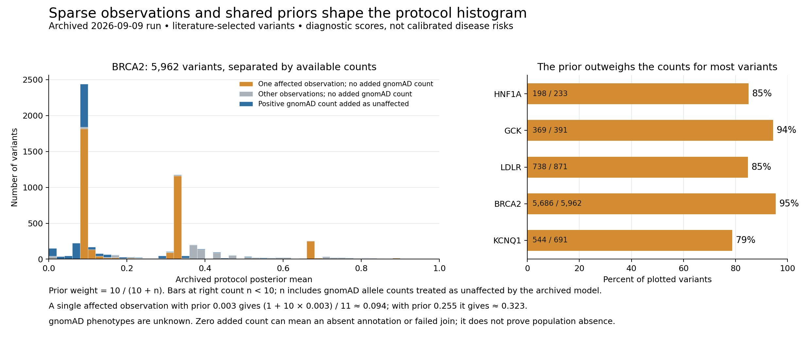

# Penetrance histogram audit — 2026-09-12

**Needs revision as an estimate of population disease risk.** The five plotted
distributions and quoted rounded numbers reproduce, but the accompanying
explanation overstates what the data and model establish. This audit covers the
five protocol CSVs, their observation/annotation summaries, the calculation and
feature-join code, the plotted figure, and the main grant narrative. It is not a
source adjudication of every extracted person, allele, or paper, nor a new fit.

The original run is preserved under
[`grant_e2e_20260909`](../grant_e2e_20260909/README.md). This audit supersedes its
claims of population calibration and the causal explanation of the histogram.
It does not change its frozen counts, posterior CSVs, or original PNG.



## What the chart actually measures

The unit is one retained variant key from literature with usable phenotype
counts, after the implementation's consequence exclusions. It is not all
variants in these genes, all ClinVar variants, or a population sample. Population
alleles absent from this selected literature set never enter the chart.
Synonymous variants are intended to be excluded. The y-axis counts keys equally,
whereas the prior fit weights observations by their carrier denominator.

The plotted column is `insilico_post_mean`, not the ClinVar-conditioned model.
Its analytical mean is approximately

```text
score = (affected_literature + 10 × fitted_feature_prior)
        / (literature_carriers + gnomAD_allele_count + 10)
```

Saved means are Monte Carlo estimates, so they differ slightly from this exact
expression. The prior is fitted to those same constructed affected/total
counts. There is no age-, sex-, or endpoint-specific background disease-risk
parameter. Removing gnomAD only from the final denominator would leave its
influence in the fitted prior; that is not a valid corrected fit.

| Gene | Variants | Median score | Below 0.10 | At least 0.50 | At least 0.90 | Nominal prior weight >50% |
| --- | ---: | ---: | ---: | ---: | ---: | ---: |
| HNF1A | 233 | 0.844 | 16.3% | 72.5% | 15.9% | 198 / 233 (85.0%) |
| GCK | 391 | 0.935 | 1.5% | 87.5% | 62.1% | 369 / 391 (94.4%) |
| LDLR | 871 | 0.937 | 4.4% | 82.4% | 62.6% | 738 / 871 (84.7%) |
| BRCA2 | 5,962 | 0.104 | 48.8% | 11.1% | 0.4% | 5,686 / 5,962 (95.4%) |
| KCNQ1 | 691 | 0.712 | 2.7% | 66.3% | 3.9% | 544 / 691 (78.7%) |

The last column is `10/(10+n)>0.5`, equivalent to `n<10`; `n` includes the
synthetic unaffected gnomAD count. This describes the final Beta update, not an
independent prior: the fitted feature prior has already seen the training counts.
BRCA2's rounded 0% above 0.90 is actually 25 variants (0.419%).

## Main findings and their implications

1. **The low BRCA2 peak is mostly singleton arithmetic.** Of 1,997 variants
   between 0.09 and 0.11, 1,919 (96.1%) have zero added gnomAD count and 1,918
   have `n=1`. The median prior is 0.00309: one affected observation yields
   `(1 + 10×0.00309)/11 = 0.0937`. Across all 2,907 scores below 0.10, 1,888
   (64.9%) have zero added gnomAD count. The 0.30–0.36 group contains 1,327
   variants, including 1,290 truncating keys and 1,262 with `n=1`; the shared
   truncating prior 0.2554 gives a singleton score of 0.3231. The quoted claim
   that most BRCA2 variants meet a large population denominator is false.

2. **The two million gnomAD total is concentrated and is not two million
   distinct unaffected people.** Only 1,399 / 5,962 BRCA2 variants have a positive
   added count. Five keys supply 96.4% of the summed allele counts. A frequent
   allele can count both copies in a homozygote; summing over alleles can also
   count the same person repeatedly. The model uses allele count directly and
   does not use allele number, homozygote count, age, sex, disease status, or
   matched sampling exposure to establish a clinical denominator. It can learn
   a low feature prior from these heavily weighted rows and transfer it to
   rare variants; attributing the precise size of that indirect influence
   requires a refit sensitivity analysis.

3. **gnomAD cannot supply observed unaffected status.** The official gnomAD
   discussion explicitly explains that its participants can have disease and
   that it is not a disease-free control collection
   ([gnomAD explanation](https://discuss.gnomad.broadinstitute.org/t/pathogenic-variants-observed-with-a-too-high-number-of-homozygous-individuals/187)).
   This is especially consequential for adult-onset cancer and common metabolic
   endpoints. The current common-variant check tests whether synthetic negative
   counts drive a score down; it does not demonstrate calibrated population
   risk. A benign allele has approximately the relevant background absolute
   disease risk, not necessarily zero. Frequency can inform plausibility or an
   explicit frequency-based likelihood; it cannot become phenotype observations.

4. **The high GCK/LDLR modes combine selected cases and shared feature priors.**
   Literature dominated by affected referrals is selected on the outcome. A
   Beta prior does not correct that selection. The grey group also includes
   nontruncating variants lacking AlphaMissense: 152 LDLR keys share prior
   0.95614, 47 GCK keys share 0.96171, and 18 HNF1A keys share 0.94717. Missing
   annotation is being used as a fitted predictor, which can encode coverage
   and selection rather than biology. A broad universe should include low-risk
   variation, but it would be wrong to force every gene into the same shape.
   In a genotype-first study, pathogenic HNF1A variants had markedly lower
   penetrance in unselected cohorts, while pathogenic GCK variants remained
   highly penetrant; the relevant GCK phenotype and ascertainment must be
   distinguished ([Mirshahi et al., 2022](https://pubmed.ncbi.nlm.nih.gov/36257325/)).

5. **Grey means no joined classification, not proven absence from ClinVar.**
   Of LDLR's 401 keys labeled `none`, 353 had no warehouse allele match; the
   corresponding BRCA2 count is 1,804 / 2,005. Label this category “no joined
   ClinVar annotation” and separate failed mapping from matched allele without
   an annotation. The source join strips transcript prefixes for cDNA aliases,
   can pool literature by protein key, and can choose one max-frequency allele
   for gnomAD while choosing a different best-review allele for ClinVar. The
   population record query reads but does not filter `filter_status`. These
   are specific identity/QC risks requiring allele-level review, not proof
   that every affected estimate is wrong. Three retained synonymous keys are
   mislabeled `substitution_cdna`: LDLR G207=, BRCA2 P2827=, and KCNQ1 I145=.
   The last contributes 1,192 added gnomAD counts, despite the intended
   synonymous exclusion. Seven BRCA2 truncating rows also have AlphaMissense
   values and need consequence/allele review. Exact rows are preserved under
   `classification_consistency` in the numerical summary.

6. **Neither the KCNQ1 shape nor the existing validation proves calibration.**
   The curated comparison uses `p_mean_w`, which itself includes gnomAD as
   unaffected; it is a concordance check sharing assumptions, not an independent
   population outcome. The reported 14,182 versus 2,492 carrier discrepancy
   also compares pipeline `n` including gnomAD against reference literature-only
   counts. That does not establish a count-imposed ceiling. The headline method
   is the pooled feature-prior/Beta update, whereas METHODS.md describes the
   older ascertainment-mixture arm. Its fitted prior sees each variant's counts
   before updating with them again; this is empirical reuse of data, not a
   fully joint hierarchical model or independently learned prior. The OOF prior
   avoids target-variant training counts, but its test label is still the
   constructed affected/(literature + gnomAD) ratio. Narrow credible intervals
   conditional on this likelihood do not include the uncertainty caused by
   selection, phenotype assignment, overlap, or annotation error.

## Fairer comparison of ranking scores

The old AUC table compares different rows because the ClinVar scorer excludes
keys with no classification and the feature scorer retains them. On the same
eligible rows for both scores (`n>=5`, finite scores, joined ClinVar present),
the independently recomputed point AUCs are:

| Gene | Same variants | Held-out in-silico prior | ClinVar ordinal |
| --- | ---: | ---: | ---: |
| HNF1A | 52 | 0.929 | 0.970 |
| GCK | 48 | 0.742 | 0.932 |
| LDLR | 176 | 0.857 | 0.751 |
| BRCA2 | 427 | 0.846 | 0.896 |
| KCNQ1 | 207 | 0.853 | 0.814 |

These are descriptive ranking comparisons against synthetic labels, with no
paired significance test and no claim of population calibration. In particular,
“matching ClinVar on BRCA2” is not supported by the same-row point comparison.

## What to do next

The next work is denominator and phenotype repair before spending on broader
literature extraction or tuning a desired histogram shape. The active checklist
is in [`TASKS.md`](../../../TASKS.md); the proposed acceptance sequence is:

1. **Freeze an observation contract and small source-review panel.** Keep HNF1A
   diabetes, GCK mild hyperglycemia/diabetes, LDLR biochemical LDL-C/FH versus
   coronary outcomes, BRCA2 age/sex-specific breast cancer, and KCNQ1 ECG versus
   arrhythmic events distinct. Retain case series, genotype-first cohorts,
   family/cascade observations, case-control samples, assay rows, and unknown
   ascertainment separately. Review duplicate people/families across papers,
   uncertain status, index cases, follow-up, and source coordinates. A missing
   phenotype stays unknown; a count-only or assay row cannot create controls.

2. **Recover the missing denominator evidence already on disk.** Begin with
   the HNF1A/GCK genotype-first source PMID 36257325 and its supplements, and
   the GCK V455E source PMID 36208030; verify the exact endpoint and per-allele
   counts before use. The archived HNF1A record reports 218 excluded total-only
   rows from the former paper; those cannot simply be marked unaffected. Then
   obtain phenotype-linked population/cascade evidence for LDLR, BRCA2 and
   KCNQ1. A reliable no-estimate outcome is valid when evidence is insufficient.

3. **Repair allele and annotation provenance.** Use genome build plus normalized
   genomic allele and transcript-aware consequences. Preserve alternate-allele
   and transcript ambiguity; do not merge distinct frameshifts solely by start
   residue. Require a defined gnomAD release/subset, PASS/QC policy, AC/AN and
   homozygote semantics. Carry `matched_zero`, `matched_positive`, `AF_only`,
   `not_annotated`, and `unmatched` separately. Review consequence/AlphaMissense
   disagreements before fitting. Run this on fixed source without new LLM calls.

4. **Separate the variant universe from the estimable subset.** Keep common,
   benign, population-only, and synonymous variants in the coverage/control
   inventory with explicit eligibility. Show which have measured phenotype
   evidence, which only have feature predictions, and which remain unestimated.
   Report variant-weighted and carrier-weighted distributions separately where
   relevant. Population-only alleles do not acquire zero disease risk by default.

5. **Fit and validate a scientifically identified estimator.** Prefer measured
   outcomes in genotype-first cohorts, with cohort/family structure and
   age/censoring when available. Use explicitly corrected case/control sampling
   if applicable, not literature case counts divided by arbitrary population
   exposure. Learn priors from training cohorts only, or use one coherent joint
   hierarchical likelihood. Define background risk for the same endpoint and
   population. Retain the current S=10 construction as a labeled historical
   sensitivity arm. Prespecify sensitivity to prior strength, missing features,
   influential common alleles and ascertainment. Hold out entire independent
   cohorts/families; assess calibration, interval coverage and proper predictive
   scores on the same rows, not AUC alone or ClinVar as clinical truth. The
   population-cohort guidance reinforces phenotype, sampling and variant
   interpretation checks
   ([Nature Genetics, 2024](https://www.nature.com/articles/s41588-024-01842-3)).

## Reproducibility and review scope

- Preservation verification: GVF commit `c6ec94c3` saved the original grant
  evidence and tested CSV compatibility fix; the six preceding pending commits
  and tag `grant-freeze-20260909` were pushed. BPE main `e048e64d` includes
  reviewed local source plus its remote history, and was independently verified
  clean and equal to remote main. Run databases, secrets, caches, traces and
  large runtime outputs remain excluded according to repository policy.
- Validation: the full GVF offline unit suite passed **3,025 tests** in
  376.94 seconds, including the new producer-to-consumer source-override
  regression. The BPE integration/pilot suite passed **47 tests**. Archived
  model fits and old experiment scripts were not all rerun.
- [`numerical_audit.py`](numerical_audit.py) reads the five archived protocol
  posterior/OOF CSVs, checks key uniqueness, exact count partitions and matching
  universes, and writes [`numerical_summary.json`](numerical_summary.json) and
  [`strata.csv`](strata.csv), including input SHA-256s. Minimal feature-join
  snapshots and provenance are retained in `feature_join/`, so reproducing
  the join-status checks does not require the ignored sibling run directory.
  Run with the GVF `.venv`.
- [`build_diagnostic_figure.py`](build_diagnostic_figure.py) writes the diagnostic
  PNG and [`diagnostic_histogram_bins.csv`](diagnostic_histogram_bins.csv).
  It needs pandas/numpy/matplotlib; the sibling BPE `.venv` was used. Both figures
  were visually inspected; the new figure's bins reconcile to all 5,962 rows.
- Controlling analysis code is preserved on BPE main, grant iteration
  `scripts/{build_observations,join_features,fit_protocol,compare_kcnq1_reference}.py`.
  Its merger/preservation record is
  [`REPOSITORY_SYNC_20260912.md`](../../../../BayesianPenetranceEstimator/docs/REPOSITORY_SYNC_20260912.md).
- Grok's review is [`reviews/grok_review.md`](reviews/grok_review.md), with exact
  prompt and run status alongside. It critiques only the user-provided aggregate
  narrative and generic statistical examples; it did not inspect internal rows.
  The source-code and row-level findings above were independently checked here.
  [`REVIEW_DISPOSITION.md`](reviews/REVIEW_DISPOSITION.md) records accepted and
  rejected advice; in particular, reducing the prior strength for an all-affected
  singleton raises its score toward one, rather than reducing it.

**Coverage: complete for reproducing the five-panel summary and tracing its
central interpretation; partial for biological/source validation.** Inventory
denominators below are scoped components, not a percentage of all evidence
verified. Historical artifacts retain their original defects with this notice.

| Presentation quality category | Observed defects | Assessment |
| --- | ---: | --- |
| Usefulness/completeness | 1 / 1 | Original panel cannot show the full variant universe or estimability. Companion diagnostic supplies the evidence split, not a new population estimate. |
| Analytical clarity | 1 / 1 | Original “penetrance” framing remains historical; this audit supplies the corrected interpretation. |
| Visual consistency | 0 / 2 | Original and diagnostic PNGs inspected; no material clipping observed. Interactive controls are not applicable. |

| Analytical correctness category | Observed defects | Assessment |
| --- | ---: | --- |
| Source authority/confidence | 5 / 5 | Each gene uses unobserved gnomAD phenotype as unaffected; individual paper facts remain only sampled. |
| Value accuracy | 0 / 5 | All five rounded histogram rows reproduce; BRCA2 rounded 0% is nonzero. |
| Within-chart agreement | 0 / 5 | Counts and medians agree with posterior CSVs in each original panel. |
| Complete source details | 1 / 1 | Original caption lacks sufficient identity/QC/background-risk semantics; this audit records the gap. |
| Cross-artifact consistency | 1 / 1 | Historical METHODS mixture description differs from the headline protocol; notices identify the mismatch. |
| Data-quality controls | 5 / 5 | All five share literature selection and annotation-missingness risks. Full source adjudication remains unperformed. |
| Conclusion support | 3 / 3 | Original BRCA2 mechanism, high-grey interpretation and KCNQ1 calibration interpretation need the corrections above. |
