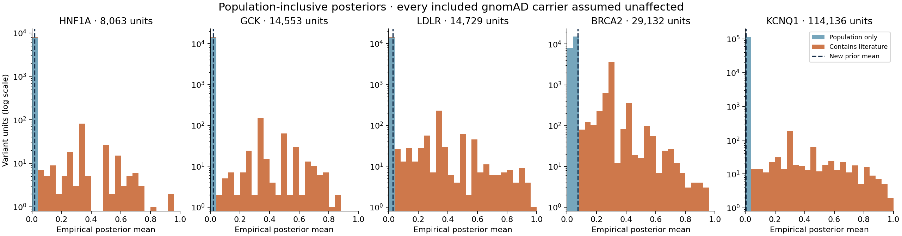

# Population-inclusive empirical penetrance redo — 2026-09-12

The previous empirical fit incorrectly treated the literature-selected row set as the full variant universe. This redo includes observed population-only alleles in both the empirical prior and the GCK structural donor pool. Every included gnomAD carrier is assumed unaffected, as requested. GCK changes from Beta(3.127, 0.746), mean 80.7%, to **Beta(0.04297, 2.11758), mean 1.99%**. Alpha receives affected observations; beta receives all unaffected observations.

The primary universe contains **180,613 variant units**, including 175,186 distinct observed QC-passing population alleles. The full genomic spans contribute 175,185 eligible alleles; one additional eligible KCNQ1 allele comes from the original coding-query boundary padding. The remaining units are eligible clinical aggregates without an observed population match. This is an observed-variant universe, not an enumeration of every theoretically possible substitution.

| Gene | Prior α | Prior β | Old empirical prior mean | New prior mean | New units | Posterior <0.10 |
|---|---:|---:|---:|---:|---:|---:|
| HNF1A | 0.03587 | 2.09609 | 60.5% | 1.68% | 8,063 | 97.6% |
| GCK | 0.04297 | 2.11758 | 80.7% | 1.99% | 14,553 | 97.6% |
| LDLR | 0.06183 | 2.09597 | 69.6% | 2.87% | 14,729 | 96.1% |
| BRCA2 | 0.22217 | 2.85348 | 53.1% | 7.22% | 29,132 | 81.0% |
| KCNQ1 | 0.00986 | 2.21814 | 64.6% | 0.44% | 114,136 | 99.5% |

“Old” is the literature-only empirical fit from the earlier structural preflight, not the original AlphaMissense-calibrated S=10 fit. The new histogram is stacked by population/literature origin so the newly included observations are visible.



## Counts and identity

The source snapshot is gnomAD 4.1.1, GRCh38. Full-span region requests cover all five gene intervals, use bounded chunks, and retain the coding/transcript snapshots for exact annotation joins. All overlapping allele identities, exome/genome/joint counts and QC agree with the earlier coding-footprint inventory. Only actual positive-count, QC-passing small variants enter the fit. Structural variants and CNVs are outside these API endpoints.

| Gene | Affected | Literature unaffected | gnomAD unaffected carrier observations | Clinical keys quarantined |
|---|---:|---:|---:|---:|
| HNF1A | 740 | 115 | 13,994,756 | 9 |
| GCK | 898 | 80 | 8,931,920 | 26 |
| LDLR | 2,488 | 155 | 16,363,132 | 220 |
| BRCA2 | 9,969 | 2,233 | 15,877,471 | 136 |
| KCNQ1 | 8,216 | 2,205 | 66,821,104 | 69 |

Population carrier observations are **joint AC − joint homozygote count**, once per DNA allele. Joint counts are never added to their exome/genome constituents. Homozygotes contribute one carrier, not two. Totals across alleles are carrier observations, not unique people: individual co-carriage cannot be resolved from aggregate counts. AC-as-carrier-proxy results are retained as a sensitivity.

The gene API can expose an empty joint filter list even when a contributing assay failed QC. Eligibility therefore requires every present exome/genome assay to pass; raw filters and the reconstructed joint filter remain inspectable. This follows the joint filtering logic described in the [gnomAD v4.1 release](https://gnomad.broadinstitute.org/news/2024-04-gnomad-v4-1) and [gnomAD clarification of joint filtering](https://discuss.gnomad.broadinstitute.org/t/is-joint-combined-genome-exome-faf-unreliable-if-either-genome-or-exome-fails-filters/88/3).

Clinical protein aggregates attach to all compatible population DNA alleles once, without replicating affected counts. Exact canonical cDNA matches require compatible transcripts. Synonymous G258G/G258= and stop R186*/R186X notation are normalized. Conflicting protein/cDNA or shared-allele identities are quarantined, with every original clinical row retained in `analysis/literature_join_ledger.csv.gz`. Unmatched population alleles remain included with A=0. Canonical annotations are never invented for region-only records.

There are 77 clinical units containing multiple population DNA alleles. The primary therefore mixes unresolved clinical protein aggregates with distinct genomic alleles; a protein-aggregate sensitivity quantifies this choice. Dropped clinical counts are explicit in the ledger and coverage table. These are identity quarantines, not assertions that the reported variants or patients are false.

## Empirical prior definition and scope sensitivity

For each gene, on the complete eligible union, let `U = literature_unaffected + gnomAD_carriers`, `n=A+U`, `y=A/n`, and `w=1−1/(n+0.01)`. The recovered historical method is:

```text
μ = Σ(w y) / Σw
v = Σ[w (y − μ)²] / number_of_variant_units
κ = μ(1−μ)/v − 1
α_empirical = μκ
β_empirical = (1−μ)κ
posterior = Beta(α_empirical + A, β_empirical + U)
```

This mean gives each variant a saturating reliability weight. It is not the pooled affected-carrier fraction: GCK’s pooled fraction is 0.0101%, versus the shared variant prior mean of 1.989%. Neither number should be relabeled disease prevalence or a validated patient-specific risk.

Historical MSE divides by the number of variants, not the sum of weights. MAE is reported as a diagnostic and is not substituted for a variance. The normalized weighted-MSE sensitivity preserves μ but changes prior strength; for GCK, κ changes from 2.161 to 0.180. All empirical hyperparameters remain fixed during the requested variant-only LOO analysis.

| Gene | Full gene + boundary padding | Coding-query footprint | Canonical coding/splice, including synonymous |
|---|---:|---:|---:|
| HNF1A | 1.68% | 4.97% | 8.86% |
| GCK | 1.99% | 11.17% | 23.74% |
| LDLR | 2.87% | 8.96% | 15.98% |
| BRCA2 | 7.22% | 16.90% | 21.03% |
| KCNQ1 | 0.44% | 10.43% | 20.94% |

**The low full-gene prior depends strongly on including noncoding population variants.** For GCK the corresponding coding/splice mean is 23.74%. These answer different variant-universe questions. The full-span result is the primary all-variant analysis; the coding subset is retained explicitly. The original gene API covered CDS intervals plus approximately 75-base flanks, which is why its intermediate GCK mean was 11.17%.

At the new GCK primary prior, an allele with A=0/U=1 has posterior mean 1.36%; A=0/U=10 gives 0.35%; A=1/U=0 gives 33.0%. The remaining clinical singleton band near one-third follows this weak prior plus one affected observation. It is no longer the original high shared prior. On the same 372 retained clinical keys, the median posterior drops from 84.7% to 33.0%; the overall new median is 1.36%.

[Prior distributions, counts and same-clinical-key comparison](analysis/PRIORS_AND_COUNTS.png) · [all numerical sensitivities](analysis/empirical_prior_comparison.csv) · [before/after summary](analysis/before_after_summary.csv).

## Predictor and structural comparisons

The empirical prior is **not calibrated to AlphaMissense**. None of AlphaMissense, GPN-Star or AlphaGenome enters its mean, variance or count update. The prior is constant within a gene, so a within-gene prior–predictor correlation is undefined. The plotted correlations compare the count-updated posterior with the predictors.

Predictor snapshots join exact GRCh38 genomic members with matching warehouse gene membership. Conflicting versions or values remain missing. In the new snapshot all scored BRCA2 AlphaMissense alleles have version conflicts; its AlphaMissense comparison is therefore unavailable. Signed GPN-Star M447 LLR decreases with predicted impact; AlphaGenome AVI increases with impact and incorporates AlphaMissense information. Additional region-only variants outside the original annotation footprint remain unscored. The five-gene comparison uses no archived protein-key fallback.

[Predictor comparison figure](analysis/POSTERIOR_VS_PREDICTORS.png) · [same-row associations and coverage](analysis/predictor_associations.csv) · [snapshot provenance](predictors/README.md).

The GCK structural redo includes **634 canonical-WT-matched missense units: 249 clinical and 385 population-only**. Primary experimental monomer 1V4S supports 614; AlphaFold sensitivity supports 628. The same correctly numbered biological monomer geometries are reused from the previous pilot. No coordinate is invented for missing residues.

Target-only LOO retains other substitutions and other distinct DNA alleles at the same residue. Every copy of the target identity is excluded. Donors contribute their empirical posteriors with equal-variant spatial weights. The normalized sigmoid has half weight at 3 Å and remains positive beyond 20 Å. Disorder uses 3.8√sequence-separation within a common contiguous disordered segment; mixed ordered/disordered pairs receive no fabricated 3D distance. Twenty geometry/metric/kernel scenarios and conditional intervals from 8,192 fixed-seed Beta draws are retained.

The primary density median is **18.24%**. This is a missense-neighbor quantity and need not equal the 1.99% full-gene shared prior. On 610 targets with common features, adding density to AlphaMissense changes posterior MAE from 0.147045 to 0.146755 and mean count NLL from 1.000828 to 0.994985. On the exact original 242 fitting/evaluation targets, with their archived AlphaMissense scores, the addition slightly worsens MAE (0.138995 to 0.139427) and count NLL (1.547250 to 1.548626). The expanded donor pool is used in both new comparisons. These results do not establish an incremental structural predictive benefit.

Outer regression folds also remove the held-out variant from every training density, verified by independent engine recalculation. Full empirical hyperparameters stay fixed by instruction, so these are internal diagnostics rather than fully independent cross-validation. GCK clinical counts still pool MODY and activating/hypoglycemia evidence; this remains pooled clinical GCK analysis.

Holding geometry and the 634 donors fixed, the density median is 18.24% under the primary prior, 29.84% under the coding/splice prior, and 31.73% under normalized weighted MSE. The AC proxy leaves it essentially unchanged at 18.25%. Prior scope and variance convention therefore matter much more than homozygote correction here. These are explicit sensitivities, not tuned replacements for the requested historical primary. See the [structural report](structural/README.md) and fixed-geometry sensitivity tables.

## What to do next

Population inclusion is now implemented. The next analytical gate is to resolve GCK source/transcript identities and separate MODY from hyperinsulinism/hypoglycemia counts, then repeat the identical AM/density/combination comparison. Resolve BRCA2 AlphaMissense version provenance before its predictor comparison. Select the intended variant scope explicitly for future application priors; full-locus and coding/splice priors should remain separately labeled. Extend to the other genes after their correctly numbered biological units and phenotype-specific donor sets are ready.

## Reproduction and checks

From the GVF main checkout, with the sibling scientific environment and PPA source available:

```bash
../BayesianPenetranceEstimator/.venv/bin/python docs/evidence/population_inclusive_penetrance_20260912/rebuild_union.py
../BayesianPenetranceEstimator/.venv/bin/python docs/evidence/population_inclusive_penetrance_20260912/analyze_results.py
../BayesianPenetranceEstimator/.venv/bin/python docs/evidence/population_inclusive_penetrance_20260912/run_structure.py
../BayesianPenetranceEstimator/.venv/bin/python docs/evidence/population_inclusive_penetrance_20260912/prior_geometry_sensitivity.py
../BayesianPenetranceEstimator/.venv/bin/python docs/evidence/population_inclusive_penetrance_20260912/validate_structure.py
../BayesianPenetranceEstimator/.venv/bin/python -m pytest docs/evidence/population_inclusive_penetrance_20260912 -q
```

The analysis scripts replay offline from compact committed snapshots. Population and predictor acquisition scripts are separate; rerunning them against current upstream services creates a new snapshot. Full raw API responses are retained locally under ignored `results/population_inclusive_penetrance_20260912/`; compact source rows, exact hashes, query definitions and coverage are committed here. Generated tables are deterministically sharded to remain inspectable without oversized Git files.

**38 count/identity/loader and structural regression tests pass.** The 114 generated union/prior/posterior tables reproduce byte-identically from the frozen inputs. The PPA optimized monomer engine passed 191 tests, including reference-backend equivalence, and is committed on PPA main as `dff15fc`. The source module hash is pinned by the structural run. Artifact verification records input hashes, allele/count conservation, all positive long-distance donor weights, zero self weight, same-residue retention, and conditional uncertainty support. Original evidence is preserved. The [Grok review](reviews/REVIEW_DISPOSITION.md) was checked against the implementation and arithmetic; its incorrect statement about weighted-variance direction was rejected.

Verify the complete manifest with `../BayesianPenetranceEstimator/.venv/bin/python docs/evidence/population_inclusive_penetrance_20260912/verify_artifacts.py`.
