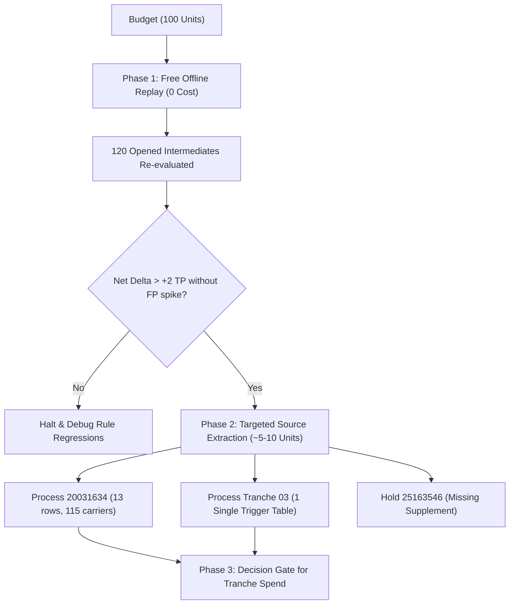

### 1. Performance Diagnostic & Error Root-Cause Analysis

* **Baseline Performance:** 120 opened cardiac/mixed papers yielded **261 TP, 141 FP, 123 FN** (Variability noise floor: $\pm 2\text{ TP}$).
* **Error Distribution:**
  * **Acquisition Failures:** $72 / 123\text{ FN}\ (58.5\%)$ — Primary bottleneck.
  * **Unsearchable/Unextractable Bodies:** $40 / 123\text{ FN}\ (32.5\%)$ — Secondary bottleneck.
  * **Parsing / Model / Projection:** $11 / 123\text{ FN}\ (8.9\%)$ — Minor contributor on opened text.
* **Critique:** With $91\%\ (112 / 123)$ of false negatives originating upstream of model extraction (acquisition/access), running expensive full-model inference over unopened tranches without verified text triggers will waste resources. The trigger scan confirms this: **Tranche 02 has 0 triggers** across 120 papers, and **Tranche 03 has only 1 table trigger**.

---

### 2. Integration & Logic Safeguards for Merged Rules

1. **Complete Protein Substitution Promotion:**
   * *Mechanism:* Promote source-only complete protein mutations directly to variant identities.
   * *Guard:* Must pass strict validation against existing gene symbol matching and sequence range boundaries to prevent cross-gene misattribution.
2. **VARIANT-GENE Capture (`[n cases]` excluded from Tables/Figures):**
   * *Mechanism:* Extract prose-bound entity mentions without synthesizing unverified count fields.
   * *Guard:* Store the exact owned token and surrounding paragraph text in separate metadata fields. Do not inject fabricated cohort sizes or counts into structured projection fields.
3. **Restricting Bare Nucleotide Coordinates:**
   * *Mechanism:* Do not infer cDNA coordinates from generic `"Nucleotide change"` headers.
   * *Guard:* Enforce mandatory header matching on explicit tokens (`cDNA`, `HGVSc`, `c.`). All other bare nucleotide lists must remain unmapped or require explicit genomic coordinate anchors.
4. **Preventing Gene-Ownership & Constructed-Variant Errors:**
   * Prevent combinatorial merging across distinct sentences or table rows. Variants must strictly inherit the gene entity anchored within their immediate syntactic clause or row hierarchy.

---

### 3. Cost-Effective Replay & Budget Allocation Strategy (100 Budget)

#### Phase 1: Zero-Cost Intermediates Replay (Budget: 0)
* Re-run the 3 merged rules (protein promotion, VARIANT-GENE prose capture, cDNA header restriction) strictly against **existing cached intermediates/ASTs** of the 120 opened attempts.
* **Objective:** Benchmark the exact shift in TP/FP/FN against the $\pm 2\text{ TP}$ baseline noise floor without invoking external API calls or spending budget.

#### Phase 2: Targeted Fresh Source Extraction (Budget: ~5–10)
* **PMID 20031634:** Apply targeted table/prose parser to the recovered repository body (13 variant rows, 115 total carriers: 54 ECG+, 55 ECG−, 6 unknown).
* **PMID 25163546:** **Hold/Do Not Spend.** Keep blocked from model extraction until the missing roster supplement is retrieved.
* **Tranche 03 Single Trigger:** Extract only the 1 confirmed table body from Tranche 03.
* **Tranche 02 (120 Papers):** **Skip entirely.** 0 triggers detected; spending budget here is guaranteed negative ROI.

---

### 4. Verification, Freezing, and Data Hygiene Protocol

* **Source-Byte Freezing:** Compute and store immutable SHA-256 hashes of all raw source payloads (HTML, XML, PDF, supplements) prior to extraction. All downstream replay must bind strictly to verified hash keys.
* **Gold-Lock Standard:**
  * Ground truth database must remain strictly read-only (`gold-lock originalspreserve`).
  * No manual database patching or label alteration to match pipeline quirks.
* **Strict Scoring Arm Isolation:**
  * Prospective evaluation arms must never have access to prior model predictions or historical extraction states.
  * Intermediates replay and targeted extractions must execute in sandboxed evaluation runs.

---

### 5. Decision Gates: When Full-Tranche Spend is Justified

Full-tranche budget spend ($\ge 50\text{ units}$) is justified **only** when all of the following conditions are met:
1. **Trigger Density Gate:** Prospective tranche shows non-zero trigger density (unlike Tranche 02's 0/120).
2. **Replay Validation Gate:** Intermediates replay demonstrates a statistically significant gain ($\Delta\text{TP} > +2$) without expanding the 141 FP count.
3. **Acquisition Verification:** Source acquisition resolver verifies body and supplement availability before queuing model extraction tasks.
