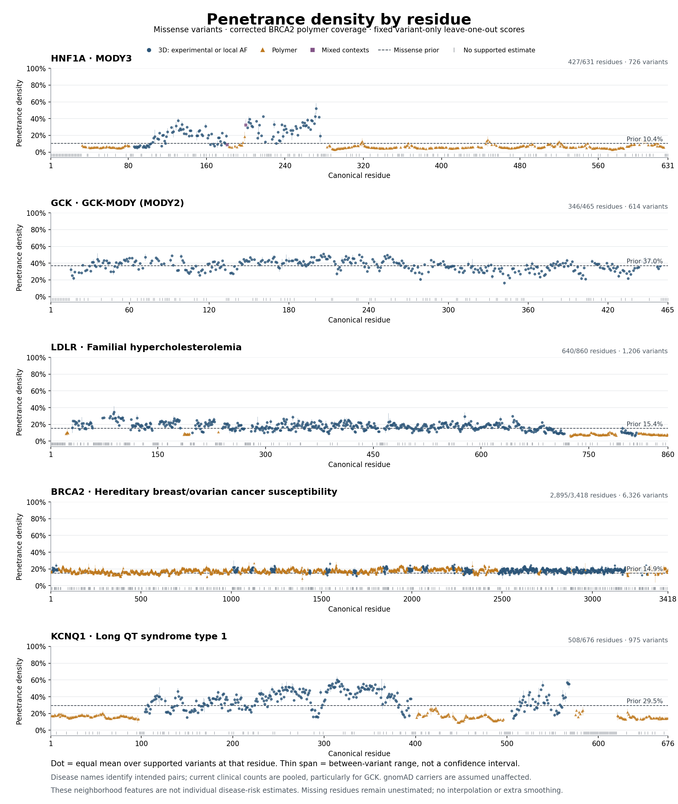

# Penetrance density by residue — 2026-09-13

[Combined PNG](ALL_GENES_PENETRANCE_DENSITY_BY_RESIDUE.png) ·
[Combined vector PDF](ALL_GENES_PENETRANCE_DENSITY_BY_RESIDUE.pdf)



| Intended gene–disease pair | Individual PNG | Vector PDF | Residue data |
| --- | --- | --- | --- |
| HNF1A–MODY3 | [PNG](HNF1A_PENETRANCE_DENSITY_BY_RESIDUE.png) | [PDF](HNF1A_PENETRANCE_DENSITY_BY_RESIDUE.pdf) | [CSV](tables/HNF1A_residue_density.csv) |
| GCK–GCK-MODY (MODY2) | [PNG](GCK_PENETRANCE_DENSITY_BY_RESIDUE.png) | [PDF](GCK_PENETRANCE_DENSITY_BY_RESIDUE.pdf) | [CSV](tables/GCK_residue_density.csv) |
| LDLR–familial hypercholesterolemia | [PNG](LDLR_PENETRANCE_DENSITY_BY_RESIDUE.png) | [PDF](LDLR_PENETRANCE_DENSITY_BY_RESIDUE.pdf) | [CSV](tables/LDLR_residue_density.csv) |
| BRCA2–hereditary breast/ovarian cancer susceptibility | [PNG](BRCA2_PENETRANCE_DENSITY_BY_RESIDUE.png) | [PDF](BRCA2_PENETRANCE_DENSITY_BY_RESIDUE.pdf) | [CSV](tables/BRCA2_residue_density.csv) |
| KCNQ1–long QT syndrome type 1 | [PNG](KCNQ1_PENETRANCE_DENSITY_BY_RESIDUE.png) | [PDF](KCNQ1_PENETRANCE_DENSITY_BY_RESIDUE.pdf) | [CSV](tables/KCNQ1_residue_density.csv) |

Each point is the **equal mean of the supported variant-specific leave-one-out
density scores at that canonical residue**. Thin vertical spans give the minimum
and maximum across those variants; they are not confidence intervals. No extra
smoothing, interpolation, prior refitting or count update is performed. Each
variant's original self-exclusion remains intact, including retention of other
variants at the same residue. A residue summary is a descriptive aggregation,
not a new leave-whole-residue-out estimate.

Blue circles are structured neighborhoods, gold triangles use the polymer method,
and purple squares retain the original mixed-context classification. Dashed lines
are the frozen gene-by-missense empirical priors. All panels use the same 0–100%
score scale. Gray marks below zero indicate unavailable estimates and are not
zero scores. The CSVs enumerate every canonical position and distinguish an
observed variant without density support from a position with no observed eligible
missense variant. Their count columns describe the frozen observed variant units;
zero counts at an unobserved position do not create a hypothetical donor.

The disease names identify the **intended pairs**. The underlying clinical counts
remain pooled and incompletely endpoint-adjudicated, especially for GCK's
hyperglycemia versus activating hypoglycemia. All gnomAD carriers remain assumed
unaffected. These neighborhood features must not be interpreted as individual
disease probabilities. See the [structural sanity audit](../structural_sanity_20260913/README.md)
for endpoint findings and the BRCA2 correction.

The source is the latest audited variant diagnostics: HNF1A, LDLR and KCNQ1 from
the missense structural extension; GCK from its class-matched replay; BRCA2 from
the corrected local-3D/polymer run. The [input receipt](inputs.json) records exact
hashes. [Coverage](tables/coverage.csv), the [independent audit](audit.json) and
[audit script](audit_plots.py) verify the aggregation against original frozen
variant counts and primary densities, rather than importing the plot code.

Reproduce with numpy, pandas and matplotlib:

```sh
OPENBLAS_NUM_THREADS=1 ../BayesianPenetranceEstimator/.venv/bin/python \
  docs/evidence/residue_density_plots_20260913/plot_residue_density.py
```

PNG exports are 170 dpi; PDFs retain vector marks and text. The combined image
and the individual BRCA2 image were visually checked for scale, labels, legend,
missingness and clipping; the independent audit also reviews rendered panels.
All five CSVs and all image/PDF artifacts are under 1.2 MB each.
