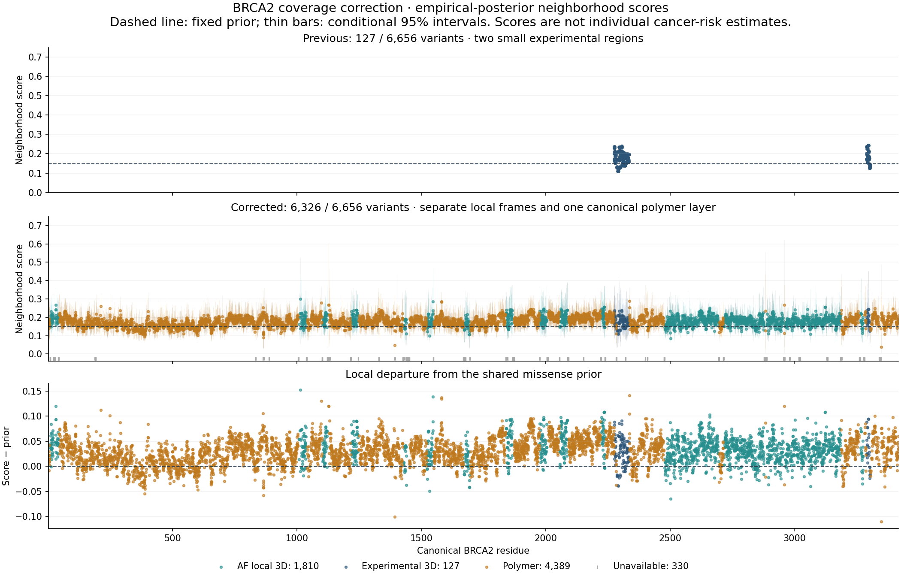

# Structural sanity check and BRCA2 correction — 2026-09-13

**BRCA2's missing polymer neighborhoods were an actual input omission, now
corrected. GCK's neighborhood scores do not show that every variant causes MODY.**
The BRCA2 rerun increases supported variants from **127 to 6,326 of 6,656**, using
previously overlooked local AlphaFold fragments and full-sequence candidate-IDR
polymer segments. The GCK audit reproduces the frozen arithmetic, finds direct
counterexamples to interpreting density as individual risk, and confirms mixed
hypoglycemia/hyperglycemia endpoints requiring source curation. Earlier evidence,
accepted priors and source counts remain unchanged.



## What changed for BRCA2

The earlier builder used only the small 7LDG and 8PBC experimental peptide
assemblies and explicitly withheld polymer outside their constructs. Although
AlphaFold's API returned no full-length model, **12 AFv6 fragments were already
cached locally**. Every fragment now has a unique exact match to canonical human
BRCA2, including agreement across overlaps and all 3,418 canonical positions.
The [geometry report](geometry/BRCA2/README.md) records the mapping and limitations.

Primary routing is exclusive for both targets and donors:

- Preserve experimentally observed positions in their original assembly frames.
  Their coordinates and original 127 supported variant scores are unchanged.
- Use local AF geometry for other positions with maximum fragment pLDDT ≥70;
  each contributing fragment must itself have pLDDT ≥70 at that position.
- Use one canonical polymer frame where **all** covering fragments have pLDDT
  below 50, outside experimentally observed positions. These are candidate IDRs,
  not experimentally proven disorder. Intermediate-confidence positions remain
  unavailable in the primary calculation.

No coordinates or distances are merged across AF or experimental frames. The
same canonical residue cannot mix experimental, AF and polymer sources. The
native methionine COM at modified MSE2322 stays unavailable; Cα sensitivity is
retained. The resulting primary geometry supplies 984 structured and 2,264
polymer positions. This is full-sequence mapping with local geometry, **not a
complete native BRCA2 biological unit**. Overlapping AF frames are alternative
model contexts; no PAE is available to validate relative domain placement.

| Variant coverage | Supported | Polymer | AF local 3D | Experimental 3D | Unavailable |
| --- | ---: | ---: | ---: | ---: | ---: |
| Earlier experimental-only run | 127 | 0 | 0 | 127 | 6,529 |
| Experimental + conservative IDR comparator | 4,516 | 4,389 | 0 | 127 | 2,140 |
| Corrected primary | 6,326 | 4,389 | 1,810 | 127 | 330 |
| All unresolved assumed polymer sensitivity | 6,651 | 4,714 | 1,810 | 127 | 5 |

The last row retains primary ordered geometry and explicitly assumes remaining
unresolved positions are polymer. Its extra coverage is an assumption sensitivity,
not evidence that those positions are disordered. Unsupported targets remain
missing rather than zero. Counts come from [coverage source data](analysis/BRCA2_figure_source_counts.csv)
and [sensitivity.csv](analysis/BRCA2/sensitivity.csv).

Within the same contiguous polymer segment and chain, distance is
`3.8 * sqrt(abs(i-j))` Å. Structured contexts use the frozen side-chain heavy-atom
COM metric, with Cα for glycine. The kernel remains
`K(d) = 2 / (1 + exp(log(3)*d/h))`: half weight at **h=3 Å**, positive tails beyond
20 Å, and no hard distance cutoff. Sensitivities use h=2 and h=5, Cα, and the two
coverage policies above. The primary median density is **0.1798298323**. Changing
h to 2 or 5 gives mean absolute paired changes of 0.0128067328 or 0.0093583051;
the broader polymer assumption gives 0.0008362673 among shared targets, with a
maximum individual change of 0.1143202334.

## BRCA2 results after the coverage correction

The frozen gene-by-missense empirical prior stays fixed: alpha **0.9074554793**,
beta **5.1993189486**, mean **0.1485981659**. Every affected observation adds to
alpha; all literature-unaffected and gnomAD carriers add to beta, preserving the
user's assumption that gnomAD carriers are unaffected. Counts and variant units
are unchanged. Density averages other variants' posterior means with normalized
proximity weights; it does not multiply donor influence by carrier count.

Outer LOO removes the held-out variant unit globally from training neighborhoods,
including every structural copy. Other variants at its residue remain eligible.
Each model uses the same held-out targets and fold-eligible training targets.
The full-dataset class prior remains fixed by design, so these are internal
posterior-label comparisons, not independent population-risk validation.

| Cohort | Model | Targets | Posterior MAE | Posterior MSE |
| --- | --- | ---: | ---: | ---: |
| All supported | Fitted intercept | 6,326 | 0.0798115583 | 0.0077391182 |
| All supported | Density | 6,326 | 0.0794515181 | 0.0077130259 |
| All supported | Sequence proximity | 6,326 | 0.0794095152 | 0.0077082871 |
| AM-complete | Fitted intercept | 2,256 | 0.0063563782 | 0.0009798196 |
| AM-complete | AlphaMissense | 2,256 | 0.0066428551 | 0.0009805333 |
| AM-complete | AlphaMissense + density | 2,256 | 0.0067969918 | 0.0009809230 |

The fitted density barely improves on the intercept and does not outperform
sequence proximity. **Adding density does not improve AlphaMissense** on its
available subset. That subset is strongly selected: its mean observed affected
fraction is **0.9734008395**, and all available AM values come from archived
clinical-key fallbacks. **4,210 units remain AM-missing because member scores or
versions conflict**; another 55 have no score. There are no population-only
archived AM fallbacks. The tiny posterior errors in this selected cohort do not
establish calibration or broad predictor accuracy. Full cohort/source-stratified
metrics are in [loo_metrics.csv](analysis/BRCA2/loo_metrics.csv).

## Why the GCK scores do not mean every variant causes MODY

The [GCK audit](gck/README.md) separates each variant's own posterior from its
variant-excluded neighborhood score:

| GCK variant | A | U, including assumed-unaffected gnomAD | Own posterior | Neighborhood score | Interpretation |
| --- | ---: | ---: | ---: | ---: | --- |
| D217N | 0 | 227 | 0.0047023538 | 0.3299633862 | WT-like functional control |
| E279Q | 0 | 141 | 0.0075122893 | 0.2275902722 | WT-like functional control |
| W99R | 7 | 0 | 0.8147352127 | 0.4473773234 | Activating/hypoglycemia evidence |
| V389L | 7 | 0 | 0.8147352127 | 0.4004708570 | Activating/hypoglycemia evidence |

The first two were directly tested as WT-like controls in
[Gersing et al.](https://pmc.ncbi.nlm.nih.gov/articles/PMC10131484/).
Different substitutions at one residue can also have opposite functional effects,
as illustrated by activating V389L versus inactivating V389D in
[Beer et al.](https://pmc.ncbi.nlm.nih.gov/articles/PMC3099725/).
These assays measure function, not disease penetrance. Frozen values and exact
unit identities are in [variant_examples.csv](gck/variant_examples.csv).

GCK's accepted prior mean is **0.3704179223**, strength **2.9187554459**. An
unaffected singleton has posterior mean **0.2758935440**, not a universal lower
bound: more unaffected observations lower it further. There are 332 singletons
among 634 units, but they supply only 1.525% of prior-fitting weight under the
historical saturating-weight formula. The historical MSE divisor is the number
of variants, not the sum of fitting weights. Diagnostic alternative priors are
reported separately and were not adopted to obtain a preferred distribution.

The source audit identifies **14 frozen affected observations in W99R/V389L:
13 source-confirmed hyperinsulinemic-hypoglycemia observations and one unassessed
carrier**. These are observations, not 13 demonstrated unique people across
publications. The proposed partition preserves the unknown phenotype rather than
turning it into unaffected. The [endpoint ledger](gck/endpoint_review.csv) and
[full source discussion](gck/README.md#confirmed-endpoint-and-count-problem) retain
paper links, source locations and the nucleotide-notation conflict.

A separately labeled sensitivity quarantines these two donor units while keeping
the prior fixed. Mean density changes only **36.84%→36.69%**, but same-residue
neighbors change substantially: W99C **48.99%→39.52%**, W99L **51.14%→42.30%**,
and V389D **42.78%→38.66%**. This is not a MODY-clean rerun; the remaining labels
still require adjudication. Mild hyperglycemia and diagnosed diabetes also remain
distinct endpoints, including for the V455E count interpretation.

The GCK null tests retain complete count/posterior records and their target labels
together. In 2,000 permutations within source origin and count bin, density shows
association beyond a constant-prior control (p=0.003998), but its **3D-versus-sequence
advantage is ordinary under that null: p=0.474263**. The raw-count donor control
agrees (p=0.726637). This supports positional information in the selected data;
it does not establish a distinct 3D benefit. The 610-target fitted comparison is
consistent: posterior MAE is 0.124636 for AM, 0.123400 for AM+density and 0.122818
for AM+sequence. These fitted results and the 614-target unfitted permutation test
have different denominators; see [permutation results](gck/permutation_summary.csv)
and [frozen fitted metrics](gck/frozen_same_row_loo_metrics.csv).

## What the five-gene audit establishes

The [cross-gene audit](analysis/ALL_GENE_AUDIT.md) independently reconstructs the
saved feature for all five genes using the original counts and weights:

```
D_i = mu * sum_j W_ij * S/(S+n_j) + sum_j W_ij * A_j/(S+n_j)
```

| Gene | Supported / units | Median density | Median direct prior share of density |
| --- | ---: | ---: | ---: |
| HNF1A | 726 / 785 | 6.35% | 77.32% |
| GCK | 614 / 634 | 37.41% | 60.71% |
| LDLR | 1,206 / 1,376 | 16.25% | 48.46% |
| BRCA2 | 6,326 / 6,656 | 17.98% | 60.16% |
| KCNQ1 | 975 / 1,061 | 24.62% | 56.44% |

The prior share is an **algebraic contribution**, not causal inflation, variance
explained, or the amount by which the prior raises the score. In corrected BRCA2,
median raw-count neighborhood is 41.43% while posterior-derived density is 17.98%:
shrinkage lowers it. GCK's corresponding medians are 34.91% and 37.41%.
A target with strong unaffected evidence can still have a high neighborhood
feature because its own counts are excluded. [Complete diagnostics](analysis/allgene_summary.csv)
and [control examples](analysis/strongest_control_examples.csv) make that
interpretive distinction explicit.

## Reviews, validation and next action

Both requested headless CLI consultations completed: Agy was requested as
`gemini-3.1-pro-high` and Grok returned `grok-4.6-build`. They reviewed the same
aggregate brief, not the source data or completed rerun. The
[review disposition](reviews/REVIEW_DISPOSITION.md) accepts the missing-polymer,
source-routing, prior-influence and endpoint concerns, while correcting the
reviewers' universal "floor," "massive" prior-strength and proved-structural-signal
claims. Their agreement is not independent verification of the data.

Local checks provide that arithmetic verification. The BRCA2 audit checks all
4,002,588 positive donor pairs and 52 cached weight shards, reconstructs density
and conditional variance, reproduces fresh reference exclusions across all three
geometry sources, recomputes 45 score rows and independently refits 54 predictions
(maximum difference below 1e-7). All old experimental BRCA2 scores are preserved.
The five-gene decomposition agrees within 7.1e-15. GCK's endpoint observations,
weights and source hashes are preserved alongside the audit. Conditional density
intervals still omit endpoint, ascertainment, prior-fitting and geometry uncertainty.

The focused test run passes 17 tests. Mandatory formatting changed eight source
files after execution without changing their Python syntax trees or numerical
outputs. The [formatting receipt](formatting_receipt.json) maps original execution
hashes to formatted source hashes, including the outer-LOO and benchmark helpers;
the original run hashes are retained. Independent audits were rerun to refresh
their current source receipts.

**Next priority is source-level endpoint, unknown-phenotype and count-ownership
curation.** Partition GCK hyperglycemia/MODY, activating hypoglycemia, other diabetes
and unknown; resolve the demonstrated notation/count conflicts and repeated
people/families. Apply analogous disease-endpoint review to the other genes, and
resolve BRCA2 AM version conflicts before broad predictor comparisons. Then rerun
the gene-by-type priors and variant-only LOO with AM+sequence retained as a required
control. Keep the target's own count posterior beside density and use density as
a feature, not an individual disease-risk estimate. Independent genotype-first
outcomes are needed for a disease-risk interpretation.

Reproducible components and receipts:

- [Geometry builder](geometry/BRCA2/build_geometry.py), [geometry manifest](geometry/BRCA2/geometry_manifest.json)
  and [geometry audit](geometry/BRCA2/geometry_audit.json).
- [BRCA2 runner](run_brca2.py), [outer-LOO implementation](outer_loo.py),
  [independent audit script](audit_brca2_run.py) and [audit receipt](analysis/BRCA2/independent_audit.json).
- [GCK audit script](gck/audit_gck.py), [source/check receipt](gck/checks.json)
  and [prior/endpoint figure](gck/GCK_PRIOR_ENDPOINT_SENSITIVITY.png).
- [Five-gene audit script](audit_all_genes.py) and [source receipt](analysis/allgene_audit_receipt.json).
- [Figure and conclusion source tables](analysis/sources_receipt.json).

Complete compact predictions, sensitivities and diagnostics are under this dated
folder. Large BRCA2 matrices remain in ignored `results/structural_sanity_20260913/BRCA2/`,
with hashes and variant order recorded in [cache_manifest.json](analysis/BRCA2/cache_manifest.json).

[manifest.json](manifest.json) freezes every compact artifact and the source inputs.
Run `python freeze.py --verify` from this folder to check local bytes, CSV payload
line endings and source hashes; after committing, `python freeze.py --git` checks
the committed artifacts and tracked source blobs. Original structure downloads,
paper caches and large matrices are explicitly identified as local caches and
are not claimed to be preserved in Git. The source-verification script also
checks the recorded formatting equivalence before accepting execution hashes.
