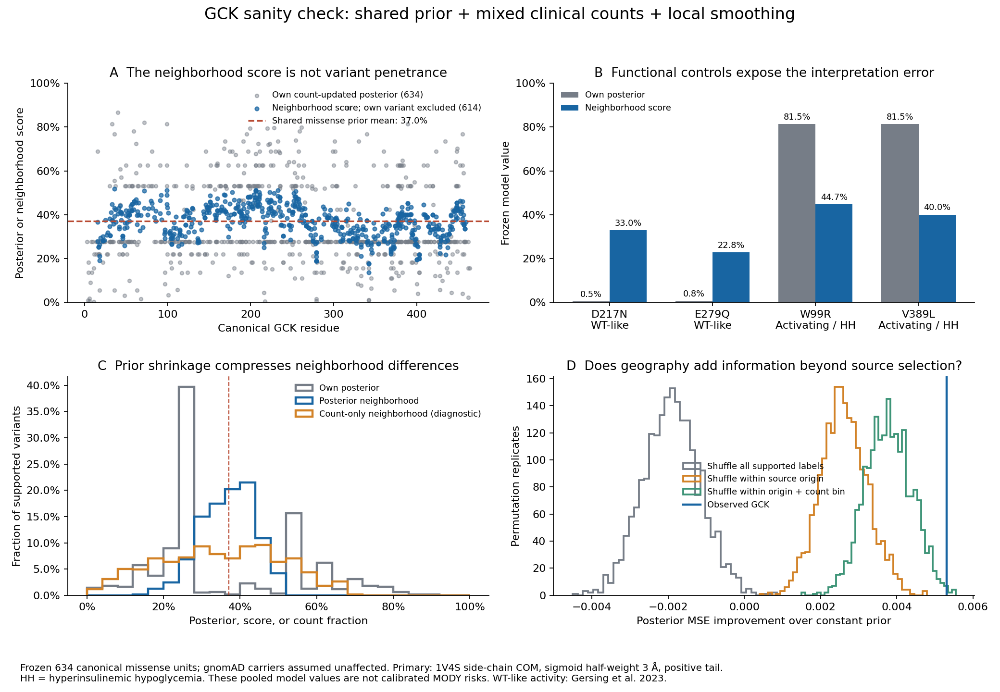
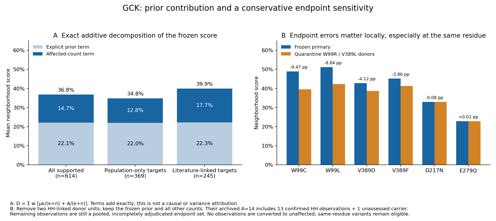

# GCK structural sanity check — 2026-09-13

**Needs revision for a MODY-penetrance claim; the frozen arithmetic reproduces.**
The neighborhood score does not mean that every GCK substitution causes MODY.
It is a proximity-weighted average of other variants' pooled count posteriors,
with the target variant's own counts deliberately excluded. The common prior,
small counts, source selection and smoothing all shape this score. Even the own
posteriors below remain model estimates under the assumption that gnomAD carriers
are unaffected; they are not calibrated clinical risks.



## Direct counterexamples

| Variant | Frozen A | Literature U | gnomAD U | Own posterior | Neighborhood score | Independent functional evidence |
|---|---:|---:|---:|---:|---:|---|
| D217N | 0 | 0 | 227 | 0.47% | 33.00% | WT-like assay control |
| E279Q | 0 | 0 | 141 | 0.75% | 22.76% | WT-like assay control |
| W99R | 7 | 0 | 0 | 81.47% | 44.74% | Activating; hyperinsulinemic hypoglycemia |
| V389L | 7 | 0 | 0 | 81.47% | 40.05% | Activating; hyperinsulinemic hypoglycemia |

D217N and E279Q were directly tested as WT-like controls by
[Gersing et al. (2023), Figure 1 and results](https://pmc.ncbi.nlm.nih.gov/articles/PMC10131484/).
That experimental map contains tolerated, reduced-activity and increased-activity
substitutions. Surface positions tend to be more tolerant than buried or active-site
positions. Its measurements are functional activity, not disease penetrance.
Thus GCK contains sensitive regions, but a broad neighborhood score cannot classify
every substitution. Moreover, different substitutions at one residue can have
opposite effects: activating V389L/T103S versus inactivating V389D/T103I in
[Beer et al. (2011), Table 1](https://pmc.ncbi.nlm.nih.gov/articles/PMC3099725/).
Retaining same-residue alternatives is the requested analysis policy, but those
alternatives need an endpoint/mechanism distinction to support a MODY model.

The counts and unit IDs in this table come from the frozen 634-row canonical
missense input, joined exactly to its 614 supported `1V4S_com_h3` targets.
[variant_examples.csv](variant_examples.csv) preserves these and five additional
examples. The 20 unsupported experimental targets remain missing, not zero.
The frozen unit policy retains distinct genomic alleles that share a protein
substitution and literature protein aggregates whose nucleotide identity remains
unresolved. LOO excludes the frozen variant unit; it does not exclude an entire
residue or every equivalent protein substitution.

## Why the density is centered near 37%

The accepted historical fit is reproduced without alteration:
`alpha=1.0811593279`, `beta=1.8375961180`, prior mean `mu=0.3704179223`,
strength `kappa=2.9187554459`. An unaffected singleton updates to **27.59%**;
its posterior still contains **74.48% prior mixture weight**.

| Frozen origin | Units | A | Literature U | gnomAD U | Singleton units |
|---|---:|---:|---:|---:|---:|
| Literature and population | 83 | 336 | 55 | 2,785 | 0 |
| Literature only | 166 | 334 | 17 | 0 | 86 |
| Population only | 385 | 0 | 0 | 1,584 | 246 |
| Total | 634 | 670 | 72 | 4,369 | 332 |

Population-only variants are 60.73% of units. Singletons are 52.37% of units,
but contribute only **1.525% of the prior-fitting weight** under
`w_i = 1 - 1/(n_i + 0.01)`. The accepted variance uses
`sum(w_i*(A_i/n_i-mu)^2)/number_of_variants`, not division by `sum(w_i)`.
Consequently, the missense prior is not the population disease prevalence or an
equal-variant average. The equal-variant raw fraction is 31.83%; pooling the
carrier counts gives 13.11%. These describe different weighting schemes, and
neither remedies clinical ascertainment.

With normalized proximity weights `W` and zero self-weight, the exact calculation is:

```
p_j = (alpha + A_j)/(kappa + n_j)
D_i = sum_j W_ij * p_j
    = mu * sum_j W_ij * kappa/(kappa+n_j)
      + sum_j W_ij * A_j/(kappa+n_j)
```

Across 614 supported targets, mean density **36.84% = 22.09 percentage points
from the explicit prior term + 14.75 points from the affected-count term**.
The median prior mixture weight is 60.65%; the median explicit prior-term share
of the score is 60.71%. These are algebraic contributions, not a causal attribution
or a percentage of variance explained. Counts also determine the amount of shrinkage.
Population-only donors supply a median 57.36% of neighborhood weight, singletons
53.92%, and median effective donor count is 23.37. Equal-variant weights allow one
carrier's variant to contribute as much as a common variant at the same distance.

| Diagnostic smoother, same supported targets | Mean | 5th–95th percentiles |
|---|---:|---:|
| Accepted posterior donors | 36.84% | 25.27–47.76% |
| Raw A/n donors, no prior | 34.75% | 9.15–59.76% |
| Additional n-weighting of posterior donors | 32.95% | 9.49–52.65% |
| Additional n-weighting of raw-count donors | 33.23% | 4.74–61.88% |

The primary range is 13.64–51.83%; it is compressed, not literally constant.
[Prior sensitivities](prior_sensitivities_DIAGNOSTIC.csv) retain the same missense
data and distinguish diagnostic formulas: normalizing the weighted MSE gives
strength 0.332 and an unaffected-singleton posterior of 9.24%; equal-variant
moments give strength 0.138 and 3.86%. These are not adopted replacements and
cannot be selected merely to obtain a preferred histogram.

## Does spatial signal exceed a prior/source null?

The audit uses the exact frozen 634-by-634 weights, same 3 Å half-weight sigmoid
with its positive tail, and variant-only exclusion. All weights and all 614 density
values reconstruct to maximum absolute error `7.22e-15`. The empirical prior stays
fixed on all 634 missense units, as specified in the original method. Assigning
every donor the prior mean produces exactly 37.04% everywhere supported.

For each of three nulls, 2,000 seeded permutations move the **complete count/posterior
record and its target label together** among the 614 geometry-supported positions.
This is not donor-only shuffling against unchanged evaluation labels, which would
leak held-out information. The other 20 labels remain fixed; they have no structural
donor weight. The sequence control retains all 634 donors, with
`sigmoid(3.8*sqrt(sequence separation))`, zero self-weight and no cutoff.

Observed unfitted posterior MSE improvement over the constant prior is **0.005308**.
The null preserves the same kernel and variant-only exclusion:

| Label permutation | Mean null improvement | Null 95% interval | One-sided permutation p |
|---|---:|---:|---:|
| All supported labels | -0.001904 | -0.003362 to -0.000385 | 0.00050 |
| Within source origin | 0.002615 | 0.001435 to 0.003860 | 0.00050 |
| Within origin and count bin | 0.003785 | 0.002611 to 0.004960 | 0.00400 |

Count bins are 1, 2, 3–5, 6–10 and >10; 14 origin/count strata occur.
The last null retains 71.3% of the observed mean improvement, showing how much
apparent predictive structure can persist with source/count composition alone.
There is residual positional association beyond that coarse null; it would be
incorrect to say the whole signal is just the constant prior. However, the observed
3D-versus-sequence improvement **0.001169** is ordinary under the same conditional
null (mean 0.001150, p=0.474). A raw-count donor control gives the same conclusion
(3D-versus-sequence p=0.727). These are exploratory internal permutation diagnostics,
not independent-family validation, and do not account for all selection mechanisms.

The existing globally held-out model comparison reaches a compatible conclusion
on the same 610 AM-complete targets:

| Frozen model | Posterior MSE | Posterior MAE |
|---|---:|---:|
| AlphaMissense | 0.024888 | 0.124636 |
| AlphaMissense + density | 0.024566 | 0.123400 |
| AlphaMissense + sequence | 0.024549 | 0.122818 |

These fitted metrics differ from the 614-target unfitted permutation diagnostic;
their denominators must not be mixed. The modest improvement over AM is largely
available from sequence proximity. A distinct 3D-specific benefit is not established.

## Confirmed endpoint and count problem

The [six original observation rows](frozen_endpoint_observations.csv) are copied
unchanged from the frozen GCK protocol output, with its SHA-256 and source path
in [frozen_endpoint_provenance.json](frozen_endpoint_provenance.json).
[endpoint_review.csv](endpoint_review.csv) records the source locations and proposed
endpoint partitions without overwriting that extraction.

* W99R: all seven retained affected observations concern hypoglycemia: one child
  in [Xu et al. (2018), Table 2 case 29](https://pmc.ncbi.nlm.nih.gov/articles/PMC6240136/),
  two patients in [Maiorana et al. (2021), Table 1](https://pmc.ncbi.nlm.nih.gov/articles/PMC8507241/),
  and four relatives in [Gilis-Januszewska et al. (2021), family results](https://pmc.ncbi.nlm.nih.gov/articles/PMC8535713/).
  Xu's results/table use `c.295T>C`, while its discussion and the frozen extraction
  use `c.295C>T`. This source-internal notation conflict requires nucleotide review;
  it does not change the confirmed protein-key hypoglycemia endpoint.
* V389L: two hypoglycemic relatives in
  [Beer et al. (2011), Figure 1A and results](https://pmc.ncbi.nlm.nih.gov/articles/PMC3099725/).
  The other source's frozen count is five affected, but
  [Challis et al. (2014), individual patient descriptions](https://pmc.ncbi.nlm.nih.gov/articles/PMC4735948/)
  establish four biochemical hypoglycemia observations and one unassessed carrier
  (II.2). The proposed review partition is **HH A=4, U=0, phenotype unknown=1**,
  retaining five observed carriers. Unknown must not be converted to unaffected.

Thus these two units contain **14 frozen affected observations, comprising 13
source-confirmed HH observations and one unknown**; this does not establish 13
unique people across publications. Removing the two endpoint-incompatible donor
units in a conservative, separately labeled sensitivity leaves the prior fixed.
Mean density moves only 36.84%→36.69%, but W99C moves 48.99%→39.52%, W99L
51.14%→42.30%, and V389D 42.78%→38.66%. The largest effects involve same-residue
alternatives, which remain eligible under the requested policy. This is not a
MODY-clean analysis: all remaining endpoint labels are still incompletely adjudicated.



Another required distinction is **mild hyperglycemia versus diagnosed diabetes**.
The high GCK penetrance reported for already-curated pathogenic variants by
[Mirshahi et al. (2022), Figure 4 and phenotype definitions](https://pmc.ncbi.nlm.nih.gov/articles/PMC9674944/)
uses HbA1c ≥39 mmol/mol and/or fasting glucose ≥5.6 mmol/L, and reports 89–97%
across cohorts. It does not describe every missense allele. The UK Biobank
case-control endpoint in [Billings et al. (2022)](https://pmc.ncbi.nlm.nih.gov/articles/PMC9659663/)
concerns diabetes. In particular, V455E's frozen literature counts of 3 affected
and 25 unaffected cannot establish absence of mild GCK hyperglycemia in the latter
group. Its variant-specific endpoint requires source adjudication.

## Recommended next step and reproducibility

Keep density as a variant-excluded feature and always display the target's own
count posterior beside it. Before a MODY-oriented rerun, partition clinical
observations into mild hyperglycemia/MODY, activating hypoglycemia, other diabetes,
and unknown; resolve the demonstrated count/notation conflicts and repeated
people/family ownership. Then repeat the accepted missense-only prior fit and
variant-only outer LOO, retaining same-residue alternatives and AM+sequence as
a required comparator. Use the independent functional map to test mechanism
concordance; it is not itself a penetrance denominator. No source system, published
count, accepted prior, frozen geometry or old evidence has been modified here.

Run `audit_gck.py` with numpy, pandas and matplotlib. It requires no network,
reads the committed frozen inputs, checks identity/weights/posteriors directly,
and writes deterministic CSV/GZip evidence plus both figures:

```sh
MPLCONFIGDIR=results/structural_sanity_20260913/gck/mpl \
OPENBLAS_NUM_THREADS=1 \
/Users/kronckbm/GitRepos/BayesianPenetranceEstimator/.venv/bin/python \
  docs/evidence/structural_sanity_20260913/gck/audit_gck.py --permutations 2000
```

[checks.json](checks.json) contains exact source hashes and validation results.
The compact outputs include all 634 per-variant diagnostics, the supported-only
distribution table, count/prior weight groups, six diagnostic prior settings,
all 12,000 permutation records (three schemes × two outcomes × 2,000 repeats),
same-row frozen metrics and the endpoint ledger. Primary paper XML downloaded
for review is held only under ignored `results/structural_sanity_20260913/gck/raw/`;
the ledger's exact primary links and sections support reinspection.
